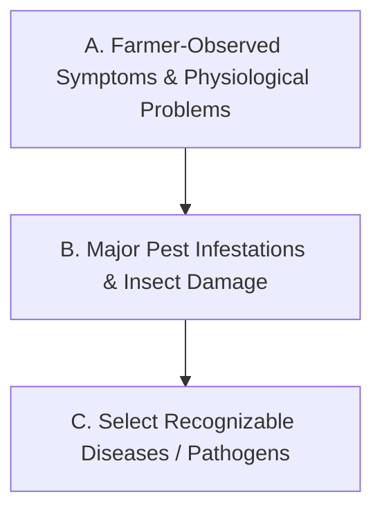

# Phase 5D Knowledge Corpus Specification
**Authoritative Specification for the Production MVP Agricultural Knowledge Corpus**

---

## 1. Objective

Phase 5D of BharatSahayak provides a **grounded Crop Problem & Disease Advisory capability**, rather than an autonomous or definitive disease diagnosis tool.

The agricultural knowledge corpus serves as the authoritative, verified evidence base for three interconnected execution layers:
1. **Deterministic Lexical Retrieval** (`app/disease/retriever.py`): Matches farmer observations (crop, plant part, symptom keywords) against verified reference entries.
2. **Controlled Gemini Reasoning** (`app/disease/service.py`): Explains retrieval evidence, synthesizes non-chemical cultural guidance, and suggests clarifying questions without hallucinating facts.
3. **Deterministic Safe Fallback** (`app/disease/fallback.py`): Operates in pure Python to construct safe advisory responses when the LLM is unavailable or fails strict safety validation.

### Core Principle
**Gemini is a reasoning and communication layer over supplied evidence, NOT the source of agricultural facts.**  
All diagnostic clues, candidate conditions, safe cultural actions, and clarifying observations must be grounded in verified reference entries contained in the corpus.

---

## 2. Initial Crop Coverage (10-Crop MVP Engineering Set)

The production MVP knowledge corpus covers **10 major crops** spanning India's principal cereals, pulses, oilseeds, and commercial cash crops:

1. **Rice** (*Oryza sativa*)
2. **Wheat** (*Triticum aestivum*)
3. **Maize** (*Zea mays*)
4. **Chickpea** (*Cicer arietinum*)
5. **Pigeon pea (Arhar / Toor)** (*Cajanus cajan*)
6. **Mustard** (*Brassica juncea*)
7. **Groundnut** (*Arachis hypogaea*)
8. **Soybean** (*Glycine max*)
9. **Cotton** (*Gossypium hirsutum*)
10. **Sugarcane** (*Saccharum officinarum*)

> [!NOTE]
> **Engineering Scope Note:** This is an engineering MVP coverage set designed to establish and test diverse agronomic representations across cereals, pulses, oilseeds, and cash crops. It is **not** a statistical claim of the ten most important crops in India.

---

## 3. Problem-First Corpus Philosophy

Farmers report observable symptoms and field anomalies rather than formal botanical or pathological classifications. Therefore, for every crop, knowledge extraction and corpus authoring must prioritize information in the following strict order:



### A. Common Farmer-Observed Problems & Symptoms
Focus on primary visual and field-level observations reported by farmers:
- **Leaf yellowing / chlorosis** (interveinal, marginal, generalized, upper vs. lower leaves)
- **Wilting and drooping** (sudden vs. gradual, diurnal vs. permanent)
- **Stunting and poor growth** (patchy vs. uniform field spread)
- **Leaf curling and crinkling** (upward curling, downward cupping, mottling)
- **Leaf spots and blights** (concentric rings, water-soaked lesions, necrotic patches)
- **Plant drying and scorching** (tip burning, leaf edge necrosis, lodging)
- **Fruit, pod, and grain damage** (borer holes, discoloration, shriveling)
- **Flower and fruit drop** (premature shedding, poor fruit set)
- **Moisture-related stress** (waterlogging yellowing, moisture stress wilting)

*Rule: Include problem-first entries only when directly supported by verified extension literature.*

### B. Major Pest-Related Problems
Focus on visible damage patterns and common insect pests:
- Aphids, jassids, and thrips (sap-sucking, leaf curling, honeydew/sooty mold)
- Shoot, fruit, and pod borers (entry holes, frass, dead hearts, wilting shoots)
- Caterpillars and defoliators (leaf skeletonization, chewed margins)
- Planthoppers (hopper burn in rice, drying patches)
- Whiteflies (yellow mosaic transmission, leaf silvering)

### C. Specific Recognized Diseases
Select a small, manageable number of high-impact, recognizable diseases per crop (e.g., Rice Blast, Wheat Rust, Chickpea Wilt).  
*Rule: Do NOT attempt exhaustive pathological coverage. Depth of verification and safety override exhaustive enumeration.*

---

## 4. Target Corpus Size

- **Per-Crop Allocation Target:**
  - 3–4 common farmer-observed problem/symptom entries
  - 2–4 major disease/pest candidate entries
  - *(Approximately 6–8 entries per crop)*
- **Target Total Size:**
  - Approximately **60 to 80 verified `KnowledgeEntry` records** across the 10 MVP crops.
- **Evidence-First Rule:**
  - 60–80 is an engineering scope target, **not a quota**.
  - **Evidence quality and provenance always override entry count.** No entry may be added, fabricated, or weakened simply to meet a numerical target.

---

## 5. Source Hierarchy

All knowledge entries must be grounded in credible, authoritative, and verifiable institutional sources. The following tier hierarchy governs source selection:

| Tier | Source Category | Examples | Authority / Role |
| :--- | :--- | :--- | :--- |
| **Tier A** | National Agricultural Research Systems | **ICAR** (Indian Council of Agricultural Research), ICAR Commodity Institutes (NRRI, IIWBR, IIMR, IIPR, DRMR, DGR, IISR, CICR, etc.), All India Coordinated Research Projects (AICRP) | Primary authoritative scientific baseline for Indian agronomy. |
| **Tier B** | State Agricultural Universities & Extension Networks | State Agricultural Universities (TNAU, PAU, PJTSAU, IARI, etc.), **KVKs** (Krishi Vigyan Kendras), State Department of Agriculture extension portals | Regional agronomic specificity, local pest/disease advisories, and IPM packages. |
| **Tier C** | Government Open Data & Official Advisories | **data.gov.in** (Open Government Data), Agricoop advisories, mKisan portal publications | Official government bulletins and open dataset records. |
| **Tier D** | International Agricultural Organizations | **FAO** (Food and Agriculture Organization), CIMMYT, IRRI, ICRISAT | International crop protection standards and pest biology guidelines. |
| **Tier E** | Peer-Reviewed Agronomic Literature | Agronomy and crop protection journals | Targeted gaps where official extension manuals lack specific non-chemical cultural details. |

### Forbidden Sources
The following are strictly **prohibited** as corpus sources:
- Commercial pesticide/agrochemical manufacturer promotional pages and blogs
- Generic SEO-driven agriculture websites and commercial affiliate blogs
- Unverified agricultural forums, question-answer boards, and social media posts
- Uncited secondary summaries or AI-generated agricultural articles

---

## 6. Source Verification & Licensing Requirements

Before any source contributes a `KnowledgeSourceProvenance` or `KnowledgeEntry` to the production corpus, the following metadata must be verified and recorded:


### Verification Checklist:
1. **Organization:** Official institutional publisher (e.g., ICAR-NRRI, TNAU Agritech Portal).
2. **Title:** Exact document, bulletin, or portal page title.
3. **Source URL:** Permanent, accessible web link to the official resource.
4. **Publication / Update Date:** Official publication date or last updated timestamp when available.
5. **Source Type:** Classification (`research_publication`, `extension_bulletin`, `government_dataset`, `university_portal`).
6. **Crop & Problem Scope:** Specific crop(s) and pathological/physiological problem covered.
7. **License / Provenance Status:** Documented copyright, open-access, or fair-use attribution terms.

### Institutional Extraction Rules:
- **ICAR / SAU Materials:**
  - Preserve explicit institutional attribution.
  - Extract concise factual knowledge, symptom lists, and non-chemical cultural practices.
  - Do **not** reproduce substantial verbatim narrative text or copyrighted figures/illustrations.
- **OGD / data.gov.in Datasets:**
  - Inspect individual dataset license metadata (e.g., NDL / GODL terms).
  - Do not assume portal-level terms automatically apply to all external department contributions without verification.

---

## 7. Allowed Knowledge in `KnowledgeEntry`

A production `KnowledgeEntry` may contain concise, source-grounded information strictly adhering to the following fields:

- **Target Crop & Scientific Name:** Standard common name and verified botanical binomial.
- **Plant Part Affected:** Explicitly observed anatomical parts (`leaves`, `stem`, `roots`, `fruits`, `panicle`, `flowers`, `whole_plant`).
- **Observable Symptoms:** Discrete, non-technical symptom keywords and concise descriptive notes observed by farmers in the field.
- **Growth Stage & Environmental Conditions:** Documented crop stages (e.g., `seedling`, `tillering`, `flowering`) and field conditions (e.g., `high humidity`, `waterlogged`, `drought stress`) *only when explicitly stated in the source*.
- **Candidate Problem / Condition:** Common condition name, verified scientific name (if applicable), and `PathogenCategory`.
- **Symptom-to-Condition Clues:** Key distinguishing visual features documented in the source.
- **Safe Cultural Practices:** Non-chemical IPM measures (e.g., sanitation, field drainage, crop rotation, solarization, resistant varieties).
- **Clarifying Observations:** Diagnostic questions to resolve field ambiguity (e.g., lesion shape, progression pattern, moisture status).
- **Expert Referral Guidance:** Thresholds for recommending field inspection by local KVK or extension officers (`ExpertReferralUrgency`).
- **Source Traceability:** Direct reference to a registered `KnowledgeSourceProvenance.source_id`.

---

## 8. Forbidden Production Knowledge

To ensure legal compliance, safety, and alignment with national advisory standards, the production corpus must **NEVER** contain:

> [!CAUTION]
> **Strict Chemical and Diagnostic Exclusions:**
> - **Zero Chemical Dosages:** No pesticide, fungicide, insecticide, herbicide, or nematicide dosages (e.g., "2 ml/L", "500 g/ha").
> - **Zero Spray Schedules / Intervals:** No chemical application timing or repetitive spray regimens.
> - **Zero Brand Names:** No commercial product trade names or proprietary formulations.
> - **Zero Definitive Diagnoses:** No claims of certainty or final diagnosis based on remote descriptions.
> - **Zero Fabricated Taxonomy:** No hallucinated scientific names, pathogens, or pest species.
> - **Zero Arbitrary Probabilities:** No numerical confidence percentages (e.g., "85% probability").
> - **Zero Unsubstantiated Yield-Loss Claims:** No speculative loss figures (e.g., "causes 40% yield drop") unless quoted in official source text.
> - **Zero Environmental Causality Inventions:** Never encode claims that NDVI, rainfall, or temperature alone *proves* a specific disease.
> - **Zero LLM-Generated Facts:** Every fact must originate from an inspected source document.

---

## 9. Diagnostic Language Boundaries

All text in the corpus and resulting advisories must support **candidate hypothesis reasoning**, rather than clinical diagnosis:

| Approved Candidate Language | Forbidden Definitive Language |
| :--- | :--- |
| *"Symptoms are consistent with..."* | *"Confirmed diagnosis of..."* |
| *"Possible condition to consider is..."* | *"Your crop definitely has..."* |
| *"Reported observations may indicate..."* | *"Diagnosed as..."* |
| *"Field inspection by a KVK expert is recommended to confirm..."* | *"Guaranteed treatment for..."* |
| *"Further observation of leaf underside is needed..."* | *"100% certain pathogen..."* |

---

## 10. Environmental Evidence Boundary

Satellite and meteorological observations assembled in Phases 1–5C (Earth Engine NDVI, seasonal baselines, ERA5-Land rainfall/temperature, CHIRPS, Dynamic World) provide **macro-environmental context only**.

### Boundary Rules:
1. **Macro vs. Micro Disconnect:** Satellite pixels (10m–11km) describe regional/field vigor, not micro-climate lesions on individual leaf undersides.
2. **Contextual Correlation Only:** Environmental anomalies (e.g., prolonged rainfall, low NDVI) may be reported alongside crop symptoms as context, but must **never** be encoded as pathogen-diagnostic rules.

```
VALID:
"Vegetation vigor (NDVI: 0.42) is 18% below seasonal baseline, indicating active field stress."
"Prolonged wet conditions create a favorable environment for foliar fungal pathogens."

INVALID:
"Low NDVI indicates Fungal Blast."
"Rainfall of 65mm proves Bacterial Leaf Blight."
```

---

## 11. Domain Model Mapping (`KnowledgeEntry` Contract)

Source information maps directly to the sealed Phase 5D Pydantic domain models in [`app/disease/types.py`](file:///d:/Documents/Desktop/adk-workspace/bharatsahayak/app/disease/types.py):

```python
# 1. Source Provenance Registration
KnowledgeSourceProvenance(
    source_id="icar_crri_rice_blast_2023",
    organization="ICAR - National Rice Research Institute (NRRI)",
    document_title="Compendium of Rice Diseases and Integrated Management",
    source_url="https://icar-nrri.gov.in/...",
    source_type="extension_bulletin",
    publication_date="2023-05-15",
    license_or_provenance_notes="Official ICAR extension publication; fair-use factual extraction with attribution",
)

# 2. Structured Knowledge Entry
KnowledgeEntry(
    entry_id="rice_blast_foliar_01",
    crop="rice",
    plant_part="leaves",
    symptoms=["spindle-shaped lesions", "gray-white center", "brown margin", "drying leaves"],
    growth_stage="tillering",
    environmental_clues=["high humidity", "overcast weather", "excessive nitrogen application"],
    possible_condition="Rice Blast",
    scientific_name="Magnaporthe oryzae",
    pathogen_category=PathogenCategory.FUNGAL,
    symptom_summary="Spindle-shaped lesions on leaves with grayish centers and dark brown borders; spots enlarge leading to leaf drying.",
    safe_cultural_practices=[
        "Avoid excessive application of nitrogenous fertilizers; apply nitrogen in split doses.",
        "Maintain proper field sanitation by destroying infected crop residues.",
        "Ensure optimal plant spacing to promote air circulation in the canopy."
    ],
    clarifying_observations=[
        "Are the lesions diamond-shaped/spindle-shaped or circular?",
        "Do you observe lesion development on leaf collars or panicle necks?"
    ],
    referral_urgency=ExpertReferralUrgency.ADVISORY,
    source_id="icar_crri_rice_blast_2023",
)
```

---

## 12. Provenance Integrity & Auditability

The corpus maintains strict referential integrity:
1. **No Orphan Entries:** Every `KnowledgeEntry.source_id` must match a registered `KnowledgeSourceProvenance.source_id` in `AgriculturalKnowledgeCorpus.sources`.
2. **Automated Verification:** Verified programmatically via `corpus.validate_provenance_integrity()`.
3. **Auditor Traceability:** Any reviewer or farmer can trace every advice item directly back to its institutional publisher without relying on model memory.

---

## 13. Crop Entry Selection Methodology

For each crop in the 10-crop MVP coverage set, knowledge curators must execute the following 7-step selection procedure:

1. **Identify High-Frequency Field Complaints:** Review KVK and state extension advisory reports for the crop to identify the top 3–4 reported visual problems (e.g., yellowing, drying, wilting).
2. **Identify Major Economic Pests:** Identify the 1–2 most widespread insect pests for the crop in India.
3. **Identify Major Recognizable Diseases:** Identify the 1–2 most impactful, visually distinct diseases.
4. **Filter for Clear Visual Symptoms:** Retain only problems with distinctive, farmer-observable symptoms.
5. **Formulate Clarifying Questions:** Extract specific differentiating visual features to assist farmers in clarifying ambiguity.
6. **Extract Non-Chemical Cultural Practices:** Include only verified cultural, mechanical, or preventive IPM measures.
7. **Discard Ambiguous or Chemical-Only Entries:** If a condition requires chemical intervention for which no safe cultural practices exist, or if symptoms are indistinguishable without laboratory assays, exclude it from the corpus.

---

## 14. Batch Implementation Strategy

The 10-crop MVP corpus will be curated and integrated in **two sequential batches**:

```mermaid
graph LR
    subgraph Batch 1: Validation Batch (5 Crops)
        B1[1. Rice] --- B2[2. Wheat] --- B3[3. Maize] --- B4[4. Chickpea] --- B5[5. Mustard]
    end
    subgraph Batch 2: Remaining MVP Crops (5 Crops)
        B6[6. Pigeon pea] --- B7[7. Groundnut] --- B8[8. Soybean] --- B9[9. Cotton] --- B10[10. Sugarcane]
    end
    Batch 1 -->|Audit & Validation Gate| Batch 2
```

### Batch 1: Validation Batch (First 5 Crops)
- **Crops:** Rice, Wheat, Maize, Chickpea, Mustard.
- **Purpose:** Serve as the initial verification gate to validate:
  - Referential integrity and source registration.
  - Deterministic lexical retrieval performance.
  - Controlled Gemini reasoning and citation accuracy.
  - Deterministic safe fallback generation.
  - Multilingual presentation (English and Hindi).
  - Absolute zero-chemical safety boundaries.

### Batch 2: Remaining MVP Crops (Subsequent 5 Crops)
- **Crops:** Pigeon pea (Arhar/Toor), Groundnut, Soybean, Cotton, Sugarcane.
- **Rollout Rule:** Curated and ingested **only after** Batch 1 successfully passes complete programmatic and manual verification review.

> [!IMPORTANT]
> Batch 1 is an initial validation checkpoint. The complete Phase 5D MVP production corpus comprises all 10 crops across Batches 1 and 2.

---

## 15. Future Visual Disease Data Integration

*Image processing and visual ML are strictly out of scope for the current Phase 5D text/symptom advisory.*

When visual diagnosis capability is investigated in future phases, the following principles will govern dataset curation:
- **Prioritize Institutional Datasets:** ICAR disease image repositories, State Agriculture Department photo archives, and verified Government Open Data resources.
- **Evaluate Open Academic Sets:** Carefully assess licensing and geographic validity of datasets such as *PlantVillage* and *PlantDoc* before integration.
- **Preserve Multimodal Decoupling:** Image classification outputs (if introduced in future phases) will serve as another symptom evidence signal feeding the deterministic retriever, maintaining the same zero-chemical safety and verification boundaries.

---

## 16. Acceptance Criteria

This specification is complete and binding when:
- [x] Initial 10-crop MVP engineering coverage set is documented.
- [x] Problem-first symptom extraction hierarchy is explicitly specified.
- [x] Target corpus size is set to approximately 60–80 verified entries across 10 crops without arbitrary quotas.
- [x] Institutional source hierarchy (Tiers A–E) and forbidden sources are defined.
- [x] Metadata recording and licensing/usage verification requirements are detailed.
- [x] Strict prohibition of chemical dosages, brand names, and definitive diagnosis is established.
- [x] Qualitative diagnostic language and environmental evidence boundaries are explicit.
- [x] Direct mapping to existing Phase 5D Pydantic domain models is demonstrated without contract changes.
- [x] Two-batch rollout strategy (Batch 1 validation gate of 5 crops $\rightarrow$ Batch 2 remaining 5 crops) is established.
- [x] `DEFAULT_CORPUS` in `app/disease/corpus.py` remains empty until batch verification begins.
- [x] No application or test code is modified during this documentation task.
