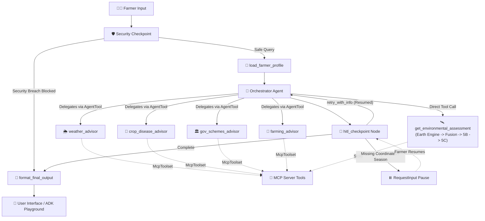

# BharatSahayak — Project Submission Write-Up

## Problem Statement
Agriculture employs over 50% of India's population across 140+ million smallholder farming families. However, smallholder farmers face severe information asymmetry: satellite observation data, soil moisture metrics, climate reanalysis, and government subsidies are locked in complex databases or technical GIS interfaces. Furthermore, rural users are vulnerable to data leaks and phishing.

BharatSahayak solves this by acting as an AI Rural Farming Companion. Built on **Google ADK 2.2.0** and powered by **Gemini 3.5 Flash Lite**, it fuses multi-source satellite Earth observation data (Google Earth Engine) and agricultural domain knowledge into an intuitive, secure, multilingual dialogue assistant.

---

## Solution Architecture & Workflow

---

## Core Technologies & Concepts Demonstrated

*   **Google ADK 2.2.0 Multi-Agent Workflow:** Orchestrates deterministic graph transitions using `Workflow`, `START`, `node`, `LlmAgent`, `AgentTool`, and `Runner` with `InMemorySessionService`.
*   **Gemini 3.5 Flash Lite:** Configured via `GEMINI_MODEL=gemini-3.5-flash-lite` for high-efficiency structured JSON reasoning, multilingual explanation, and strict epistemic grounding.
*   **Earth Engine Satellite Intelligence (V2 Flow):** Fuses 5 complementary evidence streams:
    1. Sentinel-2 10m NDVI
    2. 3-Year historical NDVI seasonal baseline & spectral anomaly quantification
    3. ERA5-Land reanalysis (~11.1km ambient temperature, volumetric soil moisture, runoff)
    4. CHIRPS rainfall (~5.566km precipitation distribution)
    5. Dynamic World 10m probabilistic land cover
*   **Evidence vs. Interpretation Separation:** Physical evidence is assembled immutably in Phase 4; Phase 5B performs pure-Python deterministic pattern assessment; Phase 5C uses Gemini strictly as an explanation layer. *Gemini never calculates physical measurements or fabricates ungrounded evidence.*
*   **Model Context Protocol (MCP) Server:** Standalone stdio FastMCP server exposes `get_environmental_assessment`, `get_crop_disease_info`, `get_weather_advisory`, `search_government_schemes`, and `calculate_farming_profitability`.
*   **Location & Coordinate Integrity Contract:** *"Regional location context is not treated as exact farm location."* State/district names are preserved for general scheme context, while satellite analysis strictly requires verified coordinates. Missing coordinates trigger HITL clarification.
*   **Crop Disease Advisory:** Evaluates symptoms against a trusted 52-entry agricultural corpus across 10 crops, providing candidate hypotheses, safe non-chemical cultural practices, and KVK referrals with 0 chemical prescriptions.
*   **Human-in-the-Loop (HITL) Resumption:** Pauses graph execution with `RequestInput(interrupt_id="more_info")` when essential context (such as coordinates or farming season) is missing, resuming statefully without loss of profile context.

---

## Security Boundary & Checkpoint Design

The intent-grounded security checkpoint runs before any agent or LLM invocation:
1. **PII Redaction:** Scrubs Aadhaar numbers (`[AADHAAR_REDACTED]`), phone numbers, and emails using regex before processing.
2. **Intent-Grounded Protection:** Detects and blocks:
   - System prompt / system instruction extraction
   - Hidden / developer instruction extraction
   - API key / token / cloud secret extraction
   - Internal tool / schema / implementation extraction
   - Private farmer / user data extraction
   - Passwords, bank/ATM PINs, CVVs, and Aadhaar credentials
   - Instruction override / jailbreak attempts
3. **Conceptual Question Support:** Legitimate educational queries (`"What is a system prompt?"`, `"What is an API?"`, `"Why should passwords be protected?"`) are safely allowed through without false-positive blocking.
4. **Standard Security Response:** Returns a concise alert:
   > 🔒 **Security Alert:** I can't provide private information, passwords, API keys, hidden instructions, system prompts, or internal system details. Please remove sensitive information from your request and try again.
5. **Security Verification:** Verified with 8 automated unit tests in `tests/unit/test_security_hardening.py` (100% pass) and 2 live Playground adversarial validation tests.

---

## Product Limitations & Honest Disclosures

* **Coordinate Dependency:** Satellite environmental analysis requires exact parcel coordinates; regional state names are insufficient.
* **Observation Lag:** Earth observation datasets exhibit publication latencies (e.g. ERA5-Land reanalysis latency of several days).
* **Non-Diagnostic Nature:** Environmental signals represent physical growing conditions and do not prove specific disease pathogens, yield loss, or fertilizer deficiency.
* **Spectral $\ne$ Agronomic:** NDVI spectral departures represent historical anomalies, not clinical damage.
* **Browser Geolocation:** Browser GPS / one-tap map geolocation is scheduled for the Phase 9 UI/UX update.
* **Deployment:** Cloud infrastructure templates are scaffolded in Terraform; live production deployment is scheduled for Phase 10.

---

## Next Phase: Phase 9 — UI / UX & Map Experience

The upcoming development milestone (Phase 9) will introduce:
* Interactive map location picker with automatic coordinate resolution.
* "Use My Current Location" one-tap browser GPS integration.
* Visual NDVI vegetation vigor indicators and moisture charts.
* Streamlined, mobile-friendly conversational interface in English and Hindi.
