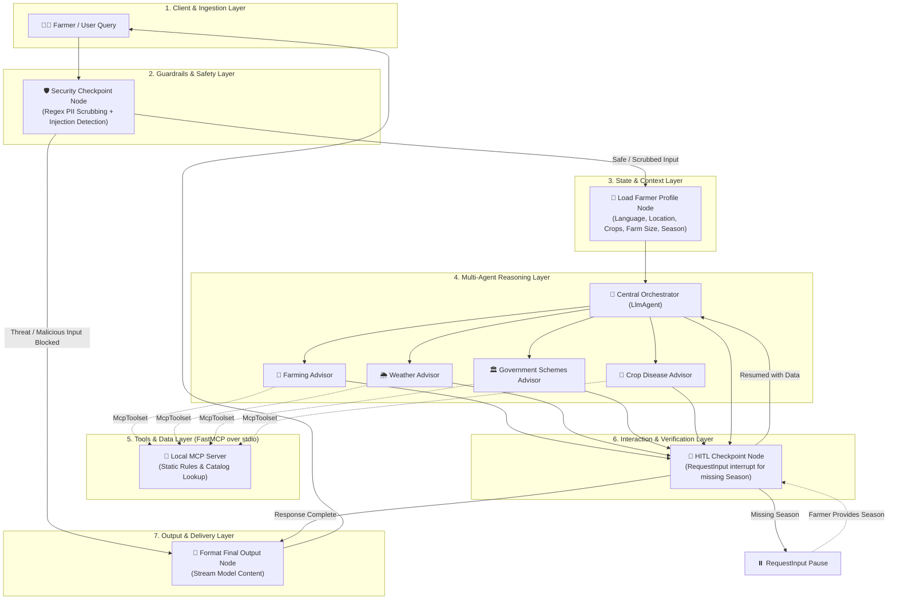
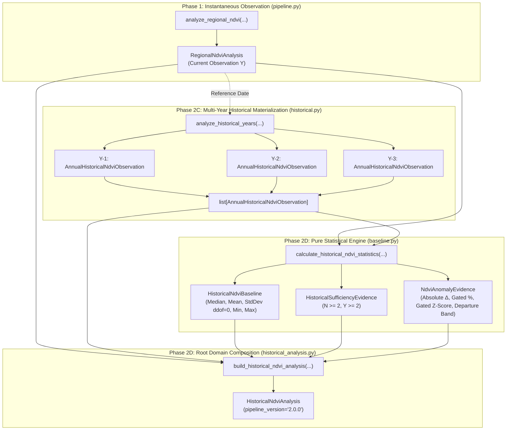
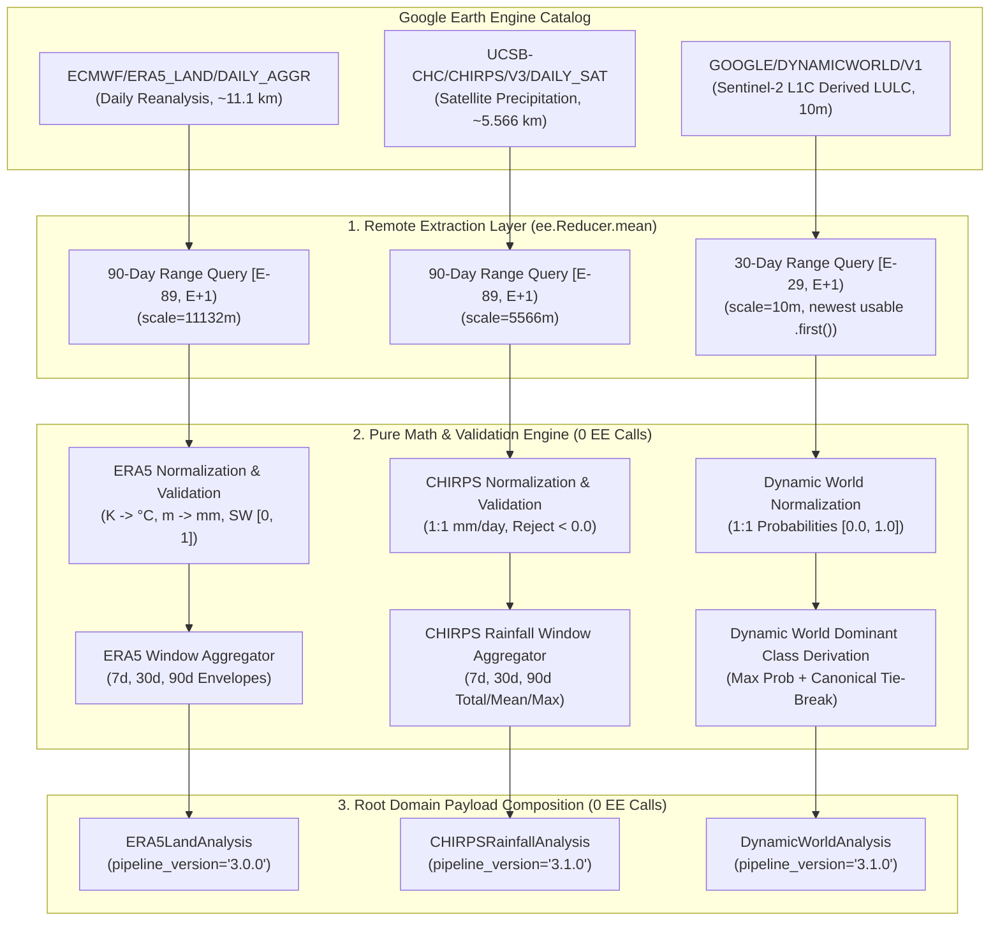
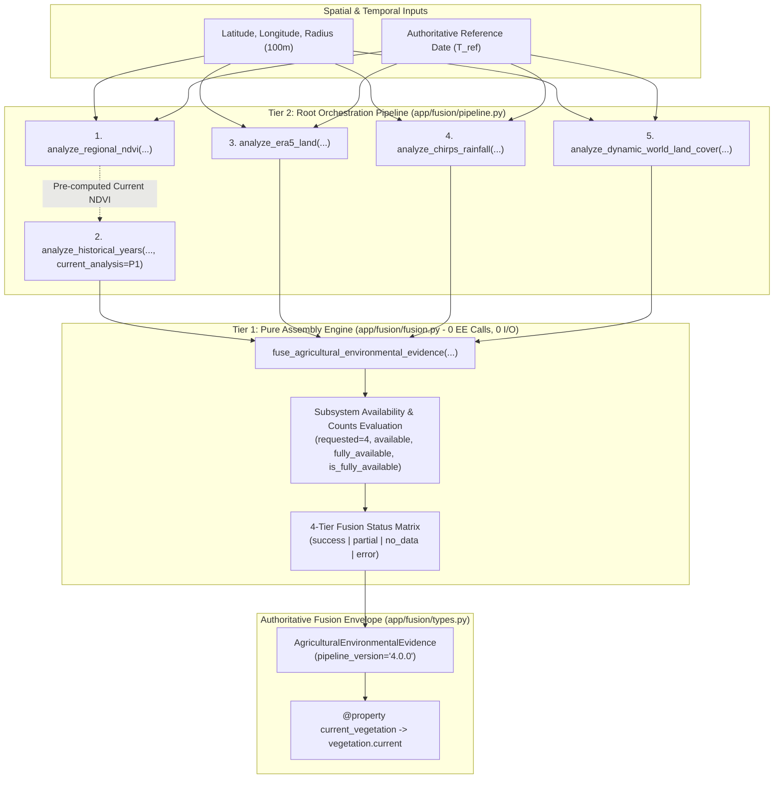
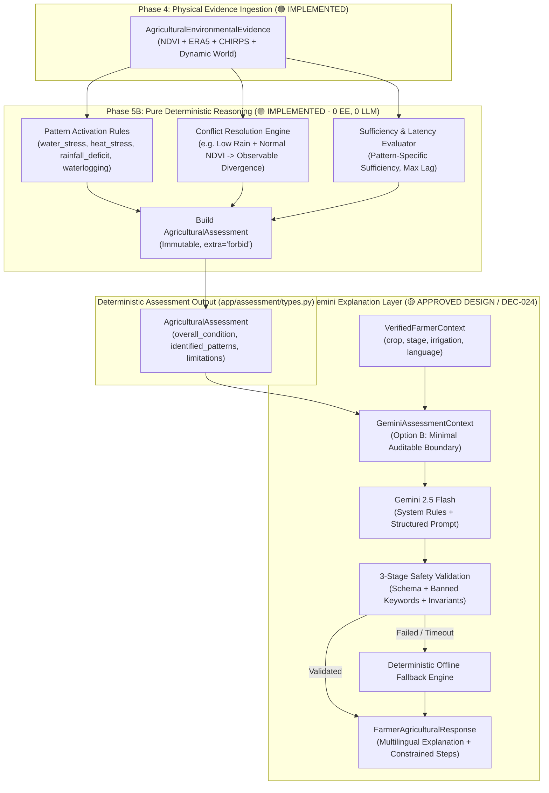

# BharatSahayak V2 — System Architecture & Design

> **Current architectural baseline, operational mechanics, guardrails, and planned evolution.**
> *Baseline Branch: `bharatsahayak-v2` | Commit: `e0fcc29`*

---

## 🏛️ System Overview

BharatSahayak V2 is an AI-powered rural agricultural companion designed to empower Indian smallholder farmers. The system is engineered on **Google ADK 2.0 (Agent Development Kit)**, powered by **Gemini 2.5 Flash**, and coupled to local and cloud execution tools via the **Model Context Protocol (MCP)**.

### Architectural Maturity Legend

| Status | Meaning |
| :--- | :--- |
| 🟢 **CURRENT / IMPLEMENTED** | Actively operational and verified in current codebase. |
| 🟡 **PLANNED** | Architecturally specified and scheduled for near-term implementation. |
| 🔴 **FUTURE IDEA** | Long-term enhancement in backlog. |

---

## 🔄 Current Execution Flow (`🟢 CURRENT / IMPLEMENTED`)

The current runtime follows a deterministic-to-agentic directed workflow graph managed by ADK:

---

## 🧩 Architectural Components Breakdown

### 1. Framework & Model Engine (`🟢 CURRENT / IMPLEMENTED`)
- **Google ADK 2.0:** Uses ADK's `Workflow`, `START`, and `node` primitives for graph construction, `LlmAgent` for agent definitions, `AgentTool` for delegation hierarchy, and `Runner` with `InMemorySessionService` for stateful sessions.
- **Gemini Model:** Standardized on `gemini-2.5-flash` configured via [app/config.py](file:///d:/Documents/Desktop/adk-workspace/bharatsahayak/app/config.py). Temperature, system instructions, and structured schemas enforce crisp formatting.

### 2. Guardrails & Security Checkpoint (`🟢 CURRENT / IMPLEMENTED`)
The `security_checkpoint` node in [app/agent.py](file:///d:/Documents/Desktop/adk-workspace/bharatsahayak/app/agent.py) executes prior to any LLM invocation:
- **PII Redaction:**
  - **Aadhaar Numbers:** 12-digit Indian national identity numbers (formatted `XXXX XXXX XXXX` or `XXXXXXXXXXXX`) are scrubbed and replaced with `[AADHAAR_REDACTED]`.
  - **Phone Numbers:** 10-digit Indian mobile numbers starting with 6-9 are replaced with `[PHONE_REDACTED]`.
  - **Email Addresses:** Standard email formats replaced with `[EMAIL_REDACTED]`.
- **Prompt Injection Defense:** Intercepts manipulation phrases (`ignore previous instructions`, `system prompt`, `jailbreak`, `override instructions`, etc.) and immediately halts graph routing to `format_final_output` with a security alert.
- **Financial & Harmful Content Filters:** Blocks requests attempting to extract bank PINs, passwords, or instructions for malicious soil sabotage/poisoning.
- **Audit Logging:** Structured audit events with timestamps (Asia/Kolkata timezone), severity levels, and scrub details are appended to `ctx.state["audit_log"]` and logged to `sys.stderr`.

### 3. State & Profile Management (`🟢 CURRENT / IMPLEMENTED`)
The `load_farmer_profile` node parses incoming queries to maintain session state across conversational turns:
- **`FarmerProfile` Schema:**
  - `language`: Detected dynamically per turn ("English" or "Hindi" via Devanagari Unicode `\u0900-\u097f` evaluation).
  - `location`: Extracted via mapped Indian state and major city dictionaries.
  - `crops`: Multilingual English/Hindi crop dictionary extractor.
  - `farm_size`: Regex extraction for acreage (e.g., `2.5 acres`, `5 एकड़`).
  - `season`: Sowing season classification (`Kharif`, `Rabi`, `Zaid`).
- **Prompt Injection into Context:** The profile is serialized and prepended to the orchestrator prompt on every turn to ensure complete conversational recall.

### 4. Multi-Agent Delegation (`🟢 CURRENT / IMPLEMENTED`)
- **Central Orchestrator Agent:** The routing hub that decides which advisor agent should handle the farmer's request. Uses structured output schema `OrchestratorOutput` (`response`, `needs_more_info`, `info_request_message`).
- **Farming Advisor:** Generates region- and season-specific crop recommendations using a structured visual layout (emojis, estimated investment, profit, difficulty, schemes, next steps).
- **Weather Advisor:** Provides irrigation advice, fertilizer timing (e.g. urea application), and disease risk warnings.
- **Government Schemes Advisor:** Outlines central/state schemes (PM-KISAN, PMFBY, state subsidies), required documentation, and application steps.
- **Crop Disease Advisor:** Diagnoses crop fungal/bacterial diseases from symptom descriptions, detailing organic treatments, chemical controls, and prevention measures.

### 5. Human-in-the-Loop (HITL) Resumption (`🟢 CURRENT / IMPLEMENTED`)
- Implemented via `@node(rerun_on_resume=True)` in `_hitl_checkpoint_impl`.
- If a crop recommendation query lacks a defined farming season (`Kharif`, `Rabi`, or `Zaid`), the node yields a `RequestInput(interrupt_id="more_info")` with a localized prompt (in English or Hindi).
- When the farmer responds, the execution resumes statefully from `ctx.resume_inputs["more_info"]`, updates the profile, and yields `route="retry_with_info"` to re-run the orchestrator without losing existing context (such as land size or location).

### 6. MCP Data Layer (`🟢 CURRENT / IMPLEMENTED` with Known Limitations)
- **FastMCP Server:** Implemented in [app/mcp_server.py](file:///d:/Documents/Desktop/adk-workspace/bharatsahayak/app/mcp_server.py), running over `stdio` via `uv run app/mcp_server.py`.
- **Tools Exposed:**
  1. `get_weather_advisory(location, crop)`
  2. `get_crop_disease_info(crop, symptoms)`
  3. `search_government_schemes(state, crop)`
  4. `calculate_farming_profitability(crop, acreage, expected_yield_per_acre)`
- ⚠️ **CURRENT LIMITATION & UPGRADE AREA:**
  > [!IMPORTANT]
  > The current MCP server returns **static, rule-based catalog responses and hardcoded conditional lookups** for selected Indian states (Punjab, Karnataka) and crops (wheat, rice, cotton).
  > It does **NOT** yet connect to live meteorological APIs, dynamic satellite feeds, or live government database endpoints. Connecting live data sources is a major milestone of upcoming phases.

### 7. Telemetry & Observability (`🟢 CURRENT / IMPLEMENTED`)
- **OpenTelemetry & GenAI Instrumentation:** [app/app_utils/telemetry.py](file:///d:/Documents/Desktop/adk-workspace/bharatsahayak/app/app_utils/telemetry.py) configures OpenTelemetry GenAI semantic conventions, optional message-content capture mode (`NO_CONTENT` metadata-only or full), and Google Cloud Storage upload hooks.
- **Feedback Collection:** [app/agent_runtime_app.py](file:///d:/Documents/Desktop/adk-workspace/bharatsahayak/app/agent_runtime_app.py) provides `register_feedback` operation logging structured satisfaction scores to Cloud Logging.

### 8. Cloud Deployment Infrastructure (`🟢 SCAFFOLDING ONLY`)
- Terraform templates in [deployment/terraform/single-project/](file:///d:/Documents/Desktop/adk-workspace/bharatsahayak/deployment/terraform/single-project/) define:
  - `google_vertex_ai_reasoning_engine` resource.
  - Telemetry GCS bucket and BigQuery completions SQL view.
  - Service accounts and IAM permissions.
- **Current Status:** Scaffolding complete; infrastructure has **not** yet been provisioned to GCP (`remote_agent_runtime_id: None`).

---

## 🛰️ Earth Engine Satellite Intelligence Flow (`🟢 PHASE 1 & PHASE 2 COMPLETE | 🟡 MCP CONNECTION SCHEDULED (Phase 6)`)

> [!IMPORTANT]
> **Current Implementation Status:**
> - **Phase 1 Instantaneous Satellite Engine (`app/satellite/`):** 🟢 **COMPLETE & SEALED (`60f8d90`)**. Standalone deterministic satellite computation engine providing `analyze_regional_ndvi(...)`, single authoritative observation selection, Cloud Score+ quality masking, NDVI computation, and regional zonal reductions (`382 tests passing`).
> - **Phase 2 Historical Intelligence & Anomaly Detection:** 🟢 **COMPLETE & SEALED (`DEC-012`–`DEC-017`, `ebba070`)**. Extends the satellite engine with 3-year rolling baselines ($Y-1, Y-2, Y-3$), calendar-date-anchored seasonal windowing ($T_h \pm 15\text{ days}$), target-year window ownership, Option C annual matched-window regional composite observations, pure-Python statistical baseline derivation (median, mean, population std dev ddof=0, sufficiency), empirical spectral departure anomaly quantification, and root payload integration (`700 satellite tests passing`).
> - **FastMCP Server & Agent Connection:** 🟡 **SCHEDULED FOR PHASE 6**. The active MCP server ([app/mcp_server.py](file:///d:/Documents/Desktop/adk-workspace/bharatsahayak/app/mcp_server.py)) currently retains its initial static/catalog tools until Phase 6 implements the live `get_regional_satellite_analysis` tool adapter.

### Multi-Year Historical Satellite Intelligence Architecture (`Phase 2D / DEC-017`)

Phase 2 enforces a strict three-tier module separation between remote Earth Engine data materialization, local pure-Python mathematics, and root domain payload composition:

### Architectural Principles & Boundaries for Earth Engine Integration
1. **Human-Centric Abstraction (`DEC-003`):** Farmers are never asked to enter raw coordinates or technical spatial projections. The frontend resolves human inputs (village name, PIN code, map tap) to spatial coordinates.
2. **Layered Integration Boundary (`DEC-004`):** The MCP server provides the capability tool contract, while Earth Engine initialization, image filtering, observation quality validation (`DEC-010`), band mathematics (`DEC-009`), and reducer operations live in an isolated module.
3. **Lean Statistical Aggregation First (`DEC-002`):** Compute robust zonal statistics (**mean**, **median**, **min**, **max**) for the farm area rather than transmitting heavy raster image arrays to LLMs.
4. **Pure Local Mathematics Boundary (`DEC-017`):** Earth Engine is strictly limited to remote pixel filtering, masking, compositing, and zonal reductions (`historical.py`). All multi-year statistical distributions, dispersion metrics, sufficiency evaluations, metric gating, and departure classifications execute as deterministic, pure-Python logic without Earth Engine dependencies (`baseline.py`, `historical_analysis.py`).
5. **Pluggable Data Source Architecture:** The Earth Engine client implements a decoupled provider interface so that future datasets (Dynamic World LULC, NDWI moisture, soil grids) can be plugged in without refactoring the core multi-agent workflow.

---

## 🌦️ Agricultural & Environmental Context Architecture (`🟢 PHASE 3 COMPLETE & FROZEN / DEC-018, DEC-019, DEC-020, DEC-021; Phase 3D Deferred`)

Phase 3 introduces physical meteorological, hydrological, and land-cover context layers to explain the physical drivers behind satellite vegetation signals:

### Key Architectural Tenets for Phase 3:
1. **Subsystem Independence:** ERA5-Land (Phase 3A), CHIRPS (Phase 3B), and Dynamic World (Phase 3C) are strictly independent subsystems with dedicated domain contracts (`ERA5LandAnalysis`, `CHIRPSRainfallAnalysis`, `DynamicWorldAnalysis`). Cross-source comparison and multi-sensor fusion are strictly deferred to Phase 4.
2. **Separation of Measurement from Agronomic Interpretation:** Phase 3 produces pure physical observations (temperature in $^\circ\text{C}$, precipitation in $\text{mm}$, soil water in $\text{m}^3/\text{m}^3$, runoff in $\text{mm}$, land-cover class probabilities in $[0.0, 1.0]$). Crop variety identification, crop stress, disease diagnosis, drought indices, and irrigation classifications are strictly deferred to Phase 4 (Fusion) and Phase 5 (Reasoning).
3. **Explicit Reanalysis & Satellite Data Lag:** Datasets exhibit publication latency. Domain contracts track `requested_end_date`, `latest_available_date`, and `data_lag_days` dynamically rather than hardcoding static constants or misrepresenting observations as real-time forecasts.
4. **Spatial Resolution Fidelity & Non-Claim Invariant:** Environmental outputs preserve native dataset resolution ($\approx 11.1\text{ km}$ ERA5-Land, $\approx 5.566\text{ km}$ CHIRPS, $10.0\text{ m}$ Dynamic World) and represent regional/local context. They are never claimed as cadastral boundary measurements. Synthetic downscaling, continuous spatial interpolation, and unverified sub-pixel weighting are prohibited.
5. **Missing Data & Artifact Invariants:** Missing values are never converted to $0.0$; negative values ($< 0.0$) from GEE data-packing artifacts are rejected as invalid (never silently clamped to 0.0).
6. **Single-Scene Land-Cover Selection:** Dynamic World selects the newest usable observation in the 30-day window $[E-29, E]$; zero temporal averaging or compositing is performed.
7. **Partial-Window Available-Observation Semantics:** For incomplete windows (`is_complete=False`), metric totals and averages represent observed totals/means over available non-null observations, NOT complete-window totals or zero-filled averages. Prohibits imputation or interpolation for missing dates.
8. **Data Sufficiency Over Dataset Accumulation:** *"Data sufficiency takes priority over dataset accumulation."* The environmental data foundation is frozen for the first prototype with 5 complementary evidence streams:
   - **Sentinel-2 NDVI:** Current vegetative vigor and condition.
   - **Historical NDVI Baseline / Anomaly:** Deviation from 3-year historical seasonal conditions.
   - **ERA5-Land Reanalysis:** Ambient temperature, topsoil volumetric water fraction, and runoff.
   - **CHIRPS Precipitation:** Satellite-partitioned daily rainfall distribution.
   - **Dynamic World Land Cover:** 9-class probabilistic land-cover context.
   Phase 3D (e.g. MODIS MOD16A2 evapotranspiration candidate) is deferred. The project now transitions from expanding environmental data collection to multi-source evidence fusion (Phase 4) and agricultural reasoning (Phase 5).

---

## 🌐 Multi-Source Evidence Fusion Architecture (`🟢 PHASE 4 COMPLETE & VERIFIED / DEC-022`)

Phase 4 provides deterministic, immutable evidence aggregation across the validated satellite and environmental subsystems without performing agricultural reasoning or synthetic scoring:

### Key Architectural Tenets for Phase 4:
1. **Pure Evidence Aggregation Layer:** Phase 4 assembles existing validated evidence pipelines into one coherent, traceable, immutable evidence envelope. It contains zero agricultural diagnoses, yield predictions, crop stress scores, irrigation recommendations, or synthetic confidence scores.
2. **Two-Tier Engine Structure:**
   - **Tier 1 (Pure Assembly — `app/fusion/fusion.py`):** Deterministic pure Python with zero Earth Engine imports, zero network calls, and zero filesystem I/O. Computes subsystem availability, 4-tier fusion status, and availability counts from passed domain models without mutating inputs.
   - **Tier 2 (Root Orchestration — `app/fusion/pipeline.py`):** Coordinates sequential execution of sub-pipelines, reuses Phase 1 current NDVI results for Phase 2 historical analysis, isolates subsystem exceptions into structured fallback error objects, and delegates to Tier 1.
3. **Direct Domain Composition:** Models are directly composed without flattening or discarding underlying fields (`vegetation: HistoricalNdviAnalysis`, `reanalysis: ERA5LandAnalysis`, `rainfall: CHIRPSRainfallAnalysis`, `land_cover: DynamicWorldAnalysis`).
4. **Four-Tier Status & Availability Semantics:**
   - `success`: All 4 subsystems provide `status == "success"`.
   - `partial`: Usable evidence exists across $\ge 1$ subsystem, but at least one subsystem is partial (e.g. `insufficient_history` with valid current NDVI) or unavailable (`no_data` / `error`).
   - `no_data`: All 4 subsystems report `status == "no_data"`.
   - `error`: Zero usable evidence with at least one `error` status, or top-level pipeline failure.
5. **Preservation of Native Resolution & Latency Semantics:** Native resolutions (10m Sentinel-2, 10m Dynamic World, 5.566km CHIRPS, 11.1km ERA5-Land), observation dates, and dataset-specific publication lags are strictly preserved without synthetic spatial downscaling or timestamp fabrication.

---

## 🧠 Agricultural Evidence Interpretation & Reasoning Architecture (`🟢 PHASE 5B VERIFIED / 🟡 PHASE 5C APPROVED DESIGN`)

Phase 5 establishes a two-layer architecture for transforming multi-source environmental evidence into safe, farmer-friendly explanations:
1. **Phase 5B (Deterministic Interpretation — `🟢 IMPLEMENTED & VERIFIED / DEC-023`):** Pure-Python deterministic engine that evaluates stress patterns, resolves conflicts, and produces immutable `AgriculturalAssessment` payloads.
2. **Phase 5C (Gemini Explanation Layer — `🟡 APPROVED DESIGN / PENDING IMPLEMENTATION / DEC-024`):** Bounded natural language layer that generates rural-friendly, multilingual explanations from structured deterministic assessments with constrained advisory and deterministic fallback.

### Key Architectural Tenets for Phase 5:
1. **The Core Tripartite Separation:** *"Phase 4 assembles evidence. Phase 5B interprets evidence. Phase 5C explains the interpretation."* LLMs never analyze raw Earth Observation data or override deterministic assessments.
2. **Deterministic Interpretation First (Phase 5B — Verified):** All diagnostic patterns (`water_stress_consistent_pattern`, `heat_stress_consistent_pattern`, `rainfall_deficit_consistent_pattern`, `excess_moisture_waterlogging_consistent_pattern`, `combined_environmental_stress_pattern`, `vegetation_stress_pattern`, `near_baseline_stable_condition`, `favorable_growth_condition`, `conflicting_environmental_signals`, `insufficient_evidence_condition`) and the 8-value `OverallEnvironmentalCondition` summary badge are derived purely in deterministic Python.
3. **Option B Purpose-Built Boundary (Phase 5C — Approved Design):** Gemini consumes `GeminiAssessmentContext`, cleanly separating deterministic assessment data, whitelisted personalization context, and presentation preferences.
4. **Personalization vs Evidence Axiom:** Farmer context (`crop`, `crop_stage`, `irrigation_available`) is personalization context, not environmental evidence. Gemini must not treat farmer input as physical evidence of crop condition.
5. **Context Freshness Lifecycle:** Context is explicitly tagged as `verified`, `stale`, or `unknown`. Stale context requires conditional framing and cannot trigger stage-specific actions.
6. **Epistemic Invariance & Multilingual Localization:** Assessments are language-independent. Translation into Hindi and regional languages preserves exact uncertainty and conflict reporting without inflating claims.
7. **Constrained Recommendation Allowlist:** MVP recommendations are strictly restricted to low-risk field visual inspection, manual topsoil moisture probing, ongoing monitoring, and information gathering. Prohibits chemical pesticide/fungicide advice, exact fertilizer dosages, and yield forecasts. Empty recommendation lists (`[]`) are fully valid.
8. **Three-Stage Mechanical Safety Pipeline:** LLM responses are validated via Pydantic schemas, banned-keyword regex scanners (blocking chemical units and names), and agronomic boundary checks.
9. **Deterministic Fallback Guarantee:** Deterministic offline template fallback engine generates valid explanations across all 8 Phase 5B overall environmental conditions if Gemini fails or times out.
10. **Prompt-Injection Defense:** Strict 5-tier structural prompt hierarchy treats all user strings inside passive XML data tags as data literals.
11. **Decoupled Camera Workflow:** Visual crop-photo disease diagnosis remains a decoupled, optional tool path, completely independent of the spatial environmental assessment pipeline.

