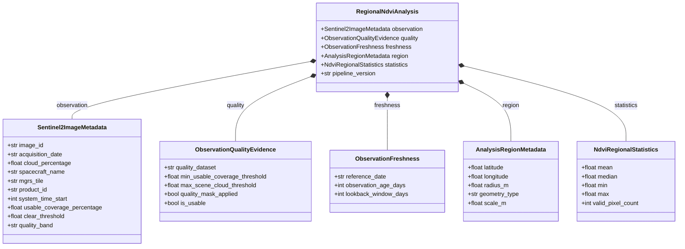

# BharatSahayak V2 — Architectural Decision Log (ADR)

> **Permanent record of architectural, data engineering, and product design decisions.**  
> *Baseline Branch: `bharatsahayak-v2` | Project ID: `bharatsahayak-v2`*

---

## 📖 Guiding Architectural Principles

1. **Human-Centric Abstraction:**
   > *"Ask the farmer for the easiest human-understandable input and derive technical geographic information from it where possible."*  
   > Never expose raw GIS complexities (EPSG projections, latitude/longitude float coordinates, multi-band raster matrices) to end-users.
2. **Lean Statistical Distillation Before LLM Injection:**
   > Convert heavy spatial raster tensors into standardized, interpretable summary statistics (mean, median, min, max, percentiles) and qualitative health categories before feeding context to Gemini.
3. **Pluggable & Decoupled Data Providers:**
   > Satellite imagery, meteorological services, and soil data sources must be implemented behind clean provider interfaces so new datasets can be introduced without disrupting existing agent tools or workflows.
4. **Safety & Privacy First:**
   > All farmer interactions must pass through deterministic privacy filters (scrubbing PII like Aadhaar, mobile numbers, and bank details) before hitting external APIs or cloud models.

---

## 📜 Decision Records

### DEC-001: Start Satellite Intelligence with Copernicus Sentinel-2 + NDVI Before Dynamic World

- **Decision ID:** `DEC-001`
- **Date / Context:** Phase 0 Baseline Establishment (BharatSahayak V2 Initiation)
- **Decision:** Begin satellite intelligence implementation with Copernicus Sentinel-2 Level-2A (Bottom of Atmosphere / Surface Reflectance) imagery to compute the Normalized Difference Vegetation Index (NDVI), rather than making Dynamic World Land Use/Land Cover (LULC) the primary or initial dependency.
- **Options Considered:**
  1. *Option A:* Immediate integration of Dynamic World (10m near-real-time LULC) alongside Sentinel-2, Landsat, and MODIS simultaneously.
  2. *Option B (Chosen):* Sentinel-2 Level-2A surface reflectance with standard NDVI computation as the foundational satellite layer; treat Dynamic World, NDWI, and other collections as pluggable future additions.
  3. *Option C:* Use pre-computed MODIS 250m NDVI products.
- **Chosen Option:** Option B — Sentinel-2 MSI Surface Reflectance + NDVI.
- **Why Chosen:**
  - Sentinel-2 provides 10m spatial resolution across visible (Red / B4) and Near-Infrared (NIR / B8) bands, which is essential for smallholder Indian farm plots (often 0.5 to 3 acres). MODIS (250m resolution) is far too coarse for individual smallholder fields.
  - NDVI is the global standard, proven, and scientifically unambiguous index for measuring photosynthetic activity, vegetation vigor, and crop density.
  - Dynamic World is highly effective for land-cover classification (e.g. distinguishing crops vs built-up vs trees), but does not directly quantify intra-field crop health or vegetative stress in the way calibrated NDVI does.
- **Advantages:**
  - High spatial fidelity (10m per pixel) suitable for small farms.
  - Straightforward mathematical formula ($\frac{\text{NIR} - \text{Red}}{\text{NIR} + \text{Red}}$) supported natively in Earth Engine with cloud masking (`QA60` / SCL).
  - Fast execution with predictable compute latency in Earth Engine reducers.
- **Disadvantages:**
  - Cloud cover during peak monsoon season (Kharif) requires robust cloud-masking and temporal compositing.
  - Does not provide instant land-use classification metadata out-of-the-box (requires separate mask or manual user confirmation of farm boundaries).
- **Complexity:** Moderate (standard Earth Engine image collection filtering and reducer operations).
- **Reliability / Data-Quality Implications:** High data quality; Level-2A provides atmospherically corrected surface reflectance.
- **Cost / Quota Implications:** Earth Engine compute units (EECUs) are well within free/standard research quotas for zonal point/polygon reductions.
- **Hackathon Value:** Demonstrates strong technical mastery of Earth Observation (EO) data and real-world AI agent integration.
- **Interview / Engineering Value:** Demonstrates disciplined MVP scoping, domain-appropriate resolution selection (10m vs 250m), and avoiding premature over-engineering.
- **Deferred Alternatives:** Dynamic World LULC, NDWI (Normalized Difference Water Index), EVI, and Landsat thermal bands deferred to Phase 3 / Future Backlog.
- **Future Upgrade Impact:** Satellite data layer will be designed with a `SatelliteDataProvider` interface so Dynamic World can be added cleanly as an optional enrichment layer in Phase 3/4.

---

### DEC-002: Use Regional NDVI Summary Statistics Initially (Mean, Median, Min, Max); Defer Time Series & Anomaly Baselines

- **Decision ID:** `DEC-002`
- **Date / Context:** Phase 0 Baseline Establishment (Earth Engine & Multi-Agent Interface Design)
- **Decision:** Extract and feed regional summary statistics—specifically **mean**, **median**, **min**, and **max** NDVI—for the farmer's land parcel to the LLM agent. Deliberately defer historical multi-year NDVI time-series charting, historical baseline modeling, and temporal anomaly detection to future iterations.
- **Options Considered:**
  1. *Option A:* Build a complete 3-year historical NDVI time-series engine with seasonal baseline deviation and automated anomaly alerting in the initial release.
  2. *Option B (Chosen):* Compute instantaneous zonal statistics (mean, median, min, max, and cloud score) for the most recent valid satellite composite over the farm area; defer multi-temporal trend analysis.
  3. *Option C:* Stream raw pixel raster grids or geotiff images directly to Gemini Multimodal.
- **Chosen Option:** Option B — Zonal summary statistics (mean, median, min, max).
- **Why Chosen:**
  - Keeps token context concise, deterministic, and highly structured for Gemini 2.5 Flash reasoning.
  - Mean/Median indicates overall crop health and vigor; Min/Max highlights intra-field variability (e.g. identifying localized pest infestation or waterlogging spots where min is significantly lower than median).
  - Historical multi-year time-series analysis requires extensive temporal image compositing, seasonal alignment algorithms, and complex caching to avoid Earth Engine query timeouts during real-time chat sessions.
- **Advantages:**
  - Sub-second to 2-second Earth Engine reduction latency.
  - Clean, structured JSON output easily ingested by Pydantic tool models and LLM system prompts.
  - Provides immediate, high-value insights (overall vigor + intra-plot uniformity).
- **Disadvantages:**
  - Does not yet tell the farmer if today's NDVI is higher or lower than the same week last year.
- **Complexity:** Low to Moderate.
- **Reliability / Data-Quality Implications:** Very high; zonal reducers aggregate out single-pixel sensor noise.
- **Cost / Quota Implications:** Extremely low payload size and minimal Earth Engine processing overhead.
- **Hackathon Value:** Delivers a reliable, snappy, and grounded agent demo without risking live demo timeouts caused by heavy time-series aggregations.
- **Interview / Engineering Value:** Shows clear understanding of latency budgets in real-time conversational agent architectures.
- **Deferred Alternatives:** Multi-year temporal graphs, seasonal moving averages, and automated z-score anomaly detection deferred to `FUTURE_BACKLOG.md`.
- **Future Upgrade Impact:** The statistical dictionary schema will include an optional `temporal_comparison` block, enabling seamless future addition without breaking tool schemas.

---

### DEC-003: Implement Map-Based Farm Location with Search & Geolocation Assistance; Never Force Manual Coordinates

- **Decision ID:** `DEC-003`
- **Date / Context:** Phase 0 Baseline Establishment (Farmer UX & Geographic Grounding)
- **Decision:** Design the farmer-facing location mechanism around an interactive map interface with:
  1. Browser GPS "Use My Current Location" button.
  2. Village / Town / District / PIN code text search.
  3. Visual map pin-drop and boundary adjustment.
  Explicitly prohibit any UX requirement forcing farmers to manually find, format, or type latitude/longitude coordinates.
- **Options Considered:**
  1. *Option A:* Command-line / chat prompt asking the farmer: "Please enter your latitude and longitude."
  2. *Option B (Chosen):* Human-friendly map UI + reverse-geocoded place search that extracts coordinates under the hood.
  3. *Option C:* Pure state/district level dropdowns without spatial coordinate resolution.
- **Chosen Option:** Option B — Interactive Map + Place Search + Geolocation Assistance.
- **Why Chosen:**
  - Rural Indian farmers understand their village, panchayat, landmarks, and farm boundaries, but rarely know their geographic latitude and longitude coordinates in decimal degrees.
  - Dropdowns at state/district level (Option C) lack sufficient spatial resolution for 10m Sentinel-2 field analysis.
  - Asking for manual coordinates (Option A) creates immense friction and causes user drop-off.
- **Advantages:**
  - Frictionless onboarding: one tap to detect location when standing on the field.
  - Accurate spatial point/bounding polygon generation for Earth Engine querying.
  - Accessible to users across literacy levels through visual map recognition.
- **Disadvantages:**
  - Requires integrating map components (e.g. Leaflet / Mapbox / Google Maps API) and geocoding services in the UI phase.
- **Complexity:** Moderate.
- **Reliability / Data-Quality Implications:** Significantly increases location accuracy compared to pure text matching.
- **Cost / Quota Implications:** Minimal standard geocoding API usage; open-source OpenStreetMap / Nominatim or Google Maps Platform geocoding.
- **Hackathon Value:** Major differentiator in usability and visual impact during product demos.
- **Interview / Engineering Value:** Embodies user-first engineering principles and empathetic accessibility design for rural demographics.
- **Deferred Alternatives:** In Phase 0/1 testing, a mock/fallback coordinate resolver will allow test harness simulation while full map UI is built in Phase 9.
- **Future Upgrade Impact:** Enables future cadastral map overlay, KML/GeoJSON upload, and precise polygon drawing in Phase 9.

---

### DEC-004: Decouple Earth Engine Computation into a Dedicated Module Behind the MCP Capability Interface

- **Decision ID:** `DEC-004`
- **Date / Context:** Phase 1A Architecture & Integration Design (Earth Engine Integration Planning)
- **Decision:** Expose the satellite capability through the Model Context Protocol (MCP) tool contract, while delegating all Earth Engine initialization, image querying, cloud masking, band math, and zonal reduction to a dedicated Earth Engine module/service (Option C).
- **Options Considered:**
  1. *Option A (Monolithic MCP):* Embed all Earth Engine API initialization, geometry parsing, Sentinel-2 image collection filtering, NDVI math, and reducer logic directly inside `app/mcp_server.py`.
  2. *Option B (Standalone Satellite Service):* Build a completely independent satellite microservice without any MCP tool bindings, requiring agent orchestration to manage external HTTP endpoints.
  3. *Option C (Chosen — Layered Tool Contract + Dedicated Engine):* MCP exposes high-level capability tools (e.g. `get_farm_satellite_intelligence`), while a dedicated Earth Engine module performs domain-specific geospatial and Earth Engine computations.
- **Chosen Option:** Option C — Layered Tool Contract with Dedicated Earth Engine Module.
- **Architectural Flow:**
  ```text
  Farmer-Friendly Location (Search / Pin-drop / GPS)
          ↓
  Latitude / Longitude Coordinates
          ↓
  MCP Capability Interface (Tool Contract / Parameter Validation)
          ↓
  Dedicated Earth Engine Module / Service
          ↓
  Copernicus Sentinel-2 Collection (Harmonized Level-2A)
          ↓
  Observation Quality (Cloud Score+ cs_cdf >= 0.60) / Quality Masking
          ↓
  NDVI Calculation ((B8 - B4) / (B8 + B4))
          ↓
  Regional Statistics Reducer (Mean, Median, Min, Max)
          ↓
  Structured JSON Output Envelope
  ```
- **Why Chosen:**
  - **Separation of Responsibilities:** The MCP layer is responsible for defining tool schemas, input validation, execution timing, and communication protocol (stdio/SSE). It should not be cluttered with low-level Earth Engine client details, band indexing, or reducer dictionary parsing.
  - **Independent Testability:** Earth Engine logic can be thoroughly unit-tested and mocked without running an active MCP stdio sub-process or spinning up an ADK agent runner.
  - **Preserved Future Pluggability:** Datasets like Dynamic World, NDWI, SoilGrids, and weather feeds can be added into the dedicated data layer without breaking or rewriting the MCP tool signatures.
  - **Cleaner Technical Story & Interview Value:** Clear separation of concerns between agent communication protocol (MCP), model reasoning (ADK/Gemini), and scientific compute (Earth Engine).
- **Disadvantages / Trade-offs:**
  - Introduces an additional module boundary and internal interface contract.
  - Slightly higher initial file/module scaffolding compared to writing inline functions in `mcp_server.py`.
- **Complexity:** Moderate.
- **Reliability / Data-Quality Implications:** High; isolating Earth Engine logic enables dedicated retry handlers, client caching, and mockable unit tests for edge cases (zero pixels, heavy cloud cover, out-of-bounds coordinates).
- **Cost / Quota Implications:** Low; Earth Engine compute is isolated to lean statistical reductions executed only when the tool is invoked.
- **Hackathon Value:** Demonstrates production-grade multi-agent software engineering rather than hacky script concatenation.
- **Interview / Engineering Value:** Highlights deep understanding of clean architecture, interface isolation, and test-driven design in AI-agent ecosystems.
- **Deferred Alternatives & Features:**
  - NDVI time-series trends (deferred to Phase 2+).
  - Historical baseline & anomaly detection (deferred to Backlog).
  - Dynamic World LULC, NDWI, and other spectral indices (deferred to Phase 3).
  - Soil & meteorological multi-source data fusion (deferred to Phase 4).
- **Future Upgrade Impact:** When adding future satellite datasets (e.g. Dynamic World in Phase 3), new methods can be added to the dedicated Earth Engine service without altering the agent-facing MCP contract.

---

### DEC-005: Earth Engine Python API Dependency Management via uv Workflow

- **Decision ID:** `DEC-005`
- **Date / Context:** Phase 1B Local Earth Engine Environment, after completion of Subphase 1B.1 Environment Inspection
- **Decision:** Manage and install the official Google Earth Engine Python client library (`earthengine-api`) using the project's standard `uv` package management workflow via `uv add earthengine-api`.

- **Current Environment Findings:**
  - Package Manager: `uv` v0.11.26
  - Active Python Runtime: Python 3.13.14
  - Core ADK Runtime: `google-adk` v2.2.0
  - Earth Engine API: Not installed
  - Git Working Tree: Clean at time of inspection
  - Project Python Version Constraint: `>=3.11,<3.14`
  - Existing Dependency Manifests: `pyproject.toml` and `uv.lock`

- **Options Considered:**
  1. **Option A - Ad-hoc pip install:** Run `pip install earthengine-api` directly in the environment.
  2. **Option B - Manual manifest editing:** Manually add `earthengine-api` to `pyproject.toml` and run `uv sync`.
  3. **Option C - Chosen - Canonical uv workflow:** Run `uv add earthengine-api` so the project dependency declaration and lockfile are resolved together.

- **Chosen Option:** Option C - `uv add earthengine-api`

- **Why Chosen:**
  - **Reproducibility:** Keeps `pyproject.toml` and `uv.lock` synchronized.
  - **Dependency Resolution:** Lets `uv` resolve compatibility with the project's Python version and existing dependencies.
  - **Consistent Toolchain:** Preserves the dependency-management workflow already used by BharatSahayak V2.
  - **Developer Experience:** Avoids manual lockfile maintenance.
  - **Deployment:** Provides a reproducible dependency graph for later cloud deployment.

- **Trade-offs:**
  - Developers need to use `uv` rather than raw `pip`.
  - The lockfile must be updated whenever dependencies change.
  - Dependency resolution may expose conflicts that require investigation before implementation can continue.

- **Cost / Quota Implications:**
  - Adding the Python client library itself does not consume Earth Engine computation quota.
  - Earth Engine computation quota becomes relevant when the application actually executes Earth Engine operations in later subphases.

- **Hackathon Value:**
  - Keeps the prototype reproducible and easier to demonstrate on another environment.
  - Establishes a clean foundation for the planned Earth Engine integration.

- **Interview / Engineering Value:**
  - Demonstrates deliberate dependency management.
  - Demonstrates reproducible environment management.
  - Demonstrates separation between local setup and application implementation.

- **Implementation Status:** 🟢 COMPLETE (Installed in Phase 1B)

---

### DEC-006: Local Earth Engine Developer Authentication Workflow

- **Decision ID:** `DEC-006`
- **Date / Context:** Phase 1B Local Earth Engine Environment (Subphase 1B.5 Developer Authentication)
- **Decision:** Use interactive Earth Engine authentication (`earthengine authenticate` / ADC workflow) for local BharatSahayak V2 development and verification.

- **Options Considered:**
  1. **Option A (Chosen):** Interactive local authentication through developer's Google Cloud ADC account.
  2. **Option B:** Service account key JSON file stored locally.
  3. **Option C:** Static mocked credentials without real Earth Engine evaluation.

- **Why Chosen:**
  - **Simplicity:** Appropriate for local development without introducing unnecessary service account keys or IAM complexity prematurely.
  - **Security:** Zero credential files or secrets stored inside the source repository.
  - **Compatibility:** Works seamlessly with `ee.Initialize(project='bharatsahayak-v2')`.

- **Security Rule:**
  - No passwords, access tokens, refresh tokens, or credential files are ever committed to Git or embedded in application code.

- **Trade-offs:**
  - Requires interactive web browser login for the local developer session.
  - Dedicated production service account authentication will be evaluated in Phase 10 for Cloud Run / Vertex AI deployment.

- **Future Upgrade Impact:**
  - When moving to Google Cloud deployment in Phase 10, production service account authentication and Workload Identity will be evaluated.

- **Implementation Status:** 🟢 COMPLETE (Executed and verified in Phase 1B.5)

---

### DEC-007: Geographic Analysis Region Strategy

- **Decision ID:** `DEC-007`
- **Date / Context:** Phase 1D Geographic Region Definition (Subphase 1D.1 Conceptual Analysis & Strategy Selection)

#### 📸 Before Snapshot
Prior to DEC-007, Phase 1 established live Earth Engine client initialization (`DEC-005`, `DEC-006`) and application-level result contracts (`Phase 1C`, `EarthEngineResult`). However, the transformation from a human-selected farm location to an Earth Engine spatial geometry remained undefined. The system lacked an explicit abstraction separating user-facing location inputs from backend satellite analysis geometries.

#### 📜 Decision
Adopt a decoupled two-stage geographic modeling strategy separating **`FarmerLocation`** (user input) from **`AnalysisRegion`** (satellite compute geometry) resolved via an intermediate **Region Resolution** abstraction:

```text
FarmerLocation (Point: Latitude, Longitude)
        ↓
Region Resolution (Resolver / Buffer Engine)
        ↓
AnalysisRegion (Geometry: Circular Buffer / Future Polygon)
```

1. **Farmer-Facing Location Input:**
   - The farmer specifies location via:
     - Browser/Device GPS ("Use My Current Location"), OR
     - Searching a village / panchayat / area on a map, OR
     - Interactively tapping / dropping a pin on a map.
   - **Strict Negative Constraints:**
     - Do **NOT** require the farmer to manually enter latitude and longitude coordinates in decimal degrees or DMS.
     - Do **NOT** require the farmer to draw a field boundary polygon in the MVP.
2. **Location Storage:**
   - Store the original farmer-selected location simply as:
     - `latitude` (float)
     - `longitude` (float)
3. **Initial Analysis Region Strategy:**
   - Automatically convert the selected point into a **circular analysis region**.
   - **Default Radius:** Fixed at **100 meters** (approx. 3.14 hectares / ~7.7 acres area).
   - This radius is an engineering choice for MVP satellite processing, **not** a claim that 100 m represents the farmer's exact farm boundary.
4. **Internal Non-Configurability:**
   - The 100 m radius is an internal system constant / default and must **NOT** be exposed to the farmer as a technical or user-configurable setting in the MVP.
5. **Decoupled Architectural Abstraction:**
   - `FarmerLocation` and `AnalysisRegion` are maintained as distinct concepts and data structures.
   - The `Region Resolution` layer is designed so future resolvers can swap or extend the region generator (e.g., 100 m buffer, cadastral boundary lookup, or user-drawn polygon) without altering the downstream satellite processing pipeline.
6. **Reusability for Historical & Multi-Temporal Analysis:**
   - The generated `AnalysisRegion` geometry must be deterministic and reusable across both current and historical satellite observations. This ensures that when multi-temporal analysis is introduced, historical trends and delta comparisons are evaluated over the exact same geographic footprint.

#### 💡 Rationale (Why Chosen)
- **Minimizes Farmer UX Complexity:** Rural Indian farmers can easily identify their village or drop a pin on their field, but forcing polygon boundary drawing on mobile screens creates severe friction, gesture errors, and drop-off.
- **Eliminates Geospatial Jargon:** Farmers are never exposed to bounding boxes, coordinate reference systems (CRS/EPSG), or polygon topology rules.
- **Sufficient Spatial Sample for Sentinel-2:** Sentinel-2 Level-2A surface reflectance has a 10m spatial resolution per pixel. A 100 m circular buffer provides an area of $\pi \times 100^2 \approx 31,416\text{ m}^2$, covering approximately 300+ raw 10m pixels, providing a bounded multi-pixel sample for regional satellite statistics rather than relying on a single pixel, while keeping the analysis region computationally manageable.
- **Preserves Future Precision without Redesign:** Decoupling `FarmerLocation` from `AnalysisRegion` ensures that when precise field polygon drawing is added in Phase 9, the satellite ingestion and zonal reducer modules require zero architectural rework.

#### ⚖️ Trade-offs
- **Fixed Radius vs. Actual Acreage:** A 100 m buffer represents a standard local spatial envelope; it does not automatically scale to match a farmer's stated acreage (e.g. 0.5 acre vs. 10 acres) in the initial MVP.
- **Boundary Inexactness:** A circle generated around a pin drop may sample land beyond the farmer's specific parcel boundary.
- **Two-Stage Data Modeling:** Requires maintaining distinct types and resolution steps (`FarmerLocation` -> `AnalysisRegion`) rather than passing raw coordinates directly to Earth Engine reducers.

#### ⚠️ Limitations
- **Approximate Local Area Only:** The 100 m circular buffer is strictly an approximate local satellite observation area.
- **Mixed Land Cover Elements:** The analysis circle may encompass neighboring plots, field bunds, farm roads, irrigation channels, adjacent trees, or rural structures.
- **Never an Exact Cadastral Boundary:** The analysis region must **NEVER** be described, labelled, or presented to the farmer as their exact legal, cadastral, or revenue parcel boundary.

#### 🔮 Future Upgrade Impact
- **Phase 9 Field Polygon Drawing:** Seamlessly introduce interactive polygon drawing tools or KML/GeoJSON boundary uploads in the frontend. The region resolver will simply emit a polygon-based `AnalysisRegion` into the unchanged satellite pipeline.
- **Cadastral & Land Record Integration:** In future phases, state land registry records (e.g., Bhulekh / Bhoomi) can be resolved to official plot boundaries via the same `Region Resolution` interface.
- **Adaptive Acreage-Scaled Buffering:** The resolver can optionally compute radius as a function of reported farm acreage ($r = \sqrt{\frac{\text{acres} \times 4046.86}{\pi}}$) if requested in future backlog enhancements.
- **Multi-Temporal Trend Comparison:** Consistent `AnalysisRegion` definitions allow multi-year NDVI trend comparisons across an identical spatial mask.

#### 📊 Current Status & Next Steps
- **Status:** 🟢 **IMPLEMENTED & LIVE VERIFIED (Subphases 1D.1–1D.3 Complete)**
- **Verified Implementation (Phase 1D.2):**
  - Created [`app/satellite/geometry.py`](file:///d:/Documents/Desktop/adk-workspace/bharatsahayak/app/satellite/geometry.py) implementing `create_analysis_region(latitude, longitude, radius_m=100.0) -> ee.Geometry`.
  - Validates `latitude ∈ [-90, 90]`, `longitude ∈ [-180, 180]`, `radius_m > 0`, and rejects non-finite/invalid types (NaN, inf, strings, None, booleans).
  - Constructs `ee.Geometry.Point([longitude, latitude]).buffer(radius_m)` in `[longitude, latitude]` order.
  - Default radius constant: `DEFAULT_ANALYSIS_RADIUS_M = 100.0` meters.
  - Exported `create_analysis_region` and `DEFAULT_ANALYSIS_RADIUS_M` in [`app/satellite/__init__.py`](file:///d:/Documents/Desktop/adk-workspace/bharatsahayak/app/satellite/__init__.py).
  - Created and passed 35 unit tests in [`tests/unit/test_satellite_geometry.py`](file:///d:/Documents/Desktop/adk-workspace/bharatsahayak/tests/unit/test_satellite_geometry.py) (covering valid Punjab coordinates, custom radius, boundary coordinates, and comprehensive invalid inputs).
  - Local non-network verification confirmed: returned type is `<class 'ee.geometry.Geometry'>`, `isinstance(region, ee.Geometry)` is `True`, geometry name is `"Geometry"`, default radius constant is `100.0`, and zero server-side `.getInfo()` or network calls were executed.
- **Live Earth Engine Verification (Phase 1D.3):**
  - Integrated `create_analysis_region()` into live Sentinel-2 collection queries in [`tests/integration/test_earth_engine_connectivity.py`](file:///d:/Documents/Desktop/adk-workspace/bharatsahayak/tests/integration/test_earth_engine_connectivity.py).
  - Verified successful query (`[75.7196, 30.9157]`, 100 m radius, `COPERNICUS/S2_SR_HARMONIZED`, August 2026, clouds < 20%) returned `image_count=1` mapped cleanly to `EarthEngineResult(status="success")`.
  - Verified no-data query (pre-Sentinel-2 dates Jan 1990) returned `image_count=0` mapped cleanly to `EarthEngineResult(status="no_data")`.
  - Verified test suite: all 5 live integration tests passed.
- **Documented Limitations:**
  - The 100 m circular region is an approximate local satellite observation area, **not** an exact farm boundary.
  - It may include neighboring plots, field bunds, roads, trees, water/irrigation channels, or structures.
  - Polygon/cadastral/adaptive region support remains future work.
- **Strict Scope Boundary Preserved:**
  - DEC-007 is a **region-definition and geometry-construction helper only**.
  - No Sentinel-2 data extraction or cloud masking pipeline is implemented yet (Subphase 1E).
  - No NDVI band math or summary statistics are implemented yet (Subphases 1F & 1G).
  - No historical analysis or baseline models are implemented yet.
  - No MCP tool integration is implemented yet.
  - No `client.py` exists yet.
  - No farmer-facing UI or map component is implemented yet.
  - No field polygon drawing is implemented yet.
- **Next Step:** Subphase 1E — Sentinel-2 Data Pipeline (🟢 Completed via DEC-008).

---

### DEC-008: Sentinel-2 Surface Reflectance Imagery Selection Pipeline

- **Decision ID:** `DEC-008`
- **Date / Context:** Phase 1E Sentinel-2 Data Pipeline (Subphase 1E Implementation & Live Verification)

#### 📸 Before Snapshot
Prior to DEC-008, Phase 1D established geographic analysis region construction (`DEC-007`, `create_analysis_region()`) and minimal live integration connectivity. However, the system lacked a structured, reproducible data pipeline to discover, filter, order, and select operational Sentinel-2 Surface Reflectance observations for downstream NDVI band computation.

#### 📜 Decision
Implement a dedicated, deterministic Sentinel-2 Surface Reflectance imagery selection pipeline ([`app/satellite/sentinel2.py`](file:///d:/Documents/Desktop/adk-workspace/bharatsahayak/app/satellite/sentinel2.py)) that:

1. **Dataset Selection:**
   - Standardizes on `COPERNICUS/S2_SR_HARMONIZED` (Sentinel-2 Level-2A Bottom-of-Atmosphere Harmonized Surface Reflectance).
2. **Spatial Bounding:**
   - Filters spatial bounds using an existing `AnalysisRegion` (`ee.Geometry` created via `create_analysis_region()`).
3. **Temporal Filtering & Lookback Window:**
   - Provides a configurable lookback window defaulting to **30 days** (`DEFAULT_LOOKBACK_DAYS = 30`).
   - Supports explicit `start_date` and `end_date` parameters (accepting ISO strings, `datetime.date`, or `datetime.datetime` objects) with automatic validation (`start_date <= end_date`, `lookback_days > 0`).
4. **Scene-Level Cloud Filtering:**
   - Filters candidate scenes using `CLOUDY_PIXEL_PERCENTAGE < max_cloud_percentage` with a configurable threshold defaulting to **20.0%** (`DEFAULT_MAX_CLOUD_PERCENTAGE = 20.0`).
5. **Deterministic Candidate Ordering:**
   - Orders candidate scenes strictly descending by acquisition timestamp (`.sort("system:time_start", False)` — newest-first).
6. **Observation Selection:**
   - Selects the **most recent usable image** (`.first()`). The term *"best image"* is explicitly avoided in favor of the technically accurate *"most recent usable image"*.
7. **Structured Result Envelopes (`EarthEngineResult`):**
   - **`status="success"`:** Usable candidate images exist; extracts structured observation metadata ([`Sentinel2ImageMetadata`](file:///d:/Documents/Desktop/adk-workspace/bharatsahayak/app/satellite/types.py#L34-L44)) including `image_id`, `acquisition_date` (ISO-8601 UTC string), `cloud_percentage`, `spacecraft_name`, `mgrs_tile`, `product_id`, and `system_time_start`.
   - **`status="no_data"`:** Zero usable candidate scenes match spatial, temporal, or cloud constraints (`image_count = 0`). Missing imagery is strictly represented as `no_data`, **never** as NDVI=0.
   - **`status="error"`:** Encapsulates underlying Earth Engine SDK (`ee.EEException`) and runtime errors into [`EarthEngineError`](file:///d:/Documents/Desktop/adk-workspace/bharatsahayak/app/satellite/types.py#L24-L29).
8. **Downstream Pipeline Helper:**
   - Exposes `get_most_recent_sentinel2_image()` returning the un-evaluated `ee.Image` proxy for downstream band mathematics in Phase 1F without duplicating collection filtering.

#### 💡 Rationale (Why Chosen)
- **Freshest Agricultural State:** Newest-first sorting ensures that downstream vegetation indices evaluate the most current field conditions available within the cloud-filtered window.
- **Reproducible Temporal Filtering:** Standardized lookback and date resolution ensure consistent behavior across live advisory workflows and historical verification.
- **Clean Architectural Separation:** Isolates collection querying and scene discovery from pixel-level index calculations (Phase 1F) and zonal statistical reductions (Phase 1G).

#### ⚖️ Trade-offs
- **Fixed Lookback vs. Dynamic Cloud Expansion:** A fixed 30-day lookback provides fresh data during clear periods, but may encounter zero usable scenes during persistent monsoon cloud cover (handled cleanly via `no_data`).
- **Scene-Level vs. Pixel-Level Filtering:** Pre-filtering at the collection level via `CLOUDY_PIXEL_PERCENTAGE` discards heavily clouded whole granules quickly before performing expensive server-side pixel masking.

#### ⚠️ Limitations
- **Scene-Level Cloud Metadata:** The `cloud_percentage` in `Sentinel2ImageMetadata` reflects cloudiness across the entire Sentinel-2 scene/granule metadata (`CLOUDY_PIXEL_PERCENTAGE`), **not** the localized cloud cover specifically over the 100 m farm parcel.
- **Pixel-Level Cloud Masking:** Fine-grained pixel masking (using `QA60` or Scene Classification `SCL` bands) is deferred to subsequent computation phases.
- **Never Claims Farm Health:** Imagery selection merely delivers an atmospherically corrected satellite raster; it does not compute vegetative indices or crop health.

#### 🔮 Future Upgrade Impact
- **Phase 1F (NDVI Band Math):** Directly consumes `get_most_recent_sentinel2_image()` for $(\text{B8}-\text{B4})/(\text{B8}+\text{B4})$ computation.
- **Phase 1G (Regional Statistics):** Applies zonal reducers (mean, median, min, max) over the selected observation across the `AnalysisRegion`.
- **Phase 2+ (Multi-Temporal Analysis):** The collection builder (`get_sentinel2_collection`) can be reused for multi-temporal compositing and historical trend generation.

#### 📊 Current Status & Next Steps
- **Status:** 🟢 **IMPLEMENTED & LIVE VERIFIED (Subphase 1E Complete)**
- **Verified Implementation:**
  - [`app/satellite/sentinel2.py`](file:///d:/Documents/Desktop/adk-workspace/bharatsahayak/app/satellite/sentinel2.py) created with `get_sentinel2_collection()`, `select_most_recent_sentinel2_image()`, `get_most_recent_sentinel2_image()`, and `resolve_date_range()`.
  - [`app/satellite/types.py`](file:///d:/Documents/Desktop/adk-workspace/bharatsahayak/app/satellite/types.py) updated with `Sentinel2ImageMetadata` and `SatelliteImageMetadata`.
  - [`app/satellite/__init__.py`](file:///d:/Documents/Desktop/adk-workspace/bharatsahayak/app/satellite/__init__.py) updated to export all Sentinel-2 pipeline components.
- **Unit Test Verification:**
  - 46 unit tests in [`tests/unit/test_satellite_sentinel2.py`](file:///d:/Documents/Desktop/adk-workspace/bharatsahayak/tests/unit/test_satellite_sentinel2.py) passed (covering constants, date parsing, lookback bounds, client-side proxy creation, parameter validation, and metadata serialization).
- **Live Earth Engine Verification:**
  - 4 integration tests (Tests 6–9) in [`tests/integration/test_earth_engine_connectivity.py`](file:///d:/Documents/Desktop/adk-workspace/bharatsahayak/tests/integration/test_earth_engine_connectivity.py) passed:
    - **Success Query:** Ludhiana test fixture (`[75.7196, 30.9157]`, 100m radius, Aug 2026, cloud < 20%) selected scene `2026-08-16T05:50:41.321000+00:00` (`Sentinel-2A`, cloud $\approx 10.995\%$, `image_count = 1`).
    - **No-Data Query:** Pre-Sentinel-2 date range (Jan 1990) returned `image_count = 0` mapped cleanly to `status="no_data"`.
    - **Candidate Ordering:** Verified candidate scenes over 2 months are ordered descending by timestamp and the newest scene is selected.
    - **Error Handling:** Verified invalid dataset ID produces `status="error"` with `EEException`.
  - Full suite: **105 tests passed**.
- **Strict Scope Boundaries Maintained:**
  - NDVI band math is **NOT** implemented yet (Subphase 1F).
  - Regional NDVI summary statistics are **NOT** implemented yet (Subphase 1G).
  - Pixel-level cloud masking is **NOT** implemented yet.
  - Historical baseline comparison is **NOT** implemented yet.
  - Multi-temporal time-series is **NOT** implemented yet.
  - Dynamic World / NDWI are **NOT** implemented yet.
  - MCP tool integration is **NOT** implemented yet.
  - Farmer UI is **NOT** implemented yet.
- **Next Step:** Subphase 1F — NDVI Calculation (🟢 Completed via DEC-009).

---

### DEC-009: Locked Normalized Difference Vegetation Index (NDVI) Calculation Strategy

- **Decision ID:** `DEC-009`
- **Date / Context:** Phase 1F NDVI Calculation (Subphase 1F Implementation & Live Verification)

#### 📸 Before Snapshot
Prior to DEC-009, Phase 1E established the Sentinel-2 Surface Reflectance imagery selection pipeline (`DEC-008`), delivering un-evaluated `ee.Image` observations and structured metadata. However, the system lacked a dedicated, validated band mathematics module to compute the Normalized Difference Vegetation Index ($\text{NDVI}$), bind NIR (B8) and Red (B4) bands, clip the raster extent to the `AnalysisRegion`, and enforce strict mathematical range constraints without premature reduction or classification.

#### 📜 Decision
Implement a dedicated, deterministic NDVI computation module ([`app/satellite/ndvi.py`](file:///d:/Documents/Desktop/adk-workspace/bharatsahayak/app/satellite/ndvi.py)) that:

1. **Input Pipeline Ingestion:**
   - Consumes the un-evaluated Sentinel-2 Level-2A (`COPERNICUS/S2_SR_HARMONIZED`) image selected via Phase 1E (`get_most_recent_sentinel2_image()` / `select_most_recent_sentinel2_image()`).
2. **Analysis Region Bounding & Clipping:**
   - Accepts the existing `AnalysisRegion` (`ee.Geometry` created via `create_analysis_region()`) and clips the resulting NDVI image to that exact spatial footprint (`.clip(region)`).
3. **Band Selection:**
   - Red Band: `B4` (Visible Red, ~665 nm, 10m spatial resolution).
   - Near-Infrared (NIR) Band: `B8` (Broad NIR, ~842 nm, 10m spatial resolution).
4. **Earth Engine Calculation Engine:**
   - Computes normalized difference natively using:
     $$\text{NDVI} = \frac{\text{B8} - \text{B4}}{\text{B8} + \text{B4}}$$
     executed via `image.normalizedDifference(["B8", "B4"])`.
   - Explicitly avoids manually implementing algebraic expression trees (`image.expression()`) in favor of Earth Engine's optimized native C++ operator.
5. **Band Naming Standard:**
   - Renames the resulting single output band from default `'nd'` to `'NDVI'` (`.rename("NDVI")`).
6. **Reflectance Scaling Cancellation:**
   - Explicitly omits manual multiplication by the Sentinel-2 reflectance scale factor ($0.0001$).
   - **Mathematical Principle:** Because the scale factor is a constant multiplier across all Surface Reflectance bands, it factors out and cancels identically in the normalized ratio:
     $$\frac{(0.0001 \cdot \text{B8}) - (0.0001 \cdot \text{B4})}{(0.0001 \cdot \text{B8}) + (0.0001 \cdot \text{B4})} = \frac{0.0001 \cdot (\text{B8} - \text{B4})}{0.0001 \cdot (\text{B8} + \text{B4})} = \frac{\text{B8} - \text{B4}}{\text{B8} + \text{B4}}$$
7. **Pixel / Cloud Masking Boundary:**
   - Does **NOT** introduce fine-grained pixel-level cloud masking (`QA60` / `SCL`) in Phase 1F.
   - Phase 1E's scene-level collection filter (`CLOUDY_PIXEL_PERCENTAGE < 20%`) remains the active filter.
8. **Preservation of Invalid & Masked Pixels:**
   - Preserves native Earth Engine masked pixels (where either band is sensor-masked or $\text{B8} + \text{B4} = 0$) without artificially replacing invalid values with zero.
   - Missing observations (such as pre-Sentinel-2 date windows) return `status="no_data"` via Phase 1E without fabricating artificial NDVI rasters.
9. **Output Contract:**
   - Returns an un-evaluated `ee.Image` proxy containing the single `'NDVI'` band.
   - Strictly defers zonal statistical reductions (**mean**, **median**, **min**, **max**) to Phase 1G.
10. **Strict Semantic & Architectural Isolation:**
    - Explicitly prohibits crop-health interpretations or arbitrary classification thresholds (e.g. *"NDVI > 0.5 = healthy"*).
    - Excludes Gemini prompt reasoning, MCP tool upgrades, and farmer UI modifications from this phase.

#### 💡 Rationale (Why Chosen)
- **Numerical Robustness:** Earth Engine's native `normalizedDifference` method handles division-by-zero safely by automatically masking pixels where the denominator is zero.
- **Computational Efficiency:** Client-side proxy creation remains zero-latency; pixel calculations execute in parallel on Google's geospatial cluster only when downstream zonal reducers or sampling are invoked.
- **Exact Spatial Extent:** Explicit `.clip(region)` ensures downstream reducers compute statistics strictly over the farmer's designated 100m observation circle.
- **Clean Architectural Scoping:** Isolates band mathematics from statistical reduction (Phase 1G), preventing monolithic functions and maintaining single-responsibility modules.

#### ⚖️ Trade-offs
- **Scene-Level vs Local Cloud Sampling:** Operating under the scene-level `<20%` cloud filter in Phase 1F means localized clouds over the 100m parcel are not yet masked pixel-by-pixel until observation quality masking (locked in `DEC-010`) is integrated.
- **Unreduced Raster Output:** Returning an `ee.Image` requires a subsequent reduction step (Phase 1G) before structured JSON dictionaries can be fed to LLM tools.

#### ⚠️ Limitations
- **Vegetative Reflectance vs Crop Health:** NDVI is an optical index reflecting chlorophyll absorption and cellular structure reflection; it must **never** be presented as definitive proof of crop health, disease diagnosis, or yield prediction on its own.
- **Approximate Observation Envelope:** The 100m circular buffer is an approximate local satellite observation area, **not** an exact farm boundary.

#### 🔮 Future Upgrade Impact
- **Phase 1G (Regional Statistics):** Applies zonal reducers (mean, median, min, max) over the unreduced `ee.Image` generated in Phase 1F.
- **Phase 2+ (Multi-Temporal Analysis):** Reuses `calculate_ndvi` across multi-temporal image collections to compute historical NDVI deltas.
- **Phase 3 (Additional Indices):** Provides the architectural blueprint for companion indices (e.g. NDWI via `normalizedDifference(["B3", "B8"])`, EVI, SAVI).

#### 📊 Current Status & Next Steps
- **Status:** 🟢 **IMPLEMENTED & LIVE VERIFIED (Subphase 1F Complete)**
- **Verified Implementation:**
  - [`app/satellite/ndvi.py`](file:///d:/Documents/Desktop/adk-workspace/bharatsahayak/app/satellite/ndvi.py) created with `calculate_ndvi()`, `compute_ndvi`, `NDVI_BAND_NAME = "NDVI"`, `NIR_BAND = "B8"`, `RED_BAND = "B4"`.
  - [`app/satellite/__init__.py`](file:///d:/Documents/Desktop/adk-workspace/bharatsahayak/app/satellite/__init__.py) updated to export all NDVI calculation components.
- **Unit Test Verification:**
  - 29 unit tests in [`tests/unit/test_satellite_ndvi.py`](file:///d:/Documents/Desktop/adk-workspace/bharatsahayak/tests/unit/test_satellite_ndvi.py) passed (covering constants, client proxy instantiation, region clipping, custom band names, alias parity, and comprehensive parameter validation).
- **Live Earth Engine Verification:**
  - 3 integration tests (Tests 10–12) in [`tests/integration/test_earth_engine_connectivity.py`](file:///d:/Documents/Desktop/adk-workspace/bharatsahayak/tests/integration/test_earth_engine_connectivity.py) passed:
    - **Live NDVI Success (Test 10):** Consumed real Sentinel-2A scene (`2026-08-16T05:50:41`) selected via Phase 1E over Ludhiana fixture (`[75.7196, 30.9157]`, 100m radius), verified output is `ee.Image`, confirmed band name is `["NDVI"]`, and verified server-side sampled pixels strictly fall within $[-1.0, 1.0]$.
    - **No-Data Path (Test 11):** Pre-Sentinel-2 date query returned `status="no_data"` without calculating or fabricating NDVI data.
    - **Invalid Bands (Test 12):** Query with non-existent band names raised `ee.EEException` during server-side evaluation.
  - Full test suite: **146 passed** (0 failures).
- **Strict Scope Boundaries Maintained:**
  - Regional NDVI summary statistics (mean, median, min, max) are **NOT** implemented yet (Subphase 1G).
  - Crop-health classification thresholds are **NOT** implemented yet.
  - Pixel-level cloud/observation quality masking is **NOT** implemented yet.
  - MCP tool upgrades, Gemini reasoning, and farmer UI components remain deferred.
- **Next Step:** Subphase 1G — Regional NDVI Statistics (Earth Engine zonal reducers computing mean, median, min, max over farm geometry), incorporating the observation quality strategy established in DEC-010.

---

### DEC-010: Sentinel-2 Observation Quality and Cloud/Shadow Handling Strategy

- **Decision ID:** `DEC-010`
- **Date / Context:** Phase 1 Earth Engine Foundation (Observation Quality, Cloud & Shadow Handling Architecture)

#### 📸 Before Snapshot
Prior to DEC-010:
- Phase 1E (`DEC-008`) established Sentinel-2 imagery selection using `COPERNICUS/S2_SR_HARMONIZED` with a coarse scene-level pre-filter (`CLOUDY_PIXEL_PERCENTAGE < 20%`), selecting the newest scene within a 30-day lookback window.
- Phase 1F (`DEC-009`) implemented unreduced NDVI calculation (`calculate_ndvi`) clipped to the `AnalysisRegion`.
- However, the system relied solely on scene-level metadata (`CLOUDY_PIXEL_PERCENTAGE`), which evaluates cloud cover across the entire Sentinel-2 scene/granule. This provided no guarantee that the farmer's localized 100 m circular `AnalysisRegion` was free of clouds, cirrus, or cloud shadows.
- Without pixel-level quality masking and parcel-level usable coverage thresholding, cloud- or shadow-contaminated pixels could corrupt NDVI calculations or produce misleading vegetative signals.

#### 📜 Locked Decisions

1. **Primary Surface-Reflectance Dataset Continuity:**
   - Continue using `COPERNICUS/S2_SR_HARMONIZED` as the primary Sentinel-2 Level-2A surface-reflectance dataset.

2. **Coarse Scene-Level Pre-Filter Retention:**
   - Retain the existing scene-level `CLOUDY_PIXEL_PERCENTAGE < 20%` filter as a coarse candidate pre-filter.
   - **Architectural Principle:** The scene filter serves strictly as an upfront catalog query optimization to prune heavily overcast scenes; it is **never** treated as a guarantee that the farmer's specific parcel is cloud-free.

3. **Primary Pixel-Level Quality Mechanism (Cloud Score+):**
   - Add Google Earth Engine Cloud Score+ S2_HARMONIZED V1 (`GOOGLE/CLOUD_SCORE_PLUS/V1/S2_HARMONIZED`) as the primary pixel-level observation-quality mechanism.

4. **Quality Band Standard:**
   - Use the Cloud Score+ `cs_cdf` (cumulative distribution function) quality band initially, linking quality masks directly to Sentinel-2 Harmonized scene IDs.

5. **Clear-Pixel Usability Threshold:**
   - Standardize on `CLEAR_THRESHOLD = 0.60` as a configurable default threshold.
   - **Explicit Documentation Requirement:** `CLEAR_THRESHOLD = 0.60` is an empirical engineering starting threshold for clear-sky observation usability; it is **not** a mathematical claim that 0.60 represents "60% clear".

6. **Strict Pixel Masking Rule:**
   - Pixels with `cs_cdf < CLEAR_THRESHOLD` must be masked out and must **never** contribute fabricated, interpolated, or corrupted NDVI values to downstream analysis.

7. **Parcel-Level Usable Coverage Calculation:**
   - Calculate usable-pixel coverage percentage specifically **inside the farmer's `AnalysisRegion`**, not across the entire Sentinel-2 scene.

8. **Minimum Usable Coverage Threshold:**
   - Standardize on `MIN_USABLE_COVERAGE = 0.70` (70% usable pixels within `AnalysisRegion`) as a configurable default threshold.
   - **Explicit Documentation Requirement:** `MIN_USABLE_COVERAGE = 0.70` is an MVP operational data-quality threshold to ensure sufficient spatial representation over the 100 m buffer, **not** a universal scientific or agronomic constant.

9. **Candidate Search & Usable Selection Strategy:**
   - Iterate candidate observations sorted strictly newest-to-oldest (descending acquisition timestamp).
   - Select the **newest candidate observation that satisfies the minimum usable coverage threshold (`MIN_USABLE_COVERAGE`)**.

10. **Strict Zero-Data / Insufficient Coverage Handling:**
    - If no candidate observation within the lookback window (default 30 days) satisfies `MIN_USABLE_COVERAGE`, return a structured `status="no_data"` result contract.
    - Do **not** calculate NDVI from an insufficient, heavily occluded observation, and do **not** fabricate NDVI=0.

11. **Exclusion of Secondary / Alternative Masking Layers in MVP:**
    - Do **not** add Sentinel-2 Cloud Probability (`COPERNICUS/S2_CLOUD_PROBABILITY`), `QA60` bitmask, Scene Classification Layer (`SCL`), or custom geometrical cloud-shadow projection algorithms as additional mandatory quality layers at this stage.

12. **Modular Observation Quality Architecture:**
    - Keep cloud and observation quality validation modular and encapsulated so alternative quality mechanisms (or future versions) can be benchmarked and substituted without modifying or redesigning the core NDVI computation module (`app/satellite/ndvi.py`).

13. **Conceptual Phase Boundary Realignment:**
    - **Phase 1E (Imagery Selection & Observation Quality):** Conceptually encompasses observation querying, Cloud Score+ quality assessment, pixel masking, parcel usable-coverage validation, newest usable scene selection, and metadata extraction.
    - **Phase 1F (NDVI Calculation):** Remains dedicated to pure band mathematics ($\text{NDVI} = \frac{\text{B8}-\text{B4}}{\text{B8}+\text{B4}}$), region clipping, and unreduced `ee.Image` output.
    - **Phase 1G (Regional NDVI Statistics):** Remains dedicated to Earth Engine zonal statistical reductions (**mean**, **median**, **min**, **max**) over the validated, masked observation raster.

14. **Strict Isolation from Agricultural & Domain Context:**
    - Keep seasonal context (Kharif, Rabi, Zaid), weather forecasts, soil parameters, water indices (NDWI), historical multi-year NDVI baselines, crop calendars, and mandi market prices strictly **outside** the satellite quality module.
    - These domain attributes will be integrated as independent contextual inputs in Phase 4 (Data Fusion) and Phase 5 (Gemini Agricultural Reasoning).

#### 💡 Rationale (Why Chosen)
- **Superior Pixel-Level Accuracy over Legacy Masks:** Cloud Score+ is a state-of-the-art machine-learning quality model specifically trained on Sentinel-2 Harmonized Level-2A imagery. It captures diffuse clouds, thin cirrus, and cloud shadows simultaneously, whereas legacy heuristic masks (`QA60`, `SCL`) suffer from coarse spatial resolution (60m for QA60) and high false-positive rates over bright soils and urban fringes.
- **Local Parcel Truth vs Scene Metadata:** A Sentinel-2 scene may report 15% overall cloud cover while an isolated cloud sits directly over the farmer's 100 m parcel; conversely, a 30% cloudy scene may have a crystal-clear window over the parcel. Computing usable coverage over `AnalysisRegion` guarantees localized data integrity.
- **Temporal Freshness with Quality Guarantee:** Iterating newest-to-oldest ensures farmers receive the most recent available observation without sacrificing minimum spatial data validity.
- **Honest Uncertainty Communication:** Returning structured `no_data` when heavy monsoon clouds persist prevents downstream LLMs from generating hallucinations or flawed agronomic advice based on compromised reflectance.

#### ⚖️ Trade-offs
- **Collection Linking Requirement:** Cloud Score+ requires joining or linking the `GOOGLE/CLOUD_SCORE_PLUS/V1/S2_HARMONIZED` collection with `COPERNICUS/S2_SR_HARMONIZED` by system index/timestamp.
- **Potential Lookback Fallback:** In persistent monsoon cloud conditions, requiring 70% usable coverage may cause the selector to reach further back in the 30-day window or return `no_data`.

#### ⚠️ Limitations
- **Empirical Thresholds:** The starting values `CLEAR_THRESHOLD = 0.60` and `MIN_USABLE_COVERAGE = 0.70` are operational heuristics for MVP smallholder advisory and should be empirically tuned across Indian agro-climatic zones in later evaluation phases.
- **Optical Sensor Physics:** No optical cloud scoring algorithm can see through opaque monsoon storm clouds; radar (Sentinel-1 SAR) or weather model imputation would be required for all-weather monitoring (deferred).

#### 🔮 Future Upgrade Impact
- **Phase 1G (Regional NDVI Statistics):** Consumes validated, masked Sentinel-2 images with guaranteed minimum usable coverage.
- **Phase 2+ (Multi-Temporal Analysis):** Cloud Score+ masking can be applied uniformly across multi-temporal image collections for clean time-series compositing.
- **Phase 3 (Water & Additional Indices):** Reuses the same Cloud Score+ quality masking pipeline for NDWI, EVI, and SAVI calculations.

#### 📊 Current Status & Next Steps
- **Status:** 🟢 **IMPLEMENTED & LIVE VERIFIED (DEC-010 Complete)**
- **Verified Implementation:**
  - Extended [`app/satellite/types.py`](file:///d:/Documents/Desktop/adk-workspace/bharatsahayak/app/satellite/types.py) adding backward-compatible optional fields (`usable_coverage_percentage`, `clear_threshold`, `quality_band`) to `Sentinel2ImageMetadata`.
  - Updated [`app/satellite/sentinel2.py`](file:///d:/Documents/Desktop/adk-workspace/bharatsahayak/app/satellite/sentinel2.py):
    - Added constants: `CLOUD_SCORE_PLUS_S2_HARMONIZED = "GOOGLE/CLOUD_SCORE_PLUS/V1/S2_HARMONIZED"`, `DEFAULT_QUALITY_BAND = "cs_cdf"`, `DEFAULT_CLEAR_THRESHOLD = 0.60`, `DEFAULT_MIN_USABLE_COVERAGE = 0.70`.
    - Added helpers: `mask_observation_quality(image, clear_threshold, quality_band)` and `calculate_usable_coverage(image, region, clear_threshold, quality_band)`.
    - Enhanced `get_sentinel2_collection()` to link `GOOGLE/CLOUD_SCORE_PLUS/V1/S2_HARMONIZED` by `system:index`, compute `USABLE_COVERAGE` per scene via `ee.Reducer.mean()` on binary `cs_cdf >= clear_threshold` mask, and filter candidates where `USABLE_COVERAGE >= min_usable_coverage`.
    - Enhanced `get_most_recent_sentinel2_image()` to return quality-masked observation raster for downstream consumption.
    - Enhanced `select_most_recent_sentinel2_image()` to return candidate count, populated metadata, or structured `status="no_data"` when no candidate meets quality criteria.
  - Exported all new constants and helpers in [`app/satellite/__init__.py`](file:///d:/Documents/Desktop/adk-workspace/bharatsahayak/app/satellite/__init__.py).
  - Confirmed zero modifications required in [`app/satellite/ndvi.py`](file:///d:/Documents/Desktop/adk-workspace/bharatsahayak/app/satellite/ndvi.py).
- **Unit Test Verification:**
  - Created [`tests/unit/test_satellite_observation_quality.py`](file:///d:/Documents/Desktop/adk-workspace/bharatsahayak/tests/unit/test_satellite_observation_quality.py) with 20 unit tests covering constants, parameter bounds validation, Pydantic metadata validation, proxy creation without network calls, and backward compatibility.
  - Total unit test suite: **190 passed** (`uv run pytest tests/unit/ -v`).
- **Live Earth Engine Verification:**
  - Added 4 live integration tests (Tests 13–16) in [`tests/integration/test_earth_engine_connectivity.py`](file:///d:/Documents/Desktop/adk-workspace/bharatsahayak/tests/integration/test_earth_engine_connectivity.py):
    - **Test 13 (`test_cloud_score_plus_linkage_and_band_association`):** Live verified that candidate image contains both Sentinel-2 optical bands (`B8`, `B4`) and Cloud Score+ quality band (`cs_cdf`), with sampled scores strictly in $[0.0, 1.0]$.
    - **Test 14 (`test_observation_quality_selection_success`):** Over Ludhiana test fixture (`[75.7196, 30.9157]`, 100m radius, Aug 2026), selected scene from `2026-08-16T05:50:41` with `status="success"`, `clear_threshold=0.60`, `quality_band="cs_cdf"`, and `usable_coverage_percentage >= 70.0%`.
    - **Test 15 (`test_observation_quality_masked_ndvi_evaluation`):** Computed NDVI on the quality-masked observation raster; sampled valid pixels evaluated strictly in $[-1.0, 1.0]$.
    - **Test 16 (`test_observation_quality_strict_threshold_rejection`):** Verified pre-Sentinel-2 date window returns `status="no_data"`, `image_count=0` without fabricating artificial NDVI.
  - Total integration test suite: **16 passed** in 40.34s.
  - Total combined test suite: **219 passed** (0 failed).
- **Strict Scope Boundaries Maintained:**
  - Regional NDVI summary statistics (mean, median, min, max) are **NOT** implemented yet (Subphase 1G).
  - Crop-health classification thresholds are **NOT** implemented yet.
  - Gemini prompt reasoning, MCP tool changes, and farmer-facing UI components remain deferred.
- **Next Step:** Subphase 1G — Regional NDVI Statistics (🟢 Completed). Subphase 1H — Reliability & Data Quality (🟢 DEC-011 Formalized).

---

### DEC-011: Regional Satellite Observation Evidence & Analysis Contract

- **Decision ID:** `DEC-011`
- **Date / Context:** Phase 1H Reliability & Data Quality (Subphase 1H Architecture Decision & Contract Formalization)

#### 📸 Before Snapshot
Prior to DEC-011:
- Phases 1A–1G successfully established isolated scientific and geospatial data-engineering building blocks in `app/satellite/`:
  - `DEC-007` (Phase 1D): Spatial geometry construction via circular buffers (`create_analysis_region(latitude, longitude, radius_m)`).
  - `DEC-008` & `DEC-010` (Phase 1E): Sentinel-2 Surface Reflectance imagery discovery (`COPERNICUS/S2_SR_HARMONIZED`), lookback windowing, coarse scene cloud filtering (`CLOUDY_PIXEL_PERCENTAGE < 20%`), Cloud Score+ pixel quality assessment (`GOOGLE/CLOUD_SCORE_PLUS/V1/S2_HARMONIZED`, `cs_cdf >= 0.60`), local usable coverage validation (`MIN_USABLE_COVERAGE = 0.70`), and metadata extraction (`Sentinel2ImageMetadata`).
  - `DEC-009` (Phase 1F): Pure NDVI band mathematics on unreduced rasters clipped to the analysis geometry (`calculate_ndvi()`).
  - Phase 1G: Zonal summary statistical reductions over valid unmasked pixels (`calculate_ndvi_statistics()`, returning `NdviRegionalStatistics` containing `mean`, `median`, `min`, `max`, and `valid_pixel_count`).
- However, the system lacked a unified, authoritative, strongly typed domain contract that packages satellite observation provenance, observation-quality evidence, temporal freshness, analysis-region spatial metadata, and NDVI regional summary statistics into one cohesive result.
- Without a formal contract, downstream callers (FastMCP tool handlers, Gemini 2.5 Flash agent reasoning graphs, and multi-source data fusion pipelines in Phases 4 & 5) would be forced to coordinate multiple low-level functions manually. This created severe architectural risks:
  1. *Untyped dictionary soup:* Loss of schema validation and type safety.
  2. *Split-brain observation queries:* Invoking image selection and NDVI computation separately could accidentally select different satellite passes.
  3. *Attribute duplication & drift:* Repeating acquisition dates or quality thresholds across multiple objects without a single authoritative owner.
  4. *Synthetic confidence scores:* Temptation to invent arbitrary aggregate confidence numbers without mathematical or empirical calibration.
  5. *Premature agronomic interpretation:* Misclassifying raw optical measurements into crop health or disease diagnoses at the data layer.

---

#### 1. Context
BharatSahayak V2 is currently at **Phase 1H — Reliability & Data Quality** (Git Checkpoint: `87903f0 — build: complete Phase 1G regional NDVI statistics`).

Phases 1A through 1G are fully complete, verified, and locked:
- **Phase 1A (`DEC-004`):** Decoupled Earth Engine computation into a dedicated `app/satellite/` engine behind the MCP capability interface.
- **Phase 1B (`DEC-005`, `DEC-006`):** Standardized dependency management via `uv` and established local developer ADC authentication.
- **Phase 1C:** Defined standard result contract envelopes (`EarthEngineResult`, `EarthEngineError`, and `EarthEngineStatus = Literal["success", "no_data", "error"]`).
- **Phase 1D (`DEC-007`):** Formulated geographic region definition converting a farmer's point location into a 100m circular analysis buffer (`AnalysisRegion`).
- **Phase 1E (`DEC-008`, `DEC-010`):** Ingested Sentinel-2 Harmonized Level-2A surface reflectance, evaluated Cloud Score+ clear-sky usability (`cs_cdf >= 0.60`), enforced 70% parcel usable coverage, and extracted structured `Sentinel2ImageMetadata`.
- **Phase 1F (`DEC-009`):** Computed Normalized Difference Vegetation Index ($\text{NDVI} = \frac{\text{B8}-\text{B4}}{\text{B8}+\text{B4}}$) using native Earth Engine normalized difference, preserving unmasked rasters in $[-1.0, 1.0]$.
- **Phase 1G:** Implemented combined server-side zonal reducers computing **mean**, **median**, **min**, **max**, and `valid_pixel_count` as `NdviRegionalStatistics`.

Phase 1H addresses reliability, edge cases, and the unified analysis domain contract before exposing the capability through FastMCP and agent tools.

---

#### 2. Problem Statement
To deliver satellite intelligence to multi-agent reasoning systems, the application must package raw Earth Observation (EO) data into an interpretable, reliable, and verifiable payload. However, satellite data is physically complex: observations have varying sensor acquisition times, orbital swaths, cloud/shadow occlusions, spatial bounding parameters, and sample pixel counts.

The core problem is: **How should BharatSahayak structure, validate, and orchestrate the delivery of regional satellite evidence so that downstream consumers receive complete provenance, quality evidence, freshness, and statistical measurements without data duplication, split-brain queries, or premature classification?**

Specifically, the design must overcome six critical failure modes:
1. **Schema Fragility:** Relying on untyped Python dicts causes key mismatches, silent typos, and broken contracts across agent boundaries.
2. **Monolithic "God Object":** Flattening 30+ disparate parameters into one massive model tightly couples unrelated concerns (e.g. satellite orbital telemetry with spatial geometry).
3. **Data Duplication & Inconsistency:** Duplicating `acquisition_date` across metadata and freshness models or duplicating quality thresholds creates ambiguity over the single source of truth.
4. **Split-Brain Observation Queries:** Calling discovery in one place and then independently fetching the "most recent image" downstream risks race conditions or temporal skew where metadata and NDVI statistics originate from different satellite passes.
5. **Synthetic "Confidence Scores":** Fabricating an uncalibrated composite number (e.g. `confidence: 0.92`) misleads users and LLMs with fake mathematical certainty.
6. **Premature Agronomic Interpretation:** Tagging raw NDVI with labels like "stressed", "diseased", or "healthy" at the data extraction layer violates separation of concerns, as true crop diagnosis requires seasonal, crop-type, and meteorological context.

---

#### 3. Architectural Goals
- **Type-Safe Compositional Domain Model:** Structure the output as a Pydantic v2 domain model (`RegionalNdviAnalysis`) composed of distinct, single-responsibility sub-models.
- **Single Authoritative Observation Pipeline:** Ensure the pipeline selects the authoritative Sentinel-2 observation *exactly once* during candidate qualification and flows that exact image proxy and metadata through band math, quality masking, and regional statistical reduction without redundant selection queries.
- **Zero Field Duplication:** Establish strict, unambiguous field ownership so every empirical measurement and operational parameter has exactly one canonical owner.
- **Explicit Multi-Dimensional Evidence:** Base reliability on transparent empirical evidence—provenance, pixel-level quality thresholds, temporal freshness days, and valid pixel counts—rather than synthetic confidence heuristics or binary freshness classifications.
- **Strict Separation of Measurement from Interpretation:** Treat NDVI statistics strictly as radiometric measurements; leave agronomic diagnosis to downstream specialized agents (Phase 5).
- **Backward Compatibility:** Maintain complete compatibility with `EarthEngineResult` envelopes and existing Phase 1A–1G contracts.
- **Forward Extensibility:** Ensure the payload seamlessly accommodates future companion indices (NDWI in Phase 3), land-use classifications (Dynamic World in Phase 3), historical baseline deltas (Phase 2+), and multi-source fusion (Phase 4).

---

#### 4. Non-Goals
- **No modification of Phase 1A–1G implementations:** The existing `calculate_ndvi()`, `calculate_ndvi_statistics()`, `create_analysis_region()`, and `select_most_recent_sentinel2_image()` functions and `NdviRegionalStatistics` models remain intact.
- **No crop health classification or diagnosis:** DEC-011 explicitly prohibits classifying crop health, disease, pest stress, irrigation need, or yield predictions.
- **No synthetic confidence score or binary freshness classification:** DEC-011 will not compute or return an aggregate scalar confidence score or binary `is_fresh` flag.
- **No multi-temporal time-series baseline modeling:** Multi-year trend comparison and anomaly detection are deferred to Phase 2+ / Future Backlog.
- **No MCP server or UI modifications in this subphase:** Wiring to FastMCP (`app/mcp_server.py`) and UI map components is scheduled for subsequent subphases.
- **No intermediate client-server `.getInfo()` evaluations:** Intermediate band math and masking must remain client-side proxies; server evaluation happens strictly at the final reduction step.

---

#### 5. Existing Contracts (Inspected & Verified)
The following contracts in [`app/satellite/types.py`](file:///d:/Documents/Desktop/adk-workspace/bharatsahayak/app/satellite/types.py) are verified and preserved:

- **`EarthEngineStatus`**: `Literal["success", "no_data", "error"]`
- **`EarthEngineError`**: `BaseModel` with `type: str`, `message: str`.
- **`Sentinel2ImageMetadata`**:
  - `image_id: str` (Earth Engine asset ID)
  - `acquisition_date: str` (ISO-8601 UTC timestamp string)
  - `cloud_percentage: float` (Scene-level `CLOUDY_PIXEL_PERCENTAGE`, `[0.0, 100.0]`)
  - `spacecraft_name: str | None` (e.g. `"Sentinel-2A"`, `"Sentinel-2B"`)
  - `mgrs_tile: str | None` (e.g. `"43RER"`)
  - `product_id: str | None` (ESA Level-2A product ID string)
  - `system_time_start: int | None` (Unix epoch milliseconds)
  - `usable_coverage_percentage: float | None` (Parcel-level clear pixel percentage, `[0.0, 100.0]`)
  - `clear_threshold: float | None` (Clear score threshold applied, `[0.0, 1.0]`)
  - `quality_band: str | None` (Quality band identifier, e.g. `"cs_cdf"`)
- **`AnalysisRegion`**: `ee.Geometry` circular buffer generated via `create_analysis_region(latitude, longitude, radius_m)`.
- **`NdviRegionalStatistics`**:
  - `mean: float` (`[-1.0, 1.0]`)
  - `median: float` (`[-1.0, 1.0]`)
  - `min: float` (`[-1.0, 1.0]`)
  - `max: float` (`[-1.0, 1.0]`)
  - `valid_pixel_count: int | None` (`ge=0`)
- **`EarthEngineResult`**: Universal result envelope containing `status: EarthEngineStatus`, `dataset: str | None`, `image_count: int | None`, `data: Any | None`, `error: EarthEngineError | None`.

---

#### 6. Proposed Contract & Composition
The authoritative domain contract adopts a layered, compositional architecture:

```text
RegionalNdviAnalysis (BaseModel)
├── observation: Sentinel2ImageMetadata
├── quality: ObservationQualityEvidence
├── freshness: ObservationFreshness
├── region: AnalysisRegionMetadata
├── statistics: NdviRegionalStatistics
└── pipeline_version: str = "1.0.0"
```



---

#### 7. Responsibility of Each Model & Field Ownership Decisions

To avoid ambiguity, redundancy, and field drift, every property has a single canonical owner:

```text
┌────────────────────────────────────────────────────────────────────────────────────────┐
│                                FIELD OWNERSHIP MATRIX                                  │
├──────────────────────────────┬──────────────────────────────┬──────────────────────────┤
│ Field Category               │ Canonical Owner Model        │ Field Name(s)            │
├──────────────────────────────┼──────────────────────────────┼──────────────────────────┤
│ Satellite Observation & Lineage│ Sentinel2ImageMetadata      │ image_id, product_id,   │
│                              │                              │ spacecraft_name, mgrs_tile│
├──────────────────────────────┼──────────────────────────────┼──────────────────────────┤
│ Sensor Acquisition Timestamp │ Sentinel2ImageMetadata      │ acquisition_date,        │
│                              │                              │ system_time_start        │
├──────────────────────────────┼──────────────────────────────┼──────────────────────────┤
│ Measured Scene Cloud Cover   │ Sentinel2ImageMetadata      │ cloud_percentage         │
├──────────────────────────────┼──────────────────────────────┼──────────────────────────┤
│ Measured Parcel Usable Cover │ Sentinel2ImageMetadata      │ usable_coverage_percentage│
├──────────────────────────────┼──────────────────────────────┼──────────────────────────┤
│ Image Clear Threshold / Band │ Sentinel2ImageMetadata      │ clear_threshold,         │
│                              │                              │ quality_band             │
├──────────────────────────────┼──────────────────────────────┼──────────────────────────┤
│ Quality Filtering Criteria   │ ObservationQualityEvidence   │ quality_dataset,         │
│ & Policy Evidence            │                              │ min_usable_coverage_threshold,│
│                              │                              │ max_scene_cloud_threshold,│
│                              │                              │ quality_mask_applied,    │
│                              │                              │ is_usable                │
├──────────────────────────────┼──────────────────────────────┼──────────────────────────┤
│ Temporal Reference Context   │ ObservationFreshness         │ reference_date,          │
│ & Derived Timeliness         │                              │ observation_age_days,    │
│                              │                              │ lookback_window_days     │
├──────────────────────────────┼──────────────────────────────┼──────────────────────────┤
│ Geographic Bounds & Sampling │ AnalysisRegionMetadata       │ latitude, longitude,     │
│ Parameters                   │                              │ radius_m, geometry_type, │
│                              │                              │ scale_m                  │
├──────────────────────────────┼──────────────────────────────┼──────────────────────────┤
│ Mathematical NDVI Statistics │ NdviRegionalStatistics       │ mean, median, min, max,  │
│                              │                              │ valid_pixel_count        │
└──────────────────────────────┴──────────────────────────────┴──────────────────────────┘
```

##### Model Specifications:

1. **`Sentinel2ImageMetadata` (Existing — Observation Provenance & Measured Attributes):**
   - Holds empirical physical and telemetry properties extracted directly from the satellite asset.
   - `image_id`: Unique Earth Engine asset ID (e.g. `"COPERNICUS/S2_SR_HARMONIZED/20260816T055041_..."`).
   - `acquisition_date`: Canonical ISO-8601 UTC timestamp of the satellite capture.
   - `cloud_percentage`: Measured scene-level cloud percentage across the entire ~100x100 km granule (`[0.0, 100.0]`).
   - `usable_coverage_percentage`: Measured percentage of unoccluded pixels within the local `AnalysisRegion` (`[0.0, 100.0]`).
   - `clear_threshold`: The clear-sky quality cutoff applied (`0.60`).
   - `quality_band`: The quality band used (`"cs_cdf"`).
   - `spacecraft_name`, `mgrs_tile`, `product_id`, `system_time_start`: Full orbital provenance.

2. **`ObservationQualityEvidence` (New — Filtering Policy Criteria & Verification Evidence):**
   - Holds the quality policy parameters and operational evidence that governed candidate qualification.
   - **Does NOT duplicate** `cloud_percentage`, `usable_coverage_percentage`, `clear_threshold`, or `quality_band`.
   - `quality_dataset: str = "GOOGLE/CLOUD_SCORE_PLUS/V1/S2_HARMONIZED"`: Quality dataset source.
   - `min_usable_coverage_threshold: float = Field(default=0.70, ge=0.0, le=1.0)`: Configured operational minimum parcel coverage ratio required for usability.
   - `max_scene_cloud_threshold: float = Field(default=20.0, ge=0.0, le=100.0)`: Configured maximum scene cloud threshold for catalog pre-filtering.
   - `quality_mask_applied: bool`: Explicit confirmation that sub-threshold pixels were masked prior to NDVI math (required field without default).
   - `is_usable: bool`: Operational validation flag confirming that both scene and parcel quality criteria were satisfied (required field without default).

3. **`ObservationFreshness` (New — Evidence-Only Temporal Reference & Timeliness):**
   - Holds the temporal context and derived age of the observation relative to a designated baseline.
   - **Does NOT duplicate** `acquisition_date` and does **NOT** impose a binary `is_fresh` classification.
   - `reference_date: str`: Canonical ISO-8601 date string (`"YYYY-MM-DD"`) against which freshness was evaluated (caller-supplied `end_date`, or current UTC date if omitted).
   - `observation_age_days: int = Field(ge=0)`: Computed integer calendar days between `acquisition_date` and `reference_date`.
   - `lookback_window_days: int = Field(default=30, gt=0)`: Configured search window length.

4. **`AnalysisRegionMetadata` (New — Spatial Footprint & Reduction Sampling Context):**
   - Holds the geographic location, buffer geometry, and raster sampling parameters.
   - `latitude: float = Field(ge=-90.0, le=90.0)`: Center latitude in decimal degrees.
   - `longitude: float = Field(ge=-180.0, le=180.0)`: Center longitude in decimal degrees.
   - `radius_m: float = Field(default=100.0, gt=0.0)`: Circular buffer radius in meters.
   - `geometry_type: str = "PointBuffer"`: Spatial geometry descriptor (extensible to `"Polygon"` in Phase 9).
   - `scale_m: float = Field(default=10.0, gt=0.0)`: Zonal reduction scale in meters (Sentinel-2 10m native optical resolution).

5. **`NdviRegionalStatistics` (Existing — Unmodified Phase 1G Zonal Measurement Layer):**
   - Holds the reduced NDVI summary statistics across valid unmasked pixels.
   - `mean: float = Field(ge=-1.0, le=1.0)`: Mean NDVI.
   - `median: float = Field(ge=-1.0, le=1.0)`: Median NDVI.
   - `min: float = Field(ge=-1.0, le=1.0)`: Minimum NDVI.
   - `max: float = Field(ge=-1.0, le=1.0)`: Maximum NDVI.
   - `valid_pixel_count: int | None = Field(default=None, ge=0)`: Count of valid unmasked pixels contributing to the reduction.

6. **`RegionalNdviAnalysis` (New — Root Domain Contract):**
   - Unifies all sub-models into a single strongly typed payload.
   - `observation: Sentinel2ImageMetadata`
   - `quality: ObservationQualityEvidence`
   - `freshness: ObservationFreshness`
   - `region: AnalysisRegionMetadata`
   - `statistics: NdviRegionalStatistics`
   - `pipeline_version: str = "1.0.0"`

---

#### 8. Provenance Design
Satellite data provenance is critical for auditability, legal defensibility, scientific repeatability, and hallucination prevention in LLMs:
- **Constellation & Instrument:** Copernicus Sentinel-2 MultiSpectral Instrument (MSI), Level-2A Bottom-of-Atmosphere (BOA) Surface Reflectance (`COPERNICUS/S2_SR_HARMONIZED`).
- **Granule Identification:** Captured via `image_id` (Earth Engine system index), `product_id` (ESA official product archive ID), and `mgrs_tile` (Military Grid Reference System 100x100 km tile ID, e.g. `43RER` for Punjab).
- **Spacecraft Identity:** Recorded as `spacecraft_name` (`"Sentinel-2A"` or `"Sentinel-2B"`).
- **Temporal Anchor:** Precise UTC millisecond epoch `system_time_start` and formatted ISO-8601 string `acquisition_date`.
- **Reproducibility Guarantee:** Given the `image_id`, `latitude`, `longitude`, `radius_m`, and `scale_m`, any third party or test suite can reproduce the identical NDVI raster and statistical reduction.

---

#### 9. Observation-Quality Evidence Design

##### Why Scene-Level Cloud Percentage is Not Sufficient by Itself:
- Sentinel-2 Level-2A granules cover approximately $100 \times 100 \text{ km}$ ($10,000 \text{ km}^2$).
- The scene-level attribute `CLOUDY_PIXEL_PERCENTAGE` is a coarse aggregate across this entire $10,000 \text{ km}^2$ footprint.
- For a smallholder farm analysis (e.g. 100-meter radius circular buffer $\approx 0.0314 \text{ km}^2$, or $3.14 \text{ hectares}$), scene-level cloud percentage creates two distinct failure modes:
  1. *False Positive Cloud Rejection:* A granule with 30% scene cloud cover may have clear optical visibility over the specific farm plot in Punjab. Rejecting the scene based purely on scene-level cloud percentage would needlessly discard valid, usable agricultural observations.
  2. *False Negative Cloud Contamination:* A granule with only 10% overall cloud cover may happen to have a localized cumulus cloud, thin cirrus plume, or cloud shadow positioned directly over the farmer's $100 \text{ m}$ observation circle. Trusting scene-level cloud cover would result in calculating NDVI on cloud/shadow-corrupted reflectance, severely depressing or distorting vegetation values and misleading downstream advisories.
- Therefore, scene-level cloud percentage functions strictly as a candidate discovery pre-filter (to discard overwhelmingly cloudy granules without expensive computation), while pixel-level Cloud Score+ evaluated within `AnalysisRegion` is mandatory for observation usability.

##### Nature of Cloud Score+ and Regional Usable Coverage:
- Cloud Score+ (`GOOGLE/CLOUD_SCORE_PLUS/V1/S2_HARMONIZED`, `cs_cdf` band) is a machine-learning quality model trained on Sentinel-2 optical imagery.
- The `cs_cdf` band provides a cumulative distribution function (CDF) clear-sky quality score between $0.0$ and $1.0$ for every $10\text{ m}$ pixel. Higher scores represent higher clear-sky optical clarity. The value `clear_threshold = 0.60` serves as an empirical cutoff for clear-sky pixel usability, capturing diffuse cloud edges, cirrus, and cloud shadows.
- **Engineering Acceptance Criterion (70% Threshold):** Enforcing `usable_coverage_percentage >= 70.0%` (`MIN_USABLE_COVERAGE = 0.70`) is an *operational engineering acceptance threshold* to ensure sufficient spatial data density across the 100m circular buffer before proceeding with NDVI reduction.
  - **Explicit Caution:** 70% usable coverage is an operational filtering heuristic, **not** a mathematical guarantee of representative spatial sampling, crop uniformity, or agricultural reliability. A parcel meeting 70% coverage may still have clear pixels concentrated on one quadrant or include field bunds.
- **Strict Separation of Concerns:**
  1. *Observed Coverage:* Measured clear pixel percentage on the selected image inside `AnalysisRegion` (`usable_coverage_percentage` on `Sentinel2ImageMetadata`).
  2. *Policy & Threshold Evidence:* Configured operational thresholds used to qualify candidates and mask pixels (`min_usable_coverage_threshold = 0.70`, `clear_threshold = 0.60`, `max_scene_cloud_threshold = 20.0` on `ObservationQualityEvidence`).
  3. *Agronomic Interpretation:* Biological/agricultural evaluation of crop condition, which is strictly decoupled and never inferred by the satellite layer.

##### Why Masked Pixels Must Remain Excluded from Statistics:
- When pixels are masked by Cloud Score+ (`cs_cdf < clear_threshold`) or sensor edge/nodata conditions, replacing masked pixels with $0.0$ (or interpolating them artificially) would corrupt the statistical distribution:
  - Replacing with $0.0$ would artificially depress the mean and median NDVI, creating fake "severe crop stress" signals for an otherwise healthy field.
  - Interpolating/imputing values from neighboring pixels without physical grounding invents synthetic optical reflectance.
- By preserving native Earth Engine null/masked states, the zonal reducer (`ee.Reducer.mean().combine(...)`) strictly aggregates only over genuine, physically measured, clear-sky surface reflectance pixels.

---

#### 10. Freshness Design

##### Why Freshness is Separate from Quality:
- Observation Quality measures the *optical and physical fidelity* of the imagery (how clear, cloud-free, and uncorrupted the spectral reflectance is).
- Observation Freshness measures the *temporal relevance and latency* of the observation relative to a reference decision date (how many days have elapsed since the satellite overpass).
- These are strictly orthogonal dimensions:
  - A satellite image acquired 28 days ago during a clear winter week may have $100\%$ usable coverage (flawless quality), but represent outdated crop growth stages (low freshness).
  - A satellite image acquired yesterday may have $72\%$ usable coverage through broken monsoon clouds (high freshness, but marginal quality).
- Conflating freshness and quality into a single metric obscures these vital nuances from agentic reasoning and decision workflows.

##### Evidence-Only Freshness Contract:
- `ObservationFreshness` delivers strictly empirical temporal evidence (`reference_date`, `observation_age_days`, `lookback_window_days`) without classifying the observation as binary "fresh" or "stale" (`is_fresh` is omitted).
- **Rationale:** Freshness requirements depend on external agricultural context (crop variety, growth velocity, and decision urgency). For instance, an 8-day-old observation may be timely for long-cycle sugarcane or rabi wheat, but stale for fast-growing leafy vegetables during active pest outbreak. Downstream multi-agent reasoning (Phase 5) evaluates timeliness against specific crop calendars.
- **Reference Date Semantics:**
  - *Caller-Supplied `end_date`:* When a specific `end_date` is provided (e.g. for historical backtesting), the resolved `end_date` serves as the `reference_date`.
  - *Default (No `end_date`):* When `end_date` is omitted, `reference_date` is the current UTC calendar date (`datetime.now(timezone.utc).date().isoformat()`).
  - *Derived `observation_age_days`:* Calculated deterministically as `(reference_date - acquisition_date).days`. If the satellite timestamp falls on the reference date, `observation_age_days = 0`.

---

#### 11. Analysis-Region Metadata Design
- **Spatial Definition:** The analysis footprint is defined by `latitude` (decimal degrees in `[-90.0, 90.0]`), `longitude` (decimal degrees in `[-180.0, 180.0]`), and `radius_m` (meters, strictly `> 0.0`, default `100.0`).
- **Engineering Sampling Envelope:** As locked in `DEC-007`, the 100m circular buffer is an engineering choice for local Sentinel-2 spatial sampling (~3.14 hectares covering ~314 pixels of 10m resolution). It represents an approximate local observation area that may encompass adjacent field bunds, farm paths, or trees, and must **never** be described as an exact cadastral property boundary.
- **Zonal Scale:** The reduction `scale_m` defaults to `10.0` meters, matching Sentinel-2 MSI Band 4 (Red) and Band 8 (NIR) native spatial resolution.

---

#### 12. NDVI Statistics Integration

##### Preservation of Phase 1G Statistics Contract & Statistical Cross-Field Invariant:
- The existing `NdviRegionalStatistics` model (`mean`, `median`, `min`, `max`, `valid_pixel_count`) and single-pass server-side reducer (`ee.Reducer.mean().combine(median).combine(min).combine(max).combine(count)`) remain the authoritative measurement layer.
- `NdviRegionalStatistics` remains unchanged with no added validators.
- **Phase 1H Pipeline Statistical Invariant:** The statistical envelope conditions ($\text{min} \le \text{median} \le \text{max}$ and $\text{min} \le \text{mean} \le \text{max}$) are verified during Phase 1H pipeline assembly before constructing a successful `RegionalNdviAnalysis`, guaranteeing that any corrupted reduction anomaly is caught before model instantiation without modifying Phase 1G models.
- `RegionalNdviAnalysis` nests `NdviRegionalStatistics` as its `statistics` attribute without modifying its fields or internal logic.

##### Why `valid_pixel_count` Belongs to Statistical Evidence:
- A 100m circular buffer has a theoretical geometric area of $\pi \times 100^2 \approx 31,416\text{ m}^2$, corresponding to approximately 314 raster cells of $10\text{ m} \times 10\text{ m}$.
- However, the *actual* number of pixels entering the reducer varies dynamically due to:
  1. Cloud Score+ quality masking (e.g., masking 15% cloudy pixels leaves ~267 valid pixels).
  2. Sensor swath boundary clipping.
  3. Denominator zero division masking ($\text{B8} + \text{B4} = 0$).
- `valid_pixel_count` represents the empirical sample size ($N$) of the statistical distribution. Treating it as statistical evidence allows downstream agents to evaluate the statistical significance of the mean and median (e.g., distinguishing $N=314$ full coverage from $N=220$ partial coverage).

---

#### 13. Single-Authoritative-Observation Pipeline
To prevent split-brain observation bugs and eliminate redundant queries, the entire analysis workflow executes as a single, deterministic pipeline:

```text
1. Resolve & Validate Inputs (Lat, Lon, Radius, Lookback, Date Range, Quality Thresholds)
       ↓
2. Create Analysis Region Geometry (ee.Geometry circular buffer via create_analysis_region)
       ↓
3. Discover & Qualify Candidate Collection:
       - Link Cloud Score+ quality band (cs_cdf)
       - Calculate regional usable coverage per scene using binary mask (cs_cdf >= clear_threshold)
       - Filter candidates by scene cloud (< max_cloud_percentage) AND parcel coverage (USABLE_COVERAGE >= min_usable_coverage)
       - Sort qualified candidates descending by system:time_start (newest-first)
       ↓
4. Evaluate Candidate Count & Select Authoritative Image:
       ├── If image_count == 0 ──→ Return EarthEngineResult(status="no_data", data=None)
       └── If image_count > 0  ──→ Select EXACTLY ONE image proxy: authoritative_img = collection.first()
                                        ↓
5. Extract Image Metadata & Telemetry (single .getInfo() on authoritative_img properties)
       ↓
6. Apply Quality Mask to Authoritative Image:
       - Apply consistent updateMask(cs_cdf >= clear_threshold) via mask_observation_quality
       ↓
7. Compute NDVI on Masked Authoritative Image & Clip (calculate_ndvi)
       ↓
8. Execute Combined Server-Side Zonal Reduction (calculate_ndvi_statistics)
       ├── If stats is empty or valid_pixel_count == 0 ──→ Return EarthEngineResult(status="no_data", data=None)
       └── If stats is valid ──→ Proceed to Assembly
                                        ↓
9. Compose Evidence Objects (ObservationQualityEvidence, ObservationFreshness, AnalysisRegionMetadata)
       ↓
10. Construct RegionalNdviAnalysis & Return EarthEngineResult(status="success", data=analysis)
```

##### Pipeline Invariants & Reconciliation:
1. **Qualification Precedes Selection:** Candidate qualification in Step 3 already evaluates regional Cloud Score+ usable coverage on every candidate scene.
2. **Single Authoritative Selection:** Step 4 selects `collection.first()`, which is already the newest observation meeting all quality gates. There is **no secondary or independent selection call**.
3. **Consistent Quality Masking:** The pixel mask applied in Step 6 (`cs_cdf >= clear_threshold`) is identical to the condition used to evaluate qualifying coverage in Step 3. The masked raster derived from `authoritative_img` is the exact raster carried into NDVI calculation (Step 7) and zonal reduction (Step 8).

---

#### 14. Error and No-Data Semantics
The contract enforces strict tripartite result semantics via `EarthEngineResult`:

1. **`status="success"`:**
   - A valid candidate observation was found, passed all configured data-quality gates, and produced valid NDVI regional statistics.
   - A `RegionalNdviAnalysis` represents an observation that passed the configured data-quality gates and produced valid NDVI regional statistics.
   - `data` contains an instance of `RegionalNdviAnalysis`.
   - `error` is `None`.

2. **`status="no_data"`:**
   - The query executed successfully, but no scientifically valid observation could be produced.
   - **Trigger Conditions:**
     - Zero candidate images in the lookback window.
     - Candidate images exist, but none satisfy `MIN_USABLE_COVERAGE >= 0.70` inside `AnalysisRegion`.
     - Spatial reduction over the masked NDVI raster yields zero valid unmasked pixels (`valid_pixel_count == 0` or null mean).
   - **Contract Guarantee:** `data` is `None`, `error` is `None`. Missing data is strictly represented as `no_data`, **never** as fabricated `NDVI=0.0`.

3. **`status="error"`:**
   - An unrecoverable exception occurred during remote Earth Engine API communication (e.g. `ee.EEException`, authentication error, computation timeout, or quota exceeded).
   - `data` is `None`.
   - `error` contains structured `EarthEngineError(type=..., message=...)`.

4. **Local Validation Errors:**
   - Invalid local inputs (e.g. latitude > 90, negative radius, invalid string types) raise synchronous `TypeError` or `ValueError` immediately before initiating any network or Earth Engine operations.

---

#### 15. Backward Compatibility
- **Transport Envelope:** `EarthEngineResult` remains the universal result wrapper. Existing callers expecting `status`, `data`, and `error` continue to function without modification.
- **Existing Types:** `Sentinel2ImageMetadata`, `NdviRegionalStatistics`, and `EarthEngineError` remain unchanged.
- **Existing Functions:** `create_analysis_region()`, `get_sentinel2_collection()`, `select_most_recent_sentinel2_image()`, `get_most_recent_sentinel2_image()`, `calculate_ndvi()`, and `calculate_ndvi_statistics()` remain fully supported and unmodified.

---

#### 16. Extensibility for Future Milestones
The compositional structure of `RegionalNdviAnalysis` is intentionally designed for straightforward expansion in upcoming roadmap phases:

- **Phase 3 (Water / Moisture Index — NDWI):**
  A companion `NdwiRegionalStatistics` model can be computed from $(\text{B3}-\text{B8})/(\text{B3}+\text{B8})$ on the same authoritative observation and attached as an optional `ndwi_statistics` field.
- **Phase 3 (Dynamic World LULC):**
  A `LandCoverDistribution` model (capturing pixel proportions for crops, trees, grass, flooded vegetation, built-up, bare ground, water) can be added as a compositional block.
- **Phase 2+ (Multi-Temporal NDVI Time-Series & Anomaly Baselines):**
  An optional `temporal_comparison` block (e.g. `historical_mean_ndvi`, `seasonal_z_score`, `year_over_year_delta`) can be attached without modifying the core instantaneous observation fields.
- **Phase 4 (Multi-Source Data Fusion):**
  `RegionalNdviAnalysis` will serve as the satellite intelligence component inside a larger `FarmContextPayload` alongside meteorological metrics (rainfall, temperature, humidity from ERA5 / Open-Meteo) and soil properties (pH, organic carbon from SoilGrids).
- **Phase 5 (Gemini 2.5 Flash Agronomic Reasoning):**
  The strongly typed JSON serialization provides unambiguous, hallucination-resistant grounding for multi-agent reasoning, ensuring LLMs receive explicit provenance, quality evidence, and measurement confidence without guesswork.

---

#### 17. Why this Architecture was Selected
1. **Domain-Model Fidelity:** Separating observation metadata, quality evidence, freshness, region parameters, and statistical measurements mirrors the physical realities of remote sensing.
2. **Deterministic Single Source of Truth:** Eliminating duplicated fields guarantees consistency across serialization and logging.
3. **Auditability & Reproducibility:** Retaining full satellite asset IDs and reduction parameters allows exact historical replay.
4. **Honest Uncertainty Communication:** Providing explicit quality evidence and valid pixel counts allows downstream agents to calibrate the strength of their recommendations rather than relying on fake confidence numbers.
5. **Architectural Decoupling:** Isolating geospatial data engineering from agent reasoning preserves clean boundaries (`DEC-004`).

---

#### 18. Alternatives Considered

| Alternative | Description | Pros | Cons | Verdict |
| :--- | :--- | :--- | :--- | :--- |
| **Alternative A: Untyped Dict Payload** | Return raw nested Python dictionaries from Earth Engine reducers directly to callers. | Quickest initial implementation; zero model definitions. | No type safety; no schema validation; prone to missing keys and runtime errors; no auto-completion. | ❌ **REJECTED** |
| **Alternative B: Giant Generic `SatelliteObservation`** | Flatten all 30+ observation, quality, freshness, region, and statistical fields into one monolithic Pydantic model. | Single flat model structure. | Conflates unrelated concerns; high field bloat; forces field duplication; difficult to extend for NDWI/LULC. | ❌ **REJECTED** |
| **Alternative C: Layered Compositional Typed Payload (`RegionalNdviAnalysis`)** | Compose strongly typed sub-models (`Sentinel2ImageMetadata`, `ObservationQualityEvidence`, `ObservationFreshness`, `AnalysisRegionMetadata`, `NdviRegionalStatistics`) under a root domain model. | Clean separation of concerns; zero duplication; type-safe; fully auditable; seamless future extensibility. | Requires defining modular Pydantic models and orchestration pipeline. | 🟢 **CHOSEN** |

---

#### 19. Risks and Mitigations

| Risk | Impact | Mitigation Strategy |
| :--- | :--- | :--- |
| **Persistent Monsoon Cloud Cover** | Lookback window may contain zero scenes meeting 70% usable coverage, leading to consecutive `no_data` results. | Graceful `status="no_data"` return; support configurable `lookback_days` (e.g. extending from 30 to 45/60 days during peak Kharif monsoon); clear agent messaging explaining optical satellite cloud limitations. |
| **Spatial Inexactness of Circular Buffer** | 100m circular buffer may sample non-crop pixels (bunds, roads, adjacent plots). | Document that 100m buffer is an approximate local observation envelope, not a cadastral parcel boundary; preserve `AnalysisRegionMetadata` so polygon boundaries can seamlessly replace buffers in Phase 9. |
| **Earth Engine API Latency / Timeouts** | Live multi-agent queries could timeout if multiple Earth Engine server-side calls are executed sequentially. | Enforce single-pass combined reducer (`ee.Reducer.mean().combine(...)`) executed in one server roundtrip; keep intermediate operations as client-side proxies. |

---

#### 20. Testing Implications
Implementation of DEC-011 in Phase 1H requires comprehensive test coverage:
1. **Model Validation Unit Tests:** Verify valid instantiation, serialization/deserialization (`model_dump()`), bounds validation ($[-1, 1]$ for NDVI, $[0, 100]$ for percentages), and rejection of negative age/pixel counts across all new models.
2. **Pipeline Orchestration Unit Tests:** Test `analyze_regional_ndvi()` using mocked Earth Engine calls covering:
   - Success path returning fully populated `RegionalNdviAnalysis`.
   - Zero candidate images returning `status="no_data"`.
   - Zero qualifying candidates (<70% usable coverage) returning `status="no_data"`.
   - Zero valid pixels in reduction returning `status="no_data"`.
   - Earth Engine remote exceptions returning `status="error"`.
   - Invalid coordinate/radius/date parameters raising `TypeError` / `ValueError`.
3. **Live Earth Engine Integration Tests:** Validate end-to-end execution against live Earth Engine servers:
   - Standard Punjab test fixture (`[75.7196, 30.9157]`, 100m radius, Aug 2026) returning `status="success"`.
   - Pre-Sentinel-2 date query (Jan 1990) returning `status="no_data"`.

---

#### 21. Future Boundaries
The scope of DEC-011 and Phase 1H is strictly confined to satellite observation evidence packaging:
- **No Agronomic Interpretation:** Do not classify vegetation vigor as "healthy", "moderate", or "stressed" in `app/satellite/`.
- **No LLM Prompts or Reasoning:** Keep prompt engineering and agent tool bindings strictly within `app/agent.py` and `app/mcp_server.py`.
- **No Frontend Rendering:** Map visualization and UI cards remain in the UI layer (Phase 9).

---

#### 22. Final Decision
**Adopt Option C: Layered Compositional Typed Domain Payload (`RegionalNdviAnalysis`).**
BharatSahayak V2 standardizes on `RegionalNdviAnalysis` as the authoritative domain model for regional satellite observation evidence and NDVI analysis, composed of `Sentinel2ImageMetadata` (observation provenance), `ObservationQualityEvidence` (quality filtering criteria), `ObservationFreshness` (temporal timeliness), `AnalysisRegionMetadata` (spatial footprint), and `NdviRegionalStatistics` (zonal measurements), wrapped within the standard `EarthEngineResult` transport envelope.

---

#### 23. Implementation Plan for Phase 1H
1. **Subphase 1H.1 — Architecture Decision Record (`DEC-011`):** 🟢 Complete (this document).
2. **Subphase 1H.2 — Domain Types & Pydantic Models:** Implement `ObservationQualityEvidence`, `ObservationFreshness`, `AnalysisRegionMetadata`, and `RegionalNdviAnalysis` in `app/satellite/types.py`.
3. **Subphase 1H.3 — Analysis Pipeline Orchestration:** Implement `analyze_regional_ndvi()` in `app/satellite/pipeline.py` executing the single-authoritative-observation pipeline.
4. **Subphase 1H.4 — Module Exports:** Export all new types and pipeline functions in `app/satellite/__init__.py`.
5. **Subphase 1H.5 — Unit Testing:** Create `tests/unit/test_satellite_pipeline.py` and extend `tests/unit/test_satellite_types.py` covering model validation, edge cases, and mocked pipeline paths.
6. **Subphase 1H.6 — Live Earth Engine Integration Testing:** Add live end-to-end pipeline tests to `tests/integration/test_earth_engine_connectivity.py`.
7. **Subphase 1H.7 — Documentation & Checkpoint:** Update `docs/phases/PHASE_01_EARTH_ENGINE_FOUNDATION.md` and `docs/CHANGELOG.md` and record verified Phase 1H Git checkpoint.

---

- **Status:** 🟢 **DECISION LOCKED & FORMALIZED (Phase 1H Architecture Decision Complete)**

---

### DEC-012: 3-Year Rolling Historical Horizon with Day-of-Year Centered Temporal Matching

- **Decision ID:** `DEC-012`
- **Date / Context:** Phase 2A Historical Satellite Intelligence (Historical Horizon & Seasonality Strategy)

#### 📸 Before Snapshot
Prior to DEC-012, Phase 1 established instantaneous regional NDVI analysis (`RegionalNdviAnalysis`), extracting a single authoritative observation within a 30-day lookback window. However, the system lacked historical depth: an instantaneous value (e.g., $\text{NDVI} = 0.54$) cannot determine whether vegetation vigor is typical, lagging, or unusually high without comparison to previous years.

#### 📜 Decision
Standardize on a **3-year rolling operational historical horizon** with **Day-of-Year (DOY) centered windowing**:

1. **Operational Horizon ($K=3$ Years):**
   - Evaluates the preceding 3 calendar years ($Y-1, Y-2, Y-3$) relative to the current observation year $Y$.
   - **Architectural Scope Notice:** 3 years is a practical operational baseline for the MVP smallholder advisory, balancing data density, compute latency, and cloud limits. It is **not** a claim of an optimal climatological baseline (longer 5–10 year horizons remain future work).
2. **Day-of-Year (DOY) Centered Window:**
   - Evaluates historical observations in a window of $\text{Reference DOY} \pm 15\text{ days}$ (30-day total window) in each historical year.
   - **Astronomical / Seasonal Normalization Boundary:** DOY matching ensures astronomical and seasonal calendar comparability. It does **not** guarantee identical crop phenological stage (planting dates vary year-to-year). Crop-specific phenology alignment remains strictly within Phase 5 agent reasoning.

#### 💡 Rationale (Why Chosen)
- **Prevents Seasonality Artifacts:** Comparing August monsoon peak against May summer fallow yields massive false-positive "anomalies". DOY windowing restricts comparison to the identical point in the annual orbit.
- **Archive Consistency:** Sentinel-2 Level-2A Harmonized Surface Reflectance (`COPERNICUS/S2_SR_HARMONIZED`) provides consistent global coverage across India from 2018 onwards. A 3-year lookback is universally available and computationally lightweight.

#### ⚖️ Trade-offs & Limitations
- **Fixed Horizon vs Climate Shifts:** A 3-year window captures recent management practices but may be influenced if 2 of the 3 prior years suffered regional droughts.
- **Calendar Matching vs Crop Growth Stages:** Does not account for shifted sowing dates due to delayed monsoon onset (handled downstream in Phase 5).

---

### DEC-013: Option C Annual Matched-Window Regional Observations & Anomaly Mathematics

- **Decision ID:** `DEC-013`
- **Date / Context:** Phase 2A Historical Satellite Intelligence (Historical Sampling & Anomaly Mathematics)

#### 📸 Before Snapshot
Prior to DEC-013, the method for sampling historical Sentinel-2 scenes and computing baseline/anomaly metrics was undefined. Pooling all raw scenes across years would treat correlated 5-day revisit passes as independent samples, while picking a single arbitrary scene per year would introduce high sensitivity to single-day weather artifacts.

#### 📜 Decision
Adopt **Option C: Annual Matched-Window Regional Observations** as the canonical sampling and statistical reduction architecture:

1. **Option C Sampling & Reduction Pipeline:**
   ```text
   Historical Sentinel-2 scenes
           ↓
   Group by historical calendar year (Y-1, Y-2, Y-3)
           ↓
   Apply Phase 1 quality policy (Cloud Score+ cs_cdf >= 0.60, min coverage >= 70%, scene cloud < 20%)
           ↓
   Within each historical year:
       Process all qualifying scenes in that year's DOY ±15-day matched window
           ↓
   Produce ONE annual matched-window regional NDVI observation per represented historical year
           ↓
   Historical annual observations:
       Y-1 → one regional value
       Y-2 → one regional value
       Y-3 → one regional value
           ↓
   Construct historical distribution [val_{Y-1}, val_{Y-2}, val_{Y-3}]
           ↓
   Compute Median / Mean / Standard Deviation across the annual values
   ```
2. **Explicit Observation Unit:**
   - Primary statistical population unit: **ONE annual matched-window regional NDVI value per represented historical year**.
   - Raw Sentinel-2 scenes within a year are aggregated into that year's representative regional value. They are **never** pooled directly as independent multi-year samples.
3. **Primary Historical Baseline:**
   - **Historical Median NDVI** ($\text{median}([\text{val}_{Y-1}, \text{val}_{Y-2}, \dots])$) is the primary baseline statistic.
   - Mean and standard deviation across annual regional values serve as secondary dispersion evidence.
4. **Primary Anomaly Metric:**
   - **Absolute NDVI Departure:**
     $$\Delta\text{NDVI} = \text{current\_regional\_mean\_ndvi} - \text{historical\_annual\_median\_ndvi}$$
5. **Gated Relative / Percentage Departure:**
   - Computed as $\frac{\text{current} - \text{baseline}}{\text{baseline}} \times 100$ **only when** $\text{historical\_annual\_median\_ndvi} \ge 0.15$. Returns `None` over fallow/bare soil to prevent near-zero division explosion.
6. **Gated Standardized Anomaly (Z-Score):**
   - Computed as $\frac{\text{current} - \mu_{\text{annual}}}{\sigma_{\text{annual}}}$ **only when** $N_{\text{annual}} \ge 2$, $Y \ge 2$, and $\sigma_{\text{annual}} \ge 0.02$ across the historical annual regional NDVI values. Returns `None` otherwise.
7. **Empirical Departure Classification Language:**
   - Labeled strictly as **"MVP empirical spectral-departure bands"** (e.g. *Strong Positive Spectral Departure*, *Near-Baseline Alignment*, *Strong Negative Spectral Departure*).
   - Strictly prohibits mapping spectral departures directly to crop health diagnoses, disease, or stress labels.

#### 💡 Rationale (Why Chosen)
- **Eliminates Autocorrelation Bias:** Sentinel-2's 5-day revisit means 4 scenes in August 2024 measure the same crop growth cycle. Grouping by year prevents over-representing a clear year with 6 scenes over a partially cloudy year with 2 scenes.
- **Robust Outlier Rejection:** Median baseline is resilient to a single anomalous past year (e.g. flood or drought).

---

### DEC-014: Layered Historical Analysis Contract with Explicit Annual Observation Units & Sufficiency Guardrails

- **Decision ID:** `DEC-014`
- **Date / Context:** Phase 2A Historical Satellite Intelligence (Domain Contract & Result-State Semantics)

#### 📸 Before Snapshot
Prior to DEC-014, the domain contract for historical evidence and result-state semantics for sparse or missing historical data was undefined.

#### 📜 Decision
Establish a strongly typed domain contract (`HistoricalNdviAnalysis`) with explicit observation units and data sufficiency guardrails:

1. **Domain Composition Hierarchy:**
   ```text
   EarthEngineResult
    └── data: HistoricalNdviAnalysis
         ├── current: RegionalNdviAnalysis (Preserved Phase 1 Root Contract)
         ├── baseline: HistoricalNdviBaseline
         │    ├── median: float
         │    ├── mean: float | None
         │    ├── std_dev: float | None
         │    ├── min: float | None
         │    ├── max: float | None
         │    └── valid_pixel_count: int | None
         ├── temporal_matching: HistoricalTemporalWindow
         │    ├── reference_doy: int
         │    ├── window_days: int
         │    ├── years_evaluated: list[int]
         │    ├── start_doy: int
         │    └── end_doy: int
         ├── sufficiency: HistoricalSufficiencyEvidence
         │    ├── historical_annual_observation_count: int
         │    ├── distinct_years_count: int
         │    ├── raw_qualifying_scenes_count: int
         │    ├── is_sufficient: bool
         │    └── sufficiency_notes: str | None
         ├── anomaly: NdviAnomalyEvidence
         │    ├── absolute_departure: float
         │    ├── percentage_departure: float | None
         │    ├── z_score: float | None
         │    ├── spectral_departure_class: str
         │    └── is_anomalous: bool
         └── pipeline_version: str = "2.0.0"
   ```
2. **Explicit Observation Units & Field Nomenclature:**
   - `historical_annual_observation_count`: Count of annual regional observations $N_{\text{annual}}$ in baseline population.
   - `distinct_years_count`: Count of distinct historical calendar years $Y$ represented.
   - `raw_qualifying_scenes_count`: Total raw Sentinel-2 scenes passing quality gates across all historical windows (provenance only).
3. **Data Sufficiency Rule:**
   - Valid baseline requires:
     $$N_{\text{annual}} \ge 2 \quad \text{AND} \quad Y \ge 2$$
   - If $N_{\text{annual}} < 2$ or $Y < 2$, the result state is marked as `insufficient_history`. The current Phase 1 observation is returned, but baseline and anomaly calculations are withheld.
4. **Universal Result-State Semantics:**
   - `status="success"`: Current observation valid AND sufficient historical data ($N_{\text{annual}} \ge 2 \land Y \ge 2$); baseline and anomalies computed.
   - `status="insufficient_history"`: Current observation valid, but historical data is sparse ($N_{\text{annual}} < 2$ or $Y < 2$).
   - `status="no_data"`: No usable current Phase 1 observation exists within lookback window.
   - `status="error"`: Earth Engine exception, runtime error, or invariant violation.
5. **Rejection of Synthetic Confidence Scores:**
   - Arbitrary scalar confidence scores (e.g. `confidence: 0.88`) are explicitly rejected in favor of transparent empirical evidence ($N_{\text{annual}}$, $Y$, $\sigma$, temporal window width).
6. **Materialization Budget:**
   - A maximum of 3 explicit client-side materialization calls (`.getInfo()`) is established as an engineering design target to control latency and limit round trips.

#### 💡 Rationale (Why Chosen)
- **Domain Fidelity:** Reflects remote sensing realities without hiding data sparsity.
- **Zero Hallucination Grounding:** Downstream agents know exactly how many historical years contributed to the baseline.
- **Phase 1 Preservation:** Nests `RegionalNdviAnalysis` without modifying any Phase 1 data structures.

---

### DEC-015: Calendar-Date-Anchored Seasonal Windowing & Cross-Year Ownership Strategy

- **Decision ID:** `DEC-015`
- **Date / Context:** Phase 2B Historical Satellite Intelligence (Temporal Window & Seasonality Strategy)

#### 📸 Before Snapshot
Prior to DEC-015, the conceptual temporal window was defined as $\text{Reference DOY} \pm 15\text{ days}$ (`DEC-012`), but the concrete date arithmetic implementation mechanism, leap-year handling across common historical years, Earth Engine filter boundary representations, and ownership rules for windows crossing January 1 / December 31 were unspecified.

#### 📜 Decision
Standardize on **Calendar-Date-Anchored Seasonal Windowing** in pure Python with explicit target-year window ownership and simple leap-year calendar correctness:

1. **Conceptual Basis vs. Implementation Mechanism:**
   - **Day of Year (DOY):** Serves as the conceptual foundation ensuring astronomical and seasonal calendar comparability across solar years.
   - **Calendar-Date Arithmetic:** Serves as the concrete implementation mechanism. For each target historical year $Y_h \in \{Y-1, Y-2, Y-3\}$, anchor the observation's calendar date $(M_0, D_0)$ and evaluate a continuous 31-day inclusive calendar window $[T_h - 15\text{ days}, T_h + 15\text{ days}]$.
2. **Cross-Calendar-Year Window Ownership Invariant:**
   - A historical search window is **strictly owned by its target historical anchor year $Y_h$**, even if its date range spans into $Y_h-1$ (e.g. Dec 21, $Y_h-1$ to Jan 20, $Y_h$) or $Y_h+1$ (e.g. Dec 10, $Y_h$ to Jan 9, $Y_h+1$).
   - The window is a contiguous *seasonal matching window*, not an arbitrary calendar-year data partition.
   - All qualifying satellite acquisitions within $[S_h, E_h]$ belong entirely to the annual baseline value for target year $Y_h$. Phase 2C must not split or partition scenes across calendar years.
3. **Simple Leap-Year Rule (Calendar Correctness):**
   - *"Leap-year handling is a calendar correctness problem, not a crop-phenology correction problem."*
   - The 31-day window easily absorbs the $\approx 1$-day astronomical displacement ($< 3.2\%$ of window width).
   - If the reference observation is February 29 in a leap year, its anchor date in common historical years is deterministically clamped to **February 28** (the last day of February).
4. **Strict UTC Calendar-Date Basis:**
   - All dates, reference anchors, and lookback windows are evaluated strictly on **UTC calendar dates**, preserving the Phase 1 architectural contract.
   - Sentinel-2 daytime overpasses over India occur at 10:30–11:00 AM IST (05:00–05:30 AM UTC), falling squarely in the middle of the UTC calendar day.
5. **Earth Engine Boundary Contract:**
   - Because Earth Engine's `filterDate(start, end)` is half-open $[start, exclusive\_end)$, the component provides:
     $$\text{ee\_filter\_start} = \text{start\_date.strftime}("\%Y-\%m-\%d")$$
     $$\text{ee\_filter\_end} = (\text{end\_date} + \text{timedelta}(\text{days}=1)).\text{strftime}("\%Y-\%m-\%d")$$
6. **Complexity Control & Deferred Alternatives:**
   - Complex phenological curve fitting, Dynamic Time Warping (DTW), Growing Degree-Days (GDD), crop-specific Days-After-Sowing (DAS) alignment, and fractional DOY coordinates are explicitly rejected or deferred for the MVP.

#### 💡 Rationale (Why Chosen)
- **100% Deterministic & Unit-Testable:** Pure Python `datetime` and `timedelta` arithmetic executes client-side without Earth Engine API dependencies or network latency.
- **Robust at Year Boundaries:** Standard ISO date strings (`YYYY-MM-DD`) are handled natively by Earth Engine's `filterDate` across New Year boundaries without requiring complex `ee.Filter.dayOfYear` modulo branching or server-side collection splitting.
- **Unambiguous Phase 2C Contract:** Enforces an exact 1:1 mapping between each target historical year $Y_h$ and its seasonal scene population.

#### ⚖️ Trade-offs & Limitations
- **Calendar vs Crop Sowing Offsets:** Does not adjust for dynamic monsoon shifts (e.g. if sowing occurred 2 weeks later in a prior year). Such agronomic interpretations remain deferred to Phase 5 agent reasoning.

---

### DEC-016: Historical Satellite Collection Pipeline & Annual Pixel-Median Compositing

- **Decision ID:** `DEC-016`
- **Date / Context:** Phase 2C Historical Satellite Intelligence (Collection Querying, Observation Selection & Annual Compositing Strategy)

#### 📸 Before Snapshot
Prior to DEC-016, Phase 2A selected Option C (Annual Matched-Window Regional Observations) and Phase 2B defined the 31-day seasonal window $[S_h, E_h]$ for each target year $Y_h \in \{Y-1, Y-2, Y-3\}$, but the collection querying architecture, quality filtering, observation qualification vs selection criteria, compositing mathematics, and masked-pixel handling required to produce one representative annual regional NDVI observation were unspecified.

#### 📜 Decision
Establish the canonical **Historical Satellite Collection Pipeline & Annual Pixel-Median Compositing Strategy** using independent annual sub-pipelines, Phase 1 quality parity, temporal recency selection among usable scenes, and pixel-wise median NDVI compositing:

1. **Three-Year Historical Horizon & Phase 2B Seasonal Matching:**
   - For each historical target year $Y_h \in \{Y-1, Y-2, Y-3\}$, evaluate candidate satellite imagery within the discrete 31-day inclusive calendar window $[T_h - 15\text{ days}, T_h + 15\text{ days}]$ derived via Phase 2B (`DEC-015`).
2. **Independent Annual Processing (Part A Architecture):**
   - Execute collection querying, quality filtering, recency sorting, and compositing as independent, isolated sub-pipelines for each target year $Y_h$.
   - Rejects complex server-side `ee.Join` / `ee.List.map()` collection grouping for the 3-year MVP to maximize simplicity, fault isolation, and unit testability.
3. **Phase 1 Quality Gate Parity (Usability Qualification):**
   - Reuses the identical Phase 1 quality policy (`DEC-010`): `COPERNICUS/S2_SR_HARMONIZED` linked with Cloud Score+ `GOOGLE/CLOUD_SCORE_PLUS/V1/S2_HARMONIZED` (`cs_cdf >= 0.60`), coarse scene cloud $< 20.0\%$, and parcel `min_usable_coverage >= 0.70` (70% unmasked pixels in 100m `AnalysisRegion`).
4. **Temporal Recency Selection among Usable Scenes:**
   - Candidate observations meeting the quality gate are qualified as **usable**.
   - Qualified usable observations are sorted by acquisition date descending (`system:time_start` newest-first), and the pipeline selects the **up to 3 most recent usable observations**.
5. **Role of Usable Coverage (Gate/Evidence vs. Ranking):**
   - `usable_coverage_percentage` functions strictly as a binary usability gate ($\ge 70\%$) and is preserved as empirical spatial evidence in metadata.
   - Usable coverage is **not** used to rank or weight qualified observations. No synthetic quality scores, ranking formulas, or arbitrary weights are applied.
6. **Bounded Selection Semantics ($N \in \{0, 1, 2, 3, >3\}$):**
   - $N \ge 3 \to$ select 3 newest usable observations.
   - $N = 2 \to$ select both 2 usable observations.
   - $N = 1 \to$ select the 1 usable observation (accepted as valid annual observation; overall baseline guarded by Phase 2A $N_{\text{annual}} \ge 2 \land Y \ge 2$ rule).
   - $N = 0 \to$ historical year returns `status="no_data"`.
7. **Per-Scene NDVI Band Mathematics (NDVI-Before-Composite):**
   - For each selected scene $i$, compute masked NDVI raster first: $\text{NDVI}_i = \frac{\text{B8}_i - \text{B4}_i}{\text{B8}_i + \text{B4}_i}$.
   - Prevents synthetic cross-date band pairing artifacts caused by compositing raw reflectance bands ($\text{median}(\text{NDVI}) \ne \text{NDVI}(\text{median } B8, \text{median } B4)$).
8. **Pixel-Wise Median NDVI Compositing:**
   - Stack selected NDVI rasters into an `ee.ImageCollection` and composite via pixel-wise median (`ee.ImageCollection.median()`).
   - Execute regional zonal reduction (`calculate_ndvi_statistics`) over the composite raster to preserve intra-parcel spatial structure ($\text{median}(\text{reduce}(I)) \ne \text{reduce}(\text{median}(I))$).
9. **Masked-Pixel Preservation & Statistics Semantics:**
   - Earth Engine's median reducer operates exclusively over valid unmasked pixels at each coordinate. If a pixel is valid in $\ge 1$ scene, it receives a valid median; if masked in all scenes, it remains masked.
   - Masked pixels are strictly excluded from zonal reductions and **never converted to artificial zeros** ($\text{NULL} \ne 0.0$).
   - `valid_pixel_count` reflects spatial pixels in the `AnalysisRegion` contributing valid data to the zonal reduction, not per-pixel observation depth.
10. **Rejection of Synthetic Data & Scalar Confidence:**
    - Prohibits scene duplication, synthetic temporal interpolation, and arbitrary scalar confidence scores in favor of transparent empirical evidence ($N_{\text{selected}}$, $N_{\text{available}}$, dates, coverage percentages).

#### 💡 Rationale (Why Chosen)
- **Mathematical & Spatial Integrity:** Combining pixel-level NDVI rasters via median before zonal reduction eliminates cloud leakage, preserves parcel spatial variance, and avoids non-linear ratio distortion.
- **Architectural Simplicity & Fault Isolation:** Independent annual pipelines avoid monolithic server-side graph complexity while ensuring an error in one historical year does not abort baseline computation for other years.
- **Phase 1 Extension:** Seamlessly extends Phase 1's temporal recency principle ("prefer recency among quality-passing scenes") to multi-scene seasonal compositing without introducing ad-hoc scoring heuristics.

#### ⚖️ Trade-offs & Limitations
- **MVP Temporal Sampling:** Selecting up to 3 newest usable scenes is a bounded operational sampling rule for the MVP; it does not claim that 3 observations is an optimal sample size or that recent scenes always capture peak vigor.
- **Per-Pixel Observation Depth:** Per-pixel observation depth rasters are deferred for the MVP to maintain a lightweight compute graph.

---
