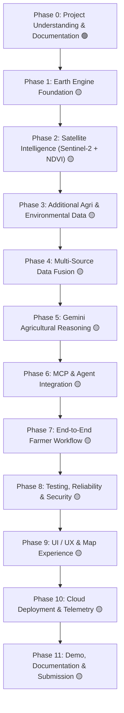

# BharatSahayak V2 — Master Project Roadmap

> **Master roadmap and progressive implementation plan for BharatSahayak V2.**  
> *Last Updated: Phase 1B Local Environment & Verification*  
> *Baseline Branch: `bharatsahayak-v2` | Commit: `e0fcc29` | GCP Project ID: `bharatsahayak-v2`*

---

## 🧭 Roadmap Overview & Status Legend

| Status Icon | Meaning | Definition |
| :--- | :--- | :--- |
| 🟢 **IMPLEMENTED** | Active & Implemented | Fully written, tested, and operational in current repository baseline. |
| 🟡 **PLANNED** | Scheduled Work | Approved architectural phase scheduled for implementation in upcoming phases. |
| 🔴 **IDEA** | Future Exploration | Conceptual enhancement deferred to post-MVP / future backlog. |

---

## 🗺️ Phases Summary

---

## 📋 Phase Breakdown

### Phase 0: Project Understanding & Documentation
- **Status:** 🟢 **IMPLEMENTED**
- **Purpose:** Conduct deep architecture and code audit, establish ground-truth project baseline, align decisions, and create permanent documentation structure.
- **Major Work:**
  - Audit existing ADK workflow, MCP server, unit/integration tests, and Terraform scaffolding.
  - Document all architectural components and identify gaps/inconsistencies between docs and code.
  - Formulate core architectural decisions (`DEC-001`, `DEC-002`, `DEC-003`).
  - Establish `docs/` repository standard (`MASTER_ROADMAP.md`, `ARCHITECTURE.md`, `DECISION_LOG.md`, `FUTURE_BACKLOG.md`, `CHANGELOG.md`, and `phases/`).
- **Dependencies:** None.
- **Future Upgrades:** Maintain documentation updates at the completion of each subsequent phase.

---

### Phase 1: Earth Engine Foundation
- **Status:** 🟡 **IN PROGRESS**
- **Purpose:** Establish the technical foundation for using Google Earth Engine to extract the first satellite-derived agricultural signal (Sentinel-2 + NDVI regional statistics).
- **Sub-Roadmap:**
  - **1A — Earth Engine Architecture & Integration Design (🟢 COMPLETE):**
    - Understood Earth Engine role, auth models, and quota limits for `bharatsahayak-v2`.
    - Selected Option C (Layered Tool Contract with Dedicated Earth Engine Module) as `DEC-004`.
    - Documented architectural integration boundaries and specifications.
  - **1B — Local Earth Engine Environment & Verification (🟢 COMPLETE / 1B.1–1B.10 Complete):**
    - **1B.1 Local Environment Inspection (🟢 COMPLETE):** Verified `uv` 0.11.26, Python 3.13.14, `google-adk` 2.2.0, project constraint `>=3.11,<3.14`, initial absence of EE API.
    - **1B.2 Dependency Management Decision (🟢 COMPLETE):** Recorded `DEC-005` establishing `uv add earthengine-api` for reproducible manifest/lockfile synchronization.
    - **1B.3 Add Earth Engine API (🟢 COMPLETE):** Installed `earthengine-api` 1.7.43, updated `pyproject.toml` and `uv.lock`, verified local import `import ee`.
    - **1B.4 Lockfile Verification (🟢 COMPLETE):** Resolved full dependency graph, confirmed clean diff check (Windows CRLF line-ending warnings only).
    - **1B.5 Authentication (🟢 COMPLETE):** Completed interactive developer authentication workflow (`DEC-006`) without exposing credentials.
    - **1B.6 Initialization (🟢 COMPLETE):** Successfully initialized `ee.Initialize(project='bharatsahayak-v2')` and verified `ee.Number(1).getInfo() -> 1`.
    - **1B.7 Sentinel-2 Connectivity & Query Bounding (🟢 COMPLETE):** Verified `COPERNICUS/S2_SR_HARMONIZED` catalog access with representative farmland fixture near Ludhiana, Punjab (`[75.7196, 30.9157]`, Aug 2026, clouds < 20% -> 1 image). Documented engineering lesson: For BharatSahayak operational queries, apply spatial and temporal bounds before expensive Earth Engine evaluation wherever possible, reducing unnecessary server-side computation and quota usage.
    - **1B.8 Credential Safety Check (🟢 COMPLETE):** Verified `.gitignore` coverage, clean working tree, zero untracked secrets, and zero tracked credentials via `git ls-files`.
    - **1B.9 Documentation (🟢 COMPLETE):** Recorded Phase 1B execution facts in phase document, changelog, and roadmap.
    - **1B.10 Git Checkpoint (🟢 COMPLETE):** Checkpointed verified Phase 1B baseline.
  - **1C — Earth Engine Connectivity & Result Contract (🟢 COMPLETE / 1C.1–1C.8 Complete):**
    - **1C.1 Minimal Server Calculation (🟢 COMPLETE):** Verified `ee.Number(42).getInfo() -> 42`.
    - **1C.2 Error Mapping (🟢 COMPLETE):** Verified `ee.EEException` raised on invalid asset request.
    - **1C.3 Zero Data Operational State (🟢 COMPLETE):** Verified historical pre-Sentinel-2 date query returns `image_count=0` cleanly without exceptions.
    - **1C.4 / 1C.5 Architectural Contract (🟢 COMPLETE):** Established clean encapsulation of Earth Engine SDK exceptions behind structured application results (`success`, `no_data`, `error`).
    - **1C.6 Pydantic Result Contract (🟢 COMPLETE):** Created `app/satellite/__init__.py` and `app/satellite/types.py` (`EarthEngineResult`, `EarthEngineError`, `EarthEngineStatus`). Verified with 6 unit tests in `tests/unit/test_satellite_types.py`.
    - **1C.7 Live Integration Tests (🟢 COMPLETE):** Created `tests/integration/test_earth_engine_connectivity.py` with 3 passing live integration tests (0 skipped, 6 non-blocking framework warnings).
    - **1C.8 Documentation & Checkpoint (🟢 COMPLETE):** Recorded Phase 1C deliverables and verified boundaries.
  - **1D — Geographic Region Definition (🟡 IN PROGRESS / 1D.1 Complete, 1D.2 Planned):**
    - **1D.1 Geographic Analysis Region Strategy (`DEC-007` 🟢 COMPLETE):** Adopted decoupled `FarmerLocation` $\rightarrow$ `Region Resolution` $\rightarrow$ `AnalysisRegion` strategy with a default 100 m circular buffer for Sentinel-2 regional aggregation. Documented approximate area limitations (never exact cadastral boundary), non-configurable MVP parameter, historical analysis reusability, and future field polygon compatibility.
    - **1D.2 Coordinate Validation (🟡 PLANNED):** Validate latitude/longitude coordinate bounds (India spatial bounds: approx. Lat 6°N–38°N, Lon 68°E–98°E).
    - **1D.3 Geometry Helpers & Buffer Construction (🟡 PLANNED):** Define geometric data models and helper functions to construct Earth Engine `ee.Geometry.Point` and `buffer(100)` instances.
    - **1D.4 Live Earth Engine Region Query (🟡 PLANNED):** Test bounded region queries against Earth Engine with validation and error handling.
  - **1E — Sentinel-2 Data Pipeline (🟡 PLANNED):**
    - Select Copernicus Sentinel-2 Level-2A (Surface Reflectance) collection.
    - Implement spatial location filtering.
    - Implement temporal date filtering (recent seasonal window).
    - Implement image selection and cloud masking (`QA60` / SCL band filtering).
    - Validate retrieved imagery metadata and scene quality.
  - **1F — NDVI Calculation (🟡 PLANNED):**
    - Identify Red (B4) and Near-Infrared (B8) spectral bands.
    - Implement normalized difference calculation: $\text{NDVI} = \frac{\text{B8} - \text{B4}}{\text{B8} + \text{B4}}$.
    - Generate single-band NDVI image in Earth Engine.
    - Validate theoretical value range ($-1.0$ to $+1.0$).
  - **1G — Regional NDVI Statistics (🟡 PLANNED):**
    - Implement Earth Engine zonal reducers across farm region:
      - **mean** NDVI (overall vegetative health).
      - **median** NDVI (robust central tendency).
      - **minimum** NDVI (localized stress / non-vegetated spots).
      - **maximum** NDVI (peak vegetative vigor).
    - Format output as a structured, serializable JSON dictionary.
  - **1H — Reliability & Data Quality (🟡 PLANNED):**
    - Handle invalid/out-of-bounds coordinates gracefully.
    - Handle scenarios with no cloud-free imagery available.
    - Handle excessive cloud cover flagging and user warnings.
    - Handle empty spatial regions or zero-pixel reductions.
    - Handle API timeouts, quota limits, and network errors.
    - Validate returned statistics against physical sanity constraints.
  - **1I — Integration Boundary Verification (🟡 PLANNED):**
    - Verify Earth Engine calculation module works independently of MCP/ADK.
    - Ensure MCP interface remains a clean capability wrapper.
    - Avoid unnecessary coupling between Earth Engine code and LLM agent prompts.
    - Preserve pluggability for future satellite datasets (Dynamic World, NDWI).
  - **1J — Phase Documentation (🟡 PLANNED):**
    - Record Before vs After implementation state.
    - Document actual code changes, test results, and verified outputs.
    - Update decision logs and record deferred work.
    - Update Future Upgrade Impact matrix and Resume Status.
  - **1K — Git Checkpoint (🟡 PLANNED):**
    - Run full verification test suite.
    - Commit verified Phase 1 implementation with clean working tree.
- **Dependencies:** Phase 0.
- **Future Upgrades:** Polygon boundary ingestion from geoJSON / KML files, multi-temporal time series, and anomaly baselines.

---

### Phase 2: Satellite Intelligence (Sentinel-2 + NDVI Regional Statistics)
- **Status:** 🟡 **PLANNED**
- **Purpose:** Implement real satellite data extraction using Copernicus Sentinel-2 surface reflectance imagery to compute regional vegetation indices.
- **Major Work:**
  - Query Copernicus Sentinel-2 MSI (Harmonized) collection with cloud-masking (`QA60` / SCL band filtering).
  - Calculate Normalized Difference Vegetation Index:
    $$\text{NDVI} = \frac{\text{B8 (NIR)} - \text{B4 (Red)}}{\text{B8 (NIR)} + \text{B4 (Red)}}$$
  - Compute regional statistical aggregations across the farm area: **mean**, **median**, **min**, and **max**.
  - Interpret vegetative health bands (vigor, crop density, potential stress zones).
- **Dependencies:** Phase 1.
- **Future Upgrades (`🔴 IDEA`):** Multi-temporal NDVI time series, historical baseline anomaly detection, NDWI (water index), EVI (Enhanced Vegetation Index), and Dynamic World LULC classification.

---

### Phase 3: Additional Agricultural & Environmental Data Sources
- **Status:** 🟡 **PLANNED**
- **Purpose:** Lay the foundation for external environmental and open agricultural datasets via a modular, pluggable provider architecture.
- **Major Work:**
  - Design pluggable provider interface for environmental data.
  - Integrate live meteorological feeds (precipitation forecast, temperature extremes, humidity, wind).
  - Prepare data structures for soil properties (pH, organic carbon, texture) and regional agro-climatic zones.
- **Dependencies:** Phase 0, Phase 1.
- **Future Upgrades (`🔴 IDEA`):** SoilGrids / ICAR soil profiles, ERA5-Land historical climate reanalysis, live mandi prices via Agmarknet / e-NAM APIs.

---

### Phase 4: Multi-Source Data Fusion
- **Status:** 🟡 **PLANNED**
- **Purpose:** Fuse satellite NDVI statistics, weather metrics, farmer profile state, and regional agronomic rules into a coherent contextual intelligence payload.
- **Major Work:**
  - Aggregate spatial NDVI statistics with local seasonal context and weather predictions.
  - Produce normalized "Farm Health & Environmental Context" JSON structures ready for LLM consumption.
  - Implement confidence scoring and missing-data fallback logic.
- **Dependencies:** Phase 2, Phase 3.
- **Future Upgrades (`🔴 IDEA`):** Automated stress anomaly tagging (e.g. flagging moisture stress vs pest damage based on NDVI + rainfall correlation).

---

### Phase 5: Gemini Agricultural Reasoning Engine
- **Status:** 🟡 **PLANNED**
- **Purpose:** Enhance Gemini 2.5 Flash prompt engineering and domain reasoning to synthesize fused satellite data into clear, empathetic, and actionable farming advice.
- **Major Work:**
  - Refactor system instructions for specialized advisors (`farming_advisor`, `weather_advisor`, `crop_disease_advisor`, `gov_schemes_advisor`) to consume fused satellite/weather context.
  - Instruct model on interpreting NDVI ranges in simple, jargon-free farmer language (English and Hindi).
  - Enforce actionable next steps: irrigation adjustments, targeted fertilizer dosing, and pest scouting.
- **Dependencies:** Phase 4.
- **Future Upgrades (`🔴 IDEA`):** Regenerative agriculture advisory modules, organic alternative recommendations, and climate-resilience scoring.

---

### Phase 6: MCP Server & Agent Integration
- **Status:** 🟡 **PLANNED**
- **Purpose:** Upgrade Model Context Protocol (MCP) server from static mock/catalog responses to live, tool-backed satellite and agricultural execution services.
- **Major Work:**
  - Upgrade FastMCP server tools (`get_farm_satellite_intelligence`, `get_weather_advisory`, `search_government_schemes`, `calculate_farming_profitability`).
  - Implement strict Pydantic schemas, source provenance metadata, and execution timing.
  - Connect updated MCP tools to ADK `LlmAgent` instances via `McpToolset`.
- **Dependencies:** Phase 2, Phase 3, Phase 5.
- **Future Upgrades (`🔴 IDEA`):** Tool result caching layer, circuit breaker for remote API timeouts, and live scheme lookup via official ministry endpoints.

---

### Phase 7: End-to-End Farmer Workflow & Interaction Flows
- **Status:** 🟡 **PLANNED**
- **Purpose:** Deliver seamless multi-turn conversational flows, intuitive farm onboarding, and human-in-the-loop (HITL) clarifications.
- **Major Work:**
  - Map-based location resolution flow: translate human-understandable location inputs (village, district, pin drop) to coordinates.
  - Onboard farm profile (location, crop, acreage, season) with interactive clarification.
  - Ensure language switching (English ⇄ Hindi) persists dynamically across conversational turns.
  - Seamless HITL resumption for ambiguous or missing parameters without state loss.
- **Dependencies:** Phase 5, Phase 6.
- **Future Upgrades (`🔴 IDEA`):** Regional voice input/output (STT/TTS in Hindi, Kannada, Telugu), multimodal leaf photo upload for vision-based diagnosis.

---

### Phase 8: Testing, Reliability, Security & Evaluation
- **Status:** 🟡 **PLANNED**
- **Purpose:** Validate entire system reliability, mock external dependencies for automated pipelines, harden security checkpoints, and run domain-specific LLM evaluations.
- **Major Work:**
  - Expand unit tests for satellite calculations, geometry utilities, and state transitions.
  - Create robust integration tests covering multi-turn HITL flows and live/mocked MCP tools.
  - Replace generic eval dataset (`basic-dataset.json`) with India-specific agricultural evaluation dataset (English, Hindi, mixed vernacular, adversarial inputs).
  - Verify PII sanitization (Aadhaar, mobile, credentials) and prompt injection defenses.
- **Dependencies:** Phase 6, Phase 7.
- **Future Upgrades (`🔴 IDEA`):** Automated synthetic evaluation generation via `agents-cli eval dataset synthesize` and LLM-as-a-judge regression tracking.

---

### Phase 9: UI / UX & Map Experience
- **Status:** 🟡 **PLANNED**
- **Purpose:** Build a premium, farmer-centric web interface with interactive map selection, NDVI health heatmaps, and clean advisory cards.
- **Major Work:**
  - Interactive map component supporting location search, GPS geolocation assistance, and farm boundary selection.
  - Visual NDVI health indicators (color-coded vegetation density and vigor).
  - Conversational chat interface with streaming responses, audio/voice toggles, and multi-language switches.
- **Dependencies:** Phase 7.
- **Future Upgrades (`🔴 IDEA`):** Offline progressive web app (PWA) field mode with cached advisories.

---

### Phase 10: Cloud Deployment & Telemetry
- **Status:** 🟡 **PLANNED**
- **Purpose:** Deploy production services to Google Cloud Platform (Cloud Run / Vertex AI Agent Engine) with full OpenTelemetry monitoring.
- **Major Work:**
  - Finalize Terraform infrastructure in `deployment/terraform/single-project/` for GCP project `bharatsahayak-v2`.
  - Configure Vertex AI Reasoning Engine / Cloud Run service containers.
  - Verify Cloud Storage telemetry bucket, GenAI completion hooks, and Cloud Logging streams.
- **Dependencies:** Phase 8, Phase 9.
- **Future Upgrades (`🔴 IDEA`):** Automated CI/CD deployment via Cloud Build GitHub triggers.

---

### Phase 11: Demo, Documentation & Final Submission
- **Status:** 🟡 **PLANNED**
- **Purpose:** Package final submission materials, record polished end-to-end demo video, and publish complete project documentation.
- **Major Work:**
  - Produce comprehensive walkthrough video showcasing satellite analysis, HITL flow, multilingual Hindi advice, and security guardrails.
  - Update `README.md`, architecture diagrams, and submission writeups to reflect final implemented reality.
  - Audit codebase for documentation consistency, reproducibility, and clean setup instructions.
- **Dependencies:** All previous phases.
- **Future Upgrades:** Post-hackathon open-source community distribution.
