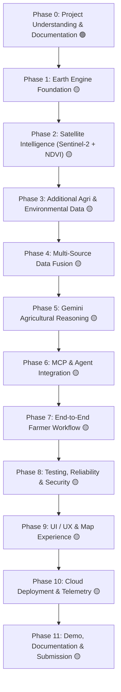

# BharatSahayak V2 — Master Project Roadmap

> **Master roadmap and progressive implementation plan for BharatSahayak V2.**  
> *Last Updated: Phase 1B Local Environment & Verification*  
> *Baseline Branch: `bharatsahayak-v2` | Commit: `e0fcc29` | GCP Project ID: `bharatsahayak-v2`*

---

## 🧭 Roadmap Overview & Status Legend

| Status Icon | Meaning | Definition |
| :--- | :--- | :--- |
| 🟢 **IMPLEMENTED** | Active & Implemented | Fully written, tested, and operational in current repository baseline. |
| 🟡 **PLANNED** | Scheduled Work | Approved architectural phase scheduled for implementation in upcoming phases. |
| 🔴 **IDEA** | Future Exploration | Conceptual enhancement deferred to post-MVP / future backlog. |

---

## 🗺️ Phases Summary

---

## 📋 Phase Breakdown

### Phase 0: Project Understanding & Documentation
- **Status:** 🟢 **IMPLEMENTED**
- **Purpose:** Conduct deep architecture and code audit, establish ground-truth project baseline, align decisions, and create permanent documentation structure.
- **Major Work:**
  - Audit existing ADK workflow, MCP server, unit/integration tests, and Terraform scaffolding.
  - Document all architectural components and identify gaps/inconsistencies between docs and code.
  - Formulate core architectural decisions (`DEC-001`, `DEC-002`, `DEC-003`).
  - Establish `docs/` repository standard (`MASTER_ROADMAP.md`, `ARCHITECTURE.md`, `DECISION_LOG.md`, `FUTURE_BACKLOG.md`, `CHANGELOG.md`, and `phases/`).
- **Dependencies:** None.
- **Future Upgrades:** Maintain documentation updates at the completion of each subsequent phase.

---

### Phase 1: Earth Engine Foundation
- **Status:** 🟢 **COMPLETE & SEALED (Subphases 1A–1K Complete — `60f8d90`)**
- **Purpose:** Establish the technical foundation for using Google Earth Engine to extract the first satellite-derived agricultural signal (Sentinel-2 + NDVI regional statistics).
- **Sub-Roadmap Summary:**
  - **1A — Earth Engine Architecture & Integration Design (🟢 COMPLETE / `DEC-004`):** Layered MCP tool contract with dedicated Earth Engine module.
  - **1B — Local Earth Engine Environment & Verification (🟢 COMPLETE / `DEC-005`, `DEC-006`):** `earthengine-api` 1.7.43 via `uv`, ADC auth, project `bharatsahayak-v2` (`13e5aa9`).
  - **1C — Earth Engine Connectivity & Result Contract (🟢 COMPLETE):** `EarthEngineResult`, `EarthEngineError`, `EarthEngineStatus` (`ff68be7`).
  - **1D — Geographic Region Definition (🟢 COMPLETE / `DEC-007`):** `create_analysis_region`, 100m circular buffer, 35 unit tests (`d04a60f`).
  - **1E — Sentinel-2 Data Pipeline & Observation Quality (🟢 COMPLETE / `DEC-008`, `DEC-010`):** `get_sentinel2_collection`, Cloud Score+ `cs_cdf >= 0.60`, $\ge 70\%$ usable coverage, newest-first ordering (`c8d1721`).
  - **1F — NDVI Calculation (🟢 COMPLETE / `DEC-009`):** `calculate_ndvi`, normalized difference band math, clipped raster (`64dc820`).
  - **1G — Regional NDVI Statistics (🟢 COMPLETE):** `calculate_ndvi_statistics`, combined reducer, `NdviRegionalStatistics` (`87903f0`).
  - **1H — Regional NDVI Orchestration Pipeline (🟢 COMPLETE / `DEC-011`):** `analyze_regional_ndvi`, single authoritative observation lineage, 382 tests passing (`4f79d2a`).
  - **1I — Integration Boundary Verification (🟢 COMPLETE):** Formal verification of layer decoupling, unidirectional dependency flow, and serialization protocols.
  - **1J — Canonical Phase 1 Documentation (🟢 COMPLETE):** Canonical Phase 1 foundation record in `docs/phases/PHASE_01_EARTH_ENGINE_FOUNDATION.md`.
  - **1K — Final Verification & Git Checkpoint (🟢 COMPLETE):** Sealed baseline checkpoint (`60f8d90`).
- **Dependencies:** Phase 0.
- **Next Phase:** Phase 2 (Historical Satellite Intelligence).

---

### Phase 2: Historical Satellite Intelligence (3-Year Baseline & Anomaly Detection)
- **Status:** 🟡 **IN PROGRESS (Subphases 2A & 2B Complete & Sealed; 2C Next / Pending)**
- **Purpose:** Extend the satellite foundation from an instantaneous observation to seasonally normalized 3-year historical comparative baselines and empirical anomaly evidence.
- **Sub-Roadmap:**
  - **2A — Architecture & Design Review (🟢 COMPLETE & APPROVED / `DEC-012`, `DEC-013`, `DEC-014`):**
    - Established 3-year operational historical horizon ($Y-1, Y-2, Y-3$).
    - Established Day-of-Year centered temporal matching ($\text{DOY} \pm 15\text{ days}$).
    - Selected Option C: Annual Matched-Window Regional Observations.
    - Defined annual observation unit and sufficiency guardrails ($N_{\text{annual}} \ge 2 \land Y \ge 2$).
    - Defined primary baseline (Median NDVI) and anomaly metrics suite (Absolute $\Delta$, Gated %, Gated Z-Score).
    - Established typed contract `HistoricalNdviAnalysis` and universal result states.
  - **2B — Historical Temporal Window & Seasonality Strategy (🟢 COMPLETE & SEALED / `DEC-015`):**
    - Formalized Calendar-Date-Anchored Seasonal Windowing ($T_h \pm 15\text{ days}$, 31-day inclusive span) across $Y-1, Y-2, Y-3$.
    - Established Cross-Calendar-Year Target-Year Ownership Invariant for continuous windows crossing Jan 1 / Dec 31.
    - Formalized simple leap-year calendar correctness (clamping Feb 29 $\to$ Feb 28 in common historical years).
    - Preserved strict UTC calendar-date basis and Earth Engine boundary contract `[start, end + 1 day)`.
    - Documented canonical 18-case edge matrix in `docs/phases/PHASE_02B_TEMPORAL_WINDOW_SEASONALITY.md`.
  - **2C — Option C Historical Collection Pipeline (🟡 NEXT / PENDING):**
    - Ingest historical Sentinel-2 collections grouped by calendar year with Phase 1 Cloud Score+ quality gates.
  - **2D — Multi-Year Baseline Computation Engine (🟡 PLANNED):**
    - Compute annual matched-window regional reductions and multi-year median/mean/std-dev baselines.
  - **2E — NDVI Anomaly Mathematics & Departure Verification (🟡 PLANNED):**
    - Calculate absolute departure, gated percentage departure, and gated z-score.
  - **2F — Historical Data Sufficiency & Sparse History Handlers (🟡 PLANNED):**
    - Enforce $N_{\text{annual}} \ge 2 \land Y \ge 2$ thresholding and `insufficient_history` state.
  - **2G — Typed Domain Contracts (Pydantic Models) (🟡 PLANNED):**
    - Implement `HistoricalNdviBaseline`, `HistoricalTemporalWindow`, `HistoricalSufficiencyEvidence`, `NdviAnomalyEvidence`, and `HistoricalNdviAnalysis`.
  - **2H — Historical Pipeline Orchestration (`analyze_historical_ndvi`) (🟡 PLANNED):**
    - Orchestrate end-to-end historical analysis pipeline within maximum 3-call materialization budget.
  - **2I — Comprehensive Unit & Live Integration Testing (🟡 PLANNED):**
    - Comprehensive unit test suite and live Earth Engine integration tests.
  - **2J — Canonical Documentation Consolidation (🟡 PLANNED):**
    - Finalize canonical Phase 2 record in `docs/phases/PHASE_02_HISTORICAL_SATELLITE_INTELLIGENCE.md`.
  - **2K — Final Verification & Git Checkpoint (🟡 PLANNED):**
    - Verify clean test suite and commit Phase 2 sealed checkpoint.
- **Dependencies:** Phase 1 (`60f8d90`).
- **Future Upgrades (`🔴 IDEA`):** Multi-year time-series animation charts, adaptive 5-10 year climatological baselines, NDWI water anomalies, and Dynamic World LULC transitions.

---

### Phase 3: Additional Agricultural & Environmental Data Sources
- **Status:** 🟡 **PLANNED**
- **Purpose:** Lay the foundation for external environmental and open agricultural datasets via a modular, pluggable provider architecture.
- **Major Work:**
  - Design pluggable provider interface for environmental data.
  - Integrate live meteorological feeds (precipitation forecast, temperature extremes, humidity, wind).
  - Prepare data structures for soil properties (pH, organic carbon, texture) and regional agro-climatic zones.
- **Dependencies:** Phase 0, Phase 1.
- **Future Upgrades (`🔴 IDEA`):** SoilGrids / ICAR soil profiles, ERA5-Land historical climate reanalysis, live mandi prices via Agmarknet / e-NAM APIs.

---

### Phase 4: Multi-Source Data Fusion
- **Status:** 🟡 **PLANNED**
- **Purpose:** Fuse satellite NDVI statistics, weather metrics, farmer profile state, and regional agronomic rules into a coherent contextual intelligence payload.
- **Major Work:**
  - Aggregate spatial NDVI statistics with local seasonal context and weather predictions.
  - Produce normalized "Farm Health & Environmental Context" JSON structures ready for LLM consumption.
  - Implement confidence scoring and missing-data fallback logic.
- **Dependencies:** Phase 2, Phase 3.
- **Future Upgrades (`🔴 IDEA`):** Automated stress anomaly tagging (e.g. flagging moisture stress vs pest damage based on NDVI + rainfall correlation).

---

### Phase 5: Gemini Agricultural Reasoning Engine
- **Status:** 🟡 **PLANNED**
- **Purpose:** Enhance Gemini 2.5 Flash prompt engineering and domain reasoning to synthesize fused satellite data into clear, empathetic, and actionable farming advice.
- **Major Work:**
  - Refactor system instructions for specialized advisors (`farming_advisor`, `weather_advisor`, `crop_disease_advisor`, `gov_schemes_advisor`) to consume fused satellite/weather context.
  - Instruct model on interpreting NDVI ranges in simple, jargon-free farmer language (English and Hindi).
  - Enforce actionable next steps: irrigation adjustments, targeted fertilizer dosing, and pest scouting.
- **Dependencies:** Phase 4.
- **Future Upgrades (`🔴 IDEA`):** Regenerative agriculture advisory modules, organic alternative recommendations, and climate-resilience scoring.

---

### Phase 6: MCP Server & Agent Integration
- **Status:** 🟡 **PLANNED**
- **Purpose:** Upgrade Model Context Protocol (MCP) server from static mock/catalog responses to live, tool-backed satellite and agricultural execution services.
- **Major Work:**
  - Upgrade FastMCP server tools (`get_farm_satellite_intelligence`, `get_weather_advisory`, `search_government_schemes`, `calculate_farming_profitability`).
  - Implement strict Pydantic schemas, source provenance metadata, and execution timing.
  - Connect updated MCP tools to ADK `LlmAgent` instances via `McpToolset`.
- **Dependencies:** Phase 2, Phase 3, Phase 5.
- **Future Upgrades (`🔴 IDEA`):** Tool result caching layer, circuit breaker for remote API timeouts, and live scheme lookup via official ministry endpoints.

---

### Phase 7: End-to-End Farmer Workflow & Interaction Flows
- **Status:** 🟡 **PLANNED**
- **Purpose:** Deliver seamless multi-turn conversational flows, intuitive farm onboarding, and human-in-the-loop (HITL) clarifications.
- **Major Work:**
  - Map-based location resolution flow: translate human-understandable location inputs (village, district, pin drop) to coordinates.
  - Onboard farm profile (location, crop, acreage, season) with interactive clarification.
  - Ensure language switching (English ⇄ Hindi) persists dynamically across conversational turns.
  - Seamless HITL resumption for ambiguous or missing parameters without state loss.
- **Dependencies:** Phase 5, Phase 6.
- **Future Upgrades (`🔴 IDEA`):** Regional voice input/output (STT/TTS in Hindi, Kannada, Telugu), multimodal leaf photo upload for vision-based diagnosis.

---

### Phase 8: Testing, Reliability, Security & Evaluation
- **Status:** 🟡 **PLANNED**
- **Purpose:** Validate entire system reliability, mock external dependencies for automated pipelines, harden security checkpoints, and run domain-specific LLM evaluations.
- **Major Work:**
  - Expand unit tests for satellite calculations, geometry utilities, and state transitions.
  - Create robust integration tests covering multi-turn HITL flows and live/mocked MCP tools.
  - Replace generic eval dataset (`basic-dataset.json`) with India-specific agricultural evaluation dataset (English, Hindi, mixed vernacular, adversarial inputs).
  - Verify PII sanitization (Aadhaar, mobile, credentials) and prompt injection defenses.
- **Dependencies:** Phase 6, Phase 7.
- **Future Upgrades (`🔴 IDEA`):** Automated synthetic evaluation generation via `agents-cli eval dataset synthesize` and LLM-as-a-judge regression tracking.

---

### Phase 9: UI / UX & Map Experience
- **Status:** 🟡 **PLANNED**
- **Purpose:** Build a premium, farmer-centric web interface with interactive map selection, NDVI health heatmaps, and clean advisory cards.
- **Major Work:**
  - Interactive map component supporting location search, GPS geolocation assistance, and farm boundary selection.
  - Visual NDVI health indicators (color-coded vegetation density and vigor).
  - Conversational chat interface with streaming responses, audio/voice toggles, and multi-language switches.
- **Dependencies:** Phase 7.
- **Future Upgrades (`🔴 IDEA`):** Offline progressive web app (PWA) field mode with cached advisories.

---

### Phase 10: Cloud Deployment & Telemetry
- **Status:** 🟡 **PLANNED**
- **Purpose:** Deploy production services to Google Cloud Platform (Cloud Run / Vertex AI Agent Engine) with full OpenTelemetry monitoring.
- **Major Work:**
  - Finalize Terraform infrastructure in `deployment/terraform/single-project/` for GCP project `bharatsahayak-v2`.
  - Configure Vertex AI Reasoning Engine / Cloud Run service containers.
  - Verify Cloud Storage telemetry bucket, GenAI completion hooks, and Cloud Logging streams.
- **Dependencies:** Phase 8, Phase 9.
- **Future Upgrades (`🔴 IDEA`):** Automated CI/CD deployment via Cloud Build GitHub triggers.

---

### Phase 11: Demo, Documentation & Final Submission
- **Status:** 🟡 **PLANNED**
- **Purpose:** Package final submission materials, record polished end-to-end demo video, and publish complete project documentation.
- **Major Work:**
  - Produce comprehensive walkthrough video showcasing satellite analysis, HITL flow, multilingual Hindi advice, and security guardrails.
  - Update `README.md`, architecture diagrams, and submission writeups to reflect final implemented reality.
  - Audit codebase for documentation consistency, reproducibility, and clean setup instructions.
- **Dependencies:** All previous phases.
- **Future Upgrades:** Post-hackathon open-source community distribution.
