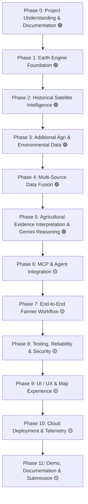

# BharatSahayak V2 — Master Project Roadmap

> **Master roadmap and progressive implementation plan for BharatSahayak V2.**
> *Last Updated: Phase 5C Gemini Explanation Pipeline Complete & Sealed*
> *Baseline Branch: `bharatsahayak-v2` | Commit: `b05fc54` | GCP Project ID: `bharatsahayak-v2`*

---

## 🧭 Roadmap Overview & Status Legend

| Status Icon | Meaning | Definition |
| :--- | :--- | :--- |
| 🟢 **IMPLEMENTED** | Active & Implemented | Fully written, tested, and operational in current repository baseline. |
| 🟡 **PLANNED** | Scheduled Work | Approved architectural phase scheduled for implementation in upcoming phases. |
| 🔴 **IDEA** | Future Exploration | Conceptual enhancement deferred to post-MVP / future backlog. |

---

## 🗺️ Phases Summary

---

## 📋 Phase Breakdown

### Phase 0: Project Understanding & Documentation
- **Status:** 🟢 **IMPLEMENTED**
- **Purpose:** Conduct deep architecture and code audit, establish ground-truth project baseline, align decisions, and create permanent documentation structure.
- **Major Work:**
  - Audit existing ADK workflow, MCP server, unit/integration tests, and Terraform scaffolding.
  - Document all architectural components and identify gaps/inconsistencies between docs and code.
  - Formulate core architectural decisions (`DEC-001`, `DEC-002`, `DEC-003`).
  - Establish `docs/` repository standard (`MASTER_ROADMAP.md`, `ARCHITECTURE.md`, `DECISION_LOG.md`, `FUTURE_BACKLOG.md`, `CHANGELOG.md`, and `phases/`).
- **Dependencies:** None.
- **Future Upgrades:** Maintain documentation updates at the completion of each subsequent phase.

---

### Phase 1: Earth Engine Foundation
- **Status:** 🟢 **COMPLETE & SEALED (Subphases 1A–1K Complete — `60f8d90`)**
- **Purpose:** Establish the technical foundation for using Google Earth Engine to extract the first satellite-derived agricultural signal (Sentinel-2 + NDVI regional statistics).
- **Sub-Roadmap Summary:**
  - **1A — Earth Engine Architecture & Integration Design (🟢 COMPLETE / `DEC-004`):** Layered MCP tool contract with dedicated Earth Engine module.
  - **1B — Local Earth Engine Environment & Verification (🟢 COMPLETE / `DEC-005`, `DEC-006`):** `earthengine-api` 1.7.43 via `uv`, ADC auth, project `bharatsahayak-v2` (`13e5aa9`).
  - **1C — Earth Engine Connectivity & Result Contract (🟢 COMPLETE):** `EarthEngineResult`, `EarthEngineError`, `EarthEngineStatus` (`ff68be7`).
  - **1D — Geographic Region Definition (🟢 COMPLETE / `DEC-007`):** `create_analysis_region`, 100m circular buffer, 35 unit tests (`d04a60f`).
  - **1E — Sentinel-2 Data Pipeline & Observation Quality (🟢 COMPLETE / `DEC-008`, `DEC-010`):** `get_sentinel2_collection`, Cloud Score+ `cs_cdf >= 0.60`, $\ge 70\%$ usable coverage, newest-first ordering (`c8d1721`).
  - **1F — NDVI Calculation (🟢 COMPLETE / `DEC-009`):** `calculate_ndvi`, normalized difference band math, clipped raster (`64dc820`).
  - **1G — Regional NDVI Statistics (🟢 COMPLETE):** `calculate_ndvi_statistics`, combined reducer, `NdviRegionalStatistics` (`87903f0`).
  - **1H — Regional NDVI Orchestration Pipeline (🟢 COMPLETE / `DEC-011`):** `analyze_regional_ndvi`, single authoritative observation lineage, 382 tests passing (`4f79d2a`).
  - **1I — Integration Boundary Verification (🟢 COMPLETE):** Formal verification of layer decoupling, unidirectional dependency flow, and serialization protocols.
  - **1J — Canonical Phase 1 Documentation (🟢 COMPLETE):** Canonical Phase 1 foundation record in `docs/phases/PHASE_01_EARTH_ENGINE_FOUNDATION.md`.
  - **1K — Final Verification & Git Checkpoint (🟢 COMPLETE):** Sealed baseline checkpoint (`60f8d90`).
- **Dependencies:** Phase 0.
- **Next Phase:** Phase 2 (Historical Satellite Intelligence).

---

### Phase 2: Historical Satellite Intelligence (3-Year Baseline & Anomaly Detection)
- **Status:** 🟢 **COMPLETE & SEALED (Subphases 2A–2D Complete — `DEC-012`–`DEC-017` / `ebba070`)**
- **Purpose:** Extend the satellite foundation from an instantaneous observation to seasonally normalized 3-year historical comparative baselines and empirical anomaly evidence.
- **Sub-Roadmap:**
  - **2A — Architecture & Design Review (🟢 COMPLETE & APPROVED / `DEC-012`, `DEC-013`, `DEC-014`):**
    - Established 3-year operational historical horizon ($Y-1, Y-2, Y-3$).
    - Established Day-of-Year centered temporal matching ($\text{DOY} \pm 15\text{ days}$).
    - Selected Option C: Annual Matched-Window Regional Observations.
    - Defined annual observation unit and sufficiency guardrails ($N_{\text{annual}} \ge 2 \land Y \ge 2$).
    - Defined primary baseline (Median NDVI) and anomaly metrics suite (Absolute $\Delta$, Gated %, Gated Z-Score).
    - Established typed contract `HistoricalNdviAnalysis` and universal result states.
  - **2B — Historical Temporal Window & Seasonality Strategy (🟢 COMPLETE & SEALED / `DEC-015`):**
    - Formalized Calendar-Date-Anchored Seasonal Windowing ($T_h \pm 15\text{ days}$, 31-day inclusive span) across $Y-1, Y-2, Y-3$.
    - Established Cross-Calendar-Year Target-Year Ownership Invariant for continuous windows crossing Jan 1 / Dec 31.
    - Formalized simple leap-year calendar correctness (clamping Feb 29 $\to$ Feb 28 in common historical years).
    - Preserved strict UTC calendar-date basis and Earth Engine boundary contract `[start, end + 1 day)`.
    - Documented canonical 18-case edge matrix in `docs/phases/PHASE_02B_TEMPORAL_WINDOW_SEASONALITY.md`.
  - **2C — Option C Historical Collection Pipeline (🟢 COMPLETE & SEALED / `DEC-016` — `ba1ec1c`):**
    - Implemented independent annual sub-pipelines for $Y-1, Y-2, Y-3$ across Phase 2B 31-day windows $[S_h, E_h]$ in [`app/satellite/historical.py`](file:///d:/Documents/Desktop/adk-workspace/bharatsahayak/app/satellite/historical.py).
    - Reused exact Phase 1 Cloud Score+ quality gates (`cs_cdf >= 0.60`, scene cloud $<20\%$, `min_usable_coverage >= 0.70`).
    - Applied temporal recency selection among usable observations (sorting newest-first, selecting up to 3 usable scenes per historical year).
    - Implemented per-scene NDVI calculation, pixel-wise median NDVI compositing (`ee.ImageCollection.median()`), and zonal statistical reduction (`calculate_ndvi_statistics`).
    - Preserved Earth Engine masked-pixel semantics (excluding masked pixels from reductions, never filling with artificial zeros).
  - **2D — Multi-Year Baseline & Anomaly Engine (🟢 COMPLETE & SEALED / `DEC-017` — `ebba070`):**
    - **Step 1 — Domain Contracts (`bdb8d69`):** Implemented strongly typed Pydantic models in [`app/satellite/types.py`](file:///d:/Documents/Desktop/adk-workspace/bharatsahayak/app/satellite/types.py): `HistoricalNdviBaseline`, `HistoricalSufficiencyEvidence`, `SpectralDepartureBand`, `NdviAnomalyEvidence`, `HistoricalAnalysisStatus`, and `HistoricalNdviAnalysis`.
    - **Step 2 — Pure Statistical Engine (`ccafc6f`):** Implemented deterministic pure-Python statistical calculation engine in [`app/satellite/baseline.py`](file:///d:/Documents/Desktop/adk-workspace/bharatsahayak/app/satellite/baseline.py) with zero Earth Engine dependencies: valid annual observation extraction, historical baseline (median, mean, population std dev ddof=0, min, max), sufficiency evaluation ($N_{\text{annual}} \ge 2 \land Y \ge 2$), absolute departure ($\Delta\text{NDVI}$), gated relative percentage departure ($\text{baseline} \ge 0.15$), gated z-score ($N \ge 2, Y \ge 2, \sigma \ge 0.02$), and empirical non-agronomic spectral departure classification.
    - **Step 3 — Root Integration & Composition (`ebba070`):** Implemented root domain composition function `build_historical_ndvi_analysis(...)` in [`app/satellite/historical_analysis.py`](file:///d:/Documents/Desktop/adk-workspace/bharatsahayak/app/satellite/historical_analysis.py), joining Phase 1 current evidence with pre-materialized Phase 2C historical observations, enforcing current-error priority, and constructing `HistoricalNdviAnalysis` with `pipeline_version="2.0.0"`. Exported in [`app/satellite/__init__.py`](file:///d:/Documents/Desktop/adk-workspace/bharatsahayak/app/satellite/__init__.py).
    - **Verification:** 18 integration tests passed in [`tests/unit/test_satellite_historical_baseline_integration.py`](file:///d:/Documents/Desktop/adk-workspace/bharatsahayak/tests/unit/test_satellite_historical_baseline_integration.py), 700 satellite subsystem tests passed, 709 full unit tests passed, 0 failures.
- **Dependencies:** Phase 1 (`60f8d90`).
- **Next Phase:** Phase 3 (Additional Agricultural & Environmental Data Sources).
- **Future Upgrades (`🔴 IDEA`):** Multi-year time-series animation charts, adaptive 5-10 year climatological baselines, NDWI water anomalies, and Dynamic World LULC transitions.

---

### Phase 3: Additional Agricultural & Environmental Data Sources
- **Status:** 🟢 **COMPLETE & FROZEN (Subphases 3A, 3B, 3C Complete & Verified — `DEC-018`–`DEC-021`; Subphase 3D Deferred)**
- **Purpose:** Provide physical grounded evidence of the meteorological, hydrological, and land-cover regime surrounding the farmer's parcel to explain the environmental drivers behind satellite vegetation signals.
- **Core Architectural Principle:** *"Data sufficiency takes priority over dataset accumulation."* The environmental data foundation is now complete and frozen for the first prototype across 5 complementary evidence streams.
- **Sub-Roadmap:**
  - **3A — ERA5-Land Daily Reanalysis Environmental Context (🟢 COMPLETE & SEALED — DEC-018 / DEC-019):**
    - **Step 1 — Domain Contracts & Deterministic Fixtures (🟢 COMPLETE — 31 Tests):** Strongly typed domain models (`DailyEnvironmentalObservation`, `EnvironmentalWindowStatistics`, `ERA5LandAnalysis` in [`app/environment/types.py`](file:///d:/Documents/Desktop/adk-workspace/bharatsahayak/app/environment/types.py)), 5 deterministic offline fixtures in `tests/fixtures/era5_land/`, typed loader in `tests/fixtures/era5_fixtures.py`, and comprehensive contract tests in [`tests/unit/test_environment_types.py`](file:///d:/Documents/Desktop/adk-workspace/bharatsahayak/tests/unit/test_environment_types.py).
    - **Step 2 — Pure Math & Window Aggregation Engine (🟢 COMPLETE — 19 Tests):** Implemented pure mathematical window aggregation engine in [`app/environment/aggregation.py`](file:///d:/Documents/Desktop/adk-workspace/bharatsahayak/app/environment/aggregation.py) with zero Earth Engine dependencies (`aggregate_window_statistics`, `compute_environmental_window_suite`), inclusive 7/30/90-day windows, partial/empty window handling, metric-level missingness, and duplicate-date rejection. 19 tests in [`tests/unit/test_environment_aggregation.py`](file:///d:/Documents/Desktop/adk-workspace/bharatsahayak/tests/unit/test_environment_aggregation.py).
    - **Step 3 — Earth Engine Collection Adapter & Integration (🟢 COMPLETE — 29 Unit Tests + 3 Live Integration Tests):** Created Tier 1 EE adapter in [`app/environment/era5.py`](file:///d:/Documents/Desktop/adk-workspace/bharatsahayak/app/environment/era5.py) (`fetch_raw_era5_land_timeseries`), Tier 2 pure normalization & Tier 3 root orchestration in [`app/environment/pipeline.py`](file:///d:/Documents/Desktop/adk-workspace/bharatsahayak/app/environment/pipeline.py) (`normalize_raw_era5_record`, `analyze_era5_land`), Region Mean Reduction over 100m buffer geometry (Option A), source-unit conversions ($K \to ^\circ\text{C}$, $m \to \text{mm}$) at ingestion boundary, dynamic publication latency derivation, and live Earth Engine integration tests.
    - 4 Core Physical Variables: 2m Temperature ($K \to ^\circ\text{C}$), Total Precipitation ($m \to \text{mm}$), Volumetric Soil Water Layer 1 (0–7 cm, $\text{m}^3/\text{m}^3$), Total Runoff ($m \to \text{mm}$).
    - 3 Retrospective Observation Windows: Recent 7-Day, 30-Day, 90-Day observation envelopes ending at latest available reanalysis observation.
    - Reanalysis Data Lag Tracking: Explicit `requested_end_date`, `latest_available_date`, and `data_lag_days`.
    - Coarse Regional Context Boundary: Standardized at $\approx 11.1\text{ km}$ ($0.1^\circ$) grid resolution; strictly non-field-scale.
    - Data Reliability Invariants: Missing precipitation/runoff $\ne 0.0\text{ mm}$; negative GEE packing artifacts rejected rather than clamped.
  - **3B — CHIRPS Regional Rainfall Backup Subsystem (🟢 COMPLETE & VERIFIED — `DEC-020`):**
    - Architecture and implementation complete: `UCSB-CHC/CHIRPS/V3/DAILY_SAT` (~5.566 km resolution) utilizing IMERG Late V07 daily partitioning for true structural independence from ERA5-Land reanalysis.
    - Zero-conversion ingestion: native $\text{mm/day}$ floating-point preservation without unit multipliers, rounding, or clamping. Rejects negative artifacts to `None` and preserves missing != zero.
    - Dedicated domain contracts in [`app/environment/chirps_types.py`](file:///d:/Documents/Desktop/adk-workspace/bharatsahayak/app/environment/chirps_types.py): `DailyRainfallObservation`, `RainfallWindowStatistics`, `CHIRPSRainfallAnalysis` (`pipeline_version="3.1.0"`).
    - Pure-Python temporal aggregation in [`app/environment/chirps_aggregation.py`](file:///d:/Documents/Desktop/adk-workspace/bharatsahayak/app/environment/chirps_aggregation.py): 7-day, 30-day, and 90-day window metrics (`total_precipitation_mm`, `mean_daily_precipitation_mm`, `max_daily_precipitation_mm`), duplicate-date rejection, order-invariance, explicit available-observation partial window semantics (`is_complete=False`).
    - Option A unweighted zonal mean spatial reduction over 100m parcel buffer at native $5566\text{ m}$ nominal scale in [`app/environment/chirps.py`](file:///d:/Documents/Desktop/adk-workspace/bharatsahayak/app/environment/chirps.py) (coarse regional context boundary, no synthetic downscaling or continuous interpolation).
    - Normalization and root orchestration in [`app/environment/chirps_pipeline.py`](file:///d:/Documents/Desktop/adk-workspace/bharatsahayak/app/environment/chirps_pipeline.py) (`normalize_raw_chirps_record`, `analyze_chirps_rainfall`).
    - Verification: 5 deterministic offline fixtures in `tests/fixtures/chirps/`, 49/49 CHIRPS unit tests passed, 838/838 full unit tests passed, 3 live EE integration tests passed.
  - **3C — Dynamic World Land-Cover Context (🟢 COMPLETE & VERIFIED — `DEC-021`):**
    - Architecture and implementation complete (`DEC-021`): `GOOGLE/DYNAMICWORLD/V1` at native $10\text{ m}$ resolution (generated from Sentinel-2 Level-1C imagery).
    - Preserves all 9 continuous class probability bands (`water`, `trees`, `grass`, `flooded_vegetation`, `crops`, `shrub_and_scrub`, `built`, `bare`, `snow_and_ice`) 1:1 without artificial rounding, scaling, or thresholds.
    - Single locked temporal selection path: 30-day window $[E-29, E]$, newest usable observation selection, zero temporal averaging or compositing.
    - Option A unweighted regional zonal mean (`ee.Reducer.mean()`) over 100m circular `AnalysisRegion` at native 10m scale; dominant class derived with deterministic tie-breaking.
    - Dedicated contracts: `DynamicWorldClassProbabilities`, `DynamicWorldAnalysis` (`pipeline_version="3.1.0"`, retaining `observation_id` from `system:index`).
    - Verification: 5 deterministic offline fixtures in `tests/fixtures/dynamic_world/`, 39/39 Dynamic World unit tests passed, 877/877 full repository unit tests passed, 3 live EE integration tests passed.
  - **3D — Additional Environmental Signal (🔴 DEFERRED):**
    - **Status:** DEFERRED / FUTURE WORK.
    - **Reason:** Environmental evidence foundation is sufficient for the first prototype across 5 complementary streams (Sentinel-2 NDVI, historical NDVI anomaly, ERA5-Land reanalysis, CHIRPS rainfall, and Dynamic World land cover). Adding further datasets without a demonstrated reasoning gap would increase complexity and test/failure surface needlessly.
    - **Future Candidate:** MODIS MOD16A2 evapotranspiration / land-atmosphere water-flux context (`MODIS/061/MOD16A2`).
- **Dependencies:** Phase 1 (`60f8d90`), Phase 2 (`583dbf8`).
- **Next Phase:** Phase 4 (Multi-Source Data Fusion).

- **Future Upgrades (`🔴 IDEA`):** SoilGrids / ICAR soil profiles, live forecast API feeds (IMD / Open-Meteo), live mandi prices via Agmarknet / e-NAM APIs.

---

### Phase 4: Multi-Source Data Fusion
- **Status:** 🟢 **COMPLETE & VERIFIED (DEC-022)**
- **Purpose:** Assemble satellite NDVI statistics, historical anomalies, reanalysis weather, CHIRPS rainfall, and Dynamic World land-cover context into a coherent, strongly typed, and auditable domain payload (`AgriculturalEnvironmentalEvidence`).
- **Sub-Roadmap:**
  - **4A — Architecture & Fusion Contract Design (🟢 COMPLETE / `DEC-022`):**
    - Domain contract design: `AgriculturalEnvironmentalEvidence`, `FusionStatus` (`success`, `partial`, `no_data`, `error`).
    - Direct composition of validated domain models (`HistoricalNdviAnalysis`, `ERA5LandAnalysis`, `CHIRPSRainfallAnalysis`, `DynamicWorldAnalysis`).
    - Two-tier module architecture: Tier 1 pure local assembly (`fusion.py`) + Tier 2 root orchestration (`pipeline.py`).
    - Spatial resolution preservation ($10\text{ m}$, $5.566\text{ km}$, $11.1\text{ km}$) over shared 100m circular `AnalysisRegion`.
    - Dynamic publication latency and multi-lag temporal alignment anchored to shared `reference_date`.
    - Partial failure matrix and zero error-swallowing semantics.
    - Strict scientific boundaries: evidence aggregation only (zero agronomic diagnosis, yield prediction, or drought scoring).
  - **4B — Implementation, Offline Fixtures & Test Verification (🟢 COMPLETE & VERIFIED):**
    - Implementation of `app/fusion/types.py`, `app/fusion/fusion.py`, `app/fusion/pipeline.py`, and `app/fusion/__init__.py`.
    - 7 deterministic offline fixtures in `tests/fixtures/fusion/` (`complete_success.json`, `partial_chirps_missing.json`, `partial_ndvi_error.json`, `historical_insufficient_history.json`, `all_no_data.json`, `all_error.json`, `mixed_no_data_error.json`).
    - Phase 1 $\to$ Phase 2 reuse: passes pre-computed `RegionalNdviAnalysis` directly to `analyze_historical_years` and `build_historical_ndvi_analysis`, avoiding redundant optical queries without modifying Phase 1/2 contracts.
    - Verification: 42 Phase 4 unit tests passed, 919 full repository unit tests passed (0 regressions), 1 live Earth Engine integration test passed over Ludhiana, Punjab coordinates.
- **Dependencies:** Phase 1 (`60f8d90`), Phase 2 (`583dbf8`), Phase 3 (`7a8371c`).
- **Next Phase:** Phase 5 (Gemini Agricultural Reasoning Engine).
- **Future Upgrades (`🔴 IDEA`):** Automated multi-sensor cross-validation (e.g. comparing ERA5-Land precipitation vs CHIRPS rainfall).

---

### Phase 5: Agricultural Evidence Interpretation & Gemini Reasoning
- **Status:** 🟢 **COMPLETE & SEALED (Subphases 5A, 5B & 5C Complete & Verified — `DEC-023`, `DEC-024`, `DEC-025` / `b05fc54`)**
- **Purpose:** Translate multi-source physical evidence (`AgriculturalEnvironmentalEvidence`) into structured, deterministic agricultural interpretations (`AgriculturalAssessment`), which Gemini 2.5 Flash explains to the farmer in empathetic, multilingual rural language with constrained, safe next steps.
- **Sub-Roadmap:**
  - **5A — Deterministic Agricultural Evidence Interpretation Design (🟢 COMPLETE & APPROVED / `DEC-023`):**
    - Architectural boundary: Evidence Assembly (Phase 4) $\to$ Deterministic Interpretation (Phase 5) $\to$ Natural-Language Explanation (Gemini).
    - Delineation of observed evidence vs derived interpretations with 100% provenance traceability.
    - Multi-source stress pattern taxonomy (`water_stress_consistent_pattern`, `rainfall_deficit_consistent_pattern`, `heat_stress_consistent_pattern`, `excess_moisture_waterlogging_consistent_pattern`, `combined_environmental_stress_pattern`, `near_baseline_stable_condition`, `favorable_growth_condition`, `conflicting_environmental_signals`, `insufficient_evidence_condition`).
    - Standardized 8-value high-level summary literal: `OverallEnvironmentalCondition` (`stable`, `vegetation_stress`, `moisture_stress_consistent`, `heat_stress_consistent`, `combined_stress_consistent`, `favorable`, `mixed`, `insufficient_evidence`).
    - Explicit conflict detection matrix (describing observable divergences without speculative causal attribution).
    - Pattern-specific evidence sufficiency and categorical evidence support levels (`high_support`, `moderate_support`, `limited_support`, `conflicted_support`) without synthetic pseudo-confidence scores.
    - Proposed domain contracts: `AgriculturalAssessment`, `EnvironmentalStressPattern`, `SupportingEvidenceItem`.
    - Strict non-agronomic boundaries: no crop disease diagnosis, no drought declarations, no exact yield predictions, no uncalibrated chemical prescriptions.
    - Camera/crop-photo workflow explicitly preserved as a decoupled, optional separate path.
  - **5B — Deterministic Assessment Engine Implementation & Offline Verification (🟢 COMPLETE & VERIFIED — `b71cfc3`):**
    - Implementation of `app/assessment/types.py`, `app/assessment/reasoning.py`, `app/assessment/pipeline.py`, and `app/assessment/__init__.py`.
    - Pure offline Tier 1 reasoning engine (0 EE calls, 0 network I/O, 0 LLM calls).
    - Deterministic offline test suite across 27 canonical scenarios in `tests/unit/test_assessment_reasoning.py`, `tests/unit/test_assessment_pipeline.py`, `tests/unit/test_assessment_types.py`.
    - Verification: 41 Phase 5 unit tests passed, 960 full repository unit tests passed (0 regressions).
  - **5C — Gemini Explanation Layer & Unified Assessment Pipeline (🟢 COMPLETE & SEALED — `DEC-024`, `DEC-025` / `b05fc54`):**
    - **Step 1 — Gemini Context Boundary (`74c9f49`):** Implemented `GeminiAssessmentContext`, `ContextPatternSummary`, `VerifiedFarmerContext`, `PresentationPreferences`, and functional projection `assessment_to_gemini_context()`. Whitelisted personalization context (`crop`, `crop_stage`, `irrigation_available`, `preferred_language`, `context_status`), zero PII leakage, and immutable contracts.
    - **Step 2 — Controlled Gemini Prompt Builder (`dc1fd39`):** Implemented `build_gemini_prompt()` with strict 5-tier structural hierarchy, passive XML data blocks (`<assessment_data>`, `<farmer_context>`), prompt injection defense, epistemic constraints, and explicit prohibited output classes.
    - **Step 3 — Isolated Gemini Explanation Service (`39a7617`):** Implemented `GeminiModelClient` interface, `DefaultGeminiClient` (`gemini-2.5-flash`), structured JSON response parsing, Pydantic schema validation, Stage 2 banned chemical/dosage regex scanner, Stage 3 agronomic invariant checks, and deterministic offline fallback engine (`generate_deterministic_fallback_explanation`) supporting all 8 conditions in English and Hindi.
    - **Step 4 — Unified Assessment & Explanation Pipeline (`b05fc54`):** Implemented `AgriculturalAssessmentExplanationResponse` (containing `assessment`, `explanation`, `context_used`), `evaluate_and_explain_agricultural_assessment()`, and `fetch_agricultural_assessment_explanation()`. Configured automatic Gemini bypass on `status == "error"` generating deterministic error responses, fallback status preservation on valid assessments, farmer-context propagation, and public exports in `app/assessment/__init__.py`.
    - **Verification:** 27 context/prompt unit tests, 27 service unit tests, 14 unified pipeline integration tests, 41 Phase 5B regression tests; 1,028 full repository unit tests passed (0 failures). Zero live Gemini API calls in automated test suite.
- **Dependencies:** Phase 4 (`a046422`), Phase 5B (`b71cfc3`).
- **Next Phase:** Phase 6 (MCP Server & Agent Integration).
- **Future Upgrades (`🔴 IDEA`):** Multimodal convergence between Phase 5 environmental moisture context and leaf photograph disease symptoms.

---

### Phase 6: MCP Server & Agent Integration
- **Status:** 🟡 **PLANNED**
- **Purpose:** Upgrade Model Context Protocol (MCP) server from static mock/catalog responses to live, tool-backed satellite and agricultural execution services.
- **Major Work:**
  - Upgrade FastMCP server tools (`get_farm_satellite_intelligence`, `get_weather_advisory`, `search_government_schemes`, `calculate_farming_profitability`).
  - Implement strict Pydantic schemas, source provenance metadata, and execution timing.
  - Connect updated MCP tools to ADK `LlmAgent` instances via `McpToolset`.
- **Dependencies:** Phase 2, Phase 3, Phase 5.
- **Future Upgrades (`🔴 IDEA`):** Tool result caching layer, circuit breaker for remote API timeouts, and live scheme lookup via official ministry endpoints.

---

### Phase 7: End-to-End Farmer Workflow & Interaction Flows
- **Status:** 🟡 **PLANNED**
- **Purpose:** Deliver seamless multi-turn conversational flows, intuitive farm onboarding, and human-in-the-loop (HITL) clarifications.
- **Major Work:**
  - Map-based location resolution flow: translate human-understandable location inputs (village, district, pin drop) to coordinates.
  - Onboard farm profile (location, crop, acreage, season) with interactive clarification.
  - Ensure language switching (English ⇄ Hindi) persists dynamically across conversational turns.
  - Seamless HITL resumption for ambiguous or missing parameters without state loss.
- **Dependencies:** Phase 5, Phase 6.
- **Future Upgrades (`🔴 IDEA`):** Regional voice input/output (STT/TTS in Hindi, Kannada, Telugu), multimodal leaf photo upload for vision-based diagnosis.

---

### Phase 8: Testing, Reliability, Security & Evaluation
- **Status:** 🟡 **PLANNED**
- **Purpose:** Validate entire system reliability, mock external dependencies for automated pipelines, harden security checkpoints, and run domain-specific LLM evaluations.
- **Major Work:**
  - Expand unit tests for satellite calculations, geometry utilities, and state transitions.
  - Create robust integration tests covering multi-turn HITL flows and live/mocked MCP tools.
  - Replace generic eval dataset (`basic-dataset.json`) with India-specific agricultural evaluation dataset (English, Hindi, mixed vernacular, adversarial inputs).
  - Verify PII sanitization (Aadhaar, mobile, credentials) and prompt injection defenses.
- **Dependencies:** Phase 6, Phase 7.
- **Future Upgrades (`🔴 IDEA`):** Automated synthetic evaluation generation via `agents-cli eval dataset synthesize` and LLM-as-a-judge regression tracking.

---

### Phase 9: UI / UX & Map Experience
- **Status:** 🟡 **PLANNED**
- **Purpose:** Build a premium, farmer-centric web interface with interactive map selection, NDVI health heatmaps, and clean advisory cards.
- **Major Work:**
  - Interactive map component supporting location search, GPS geolocation assistance, and farm boundary selection.
  - Visual NDVI health indicators (color-coded vegetation density and vigor).
  - Conversational chat interface with streaming responses, audio/voice toggles, and multi-language switches.
- **Dependencies:** Phase 7.
- **Future Upgrades (`🔴 IDEA`):** Offline progressive web app (PWA) field mode with cached advisories.

---

### Phase 10: Cloud Deployment & Telemetry
- **Status:** 🟡 **PLANNED**
- **Purpose:** Deploy production services to Google Cloud Platform (Cloud Run / Vertex AI Agent Engine) with full OpenTelemetry monitoring.
- **Major Work:**
  - Finalize Terraform infrastructure in `deployment/terraform/single-project/` for GCP project `bharatsahayak-v2`.
  - Configure Vertex AI Reasoning Engine / Cloud Run service containers.
  - Verify Cloud Storage telemetry bucket, GenAI completion hooks, and Cloud Logging streams.
- **Dependencies:** Phase 8, Phase 9.
- **Future Upgrades (`🔴 IDEA`):** Automated CI/CD deployment via Cloud Build GitHub triggers.

---

### Phase 11: Demo, Documentation & Final Submission
- **Status:** 🟡 **PLANNED**
- **Purpose:** Package final submission materials, record polished end-to-end demo video, and publish complete project documentation.
- **Major Work:**
  - Produce comprehensive walkthrough video showcasing satellite analysis, HITL flow, multilingual Hindi advice, and security guardrails.
  - Update `README.md`, architecture diagrams, and submission writeups to reflect final implemented reality.
  - Audit codebase for documentation consistency, reproducibility, and clean setup instructions.
- **Dependencies:** All previous phases.
- **Future Upgrades:** Post-hackathon open-source community distribution.
