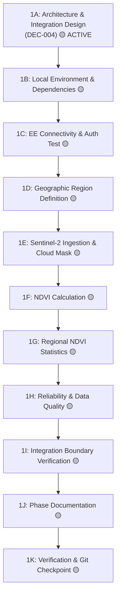

# Phase 1 — Earth Engine Foundation

> **Phase 1 Execution Record, Architectural Integration Design, and Sub-Roadmap.**  
> *Status: 🟡 IN PROGRESS | Subphase: 1A Active*

---

## 📌 Resume Status

- **Phase Status:** 🟡 **IN PROGRESS**
- **Last Completed Substep:** Phase 1 Kickoff & Planning
- **Current Active Substep:** **1A — Earth Engine Architecture & Integration Design**
- **Next Action:** Review and verify `DEC-004` integration design, then proceed to `1B — Local Earth Engine Environment` (adding dependencies and authenticating developer environment).

> [!IMPORTANT]
> **Source of Truth Rule:** When returning to the project after a session break, this *Resume Status* section is the absolute source of truth for where development stopped. Never mark a phase or subphase complete until implementation, testing, and documentation are verified.

---

## 🎯 Objective

Phase 1 establishes the technical, data-engineering, and architectural foundation for integrating **Google Earth Engine (GEE)** to derive the project's first live satellite agricultural signal.

### Initial Concrete Target:
- **Satellite Constellation:** Copernicus Sentinel-2 MSI Level-2A (Harmonized Surface Reflectance).
- **Core Signal:** Normalized Difference Vegetation Index ($\text{NDVI} = \frac{\text{B8} - \text{B4}}{\text{B8} + \text{B4}}$).
- **Spatial Aggregation:** Regional/zonal summary statistics (**mean**, **median**, **min**, **max**) computed across the farm parcel geometry.
- **Integration Boundary:** Decoupled geospatial module invoked behind an MCP capability tool interface (`DEC-004`).

---

## 📸 Before Snapshot (Baseline Before Phase 1 Implementation)

Prior to the execution of Phase 1 implementation steps, the verified application baseline is as follows:
- ❌ **No Earth Engine Code:** Earth Engine API is not integrated into `app/` application code.
- ❌ **No Live Satellite Queries:** Copernicus Sentinel-2 is not queried by BharatSahayak.
- ❌ **No NDVI Calculation:** NDVI is not computed by any module in the repository.
- ❌ **Static MCP Implementation:** Existing tools in [app/mcp_server.py](file:///d:/Documents/Desktop/adk-workspace/bharatsahayak/app/mcp_server.py) return hardcoded mock/catalog strings for Punjab, Karnataka, and fallbacks.
- ❌ **No Map-Based Location:** Farmer-facing interactive map and coordinate resolvers are not yet implemented.
- ❌ **No Earth Engine Dependencies:** `earthengine-api` is not present in `pyproject.toml` or `uv.lock`.
- ❌ **No Production Earth Engine Authentication:** Service account authentication has not been wired into runtime configuration.

---

## 🗺️ Phase 1 Sub-Roadmap



| Substep | Title | Description | Status |
| :--- | :--- | :--- | :--- |
| **1A** | **Earth Engine Architecture & Integration Design** | Analyze Earth Engine role, auth models, quota, integration boundaries (Options A/B/C), and record `DEC-004`. | 🟡 **IN PROGRESS** |
| **1B** | **Local Earth Engine Environment** | Add `earthengine-api` to dependencies, configure local environment, authenticate developer ADC, and verify GCP project `bharatsahayak-v2`. | 🟡 PLANNED |
| **1C** | **Earth Engine Connectivity Test** | Initialize EE client, execute minimal API query, verify Sentinel-2 catalog access and error deserialization. | 🟡 PLANNED |
| **1D** | **Geographic Region Definition** | Formulate point-to-region geometry strategy (bounding boxes/point buffers), validate Indian coordinate boundaries, test region queries. | 🟡 PLANNED |
| **1E** | **Sentinel-2 Data Pipeline** | Ingest Sentinel-2 Level-2A collection, apply spatial/temporal filters and `QA60`/SCL cloud masks, validate scene metadata. | 🟡 PLANNED |
| **1F** | **NDVI Calculation** | Extract Red (B4) and NIR (B8) bands, compute $\text{NDVI} = \frac{\text{B8}-\text{B4}}{\text{B8}+\text{B4}}$, validate value ranges ($-1.0$ to $+1.0$). | 🟡 PLANNED |
| **1G** | **Regional NDVI Statistics** | Implement zonal reducers across farm geometry computing **mean**, **median**, **min**, **max**, and format structured JSON output. | 🟡 PLANNED |
| **1H** | **Reliability & Data Quality** | Implement edge-case handlers for out-of-bounds coordinates, heavy clouds, zero-pixel reductions, API timeouts, and quota limits. | 🟡 PLANNED |
| **1I** | **Integration Boundary Verification** | Verify standalone execution of the Earth Engine module, clean MCP interface decoupling, and pluggability for future datasets. | 🟡 PLANNED |
| **1J** | **Phase Documentation** | Write Before vs After records, document verified outputs, update decisions, backlog, and resume state. | 🟡 PLANNED |
| **1K** | **Git Checkpoint** | Run full verification suite and commit verified Phase 1 implementation. | 🟡 PLANNED |

---

## 🏛️ 1A — Architecture & Integration Design

### Goal
Define the exact architectural placement, boundaries, and communication contracts for Google Earth Engine before writing any integration code.

### Options Considered
- **Option A (Monolithic MCP):** Write all Earth Engine initialization, image filtering, band math, and zonal reducers directly inside `app/mcp_server.py`.
- **Option B (Standalone Microservice):** Build a separate microservice with custom REST endpoints without utilizing the MCP tool architecture.
- **Option C (Chosen — Layered Tool Contract + Dedicated Engine):** Expose high-level capabilities through the MCP server tool contract, while delegating low-level Earth Engine API calls and geospatial operations to a dedicated, decoupled module.

### Chosen Architecture & Rationale
**Option C was selected (`DEC-004`).**

```text
Farmer / User Interface
        ↓
Resolved Farm Coordinates & Area (Lat, Lon, Buffer/Acreage)
        ↓
MCP Tool Contract (get_farm_satellite_intelligence)
        ↓
Dedicated Earth Engine Module / Service (app/satellite/)
        ↓
Copernicus Sentinel-2 Level-2A Collection
        ↓
Cloud Masking (QA60 / SCL)
        ↓
NDVI Band Math ((B8 - B4) / (B8 + B4))
        ↓
Zonal Reducers (Mean, Median, Min, Max)
        ↓
Structured JSON Output Envelope
        ↓
Gemini 2.5 Flash Multi-Agent Advisors
```

**Key Advantages:**
1. **Clean Separation of Concerns:** MCP handles tool contracts and serialization; the Earth Engine module handles geospatial math and client authentication.
2. **Independent Testability:** Earth Engine logic can be thoroughly tested with mock reducer fixtures in CI/CD without running a live MCP stdio subprocess.
3. **Future Pluggability:** Adding Dynamic World LULC or NDWI in later phases requires extending only the dedicated satellite module without modifying existing agent-facing MCP signatures.
4. **Engineering Rigor:** Clean, professional architecture suitable for technical interviews and scalable production deployments.

### Current Status of 1A
- Architectural design is **completed and documented**.
- Application implementation has **NOT** yet occurred.

---

## 🔮 Future Upgrade Impact

| Deferred Feature | Why Deferred | Dependency | Likely Future Affected Area | Architectural Consideration |
| :--- | :--- | :--- | :--- | :--- |
| **NDVI Multi-Temporal Time Series** | Avoids heavy multi-temporal Earth Engine latency during live conversational turns (`DEC-002`). | Phase 1 (EE foundation) | `app/` satellite modules, MCP layer | Add optional `time_series` array to output dictionary without modifying core statistical keys. |
| **Historical Baseline & Anomaly Detection** | Requires multi-year imagery alignment and seasonal baseline z-score models. | NDVI time series | `app/` analytics modules, `app/agent.py` | Pass anomaly flags as non-blocking advisory metadata. |
| **Dynamic World Land Cover (LULC)** | Sentinel-2 NDVI chosen as primary vegetative health indicator (`DEC-001`). | Phase 1 | `app/` satellite modules, MCP layer | Implement as a pluggable `LulcProvider` without tightly coupling crop advice to LULC classifications. |
| **NDWI (Water / Moisture Index)** | Focused first on vegetation greenness index before expanding spectral band math. | Phase 1 | `app/` satellite modules, MCP layer | Compute as a companion index sharing the same geometry and cloud mask pipeline. |
| **Additional Spectral Indicators (EVI, SAVI)** | Standard NDVI is universally understood and sufficient for smallholder MVP. | Phase 2 | `app/` satellite modules | Keep index calculation functions modular and independent. |
| **Multi-Source Data Fusion (Soil + Weather + Satellite)** | Requires individual satellite, meteorological, and soil providers to exist first. | Phase 2, Phase 3 | `app/fusion/` module | Fuse normalized outputs into a single `FarmHealthContext` dictionary for Gemini prompts. |

---

## 📝 Documentation Step Result (Subphase 1A)

### Actual Changes Made in 1A:
- ✅ **Documentation Only:** No application source files, configuration, dependencies, or tests were modified.
- ✅ **`DEC-004` Recorded:** Documented Earth Engine integration boundary (Option C) in `docs/DECISION_LOG.md`.
- ✅ **Master Roadmap Updated:** Expanded Phase 1 into detailed 1A–1K subphases in `docs/MASTER_ROADMAP.md`.
- ✅ **Architecture Document Updated:** Added the planned Earth Engine architecture boundary in `docs/ARCHITECTURE.md`.
- ✅ **Future Backlog Updated:** Documented decoupled areas and future satellite extensions in `docs/FUTURE_BACKLOG.md`.
- ✅ **Changelog Updated:** Logged Phase 1A documentation milestone in `docs/CHANGELOG.md`.

*(A full Phase 1 "After Snapshot" will be authored upon the completion of all Phase 1 implementation substeps).*

---

## 📜 Documentation / Resume Rules

1. **Reality Over Aspiration:** A feature or phase must never be marked complete merely because it was discussed, designed, or planned.
2. **Completion Requirements:** Marking any subphase complete requires:
   - Concrete code implementation where applicable.
   - Verification of execution outputs.
   - Unit/integration tests where applicable.
   - Accurate documentation of actual results.
   - Verified Git checkpoint.
3. **Resume Truth:** The **Resume Status** section at the top of this document is the authoritative guide for resuming development.

---

## 📊 Current Status

- **Phase 1 (Earth Engine Foundation):** 🟡 **IN PROGRESS**
- **Subphase 1A (Architecture & Integration Design):** 🟡 **IN PROGRESS**
