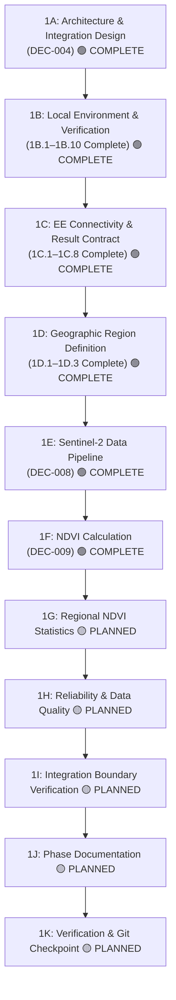

# Phase 1 — Earth Engine Foundation

> **Phase 1 Execution Record, Architectural Integration Design, and Sub-Roadmap.**  
> *Status: 🟡 IN PROGRESS | Active Subphase: 1F Complete, Next Subphase: 1G*

---

## 📌 Resume Status

- **Phase Status:** 🟡 **IN PROGRESS**
- **Last Completed Substep:** **1F — NDVI Calculation (`DEC-009`)**
- **Current Active Substep:** **1G — Regional NDVI Statistics** (🟡 PLANNED)
- **Next Action:** Implement Earth Engine zonal reducers across the `AnalysisRegion` computing **mean**, **median**, **min**, and **max** NDVI statistics, returning a structured JSON result contract in Subphase 1G.
- **Verified Fact / Boundary:**
  - **Phase 1B Completed (1B.1–1B.10):** Local environment setup, `earthengine-api` 1.7.43 installed via `uv add` (`DEC-005`), ADC authentication verified (`DEC-006`), project `bharatsahayak-v2` initialized, bounded Sentinel-2 catalog query verified, zero credential leakage audited.
  - **Phase 1C Completed (1C.1–1C.8):**
    - Minimal calculation executed: `ee.Number(42).getInfo() -> 42` (1C.1).
    - Intentional invalid asset query produced `ee.EEException` via SDK error translation (1C.2).
    - Valid query with pre-Sentinel-2 date range returned `image_count=0` without API exceptions, establishing distinct `NO_DATA` state (1C.3).
    - Pydantic result contract (`EarthEngineResult`, `EarthEngineError`, `EarthEngineStatus`) implemented in `app/satellite/types.py` and `app/satellite/__init__.py` with non-negative validation and status literal constraints (1C.4–1C.6).
    - 6 focused unit tests in `tests/unit/test_satellite_types.py` passed (1C.6).
    - 3 live Earth Engine integration tests in `tests/integration/test_earth_engine_connectivity.py` passed (0 skipped, 6 non-blocking framework warnings) validating success, no_data, and error mappings (1C.7).
    - Phase 1C documentation and checkpoint recorded (1C.8).
  - **Phase 1D Completed (1D.1–1D.3):**
    - **1D.1 Completed:** Formulated and documented `DEC-007: Geographic Analysis Region Strategy` establishing the decoupled `FarmerLocation` $\rightarrow$ `Region Resolution` $\rightarrow$ `AnalysisRegion` model with a default 100 m circular buffer for local Sentinel-2 aggregation.
    - **1D.2 Completed:** Created [`app/satellite/geometry.py`](file:///d:/Documents/Desktop/adk-workspace/bharatsahayak/app/satellite/geometry.py) implementing `create_analysis_region(latitude, longitude, radius_m=100.0) -> ee.Geometry` with coordinate and radius validation. Exported in [`app/satellite/__init__.py`](file:///d:/Documents/Desktop/adk-workspace/bharatsahayak/app/satellite/__init__.py). Verified with 35 unit tests in [`tests/unit/test_satellite_geometry.py`](file:///d:/Documents/Desktop/adk-workspace/bharatsahayak/tests/unit/test_satellite_geometry.py) and verified non-network client-side geometry proxy instantiation without `.getInfo()` or server-side calls.
    - **1D.3 Completed:** Verified `create_analysis_region()` in live Earth Engine Sentinel-2 queries in [`tests/integration/test_earth_engine_connectivity.py`](file:///d:/Documents/Desktop/adk-workspace/bharatsahayak/tests/integration/test_earth_engine_connectivity.py). Successful query over Ludhiana test fixture (`[75.7196, 30.9157]`, 100 m radius, Aug 2026, clouds < 20%) returned `image_count=1` mapped to `EarthEngineResult(status="success")`. Pre-Sentinel-2 date query (Jan 1990) returned `image_count=0` mapped to `EarthEngineResult(status="no_data")`. All 5 live integration tests passed.
  - **Phase 1E Completed (`DEC-008`):**
    - Implemented [`app/satellite/sentinel2.py`](file:///d:/Documents/Desktop/adk-workspace/bharatsahayak/app/satellite/sentinel2.py) with `get_sentinel2_collection()`, `select_most_recent_sentinel2_image()`, `get_most_recent_sentinel2_image()`, and `resolve_date_range()`.
    - Standardized on `COPERNICUS/S2_SR_HARMONIZED` with `AnalysisRegion` spatial bounding, configurable lookback (default 30 days), and configurable scene cloud filtering (`CLOUDY_PIXEL_PERCENTAGE < 20%`).
    - Sorted candidates descending by timestamp (newest-first) and selected the most recent usable observation.
    - Extracted structured [`Sentinel2ImageMetadata`](file:///d:/Documents/Desktop/adk-workspace/bharatsahayak/app/satellite/types.py#L34-L44) returning `EarthEngineResult` envelopes (`success`, `no_data`, `error`).
    - Verified with 46 unit tests in [`tests/unit/test_satellite_sentinel2.py`](file:///d:/Documents/Desktop/adk-workspace/bharatsahayak/tests/unit/test_satellite_sentinel2.py) and 4 live integration tests in [`tests/integration/test_earth_engine_connectivity.py`](file:///d:/Documents/Desktop/adk-workspace/bharatsahayak/tests/integration/test_earth_engine_connectivity.py). Total test suite: **105 passed**.
  - **Phase 1F Completed (`DEC-009`):**
    - Implemented [`app/satellite/ndvi.py`](file:///d:/Documents/Desktop/adk-workspace/bharatsahayak/app/satellite/ndvi.py) with `calculate_ndvi(image, region=None, nir_band="B8", red_band="B4", band_name="NDVI") -> ee.Image` and `compute_ndvi` alias.
    - Computes $\text{NDVI} = \frac{\text{B8} - \text{B4}}{\text{B8} + \text{B4}}$ using Earth Engine's native `image.normalizedDifference(["B8", "B4"]).rename("NDVI")`.
    - Automatically clips the NDVI raster extent to the `AnalysisRegion` (`ee.Geometry`) if provided.
    - Preserves invalid/masked pixels without fabricating replacement zeros; avoids unnecessary manual reflectance scaling (multiplicative factors cancel out in ratio).
    - Preserved active Phase 1E scene-level `<20%` cloud filter without introducing premature pixel-level cloud masking algorithms.
    - Verified with 29 unit tests in [`tests/unit/test_satellite_ndvi.py`](file:///d:/Documents/Desktop/adk-workspace/bharatsahayak/tests/unit/test_satellite_ndvi.py) and 3 live integration tests in [`tests/integration/test_earth_engine_connectivity.py`](file:///d:/Documents/Desktop/adk-workspace/bharatsahayak/tests/integration/test_earth_engine_connectivity.py) (Tests 10–12).
    - Live Ludhiana fixture verification selected Sentinel-2A scene from `2026-08-16`, confirmed output is `ee.image.Image`, single band `["NDVI"]`, sampled pixel values within $[-1.0, 1.0]$, pre-Sentinel-2 query returned `no_data` without fabricating data, and invalid band query produced `ee.EEException`.
    - Total test suite: **146 passed** (0 failed).
  - **Limitations & Future Roadmap:**
    - The 100 m circular region is an approximate local satellite observation area, **not** an exact farm boundary.
    - `cloud_percentage` is scene-level tile metadata, **not** localized cloud cover specifically over the 100 m farm parcel.
    - Pixel-level cloud masking (`QA60` / `SCL`) is deferred to subsequent calculation phases.
    - NDVI alone represents vegetative reflectance/greenness, **not** definitive crop health, disease diagnosis, or yield prediction.
    - Polygon/cadastral/adaptive region support remains future work.
  - **Strict Scope Boundaries:**
    - Earth Engine production client is **NOT** implemented yet (`app/satellite/client.py` does **NOT** exist yet).
    - Regional NDVI summary statistics (mean, median, min, max) are **NOT** implemented yet (Subphase 1G).
    - Crop-health interpretations and classification thresholds are **NOT** implemented yet.
    - Dynamic World LULC and NDWI are **NOT** implemented yet.
    - Weather data fusion and predictive models are **NOT** implemented yet.
    - Gemini prompt reasoning and MCP integration are **NOT** implemented yet.
    - Field polygon drawing is **NOT** implemented yet.
    - Farmer-facing interactive map workflow is **NOT** implemented yet.

> [!IMPORTANT]
> **Source of Truth Rule:** When returning to the project after a session break, this *Resume Status* section is the absolute source of truth for where development stopped. Never mark a phase or subphase complete until implementation, testing, and documentation are verified.

---

## 🎯 Objective

Phase 1 establishes the technical, data-engineering, and architectural foundation for integrating **Google Earth Engine (GEE)** to derive the project's first live satellite agricultural signal.

### Initial Concrete Target:
- **Satellite Constellation:** Copernicus Sentinel-2 MSI Level-2A (Harmonized Surface Reflectance).
- **Core Signal:** Normalized Difference Vegetation Index ($\text{NDVI} = \frac{\text{B8} - \text{B4}}{\text{B8} + \text{B4}}$).
- **Spatial Aggregation:** Regional/zonal summary statistics (**mean**, **median**, **min**, **max**) computed across the farm parcel geometry.
- **Integration Boundary:** Decoupled geospatial module invoked behind an MCP capability tool interface (`DEC-004`).

---

## 📸 Before Snapshot (Baseline Before Phase 1 Implementation)

Prior to the execution of Phase 1 implementation steps, the verified application baseline is as follows:
- ❌ **No Earth Engine Code:** Earth Engine API is not integrated into `app/` application code.
- ❌ **No Live Satellite Queries:** Copernicus Sentinel-2 is not queried by BharatSahayak.
- ❌ **No NDVI Calculation:** NDVI is not computed by any module in the repository.
- ❌ **Static MCP Implementation:** Existing tools in [app/mcp_server.py](file:///d:/Documents/Desktop/adk-workspace/bharatsahayak/app/mcp_server.py) return hardcoded mock/catalog strings for Punjab, Karnataka, and fallbacks.
- ❌ **No Map-Based Location:** Farmer-facing interactive map and coordinate resolvers are not yet implemented.
- ❌ **No Earth Engine Dependencies:** `earthengine-api` was initially not present in `pyproject.toml` or `uv.lock`.
- ❌ **No Production Earth Engine Authentication:** Service account authentication has not been wired into runtime configuration.

---

## 🗺️ Phase 1 Sub-Roadmap



| Substep | Title | Description | Status |
| :--- | :--- | :--- | :--- |
| **1A** | **Earth Engine Architecture & Integration Design** | Analyze Earth Engine role, auth models, quota, integration boundaries (Options A/B/C), and record `DEC-004`. | 🟢 **COMPLETE** |
| **1B** | **Local Earth Engine Environment & Verification** | Add `earthengine-api` via `uv` (`DEC-005`), configure local environment, authenticate developer ADC (`DEC-006`), initialize project `bharatsahayak-v2`, verify bounded Sentinel-2 catalog connectivity, audit credentials, and record documentation. | 🟢 **COMPLETE (1B.1–1B.10 Complete)** |
| **1C** | **Earth Engine Connectivity & Result Contract** | Execute minimal calculation (1C.1), observe SDK error translation on invalid asset (1C.2), verify zero-data behavior (1C.3), define result boundary (1C.4/1C.5), implement Pydantic result contract in `app/satellite/` (1C.6), and verify via unit and live integration tests (1C.6/1C.7), document checkpoint (1C.8). | 🟢 **COMPLETE (1C.1–1C.8 Complete)** |
| **1D** | **Geographic Region Definition** | Formulate point-to-region geometry strategy (`DEC-007` 🟢), implement geometry helpers in `app/satellite/geometry.py` (`1D.2` 🟢), validate coordinates & radius, test live region queries against Earth Engine (`1D.3` 🟢). | 🟢 **COMPLETE (1D.1–1D.3 Complete)** |
| **1E** | **Sentinel-2 Data Pipeline** | Ingest Sentinel-2 Level-2A collection (`COPERNICUS/S2_SR_HARMONIZED`), apply spatial/temporal filters and scene cloud filtering (`CLOUDY_PIXEL_PERCENTAGE < 20%`), order newest-first, select most recent usable scene, and extract structured metadata (`DEC-008`). | 🟢 **COMPLETE** |
| **1F** | **NDVI Calculation** | Compute $\text{NDVI} = \frac{\text{B8}-\text{B4}}{\text{B8}+\text{B4}}$ using native `image.normalizedDifference(["B8", "B4"]).rename("NDVI")`, clip to `AnalysisRegion`, output unreduced `ee.Image`, validate $[-1.0, 1.0]$ range (`DEC-009`). | 🟢 **COMPLETE** |
| **1G** | **Regional NDVI Statistics** | Implement zonal reducers across farm geometry computing **mean**, **median**, **min**, **max**, and format structured JSON output. | 🟡 PLANNED |
| **1H** | **Reliability & Data Quality** | Implement edge-case handlers for out-of-bounds coordinates, heavy clouds, zero-pixel reductions, API timeouts, and quota limits. | 🟡 PLANNED |
| **1I** | **Integration Boundary Verification** | Verify standalone execution of the Earth Engine module, clean MCP interface decoupling, and pluggability for future datasets. | 🟡 PLANNED |
| **1J** | **Phase Documentation** | Write Before vs After records, document verified outputs, update decisions, backlog, and resume state. | 🟡 PLANNED |
| **1K** | **Git Checkpoint** | Run full verification suite and commit verified Phase 1 implementation. | 🟡 PLANNED |

---

## 🏛️ 1A — Architecture & Integration Design

### Goal
Define the exact architectural placement, boundaries, and communication contracts for Google Earth Engine before writing any integration code.

### Options Considered
- **Option A (Monolithic MCP):** Write all Earth Engine initialization, image filtering, band math, and zonal reducers directly inside `app/mcp_server.py`.
- **Option B (Standalone Microservice):** Build a separate microservice with custom REST endpoints without utilizing the MCP tool architecture.
- **Option C (Chosen — Layered Tool Contract + Dedicated Engine):** Expose high-level capabilities through the MCP server tool contract, while delegating low-level Earth Engine API calls and geospatial operations to a dedicated, decoupled module.

### Chosen Architecture & Rationale
**Option C was selected (`DEC-004`).**

```text
Farmer / User Interface
        ↓
Resolved Farm Coordinates & Area (Lat, Lon, Buffer/Acreage)
        ↓
MCP Tool Contract (get_farm_satellite_intelligence)
        ↓
Dedicated Earth Engine Module / Service (app/satellite/)
        ↓
Copernicus Sentinel-2 Level-2A Collection
        ↓
Cloud Masking (QA60 / SCL)
        ↓
NDVI Band Math ((B8 - B4) / (B8 + B4))
        ↓
Zonal Reducers (Mean, Median, Min, Max)
        ↓
Structured JSON Output Envelope
        ↓
Gemini 2.5 Flash Multi-Agent Advisors
```

**Key Advantages:**
1. **Clean Separation of Concerns:** MCP handles tool contracts and serialization; the Earth Engine module handles geospatial math and client authentication.
2. **Independent Testability:** Earth Engine logic can be thoroughly tested with mock reducer fixtures in CI/CD without running a live MCP stdio subprocess.
3. **Future Pluggability:** Adding Dynamic World LULC or NDWI in later phases requires extending only the dedicated satellite module without modifying existing agent-facing MCP signatures.
4. **Engineering Rigor:** Clean, professional architecture suitable for technical interviews and scalable production deployments.

### Status of 1A
- 🟢 **COMPLETED & DOCUMENTED**

---

## 🛠️ 1B — Local Earth Engine Environment & Verification

### Goal
Establish, configure, authenticate, and verify the local developer environment for Google Earth Engine against Google Cloud project `bharatsahayak-v2` using reproducible package management and verified query tests.

### Substep Breakdown & Execution Record

#### 1B.1 Local Environment Inspection — 🟢 COMPLETE
- **Package Manager:** `uv` 0.11.26
- **Python Runtime:** Python 3.13.14
- **ADK Version:** `google-adk` 2.2.0
- **Project Python Constraint:** `>=3.11,<3.14` (in `pyproject.toml`)
- **Initial State:** `earthengine-api` was verified as not initially installed in the virtual environment.

#### 1B.2 Dependency Management Decision (`DEC-005`) — 🟢 COMPLETE
- **Chosen Approach:** Use canonical `uv add earthengine-api` command.
- **Recorded ADR:** Logged as `DEC-005` in `docs/DECISION_LOG.md`.
- **Rationale:** Guarantees reproducibility, keeps `pyproject.toml` and `uv.lock` synchronized in a single transaction, enables automatic dependency resolution across transitive packages, and maintains a consistent project toolchain.

#### 1B.3 Add Earth Engine API — 🟢 COMPLETE
- Installed package: `earthengine-api` v1.7.43
- Manifest updates: `pyproject.toml` and `uv.lock` updated cleanly.
- Import verification: `import ee` executed and verified successfully in the local runtime.

#### 1B.4 Lockfile Verification — 🟢 COMPLETE
- `uv` resolved and updated the complete dependency graph.
- `git diff --check` confirmed no actual whitespace errors.
- Note: LF/CRLF notifications on Windows are standard line-ending warnings and do not represent syntax or lockfile defects.

#### 1B.5 Earth Engine Developer Authentication (`DEC-006`) — 🟢 COMPLETE
- **Authentication Method:** Interactive developer authentication via `earthengine authenticate` / ADC workflow (`DEC-006`).
- **Execution:** Completed successfully for the local developer session.
- **Security Rule:** No credentials, access tokens, refresh tokens, or credential file contents are ever recorded, exposed, or committed to the repository.

#### 1B.6 Client Initialization & Minimal Query — 🟢 COMPLETE
- **Project Initialized:** `ee.Initialize(project='bharatsahayak-v2')` succeeded with project `bharatsahayak-v2`.
- **Minimal API Query:** `ee.Number(1).getInfo()` executed and returned `1`.

#### 1B.7 Sentinel-2 Catalog Connectivity & Engineering Lessons — 🟢 COMPLETE
- **Unbounded Query Lesson:** An initial unbounded exploratory query using `ee.ImageCollection('COPERNICUS/S2_SR_HARMONIZED').size().getInfo()` without spatial or temporal filters hung waiting for Earth Engine's distributed catalog evaluation and was interrupted.
  > [!NOTE]
  > **Engineering Lesson (Not a System Failure):** For BharatSahayak operational queries, apply spatial and temporal bounds before expensive Earth Engine evaluation wherever possible, reducing unnecessary server-side computation and quota usage.
- **Bounded Verification Query:** Executed a filtered catalog query over a representative agricultural test fixture:
  - **Location:** Representative farmland near Ludhiana, Punjab (Latitude: `30.9157`, Longitude: `75.7196`).
  - **Syntax Notice:** `ee.Geometry.Point` requires coordinates in `[longitude, latitude]` order, so `[75.7196, 30.9157]` was used.
  - **Dataset:** `COPERNICUS/S2_SR_HARMONIZED` (Sentinel-2 Level-2A Surface Reflectance).
  - **Date Filter:** `2026-08-01` to `2026-08-31`.
  - **Cloud Filter:** `CLOUDY_PIXEL_PERCENTAGE < 20`.
  - **Result:** Successfully returned `1` valid scene, proving end-to-end catalog access, authorization, and network round-trip.
  - **Fixture Clarification:** This is a development test fixture only, not a hardcoded production farmer location.

#### 1B.8 Credential Safety Check — 🟢 COMPLETE
- Verified `git status` clean.
- Verified `.gitignore` comprehensively excludes `.env`, `.venv`, `.adk`, `*.env`, and local credentials.
- Searched repository for credential filenames; matches were strictly confined to third-party library metadata inside `.venv` (ignored).
- Ran `git ls-files` search against credential and secret patterns; confirmed **zero tracked secrets**.
- Confirmed no tokens or secrets were introduced into the repository.

#### 1B.9 Documentation — 🟢 COMPLETE
- Recorded verified Phase 1B facts across `docs/phases/PHASE_01_EARTH_ENGINE_FOUNDATION.md`, `docs/CHANGELOG.md`, and `docs/MASTER_ROADMAP.md`.

#### 1B.10 Git Checkpoint — 🟢 COMPLETE
- Checkpointed verified Phase 1B environment baseline.

---

## 🛰️ 1C — Earth Engine Connectivity & Result Contract

### Goal
Validate core Earth Engine calculation and failure behavior, define an explicit application-level result contract, implement Pydantic models in `app/satellite/`, and verify the contract via unit and live integration tests.

### Substep Breakdown & Execution Record

#### 1C.1 Minimal Earth Engine Calculation — 🟢 COMPLETE
- Executed `ee.Number(42).getInfo()`, returning `42`.
- Confirmed server-side mathematical evaluation against project `bharatsahayak-v2`.

#### 1C.2 Intentional Earth Engine Error Behavior — 🟢 COMPLETE
- Executed query against an intentionally invalid asset path: `ee.ImageCollection("NON_EXISTENT/INVALID_ASSET_12345").size().getInfo()`.
- Verified that the underlying Google API error was translated by the Earth Engine Python SDK into `ee.EEException`.
- Documented observed SDK error translation behavior without generalizing across all possible failure modes.

#### 1C.3 Valid Query with Zero Data — 🟢 COMPLETE
- Executed valid Sentinel-2 query using the Ludhiana test point (`[75.7196, 30.9157]`) over a historical pre-launch date range (`1990-01-01` to `1990-01-02`).
- Query evaluated successfully without raising an API exception and returned `image_count=0`.
- Established `NO_DATA` as a valid, distinct operational state separate from system errors.

#### 1C.4 / 1C.5 Result Boundary & Contract Decisions — 🟢 COMPLETE
- Defined structured Earth Engine result contract supporting explicit status values: `"success"`, `"no_data"`, `"error"`.
- Enforced architectural boundary: SDK-specific exceptions remain encapsulated behind the satellite module integration boundary and are converted into application-level error structures.

#### 1C.6 Result Contract Implementation & Unit Tests — 🟢 COMPLETE
- Created [app/satellite/\_\_init\_\_.py](file:///d:/Documents/Desktop/adk-workspace/bharatsahayak/app/satellite/__init__.py) and [app/satellite/types.py](file:///d:/Documents/Desktop/adk-workspace/bharatsahayak/app/satellite/types.py).
- Implemented using Pydantic `BaseModel` conforming to BharatSahayak standards:
  - [`EarthEngineResult`](file:///d:/Documents/Desktop/adk-workspace/bharatsahayak/app/satellite/types.py#L31-L38): `status` (`Literal["success", "no_data", "error"]`), optional `dataset` (`str`), optional `image_count` (`int` with `ge=0` non-negative validation), optional generic `data` payload, and optional `error` (`EarthEngineError`).
  - [`EarthEngineError`](file:///d:/Documents/Desktop/adk-workspace/bharatsahayak/app/satellite/types.py#L22-L27): `type` (`str`), `message` (`str`).
- Created unit test suite in [tests/unit/test_satellite_types.py](file:///d:/Documents/Desktop/adk-workspace/bharatsahayak/tests/unit/test_satellite_types.py).
- Verified: **6 unit tests passed** (success creation, no_data creation, error creation, invalid status rejection, negative image count rejection, model dict/json serialization).

#### 1C.7 Live Earth Engine Integration Testing — 🟢 COMPLETE
- Created live integration test suite in [tests/integration/test_earth_engine_connectivity.py](file:///d:/Documents/Desktop/adk-workspace/bharatsahayak/tests/integration/test_earth_engine_connectivity.py).
- Implemented module-scoped `ee_session` fixture initializing `ee.Initialize(project="bharatsahayak-v2")` with clean `pytest.skip` handling if credentials are unavailable.
- Executed `uv run pytest tests/integration/test_earth_engine_connectivity.py`:
  - **3 integration tests passed** (12.86s).
  - Success test returned 1 Sentinel-2 scene.
  - No-data test returned 0 scenes.
  - Error test intercepted `ee.EEException` and mapped it to structured `EarthEngineResult(status="error", error=EarthEngineError(...))`.
  - **0 tests skipped**; 6 non-blocking framework warnings reported.
  - All queries kept strictly spatially and temporally bounded (no unmeasured EECU claims).

#### 1C.8 Phase 1C Documentation & Checkpoint — 🟢 COMPLETE
- Documented verified Phase 1C achievements across `docs/phases/PHASE_01_EARTH_ENGINE_FOUNDATION.md`, `docs/MASTER_ROADMAP.md`, and `docs/CHANGELOG.md`.

---

## 🌐 1D — Geographic Region Definition

### Goal
Establish the architectural strategy and geometric transformations for converting human-selected farm locations into bounded Earth Engine geometries for satellite data extraction.

### Substep Breakdown & Execution Record

#### 1D.1 Geographic Analysis Region Strategy (`DEC-007`) — 🟢 COMPLETE
- **Conceptual Strategy:** Adopted a decoupled two-stage geographic modeling strategy separating **`FarmerLocation`** (user input) from **`AnalysisRegion`** (satellite compute geometry) through an intermediate **Region Resolution** abstraction:
  ```text
  FarmerLocation (Point: Latitude, Longitude)
          ↓
  Region Resolution (Resolver / Buffer Engine)
          ↓
  AnalysisRegion (Geometry: Circular Buffer / Future Polygon)
  ```
- **Farmer-Facing Location Input:**
  - Farmers specify location via browser GPS, map-based village/area search, or interactive map pin-drop (`DEC-003`).
  - Strict negative constraint: Never require farmers to manually type raw latitude/longitude coordinates or draw complex field polygons in the MVP.
- **Location Storage:**
  - Store original farmer-selected location as simple `latitude` and `longitude` (`FarmerLocation`).
- **Initial Analysis Region Choice:**
  - Automatically convert selected point into a circular analysis region with a fixed default radius of **100 meters** (~3.14 hectares / ~7.7 acres).
  - This is an engineering MVP choice for local satellite processing, **not** a claim of exact cadastral farm boundary.
  - The 100 m radius must **NOT** be exposed as a user-configurable technical parameter in the MVP.
- **Limitation Documentation:**
  - The 100 m circular buffer is an approximate local satellite observation area. It may sample neighboring plots, field bunds, farm roads, irrigation channels, adjacent trees, or rural structures.
  - It must **NEVER** be described or presented to the farmer as their exact cadastral or legal field boundary.
- **Future Reusability:**
  - The generated `AnalysisRegion` is deterministic and reusable across both current and historical satellite observations, enabling consistent multi-temporal trend calculations over the exact same spatial footprint.
- **Future Upgrade Path:**
  - Compatible with optional precise field polygon drawing (Phase 9) and cadastral database integration without redesigning downstream satellite processing.
- **Recorded Decision:** Logged as [`DEC-007`](file:///d:/Documents/Desktop/adk-workspace/bharatsahayak/docs/DECISION_LOG.md#DEC-007) in `docs/DECISION_LOG.md`.
- **Strict Scope Boundary:** DEC-007 is a **region-definition decision only**. It does **NOT** mean that Sentinel-2 NDVI, historical analysis, weather fusion, prediction, Gemini reasoning, or MCP integration are implemented.

#### 1D.2 Geographic Geometry Helper Implementation & Unit Verification — 🟢 COMPLETE
- **Code Implementation:**
  - Created [`app/satellite/geometry.py`](file:///d:/Documents/Desktop/adk-workspace/bharatsahayak/app/satellite/geometry.py) implementing `create_analysis_region(latitude, longitude, radius_m=100.0) -> ee.Geometry`.
  - Built-in validation ensures:
    - `latitude ∈ [-90, 90]` (decimal degrees)
    - `longitude ∈ [-180, 180]` (decimal degrees)
    - `radius_m > 0` (strictly positive finite meters)
    - Invalid and non-finite types (NaN, inf, -inf, strings, None, booleans) raise `ValueError`.
  - Geometry construction: Constructs `ee.Geometry.Point([float(longitude), float(latitude)]).buffer(float(radius_m))` adhering to Earth Engine's `[x, y]` coordinate syntax.
  - Constant defined: `DEFAULT_ANALYSIS_RADIUS_M = 100.0` meters (`DEC-007`).
  - Module exports: Exported `create_analysis_region` and `DEFAULT_ANALYSIS_RADIUS_M` in [`app/satellite/__init__.py`](file:///d:/Documents/Desktop/adk-workspace/bharatsahayak/app/satellite/__init__.py).
  - Docstrings thoroughly describe `FarmerLocation`, `Region Resolution`, `AnalysisRegion`, and document that the 100 m buffer is an approximate local satellite observation area, **not** an exact farm boundary.
- **Unit Test Verification:**
  - Created [`tests/unit/test_satellite_geometry.py`](file:///d:/Documents/Desktop/adk-workspace/bharatsahayak/tests/unit/test_satellite_geometry.py) containing **35 test cases**.
  - Test coverage:
    - Valid Punjab farm coordinates (`[75.7196, 30.9157]`) with default radius.
    - Custom radius values (`250.0m`, `50m`).
    - Coordinate boundary limits (`[-90, 90]`, `[-180, 180]`, `(0, 0)`).
    - Invalid latitude parameterized checks (out-of-bounds, NaN, inf, -inf, string, None, True).
    - Invalid longitude parameterized checks (out-of-bounds, NaN, inf, -inf, string, None, False).
    - Invalid radius parameterized checks (`0`, `0.0`, `-1`, `-100.0`, `-0.0001`, NaN, inf, -inf, string, None, True).
    - Default radius constant validation (`DEFAULT_ANALYSIS_RADIUS_M == 100.0`).
  - Execution result: **35 passed in 7.20s** (`uv run pytest tests/unit/test_satellite_geometry.py -v`).
- **Local Non-Network Verification:**
  - Executed client-side instantiation script over `latitude=30.9157`, `longitude=75.7196`, `radius_m=100`.
  - Verified outputs:
    - Python type: `<class 'ee.geometry.Geometry'>`
    - `isinstance(region, ee.Geometry)`: `True`
    - Geometry name: `"Geometry"`
    - Default radius constant: `100.0`
    - Confirmed: **Zero `.getInfo()` or server-side Earth Engine network calls were executed.**
- **Strict Scope Boundaries Maintained:**
  - Sentinel-2 query pipeline is **NOT** implemented yet.
  - NDVI band math is **NOT** implemented yet.
  - Regional summary statistics are **NOT** implemented yet.
  - Multi-temporal historical analysis is **NOT** implemented yet.
  - MCP tool integration is **NOT** implemented yet.
  - `app/satellite/client.py` does **NOT** exist yet.
  - Farmer-facing UI and interactive map components are **NOT** implemented yet.
  - Field polygon drawing is **NOT** implemented yet.

#### 1D.3 Live Earth Engine Region Query Verification & Checkpoint — 🟢 COMPLETE
- **Live Integration Testing:**
  - Extended [`tests/integration/test_earth_engine_connectivity.py`](file:///d:/Documents/Desktop/adk-workspace/bharatsahayak/tests/integration/test_earth_engine_connectivity.py) with live region query tests using `create_analysis_region()`.
  - **Test 4 (`test_earth_engine_region_query_success`):**
    - Geometry: `create_analysis_region(latitude=30.9157, longitude=75.7196, radius_m=100.0)`
    - Dataset: `COPERNICUS/S2_SR_HARMONIZED`
    - Date Filter: `2026-08-01` to `2026-08-31`
    - Cloud Filter: `CLOUDY_PIXEL_PERCENTAGE < 20`
    - Spatial Filter: `.filterBounds(region)`
    - Server Evaluation: Evaluated via `collection.size().getInfo()` against project `bharatsahayak-v2`.
    - Result: Returned **`image_count = 1`** scene, cleanly mapping to `EarthEngineResult(status="success", dataset="COPERNICUS/S2_SR_HARMONIZED", image_count=1)`.
  - **Test 5 (`test_earth_engine_region_query_no_data`):**
    - Geometry: Same 100 m region over Ludhiana test fixture.
    - Date Filter: Historical pre-Sentinel-2 date range (`1990-01-01` to `1990-01-02`).
    - Result: Returned **`image_count = 0`** without API exceptions, cleanly mapping to `EarthEngineResult(status="no_data", dataset="COPERNICUS/S2_SR_HARMONIZED", image_count=0)`.
  - **Test Suite Results:** **5 passed in 19.34s** (`uv run pytest tests/integration/test_earth_engine_connectivity.py`).
- **Recorded Limitations:**
  - The 100 m circular region is an approximate local satellite observation area, **not** an exact farm boundary.
  - It may include neighboring plots, field bunds, farm roads, adjacent trees, water/irrigation channels, or rural structures.
  - The analysis region must **never** be presented to the farmer as an exact cadastral or legal field boundary.
  - Support for user-drawn field polygons (Phase 9), official cadastral land record integration (Bhulekh / Bhoomi), and adaptive acreage-scaled buffering remains future work.
- **Strict Scope Boundaries Maintained:**
  - Earth Engine production client is **NOT** implemented yet (`app/satellite/client.py` does **NOT** exist yet).
  - Sentinel-2 NDVI band math is **NOT** implemented yet (Subphase 1F).
  - Regional NDVI summary statistics are **NOT** implemented yet (Subphase 1G).
  - Crop health prediction, historical trend analysis, Gemini prompt reasoning, MCP tool upgrades, and farmer-facing UI/polygon drawing remain future work.

---

## 🛰️ 1E — Sentinel-2 Data Pipeline

### Goal
Implement a dedicated, deterministic Sentinel-2 Surface Reflectance imagery selection pipeline (`DEC-008`), bounding candidates by spatial `AnalysisRegion` and temporal lookback window, filtering cloudy scenes, sorting newest-first, selecting the most recent usable observation, and extracting structured metadata for downstream NDVI calculation.

### Substep Breakdown & Execution Record

#### 1E.1 Sentinel-2 Imagery Selection Pipeline (`DEC-008`) — 🟢 COMPLETE
- **Code Implementation:**
  - Created [`app/satellite/sentinel2.py`](file:///d:/Documents/Desktop/adk-workspace/bharatsahayak/app/satellite/sentinel2.py) implementing:
    - `get_sentinel2_collection(region, start_date, end_date, lookback_days=30, max_cloud_percentage=20.0, dataset='COPERNICUS/S2_SR_HARMONIZED') -> ee.ImageCollection`: Constructs spatially and temporally bounded, cloud-filtered collection sorted descending by acquisition time (`system:time_start`).
    - `select_most_recent_sentinel2_image(...) -> EarthEngineResult`: Evaluates candidate scenes, selects `.first()`, extracts structured metadata into `Sentinel2ImageMetadata`, and handles `no_data` (`image_count = 0`) and errors cleanly.
    - `get_most_recent_sentinel2_image(...) -> ee.Image`: Returns the un-evaluated `ee.Image` proxy for downstream band mathematics in Phase 1F.
    - `resolve_date_range(...) -> tuple[str, str]`: Standardizes and validates ISO string, date, and datetime inputs with positive lookback calculation.
  - Updated [`app/satellite/types.py`](file:///d:/Documents/Desktop/adk-workspace/bharatsahayak/app/satellite/types.py) adding [`Sentinel2ImageMetadata`](file:///d:/Documents/Desktop/adk-workspace/bharatsahayak/app/satellite/types.py#L34-L44) and `SatelliteImageMetadata` alias.
  - Exported all pipeline functions, constants, and types in [`app/satellite/__init__.py`](file:///d:/Documents/Desktop/adk-workspace/bharatsahayak/app/satellite/__init__.py).
- **Unit Test Verification:**
  - Created [`tests/unit/test_satellite_sentinel2.py`](file:///d:/Documents/Desktop/adk-workspace/bharatsahayak/tests/unit/test_satellite_sentinel2.py) containing **46 unit tests**.
  - Verified: constant definitions, date parsing across multiple formats, lookback date calculations, start/end ordering validation, client-side proxy instantiation, parameter bounds checking, Pydantic model serialization, and error encapsulation.
  - Execution result: **46 passed** (`uv run pytest tests/unit/test_satellite_sentinel2.py -v`).
- **Live Earth Engine Integration Testing:**
  - Extended [`tests/integration/test_earth_engine_connectivity.py`](file:///d:/Documents/Desktop/adk-workspace/bharatsahayak/tests/integration/test_earth_engine_connectivity.py) with 4 live pipeline tests (Tests 6–9):
    - **Test 6 (`test_select_most_recent_sentinel2_image_success`):** Over Ludhiana test fixture (`[75.7196, 30.9157]`, 100m radius, Aug 2026, cloud < 20%), returned `image_count = 1` scene from `2026-08-16T05:50:41.321000+00:00` (`Sentinel-2A`, cloud $\approx 10.995\%$) with `status="success"`.
    - **Test 7 (`test_select_most_recent_sentinel2_image_no_data`):** Over historical pre-Sentinel-2 dates (Jan 1990), returned `image_count = 0` mapped cleanly to `status="no_data"`.
    - **Test 8 (`test_sentinel2_candidate_ordering_and_most_recent_selection`):** Verified multiple candidate scenes over 2 months are sorted strictly descending by acquisition timestamp and that `select_most_recent_sentinel2_image()` selects the newest candidate.
    - **Test 9 (`test_select_most_recent_sentinel2_image_error`):** Verified invalid asset IDs produce `status="error"` with `EEException` details.
  - Total test suite: **105 passed** in 70.95s.
- **Documented Limitations & Scope Boundaries:**
  - **Scene-Level Cloud Metadata:** `cloud_percentage` represents cloud cover across the entire Sentinel-2 tile (`CLOUDY_PIXEL_PERCENTAGE`), **not** localized cloudiness specifically over the 100 m farm parcel.
  - **Pixel-Level Cloud Masking:** Fine-grained pixel masking (`QA60` / `SCL`) is deferred to subsequent calculation phases.
  - **Terminology:** Avoids subjective terms like *"best image"*; strictly uses *"most recent usable image"*.
  - **Missing Imagery:** Missing observations are strictly represented as `no_data`, **never** as NDVI=0.
  - **Strict Scope Preserved:** NDVI band math (Phase 1F), regional NDVI summary statistics (Phase 1G), multi-temporal time-series, historical baseline comparisons, Dynamic World / NDWI, MCP server tool upgrades, and farmer UI components remain deferred.

---

## 🌿 1F — NDVI Calculation

### Goal
Implement Normalized Difference Vegetation Index ($\text{NDVI}$) calculation for Sentinel-2 Level-2A imagery in accordance with `DEC-009`, applying native Earth Engine band math ($(\text{B8}-\text{B4})/(\text{B8}+\text{B4})$), renaming the output band to `'NDVI'`, clipping to the `AnalysisRegion`, preserving un-invented masked pixels, and verifying theoretical value range $[-1.0, 1.0]$.

### Substep Breakdown & Execution Record

#### 1F.1 NDVI Band Mathematics & Module Implementation (`DEC-009`) — 🟢 COMPLETE
- **Code Implementation:**
  - Created [`app/satellite/ndvi.py`](file:///d:/Documents/Desktop/adk-workspace/bharatsahayak/app/satellite/ndvi.py) implementing:
    - `calculate_ndvi(image: ee.Image, region: ee.Geometry | None = None, nir_band: str = "B8", red_band: str = "B4", band_name: str = "NDVI") -> ee.Image`:
      - Consumes an un-evaluated `ee.Image` from Phase 1E (`COPERNICUS/S2_SR_HARMONIZED`).
      - Identifies Near-Infrared band (`B8`) and Red band (`B4`).
      - Applies normalized difference formula:
        $$\text{NDVI} = \frac{\text{B8} - \text{B4}}{\text{B8} + \text{B4}}$$
        using Earth Engine's native `image.normalizedDifference(["B8", "B4"])`.
      - Renames resulting output band to `'NDVI'` (`.rename(band_name)`).
      - Automatically clips the raster extent to the provided `AnalysisRegion` (`.clip(region)`) if specified.
      - Preserves invalid/masked pixels (zero denominator or sensor masked) natively without fabricating artificial zeros.
      - Skips manual reflectance scaling (multiplicative scale factor $0.0001$ cancels out identically in normalized ratios).
    - `compute_ndvi`: Defined as a semantic functional alias for `calculate_ndvi`.
    - Defined standard constants: `NDVI_BAND_NAME = "NDVI"`, `NIR_BAND = "B8"`, `RED_BAND = "B4"`.
  - Exported `NDVI_BAND_NAME`, `NIR_BAND`, `RED_BAND`, `calculate_ndvi`, and `compute_ndvi` in [`app/satellite/__init__.py`](file:///d:/Documents/Desktop/adk-workspace/bharatsahayak/app/satellite/__init__.py).
- **Unit Test Verification:**
  - Created [`tests/unit/test_satellite_ndvi.py`](file:///d:/Documents/Desktop/adk-workspace/bharatsahayak/tests/unit/test_satellite_ndvi.py) with **29 unit tests**.
  - Verified:
    - Constant definitions (`NDVI_BAND_NAME == "NDVI"`, `NIR_BAND == "B8"`, `RED_BAND == "B4"`).
    - Client-side proxy creation for un-evaluated `ee.Image` objects.
    - Client-side proxy creation with `AnalysisRegion` clipping.
    - Custom band and output naming support (`B8A`, `B4`, `CUSTOM_NDVI`).
    - Parity of `compute_ndvi` alias.
    - Parameterized type validation: rejection of non-`ee.Image` inputs (None, strings, numbers, booleans, lists, dicts).
    - Parameterized geometry validation: rejection of non-`ee.Geometry` regions.
    - Parameterized string validation: rejection of empty, whitespace, and non-string band names.
  - Execution result: **29 passed** (`uv run pytest tests/unit/test_satellite_ndvi.py -v`).
- **Live Earth Engine Integration Testing:**
  - Extended [`tests/integration/test_earth_engine_connectivity.py`](file:///d:/Documents/Desktop/adk-workspace/bharatsahayak/tests/integration/test_earth_engine_connectivity.py) with 3 live tests (Tests 10–12):
    - **Test 10 (`test_calculate_ndvi_live_evaluation`):**
      - Fixture: Representative farmland near Ludhiana, Punjab (`[75.7196, 30.9157]`, 100m radius circular buffer, project `bharatsahayak-v2`).
      - Selected Observation: Live Sentinel-2A scene from `2026-08-16T05:50:41` selected via Phase 1E pipeline (`COPERNICUS/S2_SR_HARMONIZED`, cloud $\approx 10.995\%$).
      - Output Verification: Output is an `ee.Image` instance; `.bandNames().getInfo()` returned `["NDVI"]`.
      - Value Range Verification: Sampled valid pixels within the 100m buffer evaluated strictly within $[-1.0, 1.0]$.
    - **Test 11 (`test_calculate_ndvi_no_data_path`):**
      - Pre-Sentinel-2 date query (Jan 1990) returned `status="no_data"`, `image_count=0`, confirming NDVI calculation is not executed or fabricated from non-existent imagery.
    - **Test 12 (`test_calculate_ndvi_invalid_bands_error`):**
      - Evaluated image with non-existent band names, confirming server-side evaluation raises `ee.EEException`.
  - Total test suite: **146 passed** (0 failed) in 112.44s.
- **Documented Limitations & Scope Boundaries:**
  - **NDVI is a Reflectance Metric, Not Direct Crop Health:** NDVI measures vegetative greenness and relative photosynthetic vigor. It does **not** constitute an agronomic diagnosis, pest identification, or yield prediction on its own.
  - **Cloud Masking Scope:** Scene-level filtering (`CLOUDY_PIXEL_PERCENTAGE < 20%`) from Phase 1E remains active. Fine-grained pixel-level masking (`QA60` / `SCL`) is deferred.
  - **Approximate Geometry:** The 100m circular buffer is an approximate local satellite observation envelope, **not** an exact farm boundary.
  - **Strict Scope Boundaries Maintained:**
    - Zonal statistical reductions (mean, median, min, max) are **NOT** implemented yet (Subphase 1G).
    - Crop-health classification thresholds are **NOT** implemented yet.
    - Gemini prompt reasoning, MCP tool changes, and farmer-facing UI components remain deferred.

---

## 🔮 Future Upgrade Impact

| Deferred Feature | Why Deferred | Dependency | Likely Future Affected Area | Architectural Consideration |
| :--- | :--- | :--- | :--- | :--- |
| **Precise Field Polygon Drawing & GeoJSON Upload** | Lowers farmer UX complexity in MVP; circular buffer provides sufficient satellite sample (`DEC-007`). | Phase 1 (EE foundation), Phase 9 (UI) | `app/satellite/` geometry resolver, `frontend/` map | Resolver outputs polygon `AnalysisRegion` into unchanged satellite extraction pipeline. |
| **Cadastral / Land Record Boundary Ingestion** | Requires state-level land registry API access (Bhulekh / Bhoomi). | Phase 1, Phase 7 | `app/data_sources/cadastral.py` | Feed resolved parcel polygons directly into `AnalysisRegion` model. |
| **NDVI Multi-Temporal Time Series** | Avoids heavy multi-temporal Earth Engine latency during live conversational turns (`DEC-002`). | Phase 1 (EE foundation) | `app/` satellite modules, MCP layer | Add optional `time_series` array to output dictionary without modifying core statistical keys. |
| **Historical Baseline & Anomaly Detection** | Requires multi-year imagery alignment and seasonal baseline z-score models. | NDVI time series, `DEC-007` | `app/` analytics modules, `app/agent.py` | Query historical scenes over same `AnalysisRegion`; pass anomaly flags as non-blocking advisory metadata. |
| **Dynamic World Land Cover (LULC)** | Sentinel-2 NDVI chosen as primary vegetative health indicator (`DEC-001`). | Phase 1 | `app/` satellite modules, MCP layer | Implement as a pluggable `LulcProvider` without tightly coupling crop advice to LULC classifications. |
| **NDWI (Water / Moisture Index)** | Focused first on vegetation greenness index before expanding spectral band math. | Phase 1 | `app/` satellite modules, MCP layer | Compute as a companion index sharing the same geometry and cloud mask pipeline. |
| **Additional Spectral Indicators (EVI, SAVI)** | Standard NDVI is universally understood and sufficient for smallholder MVP. | Phase 2 | `app/` satellite modules | Keep index calculation functions modular and independent. |
| **Multi-Source Data Fusion (Soil + Weather + Satellite)** | Requires individual satellite, meteorological, and soil providers to exist first. | Phase 2, Phase 3 | `app/fusion/` module | Fuse normalized outputs into a single `FarmHealthContext` dictionary for Gemini prompts. |

---

## 📝 Documentation Step Result (Phase 1 Progress)

### Verified Achievements Across Phase 1:
- ✅ **1A Completed:** Documented Earth Engine integration boundary (`DEC-004`, Option C) in `docs/DECISION_LOG.md` and `docs/ARCHITECTURE.md`.
- ✅ **1B Completed (1B.1–1B.10):**
  - Added `earthengine-api` 1.7.43 via `uv add` (`DEC-005`).
  - Completed local developer authentication (`DEC-006`) without secret leakage.
  - Successfully initialized `ee.Initialize(project='bharatsahayak-v2')` and verified `ee.Number(1).getInfo() -> 1`.
  - Verified Sentinel-2 catalog querying with bounded test fixture over Ludhiana, Punjab.
  - Documented spatial/temporal query bounding lesson for Earth Engine collections.
  - Audited repository and confirmed zero credentials or secrets tracked.
- ✅ **1C Completed (1C.1–1C.8):**
  - Verified minimal compute `ee.Number(42).getInfo() -> 42`.
  - Verified SDK exception translation (`ee.EEException`) on invalid assets.
  - Verified `image_count=0` no-data query state.
  - Created `app/satellite/__init__.py` and `app/satellite/types.py` (`EarthEngineResult`, `EarthEngineError`, `EarthEngineStatus`).
  - Verified 6 unit tests in `tests/unit/test_satellite_types.py`.
  - Verified 3 live integration tests in `tests/integration/test_earth_engine_connectivity.py`.
  - Completed Phase 1C documentation checkpoint.
- ✅ **1D Completed (1D.1–1D.3):**
  - **1D.1 Completed:** Formulated and documented `DEC-007: Geographic Analysis Region Strategy` in `docs/DECISION_LOG.md` (decoupled `FarmerLocation` $\rightarrow$ `Region Resolution` $\rightarrow$ `AnalysisRegion` with 100 m default circular buffer).
  - **1D.2 Completed:** Implemented `app/satellite/geometry.py` with `create_analysis_region(latitude, longitude, radius_m=100.0) -> ee.Geometry` and coordinate/radius validation. Exported in `app/satellite/__init__.py`. Passed 35 unit tests in `tests/unit/test_satellite_geometry.py`. Verified non-network client-side geometry proxy instantiation without server-side calls.
  - **1D.3 Completed:** Verified geometry helper with live Earth Engine Sentinel-2 queries in `tests/integration/test_earth_engine_connectivity.py`. Successful query returned `image_count=1`, no-data query returned `image_count=0`. 5 live integration tests passed. Documented approximation limitations and future polygon/cadastral roadmap.
- ✅ **1E Completed (`DEC-008`):**
  - Implemented `app/satellite/sentinel2.py` (`get_sentinel2_collection`, `select_most_recent_sentinel2_image`, `get_most_recent_sentinel2_image`, `resolve_date_range`).
  - Standardized on `COPERNICUS/S2_SR_HARMONIZED`, `AnalysisRegion` bounds, configurable lookback (default 30 days), and scene cloud filter (`CLOUDY_PIXEL_PERCENTAGE < 20%`).
  - Implemented newest-first candidate ordering and most recent usable image selection.
  - Created `Sentinel2ImageMetadata` model and updated `EarthEngineResult` contracts.
  - Verified 46 unit tests in `tests/unit/test_satellite_sentinel2.py` and 4 live integration tests in `tests/integration/test_earth_engine_connectivity.py`. 105 total tests passed.
- ✅ **1F Completed (`DEC-009`):**
  - Implemented `app/satellite/ndvi.py` (`calculate_ndvi`, `compute_ndvi`, `NDVI_BAND_NAME`, `NIR_BAND`, `RED_BAND`).
  - Native `image.normalizedDifference(["B8", "B4"]).rename("NDVI")`, clipped to `AnalysisRegion`, returning unreduced `ee.Image`.
  - Preserved masked pixels; avoided manual scale factor multiplication; preserved scene-level `<20%` cloud filter.
  - Verified 29 unit tests in `tests/unit/test_satellite_ndvi.py` and 3 live integration tests in `tests/integration/test_earth_engine_connectivity.py`. 146 total tests passed.
- 🟡 **1G Next:** Regional NDVI Statistics (Earth Engine zonal reductions computing mean, median, min, max over farm geometry).

---

## 📜 Documentation / Resume Rules

1. **Reality Over Aspiration:** A feature or phase must never be marked complete merely because it was discussed, designed, or planned.
2. **Completion Requirements:** Marking any subphase complete requires:
   - Concrete code implementation where applicable.
   - Verification of execution outputs.
   - Unit/integration tests where applicable.
   - Accurate documentation of actual results.
   - Verified Git checkpoint.
3. **Resume Truth:** The **Resume Status** section at the top of this document is the authoritative guide for resuming development.

---

## 📊 Current Status

- **Phase 1 (Earth Engine Foundation):** 🟡 **IN PROGRESS**
- **Subphase 1A (Architecture & Integration Design):** 🟢 **COMPLETE**
- **Subphase 1B (Local Earth Engine Environment & Verification):** 🟢 **COMPLETE (1B.1–1B.10 Complete)**
- **Subphase 1C (Earth Engine Connectivity & Result Contract):** 🟢 **COMPLETE (1C.1–1C.8 Complete)**
- **Subphase 1D (Geographic Region Definition):** 🟢 **COMPLETE (1D.1–1D.3 Complete)**
- **Subphase 1E (Sentinel-2 Data Pipeline):** 🟢 **COMPLETE**
- **Subphase 1F (NDVI Calculation):** 🟢 **COMPLETE**
- **Subphase 1G (Regional NDVI Statistics):** 🟡 **PLANNED**
