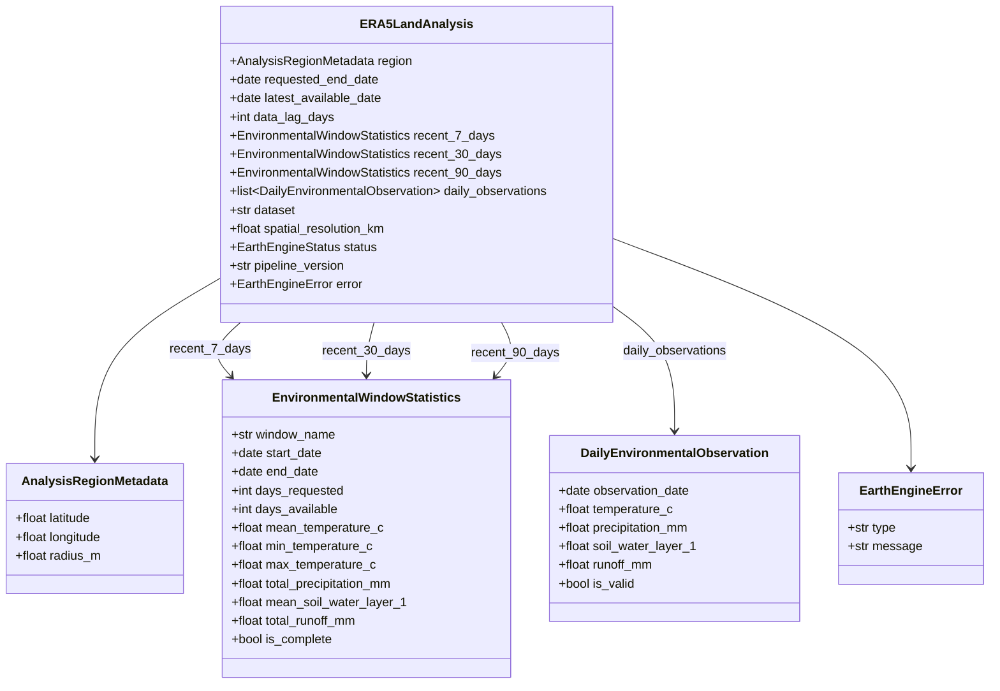
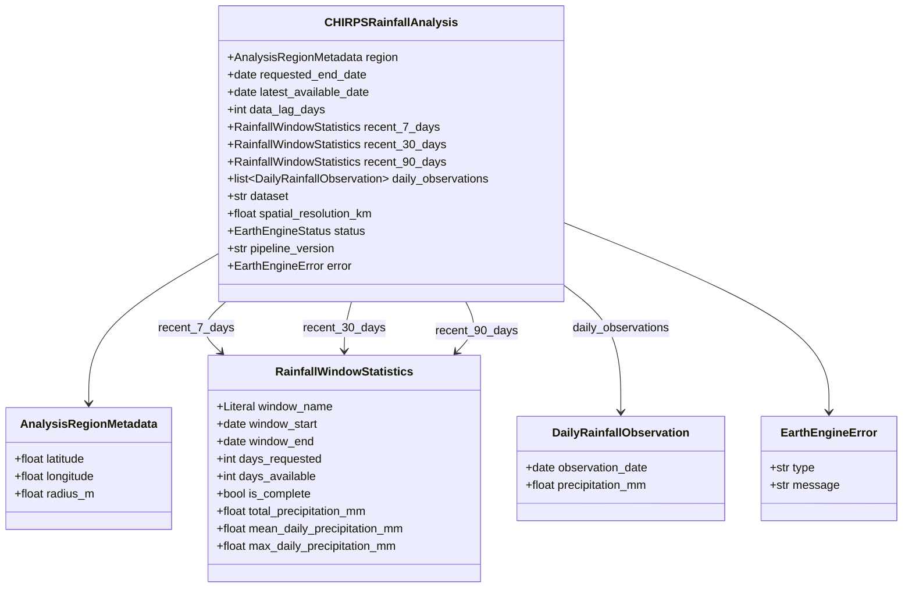
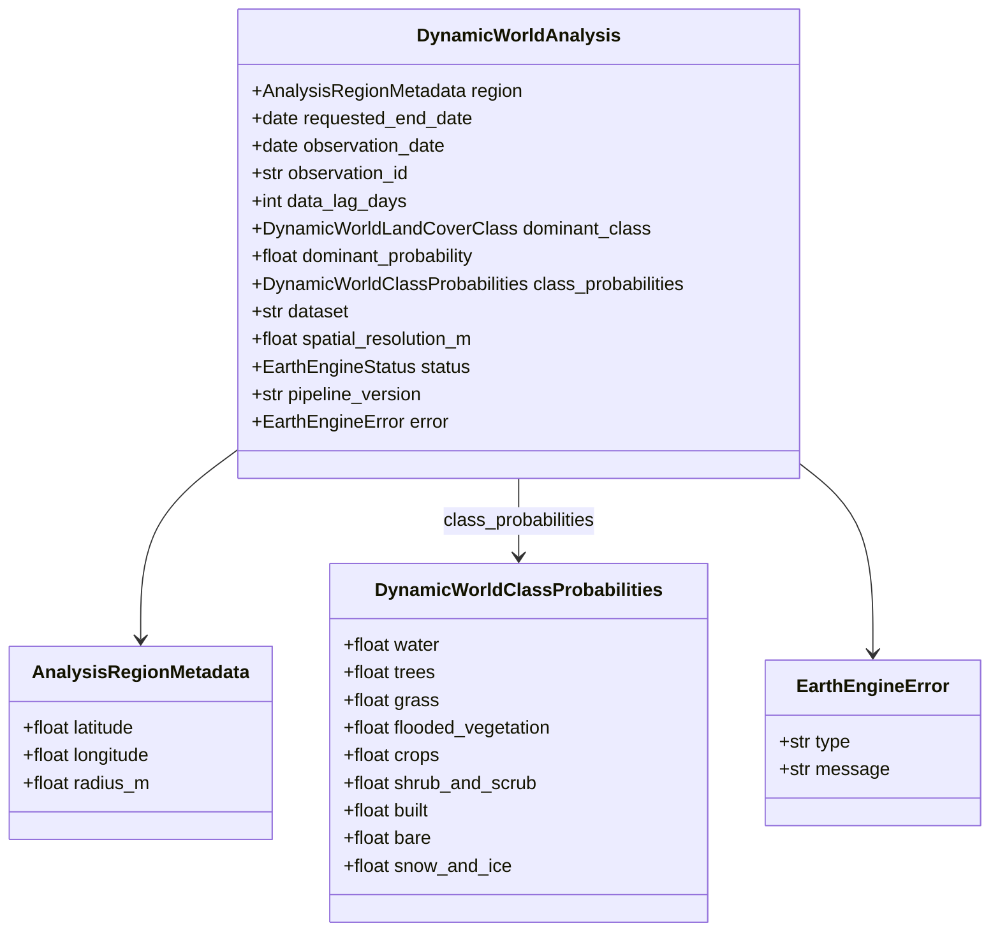

# Phase 3 — Additional Agricultural & Environmental Data Sources

> **Canonical Record of Phase 3 Architecture, Environmental Data Sources, ERA5-Land Reanalysis, CHIRPS Precipitation, and Dynamic World Land Cover.**  
> *Status: 🟢 PHASE 3 COMPLETE & FROZEN (Phase 3A, 3B, 3C Complete & Verified — DEC-018, DEC-019, DEC-020, DEC-021; Phase 3D Deferred)*<br>
> *Base Sealed Checkpoint: `583dbf8 — docs: seal Phase 2 historical satellite intelligence`*<br>
> *Current State: Environmental Foundation Complete & Frozen (5 Complementary Evidence Streams)*<br>
> *Next Phase: Phase 4 (Multi-Source Data Fusion)*

---

## 1. Executive Summary

Phases 1 and 2 established the core satellite foundation of BharatSahayak V2:
- **Phase 1 (`60f8d90`):** Instantaneous Sentinel-2 Level-2A surface reflectance, Cloud Score+ quality masking (`cs_cdf >= 0.60`), NDVI band mathematics, and zonal statistical reduction (`RegionalNdviAnalysis`).
- **Phase 2 (`583dbf8`):** Multi-year historical baseline ($Y-1, Y-2, Y-3$), Day-of-Year seasonal matching ($T_h \pm 15\text{ days}$), Option C annual matched-window regional composite observations, pure-Python statistical baseline derivation (median, mean, population std dev with ddof=0, sufficiency), and empirical spectral departure anomaly quantification (`HistoricalNdviAnalysis`).

While satellite NDVI provides direct radiometric evidence of vegetative vigor, **satellite reflectance alone cannot explain why vegetation is lagging or flourishing**. A negative spectral departure could be caused by delayed monsoon rainfall, high thermal stress, localized soil moisture deficit, or seasonal fallow.

**Phase 3 introduces external agricultural and environmental context layers** to provide physical grounded evidence of the weather, moisture, rainfall, and land-cover regime surrounding the farmer's parcel:

```
┌─────────────────────────────────────────────────────────────────────────────────────────┐
│ 1. SATELLITE REFLECTANCE & HISTORICAL ANOMALY (Phase 1 & 2 — COMPLETE & SEALED)         │
│    - Current regional NDVI + 3-year historical baseline comparison.                     │
│    - Physical evidence: "How is vegetation reflecting compared to previous seasons?"    │
├─────────────────────────────────────────────────────────────────────────────────────────┤
│ 2. ENVIRONMENTAL & METEOROLOGICAL CONTEXT (Phase 3 — COMPLETE & FROZEN)                 │
│    - Phase 3A: ERA5-Land Daily Reanalysis (Temperature, Precipitation, Soil Moisture)   │
│    - Phase 3B: CHIRPS Regional Rainfall Backup Subsystem (Rainfall Distribution)        │
│    - Phase 3C: Dynamic World Real-Time Land Cover Context (9-Class Probability)         │
│    - Physical evidence: "What environmental conditions were observed over recent days?" │
├─────────────────────────────────────────────────────────────────────────────────────────┤
│ 3. MULTI-SOURCE EVIDENCE FUSION (Phase 4 — NEXT PHASE)                                  │
│    - Correlates NDVI anomalies with environmental context (moisture deficit vs drought).│
│    - Synthesizes normalized FarmContext payload for agent consumption.                  │
├─────────────────────────────────────────────────────────────────────────────────────────┤
│ 4. GEMINI AGRICULTURAL REASONING & ADVISORY (Phase 5 — FUTURE)                          │
│    - Gemini 2.5 Flash domain reasoning generating actionable, localized farmer advice.  │
└─────────────────────────────────────────────────────────────────────────────────────────┘
```

> [!IMPORTANT]
> **The Core Conceptual Boundary of Phase 3:**
> - **Phase 3A, 3B, 3C:** *"What physical environmental and rainfall conditions were observed over recent windows?"* (Empirical physical measurements: temperature, cumulative precipitation, topsoil moisture fraction, runoff, land-cover class probabilities).
> - **Phase 4:** *"How does that environmental evidence correlate with the satellite NDVI anomaly?"* (Multi-source data fusion and cross-source rainfall validation).
> - **Phase 5:** *"What does this mean for the farmer and what actions should they take?"* (Gemini 2.5 Flash agricultural reasoning and localized advisory).

---

## 2. Phase 3 Subphase Architecture & Scope

```
Phase 3: Additional Agricultural & Environmental Data Sources
├── 3A: ERA5-Land Daily Reanalysis Environmental Context (🟢 COMPLETE & SEALED — Commit 74fd372)
│    ├── 4 Core Variables (2m Temp, Total Precipitation, 0-7cm Soil Water, Runoff)
│    ├── 3 Analysis Windows (Recent 7-Day, 30-Day, 90-Day Observation Envelopes)
│    ├── Data Lag & Reanalysis Latency Tracking (requested vs latest available date)
│    ├── Coarse-Resolution Regional Context Boundary (~11.1 km Grid)
│    └── Unweighted Zonal Mean Reduction (Option A at 11132m nominal scale)
├── 3B: CHIRPS Regional Rainfall Backup Subsystem (🟢 COMPLETE & VERIFIED — DEC-020)
│    ├── UCSB-CHC/CHIRPS/V3/DAILY_SAT (~5.566 km native pixel scale)
│    ├── Satellite-Partitioned Independent Ingestion (IMERG Late V07 daily partitioning)
│    ├── Native Unit Ingestion (mm/day with 1:1 floating-point preservation, zero rounding)
│    ├── Dedicated Rainfall Domain Contracts (DailyRainfallObservation, RainfallWindowStatistics, CHIRPSRainfallAnalysis)
│    ├── 3 Analysis Windows (Recent 7-Day, 30-Day, 90-Day Rainfall Envelopes)
│    ├── Dynamic Publication Lag Tracking (requested vs latest available date)
│    └── Coarse Regional Context Boundary (Option A unweighted zonal mean at 5566m nominal scale)
├── 3C: Dynamic World Land-Cover Context (🟢 COMPLETE & VERIFIED — DEC-021)
│    ├── GOOGLE/DYNAMICWORLD/V1 (10m Sentinel-2 L1C Derived LULC)
│    ├── 9-Class Continuous Probability Bands (1:1 float preservation)
│    ├── 30-Day Window with Newest Usable Observation Selection (.first())
│    ├── Option A Unweighted Zonal Mean Reduction (scale=10.0m)
│    └── Dominant Class Derivation with Canonical Index Order Tie-Breaking
└── 3D: Additional Environmental Signal (🔴 DEFERRED — Future Candidate: MODIS MOD16A2 ET)
     └── Deferred under principle: "Data sufficiency takes priority over dataset accumulation"
```

---

## 3. Phase 3A: ERA5-Land Daily Reanalysis Design Specification

### 3.1 Problem Statement & Dataset Selection
- **Dataset:** `ECMWF/ERA5_LAND/DAILY_AGGR` (ECMWF ERA5-Land Daily Aggregated in Google Earth Engine).
- **Dataset Nature:** ERA5-Land is a global reanalysis dataset providing a consistent view of land-surface variables over several decades at high temporal resolution (daily aggregates).
- **Spatial Resolution:** $\approx 11.1\text{ km}$ ($0.1^\circ \times 0.1^\circ$ grid cells at the equator).
- **Core Purpose:** Deliver regional environmental context over the farmer's location over recent 7, 30, and 90-day windows.

### 3.2 Selected Variables for MVP

Phase 3A strictly standardizes on **four physical variables** in the MVP:

| Source Variable Name | Source Band in GEE | Source Physical Unit | Normalized Domain Unit | Conversion Formula | Physical Validity Range |
|---|---|---|---|---|---|
| **Air Temperature (2m)** | `temperature_2m` | Kelvin ($K$) | Degrees Celsius ($^\circ\text{C}$) | $T_{^\circ\text{C}} = T_K - 273.15$ | $[-50.0, 60.0]\ ^\circ\text{C}$ |
| **Total Precipitation** | `total_precipitation_sum` | Meters ($m$) | Millimeters ($\text{mm}$) | $P_{\text{mm}} = P_m \times 1000.0$ | $P_{\text{mm}} \ge 0.0$ (Negative rejected) |
| **Volumetric Soil Water (Layer 1)** | `volumetric_soil_water_layer_1` | Dimensionless fraction ($\text{m}^3/\text{m}^3$) | Dimensionless volume fraction ($\text{m}^3/\text{m}^3$) | Direct ($1:1$) | $[0.0, 1.0]\ \text{m}^3/\text{m}^3$ (Topsoil 0–7 cm) |
| **Surface & Subsurface Runoff** | `runoff_sum` | Meters ($m$) | Millimeters ($\text{mm}$) | $R_{\text{mm}} = R_m \times 1000.0$ | $R_{\text{mm}} \ge 0.0$ (Negative rejected) |

> [!NOTE]
> Additional atmospheric variables (e.g., dewpoint, solar radiation, wind speed, lower soil layers 2–4) are deferred to the Future Backlog to maintain a lean compute graph and focused domain payload for MVP fusion.

### 3.3 Temporal Design & Analysis Windows

Phase 3A evaluates three retrospective environmental observation windows ending at the latest available observation:

```text
               Requested Reference Date (T_0)
                            │
   ◄────────────────────────┤  (ERA5-Land Publication Lag: e.g. 5 days)
   │
Latest Available Date (T_latest)
   │
   ├── [Recent 7-Day Window]  ──► [T_latest - 6 days, T_latest]  (Immediate short-term moisture & temperature)
   │
   ├── [Recent 30-Day Window] ──► [T_latest - 29 days, T_latest] (Monthly cumulative context, aligns with S2 lookback)
   │
   └── [Recent 90-Day Window] ──► [T_latest - 89 days, T_latest] (Seasonal cumulative envelope, full crop growth cycle)
```

1. **Recent 7 Days (`recent_7_days`):** Captures short-term acute weather events (recent rain spells, heat waves, or cold snaps) directly affecting current crop vigor.
2. **Recent 30 Days (`recent_30_days`):** Matches the default 30-day lookback window of Phase 1 Sentinel-2 observations, providing direct monthly meteorological context.
3. **Recent 90 Days (`recent_90_days`):** Covers the broader seasonal agronomic envelope (e.g. cumulative monsoon rainfall or winter thermal regime across the vegetative cycle).

### 3.4 Data Freshness & Reanalysis Latency Management
- **Reanalysis Nature:** ERA5-Land is a reanalysis model driven by historical meteorological observations and data assimilation; it is **not a real-time sensor telemetry feed or a weather forecast**.
- **Publication Lag:** ECMWF ERA5-Land Daily Aggregated data in Earth Engine typically exhibits an operational lag of **3 to 7 days** behind real-time UTC.
- **Explicit Provenance Contract:**
  - `requested_end_date`: The reference date requested by the caller (UTC).
  - `latest_available_date`: The newest calendar date with a valid ERA5-Land observation.
  - `data_lag_days`: Explicit integer latency ($\text{requested\_end\_date} - \text{latest\_available\_date}$ in days).
- **Anti-Misrepresentation Principle:** The system **must never** label ERA5-Land reanalysis observations as "today's live weather" or "weather forecasts".

### 3.5 Spatial Design & Resolution Boundary
- **Resolution:** $\approx 11.1\text{ km}$ ($0.1^\circ$).
- **Spatial Envelope:** Extracted via point sampling or zonal mean over the farmer's `AnalysisRegion` (`ee.Geometry`).
- **Strict Spatial Non-Claim:**
  > [!WARNING]
  > ERA5-Land observations are strictly **coarse-resolution regional environmental context**.  
  > The system must **NEVER** claim or imply that ERA5-Land outputs represent a 10m or 100m parcel-level microclimate measurement. No synthetic interpolation or ungrounded downscaling is performed in Phase 3A.

### 3.6 Data Quality, Validation & Reliability Invariants

Phase 3A adheres strictly to the repository reliability principles established in `DEC-010`, `DEC-011`, and `DEC-017`:

1. **Missing Data is NOT Zero:**
   - $\text{Missing Precipitation} \ne 0.0\text{ mm}$ (Falsely substituting 0.0 would fabricate an artificial severe drought).
   - $\text{Missing Runoff} \ne 0.0\text{ mm}$.
   - Missing temperature and soil moisture must remain explicitly `None` / unrecorded.
2. **Rejection of Negative Accumulated Packing Artifacts:**
   - Earth Engine daily aggregation products can contain small negative values for accumulated precipitation or runoff (e.g. $-10^{-7}\text{ m}$) due to GEE data-packing, coordinate re-projection, or underlying netCDF precision artifacts.
   - **Validation Rule:** Any observation where $\text{precipitation} < 0.0$ or $\text{runoff} < 0.0$ is detected as **physically invalid** and excluded from cumulative totals.
   - **Anti-Clamping Rule:** The pipeline must **NEVER** silently clamp negative values to zero ($\text{clamp}(x, 0) \to 0.0$ is prohibited).
3. **Completeness Thresholding:**
   - Each window tracks `days_requested` vs `days_available`.
   - `is_complete: bool = (days_available == days_requested)`.
4. **Strict Non-Agronomic Interpretation Boundary:**
   - Phase 3A provides pure physical measurements.
   - Phase 3A **DOES NOT** classify:
     - ❌ Drought severity (e.g., "Severe drought", "SPI < -1.5")
     - ❌ Heat stress indices (e.g., "Heatwave alert")
     - ❌ Flood risk
     - ❌ Crop water requirement deficits
     - ❌ Irrigation advisories
   - All diagnostic, synthetic, and agronomic interpretations are strictly deferred to Phase 4 (Fusion) and Phase 5 (Gemini Agricultural Reasoning).

---

## 4. Proposed Phase 3A Domain Contracts (Conceptual)



---

## 5. Architectural Boundary & Separation of Concerns

Phase 3A adopts the same proven three-tier decoupling established in Phase 2 (`DEC-017`):

```
┌────────────────────────────────────────────────────────────────────────────────────────┐
│ PHASE 3A ARCHITECTURAL BOUNDARIES                                                      │
├────────────────────────────────────────────────────────────────────────────────────────┤
│ 1. Remote Earth Engine Adapter (app/satellite/era5.py or app/environment/era5.py)      │
│    - Queries ECMWF/ERA5_LAND/DAILY_AGGR collection over spatial point / region buffer.  │
│    - Evaluates 90-day time series reduction.                                           │
│    - Reuses create_analysis_region(...) and AnalysisRegionMetadata.                    │
│    - Returns raw multi-day timeseries dictionary wrapped in EarthEngineResult.         │
├────────────────────────────────────────────────────────────────────────────────────────┤
│ 2. Pure Statistical & Window Aggregation Engine (app/environment/aggregation.py / pure) │
│    - Pure math rolling window aggregator (7-day, 30-day, 90-day).                      │
│    - Computes temperature min/max/mean, precipitation sum, soil moisture mean, runoff. │
│    - ZERO Earth Engine imports, ZERO getInfo() calls, ZERO network I/O.                │
├────────────────────────────────────────────────────────────────────────────────────────┤
│ 3. Root Domain Composition Layer (app/environment/pipeline.py)                         │
│    - Ingestion normalization (K -> °C, m -> mm, soil water [0, 1]).                    │
│    - Rejects negative artifacts (< 0.0) without clamping; preserves Missing != 0.0.    │
│    - Calculates dynamic data_lag_days and window completeness flags.                   │
│    - Assembles ERA5LandAnalysis contract (v3.0.0) with status resolution.              │
└────────────────────────────────────────────────────────────────────────────────────────┘
```

---

## 6. Phase 3B: CHIRPS Regional Rainfall Backup Subsystem (Design Specification)

### 6.1 Problem Statement & Dataset Selection

Agricultural advisory systems require specialized precipitation monitoring to validate rainfall events, dry spells, and seasonal rainfall distribution. While ERA5-Land provides reanalysis-based precipitation, having an **independent, satellite-derived rainfall evidence path** is critical for:
1. **Independent Rainfall Evidence:** Providing specialized precipitation data alongside atmospheric reanalysis.
2. **Backup Rainfall Source:** Maintaining continuous rainfall context even if atmospheric reanalysis data lag is extended.
3. **Cross-Source Comparison (Phase 4):** Enabling future multi-source validation comparing reanalysis rainfall with satellite-partitioned precipitation.

#### Dataset Selection: `UCSB-CHC/CHIRPS/V3/DAILY_SAT`

| Property | Specification |
|---|---|
| **Earth Engine Asset** | `UCSB-CHC/CHIRPS/V3/DAILY_SAT` |
| **Generation** | CHIRPS v3 (Current Generation — DO NOT use legacy CHIRPS v2) |
| **Target Band** | `precipitation` |
| **Native Physical Unit** | $\text{mm/day}$ |
| **Native Pixel Scale** | $\approx 5566\text{ m}$ ($0.05^\circ \times 0.05^\circ$ at the equator) |
| **Coverage Archive** | 1981 to near-present |
| **Daily Partitioning Model** | IMERG Late V07 Satellite-only precipitation |

#### Rationale for `DAILY_SAT` vs `DAILY_RNL`

CHIRPS v3 provides two daily disaggregation products:
- **`DAILY_RNL` (Reanalysis Partitioned):** Uses **ERA5 daily precipitation** to partition pentadal CHIRPS totals into daily amounts.
- **`DAILY_SAT` (Satellite Partitioned — SELECTED):** Uses **IMERG Late V07** satellite precipitation to partition pentadal CHIRPS totals into daily amounts.

> [!IMPORTANT]
> **Why `DAILY_SAT` was chosen for MVP:**  
> Using `DAILY_RNL` would introduce a hidden mathematical dependency on ERA5 precipitation into the CHIRPS subsystem. To ensure an independent rainfall evidence source relative to the ERA5-Land subsystem for cross-source validation in Phase 4, `DAILY_SAT` is selected. This provides an independent rainfall evidence source relative to the ERA5-Land subsystem without claiming that `DAILY_SAT` is universally more accurate across all meteorological conditions.

### 6.2 Three-Tier Architectural Decoupling

Phase 3B adheres to the repository's strict three-tier architecture:

```
┌────────────────────────────────────────────────────────────────────────────────────────┐
│ PHASE 3B ARCHITECTURAL TIERS                                                           │
├────────────────────────────────────────────────────────────────────────────────────────┤
│ Tier 1: Remote Earth Engine Adapter (app/environment/chirps.py)                        │
│   - Sole module importing `ee` and evaluating `.getInfo()`.                           │
│   - Queries `UCSB-CHC/CHIRPS/V3/DAILY_SAT` over `create_analysis_region(...)`.         │
│   - Applies temporal filter [requested_end_date - 89 days, requested_end_date + 1 day).│
│   - Executes Option A zonal reduction (`ee.Reducer.mean()`) at scale 5566m.           │
│   - Returns raw daily observation list with structured exception handling.            │
├────────────────────────────────────────────────────────────────────────────────────────┤
│ Tier 2: Pure Normalization & Pure Window Aggregation (app/environment/chirps_*.py)     │
│   - Ingestion: `normalize_raw_chirps_record(raw_record: dict)`                        │
│     - Preserves raw floating-point values 1:1 without unit scaling (mm/day).           │
│     - Rejects negative artifacts (< 0.0 mm) to None.                                   │
│     - Preserves missing data as None (Missing != 0.0 mm).                              │
│   - Aggregation: `compute_rainfall_window_suite(observations, requested_end_date)`     │
│     - Pure Python calculation of 7-day, 30-day, 90-day rainfall window statistics.     │
│     - Rejects duplicate observation dates with ValueError.                             │
│     - Order-invariant, supports partial/empty windows with explicit semantics.         │
│   - ZERO `ee` imports, ZERO network I/O, 100% offline testable.                       │
├────────────────────────────────────────────────────────────────────────────────────────┤
│ Tier 3: Root Domain Composition (app/environment/chirps_pipeline.py)                   │
│   - `analyze_chirps_rainfall(latitude, longitude, requested_end_date, radius_m=100.0)`│
│   - Coordinates Tier 1 retrieval, Tier 2 normalization, dynamic data lag derivation,   │
│     and Tier 2 rainfall window aggregation.                                            │
│   - Assembles and returns authoritative `CHIRPSRainfallAnalysis` (v3.1.0).             │
└────────────────────────────────────────────────────────────────────────────────────────┘
```

### 6.3 Dedicated Domain Contracts

Rainfall is a specialized single-variable hydrological time series. Rather than overloading the 4-variable ERA5 `DailyEnvironmentalObservation` (which would leave temperature, soil water, and runoff as empty/None fields), Phase 3B defines dedicated domain models in `app/environment/chirps_types.py`:



### 6.4 Spatial Extraction Semantics (Option A)

- **Geometry Contract:** Reuses existing `create_analysis_region(latitude, longitude, radius_m=100.0) -> ee.Geometry`.
- **Extraction Mechanism:** Option A — Unweighted zonal spatial mean (`ee.Reducer.mean()`) at native nominal scale $5566\text{ m}$.
- **Technical Reduction Semantics:**
  - Evaluates the zonal spatial mean of intersecting CHIRPS grid cells at the native dataset scale ($5566\text{ m}$).
  - The resulting reduction value serves strictly as **coarse regional rainfall context** ($\approx 5.566\text{ km}$).
  - The 100m `AnalysisRegion` must **NEVER** be described, labelled, or presented as a 100m field-scale rainfall measurement.
  - Prohibits synthetic downscaling, continuous spatial interpolation, inverse-distance weighting, or sub-pixel weighting claims.
- **Scientific Boundary:**
  > [!WARNING]
  > CHIRPS provides **coarse regional rainfall context** ($\approx 5.566\text{ km}$).  
  > The 100m `AnalysisRegion` must **NEVER** be described, labelled, or presented as a 100m field-scale rainfall measurement.

### 6.5 Temporal Windowing & Latency Tracking

- **Lookback Envelope:** Standard 90-day retrospective lookback $[E-89, E]$ anchored to `requested_end_date` (providing 90-day cumulative rainfall / longer-term recent rainfall context).
- **Earth Engine Query Boundary:** Half-open interval `[start_date, requested_end_date + 1 day)` ensuring inclusive calendar filtering.
- **Dynamic Publication Data Lag:**
  - `latest_available_date = max(obs.observation_date for obs in daily_observations if obs.precipitation_mm is not None)`
  - `data_lag_days = (requested_end_date - latest_available_date).days`
  - No static publication lag constants are hardcoded.
- **No Date Fabrication:** Missing calendar dates in the archive are never fabricated.

### 6.6 Zero-Conversion Ingestion & Missing Data Semantics

1. **Zero-Conversion Preservation:**
   - Raw CHIRPS band `precipitation` is natively measured in $\text{mm/day}$.
   - No multiplication by 1000, no division, no unit scaling.
   - Preserves exact floating-point value: no rounding, no clamping.
2. **Missing != Zero Invariant:**
   - If precipitation is unavailable: `precipitation_mm = None`.
   - If precipitation is explicitly 0.0 mm: `precipitation_mm = 0.0`.
   - Missing values are never converted to 0.0 mm (which would fabricate false dry spells).
3. **Rejection of Negative Packing Artifacts:**
   - Any raw observation with $\text{precipitation} < 0.0\text{ mm}$ is invalid and set to `None`.
   - Prohibits silent clamping ($\text{clamp}(x, 0) \to 0.0$ is prohibited).

### 6.7 Pure-Python Multi-Window Aggregation Engine

Evaluates three standard temporal envelopes:
1. **Recent 7 Days (`recent_7_days`):** $[E-6, E]$, $\text{days\_requested}=7$ (immediate acute rain events).
2. **Recent 30 Days (`recent_30_days`):** $[E-29, E]$, $\text{days\_requested}=30$ (monthly cumulative rainfall, aligns with S2 lookback).
3. **Recent 90 Days (`recent_90_days`):** $[E-89, E]$, $\text{days\_requested}=90$ (90-day cumulative rainfall / longer-term recent rainfall context).

#### Window Metrics Suite:
- `window_name`: `"recent_7_days"` | `"recent_30_days"` | `"recent_90_days"`
- `window_start`: Date of window start
- `window_end`: Date of window end
- `days_requested`: Integer span ($7$, $30$, $90$)
- `days_available`: Count of distinct returned observation dates falling within $[ \text{window\_start}, \text{window\_end} ]$
- `is_complete`: `bool = (days_available == days_requested)`
- `total_precipitation_mm`: $\sum P_i$ over available non-null observations ($\ge 0.0$)
- `mean_daily_precipitation_mm`: $\frac{1}{N} \sum P_i$ over available non-null observations ($\ge 0.0$)
- `max_daily_precipitation_mm`: $\max(P_i)$ over available non-null observations ($\ge 0.0$)

#### Aggregation & Partial-Window Invariants:
- **Partial-Window Semantics (`is_complete=False`):**
  - When an observation window has missing days (`days_available < days_requested`), metrics are calculated strictly over available non-null observations.
  - `total_precipitation_mm` represents the observed precipitation total over available non-null observations, NOT a complete-window rainfall total.
  - `mean_daily_precipitation_mm` represents the mean over available non-null observations, NOT a mean over missing days treated as zero.
  - `max_daily_precipitation_mm` represents the maximum daily value over available non-null observations.
  - Prohibits imputation, continuous interpolation, or zero-filling for missing dates.
- **Duplicate Date Rejection:** Sequences with duplicate `observation_date` entries raise `ValueError`.
- **Order Invariance:** Input sequence sorting (chronological, reverse, shuffled) produces identical window statistics.
- **Empty Window Handling:** Windows with 0 available observations return `days_available=0`, `is_complete=False`, and `None` for all metric fields.
- **Strict Non-Agronomic Scope:** Prohibits drought indices (SPI), anomaly scores, flood risk alerts, rainfall adequacy scores, and crop water requirement thresholds.

### 6.8 Status Semantics

Reuses foundational `EarthEngineStatus`:
- `status="success"`: Valid normalized observations exist and window statistics are computed.
- `status="no_data"`: Earth Engine query succeeds with 0 observations in the requested window (`daily_observations=[]`, window statistics `None`, `latest_available_date=None`, `data_lag_days=None`).
- `status="error"`: Earth Engine compute, authorization, or network failure captured into structured `EarthEngineError`.

---

## 7. Architectural Boundary & Subsystem Independence

```
┌────────────────────────────────────────────────────────────────────────────────────────┐
│ SUBSYSTEM INDEPENDENCE INVARIANT                                                       │
├────────────────────────────────────────────────────────────────────────────────────────┤
│ - Phase 3A (ERA5-Land) and Phase 3B (CHIRPS) are completely independent subsystems.    │
│ - Zero code coupling between era5.py and chirps.py.                                    │
│ - Zero modification to existing sealed Phase 3A codebase.                              │
│ - Cross-source correlation and multi-sensor validation is strictly deferred to Phase 4.│
└────────────────────────────────────────────────────────────────────────────────────────┘
```

---

## 8. Fixture & Test Architecture

### 8.1 Deterministic Test Fixtures (`tests/fixtures/chirps/`)
Store deterministic offline JSON fixtures:
1. `punjab_monsoon_wet_90d.json`: High precipitation events with realistic dry intervals during Kharif monsoon.
2. `punjab_winter_dry_90d.json`: Predominantly zero-rainfall observations during Rabi dry winter.
3. `lagged_partial_90d.json`: Incomplete recent window simulating publication latency.
4. `negative_artifact_edge_case.json`: Contains negative packing artifacts ($< 0.0$) and missing null values.
5. `no_data_empty.json`: Empty observation list for zero-data query verification.

### 8.2 Pure Unit Test Suite (`tests/unit/`)
- Test raw record parsing and zero-conversion $1:1$ preservation.
- Test rejection of negative artifacts to `None` without clamping.
- Test missing != zero distinction.
- Test duplicate date rejection with `ValueError`.
- Test order invariance.
- Test 7-day, 30-day, and 90-day window metrics (total, mean, max).
- Test dynamic data lag calculation.
- Test partial and empty window edge cases with verified `is_complete=False` semantics.
- Test Pydantic contract validation and serialization.

### 8.3 Live Earth Engine Integration Tests (`tests/integration/`)
Dedicated integration test suite in `tests/integration/test_chirps_integration.py` verifying:
- Live accessibility of `UCSB-CHC/CHIRPS/V3/DAILY_SAT` collection.
- Availability of `precipitation` band.
- Spatial reduction over `create_analysis_region` at Ludhiana fixture.
- Non-negative evaluated rainfall measurements ($\text{mm/day}$).
- Dynamic publication lag calculation.
- Full end-to-end `CHIRPSRainfallAnalysis` domain construction.

---

## 9. Implementation Progress & Roadmap

- **Phase 3A — ERA5-Land Daily Reanalysis Context (🟢 COMPLETE & SEALED — Commit `74fd372`):**
  - Step 1: Strongly typed domain models (`app/environment/types.py`) and offline fixtures.
  - Step 2: Pure mathematical window aggregation engine (`app/environment/aggregation.py`).
  - Step 3: Earth Engine collection adapter (`app/environment/era5.py`), normalization & pipeline (`app/environment/pipeline.py`), Option A spatial reduction, and live integration tests.
  - Verification: 80 environmental subsystem tests passed, 789 full unit tests passed, 3 live EE integration tests passed.
- **Phase 3B — CHIRPS Regional Rainfall Backup Subsystem (🟢 COMPLETE & VERIFIED — `DEC-020` — Commit `f70dada`):**
  - Architecture and implementation complete: `UCSB-CHC/CHIRPS/V3/DAILY_SAT` (~5.566 km resolution).
  - Ingestion: Zero-conversion native $\text{mm/day}$ floating-point preservation without artificial rounding.
  - Domain contracts: Dedicated `DailyRainfallObservation`, `RainfallWindowStatistics`, `CHIRPSRainfallAnalysis` (`app/environment/chirps_types.py`).
  - Earth Engine Adapter: Isolated in `app/environment/chirps.py` (`fetch_raw_chirps_rainfall_timeseries`) with Option A unweighted zonal mean reduction at 5566m scale.
  - Pure Aggregation & Normalization: `app/environment/chirps_aggregation.py` and `app/environment/chirps_pipeline.py`.
  - Verification: 49/49 CHIRPS unit tests passed, 838/838 full unit tests passed, 3 live EE integration tests passed.
- **Phase 3C — Dynamic World Land-Cover Context (🟢 COMPLETE & VERIFIED — `DEC-021`):**
  - Architecture and implementation complete: `GOOGLE/DYNAMICWORLD/V1` (10m native spatial resolution, generated from Sentinel-2 Level-1C imagery).
  - Ingestion: Pure 1:1 probability preservation across all 9 classes (`water`, `trees`, `grass`, `flooded_vegetation`, `crops`, `shrub_and_scrub`, `built`, `bare`, `snow_and_ice`) without artificial rounding, scaling, or thresholds.
  - Spatial Extraction: Option A unweighted regional zonal mean (`ee.Reducer.mean()`) over 100m circular `AnalysisRegion` at native 10m scale.
  - Temporal Strategy: Single locked path over 30-day window $[E-29, E]$; selects newest usable observation (`collection.sort("system:time_start", False).first()`); zero temporal averaging or compositing.
  - Dominant Class Derivation: Class with highest regional mean probability, with deterministic tie-breaking by canonical GEE index order.
  - Verification: 39/39 Dynamic World unit tests passed, 877/877 full repository unit tests passed, 3 live EE integration tests passed.
  - Next Phase: Phase 4 (Multi-Source Data Fusion) — correlating environmental evidence with NDVI anomalies and synthesizing normalized FarmContext.

---

## 10. Phase 3C: Dynamic World Land-Cover Context Architecture (DEC-021)

> [!NOTE]
> **Status: 🟢 IMPLEMENTED & VERIFIED (DEC-021)**  
> Complete implementation in `app/environment/dynamic_world_types.py`, `app/environment/dynamic_world.py`, and `app/environment/dynamic_world_pipeline.py`. Verified with 39 unit tests and 3 live Earth Engine integration tests.

### 10.1 Goal & Scientific Boundary

Phase 3C supplies structured **land-cover context** for the existing farmer `AnalysisRegion`.

```
Farmer Location (lat, lon)
        ↓
Existing 100m AnalysisRegion
        ↓
Dynamic World V1 (GOOGLE/DYNAMICWORLD/V1)
        ↓
30-Day Calendar Lookback Window: [requested_end_date - 29 days, requested_end_date + 1 day)
        ↓
Newest Usable Dynamic World Observation (collection.first())
        ↓
Regional Zonal Mean of 9 Probability Bands (ee.Reducer.mean(), scale=10.0m)
        ↓
9-Class Continuous Probability Distribution
        ↓
Highest Regional Probability + Canonical Deterministic Tie-Break
        ↓
Dominant Land-Cover Class
        ↓
DynamicWorldAnalysis Envelope
```

#### Strict Non-Agronomic Scope:
Phase 3C provides **land-cover context only**. It strictly prohibits:
- Inferring specific crop species or varieties (e.g., `crops` $\ne$ `wheat`, `rice`, or `maize`).
- Inferring crop health, disease, stress, or vigor (deferred to Phase 4/5 with NDVI).
- Estimating phenological stages, sowing dates, or crop calendars.
- Estimating soil moisture, soil fertility, or irrigation status.
- Generating agronomic advice, fertilizer schedules, or farmer recommendations.

### 10.2 Dataset & Source Imagery Specification

- **Earth Engine Asset ID:** `GOOGLE/DYNAMICWORLD/V1`
- **Native Spatial Resolution:** $10.0\text{ meters}$ (inheriting Sentinel-2 MSI pixel grid).
- **Source Imagery:** Dynamic World V1 predictions are generated from **Sentinel-2 Level-1C (L1C)** imagery. (Sentinel-2 L2A is not part of the source imagery for this architecture).
- **Temporal Cadence:** Near-Real-Time (NRT) matching Sentinel-2 overpasses (~2-5 days revisit).

### 10.3 Class Definitions & 9 Probability Bands

Dynamic World produces 9 continuous class probability bands in $[0.0, 1.0]$:

| Band Name | GEE Index | Physical Land-Cover Representation |
| :--- | :---: | :--- |
| `water` | 0 | Open surface water, rivers, canals, lakes, reservoirs |
| `trees` | 1 | Tree canopy, agroforestry parcels, orchards, woodland patches |
| `grass` | 2 | Natural grassland, pastures, rangeland, uncultivated turf |
| `flooded_vegetation` | 3 | Inundated vegetation, marshland, flooded paddy, wetlands |
| `crops` | 4 | Cultivated agricultural cropland, standing crops, seeded plots |
| `shrub_and_scrub` | 5 | Dense or open shrubs, arid brush, woody scrub |
| `built` | 6 | Human-made structures, roads, farm buildings, paved surfaces |
| `bare` | 7 | Exposed soil, sand, dry riverbeds, bare earth |
| `snow_and_ice` | 8 | Snow, ice cover, glacial surfaces |

### 10.4 Spatial Extraction Semantics (Option A)

- **Geometry Contract:** Reuses the foundational `AnalysisRegion` ($100\text{ m}$ radius circular buffer around farmer coordinates, covering $\approx 3.14\text{ hectares}$).
- **Contributing Pixels Language:** The `AnalysisRegion` covers approximately $3.14\text{ hectares}$. The number of contributing $10\text{ m}$ Dynamic World pixels depends on the raster grid and geometry alignment.
- **Extraction Mechanism:** Unweighted zonal spatial mean (`ee.Reducer.mean()`) evaluated at native dataset scale (`scale=10.0`) across the circular buffer geometry.
- **Scientific Guardrails:**
  - Preserves native $10\text{ m}$ regional context.
  - Prohibits synthetic downscaling, continuous spatial interpolation, or unsupported sub-pixel weighting.
  - Output is strictly interpreted as **regional land-cover context** around the farmer's location, not a cadastral field boundary classification.

### 10.5 Temporal Strategy & Newest Usable Observation Selection Path

- **Lookback Window:** $30\text{ calendar days}$ $[E-29, E]$.
- **EE Half-Open Interval:** $[ \text{requested\_end\_date} - 29\text{ days}, \text{requested\_end\_date} + 1\text{ day} )$.
- **Single Locked Selection Flow:**
  ```
  30-day Dynamic World collection
          ↓
  Determine which observations contain usable Dynamic World probability data over the AnalysisRegion
          ↓
  Exclude observations without usable regional probability data (EE server-side filter)
          ↓
  Sort usable observations by system:time_start descending
          ↓
  Select the newest usable observation (.first())
          ↓
  Extract the 9-band regional mean reduction for that single observation
  ```
- **Exact Earth Engine Usability Determination:**
  - The Tier 1 Earth Engine adapter queries `GOOGLE/DYNAMICWORLD/V1` filtered by `geometry` and `[E-29, E+1)`, sorted by `system:time_start` descending.
  - Maps `reduceRegion(reducer=ee.Reducer.mean(), geometry=geometry, scale=10.0)` across the collection, generating a FeatureCollection of candidate regional observations enriched with `observation_date` and `system:index`.
  - Determines usability server-side: filters for features containing non-null probability data over the `AnalysisRegion` (`ee.Filter.notNull(["crops"])`).
  - Selects `.first()` from the filtered usable collection.
  - Strictly NO temporal averaging, median, mode, or temporal compositing across multiple observations.
- **Definition of Usable Observation:**
  - A Dynamic World image exists within the requested 30-day temporal window $[E-29, E]$.
  - The image contains usable Dynamic World probability data over the existing `AnalysisRegion`.
  - Does NOT invent cloud thresholds, does NOT invoke Cloud Score+, and does NOT duplicate Phase 1 optical quality filtering.

### 10.6 Probability Semantics & Dominant Class Derivation

1. **Zero-Rounding Preservation:**
   - Raw regional mean probabilities from Earth Engine are preserved $1:1$ as floating-point numbers without scaling, clipping, or artificial rounding.
   - All 9 probabilities reside in $[0.0, 1.0]$.
2. **Dominant Class Rule:**
   - $\text{dominant\_class} = \arg\max_{c \in \text{Classes}} P(c)$.
   - $\text{dominant\_probability} = \max_{c \in \text{Classes}} P(c)$.
3. **Deterministic Tie-Breaking:**
   - In the event of an exact tie, ties are resolved deterministically using canonical GEE index order: `water` (0) > `trees` (1) > `grass` (2) > `flooded_vegetation` (3) > `crops` (4) > `shrub_and_scrub` (5) > `built` (6) > `bare` (7) > `snow_and_ice` (8).

### 10.7 Status & Metadata Semantics

- **`status="success"`:** A valid, usable Dynamic World observation exists within the 30-day window. All request/context metadata, observation metadata (`observation_date`, `observation_id`), derived latency (`data_lag_days`), and probability metrics (`class_probabilities`, `dominant_class`, `dominant_probability`) are fully populated. `error=None`.
- **`status="no_data"`:** Earth Engine query succeeds, but 0 usable observations exist within the 30-day window over the `AnalysisRegion`.
  - **Preserved Context Metadata:** `region`, `requested_end_date`, `dataset="GOOGLE/DYNAMICWORLD/V1"`, `spatial_resolution_m=10.0`, `status="no_data"`, `pipeline_version="3.1.0"`, `error=None`.
  - **Observation-Derived Fields set to `None`:** `observation_date=None`, `observation_id=None`, `data_lag_days=None`, `class_probabilities=None`, `dominant_class=None`, `dominant_probability=None`.
- **`status="error"`:** Earth Engine compute, authorization, parameter, or network exception occurs.
  - **Preserved Context Metadata:** `region`, `requested_end_date`, `dataset`, `spatial_resolution_m`, `status="error"`, `pipeline_version`.
  - **Structured Error:** `error=EarthEngineError(...)`. Observation fields evaluate to `None`.

### 10.8 Domain Contracts (`app/environment/dynamic_world_types.py`)



- **`observation_id` Retained:** Preserved directly from `system:index` of the selected Earth Engine Dynamic World image for precise satellite provenance.

### 10.9 Three-Tier Architecture & Isolation

```
Tier 1: GEE Data Adapter (app/environment/dynamic_world.py)
   ├── Only file importing ee and calling .getInfo()
   ├── Queries ImageCollection('GOOGLE/DYNAMICWORLD/V1')
   ├── Filters date [requested_end_date - 29, requested_end_date + 1)
   ├── Reduces collection over geometry and filters server-side for non-null probability data
   ├── Sorts by system:time_start descending and selects newest usable observation (.first())
   └── Returns standard EarthEngineResult

Tier 2: Pure Normalization & Dominant Derivation (app/environment/dynamic_world_pipeline.py)
   ├── normalize_raw_dynamic_world_record(): raw dict -> (date, id, DynamicWorldClassProbabilities)
   ├── derive_dominant_land_cover(): DynamicWorldClassProbabilities -> (class, prob)
   └── Strictly zero ee imports, zero network calls

Tier 3: Root Orchestration Pipeline (app/environment/dynamic_world_pipeline.py)
   ├── analyze_dynamic_world_land_cover(): Coordinates Tier 1 and Tier 2
   ├── Computes dynamic publication data lag: (requested_end_date - observation_date).days
   ├── Preserves context metadata on no_data and error states
   └── Constructs immutable DynamicWorldAnalysis domain envelope
```

---

## 11. Phase 3 Environmental Foundation Freeze & Phase 3D Scope Deferral

### 11.1 Architectural Principle: Data Sufficiency Over Dataset Accumulation

> [!IMPORTANT]
> **Core Principle:** *"Data sufficiency takes priority over dataset accumulation."*  
> The environmental data foundation is now complete and frozen for the first BharatSahayak prototype. Rather than accumulating additional datasets, the project prioritizes synthesizing and interpreting existing physical evidence for agricultural intelligence.

### 11.2 The Five Complementary Environmental Evidence Streams

The completed foundation delivers five structurally independent and complementary observational signals:

1. **Current Vegetation Vigor (Sentinel-2 NDVI — Phase 1):**
   - Direct radiometric greenness and canopy density at $10\text{ m}$ spatial resolution.
2. **Historical Seasonal Anomaly (Multi-Year NDVI Baseline — Phase 2):**
   - Deviation from 3-year rolling historical baseline ($Y-1, Y-2, Y-3$, DOY $\pm 15\text{ days}$) to identify lags or flourishing crops.
3. **Thermal & Subsurface Reanalysis (ERA5-Land — Phase 3A):**
   - 2m air temperature, topsoil volumetric water fraction ($0\text{–}7\text{ cm}$), and surface runoff across 7d/30d/90d envelopes.
4. **Precipitation Distribution (CHIRPS — Phase 3B):**
   - Satellite-partitioned daily rainfall distribution ($5.566\text{ km}$ resolution) across 7d/30d/90d envelopes.
5. **Land-Cover Context (Dynamic World — Phase 3C):**
   - 9-class continuous probability distribution ($10\text{ m}$ resolution) identifying agricultural vs non-crop land-cover regimes.

### 11.3 Phase 3D Scope Deferral

- **Status:** 🔴 **DEFERRED / FUTURE BACKLOG**
- **Candidate Evaluated:** MODIS MOD16A2 Global Evapotranspiration / Land-Atmosphere Water Flux ($500\text{ m}$, 8-day composites).
- **Scope Decision:**
  - The current 5-stream evidence base is sufficient for smallholder advisory in the initial prototype.
  - Adding further remote sensing datasets at this stage increases Earth Engine compute graph complexity, test surface area, remote dependency failure modes, and maintenance overhead without a demonstrated agricultural reasoning gap.
  - Candidate MODIS MOD16A2 will be re-evaluated post-MVP only if multi-source data fusion (Phase 4) or Gemini domain reasoning (Phase 5) demonstrates a concrete explanatory deficiency regarding crop moisture stress.
- **Next Phase:** **Phase 4 — Multi-Source Data Fusion** (correlating environmental metrics with vegetation anomalies to synthesize normalized `FarmContext` payloads).


