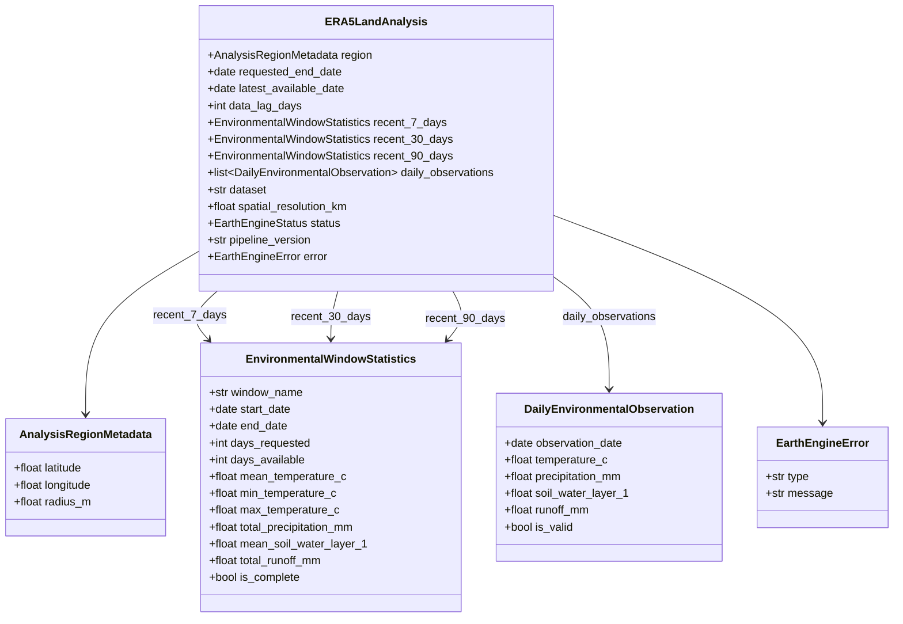

# Phase 3 — Additional Agricultural & Environmental Data Sources

> **Canonical Record of Phase 3 Architecture, Environmental Data Sources, ERA5-Land Reanalysis, CHIRPS Precipitation, and Dynamic World Land Cover.**  
> *Status: 🟡 PHASE 3 IN PROGRESS (Subphase 3A Step 1 Contracts & Step 2 Pure Math Complete — 50 Subsystem Tests Passing; Step 3 Design Sealed / DEC-019 / Implementation Pending)*<br>
> *Base Sealed Checkpoint: `583dbf8 — docs: seal Phase 2 historical satellite intelligence`*<br>
> *Current Subphase: Phase 3A (ERA5-Land Daily Reanalysis Environmental Context)*<br>
> *Next Subphase Implementation: Phase 3A Step 3 (Earth Engine Ingestion Boundary & Collection Adapter Implementation)*

---

## 1. Executive Summary

Phases 1 and 2 established the core satellite foundation of BharatSahayak V2:
- **Phase 1 (`60f8d90`):** Instantaneous Sentinel-2 Level-2A surface reflectance, Cloud Score+ quality masking (`cs_cdf >= 0.60`), NDVI band mathematics, and zonal statistical reduction (`RegionalNdviAnalysis`).
- **Phase 2 (`583dbf8`):** Multi-year historical baseline ($Y-1, Y-2, Y-3$), Day-of-Year seasonal matching ($T_h \pm 15\text{ days}$), Option C annual matched-window regional composite observations, pure-Python statistical baseline derivation (median, mean, population std dev with ddof=0, sufficiency), and empirical spectral departure anomaly quantification (`HistoricalNdviAnalysis`).

While satellite NDVI provides direct radiometric evidence of vegetative vigor, **satellite reflectance alone cannot explain why vegetation is lagging or flourishing**. A negative spectral departure could be caused by delayed monsoon rainfall, high thermal stress, localized soil moisture deficit, or seasonal fallow.

**Phase 3 introduces external agricultural and environmental context layers** to provide physical grounded evidence of the weather, moisture, rainfall, and land-cover regime surrounding the farmer's parcel:

```
┌─────────────────────────────────────────────────────────────────────────────────────────┐
│ 1. SATELLITE REFLECTANCE & HISTORICAL ANOMALY (Phase 1 & 2 — COMPLETE & SEALED)         │
│    - Current regional NDVI + 3-year historical baseline comparison.                     │
│    - Physical evidence: "How is vegetation reflecting compared to previous seasons?"    │
├─────────────────────────────────────────────────────────────────────────────────────────┤
│ 2. ENVIRONMENTAL & METEOROLOGICAL CONTEXT (Phase 3 — CURRENT PHASE)                     │
│    - Phase 3A: ERA5-Land Daily Reanalysis (Temperature, Precipitation, Soil Moisture)   │
│    - Phase 3B: CHIRPS High-Resolution Daily Precipitation Regime (Rainfall Distribution)│
│    - Phase 3C: Dynamic World Real-Time Land Use / Land Cover (Crop / Soil / Trees)      │
│    - Physical evidence: "What environmental conditions were observed over recent days?" │
├─────────────────────────────────────────────────────────────────────────────────────────┤
│ 3. MULTI-SOURCE EVIDENCE FUSION (Phase 4 — FUTURE)                                      │
│    - Correlates NDVI anomalies with environmental context (moisture deficit vs drought).│
│    - Synthesizes normalized FarmContext payload for agent consumption.                  │
├─────────────────────────────────────────────────────────────────────────────────────────┤
│ 4. GEMINI AGRICULTURAL REASONING & ADVISORY (Phase 5 — FUTURE)                          │
│    - Gemini 2.5 Flash domain reasoning generating actionable, localized farmer advice.  │
└─────────────────────────────────────────────────────────────────────────────────────────┘
```

> [!IMPORTANT]
> **The Core Conceptual Boundary of Phase 3A:**
> - **Phase 3A:** *"What physical environmental conditions were observed over recent windows?"* (Empirical physical measurements: temperature, cumulative precipitation, root-zone soil moisture fraction, runoff).
> - **Phase 4:** *"How does that environmental evidence correlate with the satellite NDVI anomaly?"* (Multi-source data fusion).
> - **Phase 5:** *"What does this mean for the farmer and what actions should they take?"* (Gemini 2.5 Flash agricultural reasoning and localized advisory).

---

## 2. Phase 3 Subphase Architecture & Scope

```
Phase 3: Additional Agricultural & Environmental Data Sources
├── 3A: ERA5-Land Daily Reanalysis Environmental Context (🟡 IN PROGRESS / Steps 1 & 2 Complete / Step 3 Design Sealed — DEC-019 / Step 3 Implementation Pending)
│    ├── 4 Core Variables (2m Temp, Total Precipitation, 0-7cm Soil Water, Runoff)
│    ├── 3 Analysis Windows (Recent 7-Day, 30-Day, 90-Day Observation Envelopes)
│    ├── Data Lag & Reanalysis Latency Tracking (requested vs latest available date)
│    └── Coarse-Resolution Context Boundary (~11.1 km Grid)
├── 3B: CHIRPS High-Resolution Precipitation Regime (🟡 PLANNED)
│    ├── UCSB-CHG/CHIRPS/DAILY (~5.5 km resolution)
│    └── Rainfall Event Frequency, Dry Spells & Precipitation Seasonality
├── 3C: Dynamic World Land Use / Land Cover (🟡 PLANNED)
│    ├── GOOGLE/DYNAMICWORLD/V1 (10m Sentinel-2 aligned LULC)
│    └── Probabilistic Land Cover (Crops, Bare Ground, Trees, Built-up)
└── 3D: Environmental Provider Abstraction & Unified Context Contract (🟡 PLANNED)
     └── Pluggable Provider Architecture & Integration Testing
```

---

## 3. Phase 3A: ERA5-Land Daily Reanalysis Design Specification

### 3.1 Problem Statement & Dataset Selection
- **Dataset:** `ECMWF/ERA5_LAND/DAILY_AGGR` (ECMWF ERA5-Land Daily Aggregated in Google Earth Engine).
- **Dataset Nature:** ERA5-Land is a global reanalysis dataset providing a consistent view of land-surface variables over several decades at high temporal resolution (daily aggregates).
- **Spatial Resolution:** $\approx 11.1\text{ km}$ ($0.1^\circ \times 0.1^\circ$ grid cells at the equator).
- **Core Purpose:** Deliver regional environmental context over the farmer's location over recent 7, 30, and 90-day windows.

### 3.2 Selected Variables for MVP

Phase 3A strictly standardizes on **four physical variables** in the MVP:

| Source Variable Name | Source Band in GEE | Source Physical Unit | Normalized Domain Unit | Conversion Formula | Physical Validity Range |
|---|---|---|---|---|---|
| **Air Temperature (2m)** | `temperature_2m` | Kelvin ($K$) | Degrees Celsius ($^\circ\text{C}$) | $T_{^\circ\text{C}} = T_K - 273.15$ | $[-50.0, 60.0]\ ^\circ\text{C}$ |
| **Total Precipitation** | `total_precipitation_sum` | Meters ($m$) | Millimeters ($\text{mm}$) | $P_{\text{mm}} = P_m \times 1000.0$ | $P_{\text{mm}} \ge 0.0$ (Negative rejected) |
| **Volumetric Soil Water (Layer 1)** | `volumetric_soil_water_layer_1` | Dimensionless fraction ($\text{m}^3/\text{m}^3$) | Dimensionless volume fraction ($\text{m}^3/\text{m}^3$) | Direct ($1:1$) | $[0.0, 1.0]\ \text{m}^3/\text{m}^3$ (Topsoil 0–7 cm) |
| **Surface & Subsurface Runoff** | `runoff_sum` | Meters ($m$) | Millimeters ($\text{mm}$) | $R_{\text{mm}} = R_m \times 1000.0$ | $R_{\text{mm}} \ge 0.0$ (Negative rejected) |

> [!NOTE]
> Additional atmospheric variables (e.g., dewpoint, solar radiation, wind speed, lower soil layers 2–4) are deferred to the Future Backlog to maintain a lean compute graph and focused domain payload for MVP fusion.

### 3.3 Temporal Design & Analysis Windows

Phase 3A evaluates three retrospective environmental observation windows ending at the latest available observation:

```text
               Requested Reference Date (T_0)
                            │
   ◄────────────────────────┤  (ERA5-Land Publication Lag: e.g. 5 days)
   │
Latest Available Date (T_latest)
   │
   ├── [Recent 7-Day Window]  ──► [T_latest - 6 days, T_latest]  (Immediate short-term moisture & temperature)
   │
   ├── [Recent 30-Day Window] ──► [T_latest - 29 days, T_latest] (Monthly cumulative context, aligns with S2 lookback)
   │
   └── [Recent 90-Day Window] ──► [T_latest - 89 days, T_latest] (Seasonal cumulative envelope, full crop growth cycle)
```

1. **Recent 7 Days (`recent_7_days`):** Captures short-term acute weather events (recent rain spells, heat waves, or cold snaps) directly affecting current crop vigor.
2. **Recent 30 Days (`recent_30_days`):** Matches the default 30-day lookback window of Phase 1 Sentinel-2 observations, providing direct monthly meteorological context.
3. **Recent 90 Days (`recent_90_days`):** Covers the broader seasonal agronomic envelope (e.g. cumulative monsoon rainfall or winter thermal regime across the vegetative cycle).

### 3.4 Data Freshness & Reanalysis Latency Management
- **Reanalysis Nature:** ERA5-Land is a reanalysis model driven by historical meteorological observations and data assimilation; it is **not a real-time sensor telemetry feed or a weather forecast**.
- **Publication Lag:** ECMWF ERA5-Land Daily Aggregated data in Earth Engine typically exhibits an operational lag of **3 to 7 days** behind real-time UTC.
- **Explicit Provenance Contract:**
  - `requested_end_date`: The reference date requested by the caller (UTC).
  - `latest_available_date`: The newest calendar date with a valid ERA5-Land observation.
  - `data_lag_days`: Explicit integer latency ($\text{requested\_end\_date} - \text{latest\_available\_date}$ in days).
- **Anti-Misrepresentation Principle:** The system **must never** label ERA5-Land reanalysis observations as "today's live weather" or "weather forecasts".

### 3.5 Spatial Design & Resolution Boundary
- **Resolution:** $\approx 11.1\text{ km}$ ($0.1^\circ$).
- **Spatial Envelope:** Extracted via point sampling or zonal mean over the farmer's `AnalysisRegion` (`ee.Geometry`).
- **Strict Spatial Non-Claim:**
  > [!WARNING]
  > ERA5-Land observations are strictly **coarse-resolution regional environmental context**.  
  > The system must **NEVER** claim or imply that ERA5-Land outputs represent a 10m or 100m parcel-level microclimate measurement. No synthetic interpolation or ungrounded downscaling is performed in Phase 3A.

### 3.6 Data Quality, Validation & Reliability Invariants

Phase 3A adheres strictly to the repository reliability principles established in `DEC-010`, `DEC-011`, and `DEC-017`:

1. **Missing Data is NOT Zero:**
   - $\text{Missing Precipitation} \ne 0.0\text{ mm}$ (Falsely substituting 0.0 would fabricate an artificial severe drought).
   - $\text{Missing Runoff} \ne 0.0\text{ mm}$.
   - Missing temperature and soil moisture must remain explicitly `None` / unrecorded.
2. **Rejection of Negative Accumulated Packing Artifacts:**
   - Earth Engine daily aggregation products can contain small negative values for accumulated precipitation or runoff (e.g. $-10^{-7}\text{ m}$) due to GEE data-packing, coordinate re-projection, or underlying netCDF precision artifacts.
   - **Validation Rule:** Any observation where $\text{precipitation} < 0.0$ or $\text{runoff} < 0.0$ is detected as **physically invalid** and excluded from cumulative totals.
   - **Anti-Clamping Rule:** The pipeline must **NEVER** silently clamp negative values to zero ($\text{clamp}(x, 0) \to 0.0$ is prohibited).
3. **Completeness Thresholding:**
   - Each window tracks `days_requested` vs `days_available`.
   - `is_complete: bool = (days_available == days_requested)`.
4. **Strict Non-Agronomic Interpretation Boundary:**
   - Phase 3A provides pure physical measurements.
   - Phase 3A **DOES NOT** classify:
     - ❌ Drought severity (e.g., "Severe drought", "SPI < -1.5")
     - ❌ Heat stress indices (e.g., "Heatwave alert")
     - ❌ Flood risk
     - ❌ Crop water requirement deficits
     - ❌ Irrigation advisories
   - All diagnostic, synthetic, and agronomic interpretations are strictly deferred to Phase 4 (Fusion) and Phase 5 (Gemini Agricultural Reasoning).

---

## 4. Proposed Phase 3A Domain Contracts (Conceptual)



---

## 5. Architectural Boundary & Separation of Concerns

Phase 3A adopts the same proven three-tier decoupling established in Phase 2 (`DEC-017`):

```
┌────────────────────────────────────────────────────────────────────────────────────────┐
│ PHASE 3A ARCHITECTURAL BOUNDARIES                                                      │
├────────────────────────────────────────────────────────────────────────────────────────┤
│ 1. Remote Earth Engine Adapter (app/satellite/era5.py or app/environment/era5.py)      │
│    - Queries ECMWF/ERA5_LAND/DAILY_AGGR collection over spatial point / region buffer.  │
│    - Evaluates 90-day time series reduction.                                           │
│    - Reuses create_analysis_region(...) and AnalysisRegionMetadata.                    │
│    - Returns raw multi-day timeseries dictionary wrapped in EarthEngineResult.         │
├────────────────────────────────────────────────────────────────────────────────────────┤
│ 2. Pure Statistical & Window Aggregation Engine (app/environment/baseline.py / pure)    │
│    - Unit conversions: Kelvin -> Celsius, meters -> millimeters.                       │
│    - Physical validation: rejects negative precipitation/runoff, checks ranges.        │
│    - Computes 7-day, 30-day, 90-day rolling sums and means.                            │
│    - ZERO Earth Engine imports, ZERO getInfo() calls, ZERO network I/O.                │
├────────────────────────────────────────────────────────────────────────────────────────┤
│ 3. Root Domain Composition Layer                                                       │
│    - Assembles ERA5LandAnalysis contract with status resolution.                       │
│    - Calculates data_lag_days and window completeness flags.                           │
│    - ZERO Earth Engine imports, ZERO getInfo() calls, ZERO network I/O.                │
└────────────────────────────────────────────────────────────────────────────────────────┘
```

---

## 6. Fixture & Test Architecture

To guarantee rapid, deterministic unit testing without hitting Earth Engine network quotas during development:
1. **Deterministic Test Fixtures:**
   - Store realistic, validated multi-day ERA5-Land JSON payloads (covering monsoon rainy season, winter dry season, leap year February, missing dates, and negative artifact edge cases) in `tests/fixtures/era5_land/`.
   - Explicitly document fixtures as **static test/demo fallback data**, never represented as live observations.
2. **Unit Test Suite:**
   - Test conversion math ($K \to ^\circ\text{C}$, $m \to \text{mm}$).
   - Test validation filters (negative artifact rejection, range checks).
   - Test 7, 30, and 90-day window aggregation logic.
   - Test data lag computation and missing-date completeness flags.
   - Test status propagation (`success`, `no_data`, `error`).
3. **Live Earth Engine Integration Tests:**
   - Dedicated integration test against project `bharatsahayak-v2` verifying live querying of `ECMWF/ERA5_LAND/DAILY_AGGR` over the Ludhiana, Punjab test fixture (`[75.7196, 30.9157]`).

---

## 7. Implementation Progress & Roadmap (Phase 3A)
 
- **Step 1 — Domain Contracts & Deterministic Offline Fixtures (🟢 COMPLETE — 31 Tests Passing):**
  - Strongly typed Pydantic domain models in [`app/environment/types.py`](file:///d:/Documents/Desktop/adk-workspace/bharatsahayak/app/environment/types.py): `DailyEnvironmentalObservation`, `EnvironmentalWindowStatistics`, and `ERA5LandAnalysis` (`pipeline_version="3.0.0"`).
  - Reused `AnalysisRegionMetadata`, `EarthEngineStatus`, and `EarthEngineError` without duplicate status enums.
  - Deterministic offline fixtures in `tests/fixtures/era5_land/` (`punjab_monsoon_90d.json`, `punjab_winter_dry_90d.json`, `lagged_partial_90d.json`, `negative_artifact_edge_case.json`, `no_data_empty.json`) and typed loader in `tests/fixtures/era5_fixtures.py`.
  - Comprehensive contract test suite in [`tests/unit/test_environment_types.py`](file:///d:/Documents/Desktop/adk-workspace/bharatsahayak/tests/unit/test_environment_types.py) (31 tests passed).
- **Step 2 — Pure Math & Window Aggregation Engine (🟢 COMPLETE — 19 Tests Passing):**
  - Implemented pure mathematical window aggregation engine in [`app/environment/aggregation.py`](file:///d:/Documents/Desktop/adk-workspace/bharatsahayak/app/environment/aggregation.py) with zero Earth Engine dependencies: `aggregate_window_statistics` and `compute_environmental_window_suite`.
  - Inclusive calendar window spans $[E - N + 1, E]$ for 7-day, 30-day, and 90-day observation envelopes.
  - Temporal availability and completeness invariants: `days_available` counts distinct observation dates in window; `is_complete == (days_available == days_requested)`.
  - Metric-level missingness handling: metrics calculate over available non-null values; zero vs None distinction strictly preserved ($\text{Missing} \ne 0.0\text{ mm}$).
  - Duplicate date detection: input sequences with duplicate `observation_date` values explicitly raise `ValueError`.
  - Incomplete windows calculated from available observations without discarding data; empty windows return `None` metrics.
  - Order-invariant processing: input order does not affect computed statistics.
  - Comprehensive aggregation test suite in [`tests/unit/test_environment_aggregation.py`](file:///d:/Documents/Desktop/adk-workspace/bharatsahayak/tests/unit/test_environment_aggregation.py) (19 tests passed; 50 environmental tests total).
- **Step 3 — Earth Engine Collection Adapter & Integration (🟢 DESIGN SEALED — DEC-019 / 🟡 IMPLEMENTATION PENDING):**
  - **Tier 1 (Remote EE Adapter — `app/environment/era5.py`):** Query `ECMWF/ERA5_LAND/DAILY_AGGR` collection over parcel region buffer (`create_analysis_region`), execute 90-day time series reduction $[E-89, E+1)$, and return raw band dictionaries with structured exception handling (`EarthEngineError`).
  - **Tier 2 (Ingestion & Unit Normalization Boundary):** Pure parser converting raw units ($T_{^\circ\text{C}} = T_K - 273.15$, $P_{\text{mm}} = P_m \times 1000.0$, $R_{\text{mm}} = R_m \times 1000.0$), rejecting negative artifacts ($< 0.0$), preserving missing fields as `None` ($\text{Missing} \ne 0.0\text{ mm}$), and constructing `list[DailyEnvironmentalObservation]`. Zero `ee` dependencies, 100% testable offline.
  - **Tier 3 (Root Domain Composition — `analyze_era5_land`):** Coordinate Tier 1 & 2, dynamically derive `latest_available_date` and `data_lag_days`, delegate to Step 2 `compute_environmental_window_suite`, and assemble authoritative `ERA5LandAnalysis` with `EarthEngineStatus`.
  - **Spatial Strategy:** Region Mean Reduction over 100m buffer geometry at native $11132\text{ m}$ scale (Option A).
  - **Testing:** Offline unit tests for conversion/parsing + live Earth Engine integration tests in `tests/integration/test_era5_land_integration.py`.
