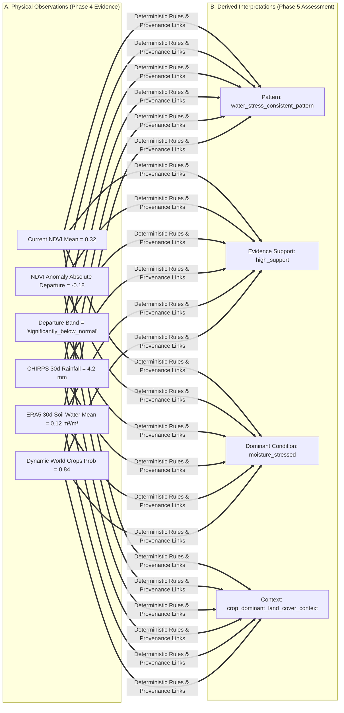

# Phase 5 — Agricultural Evidence Interpretation Architecture

> **Canonical Architecture Design for Phase 5: Deterministic Agricultural Evidence Interpretation & Structured Assessment.**  
> *Status: 🟢 APPROVED DESIGN / PENDING IMPLEMENTATION (`DEC-023`)*<br>
> *Base Implementation Checkpoint: `a046422 — feat: implement phase 4 multi-source evidence fusion`*<br>
> *Scope: Architecture & Domain Contracts Design Only (No Application Code, No Gemini/MCP, No Image Processing)*

---

## 1. Executive Summary

Phases 1 through 4 established a robust, deterministic, multi-source Earth Observation and environmental data foundation:
1. **Sentinel-2 Regional NDVI (Phase 1 — `60f8d90`):** Instantaneous radiometric vegetation greenness and canopy density at $10\text{ m}$ spatial scale.
2. **Historical Seasonal NDVI Baseline & Anomaly (Phase 2 — `ebba070`):** 3-year rolling seasonal baseline ($Y-1, Y-2, Y-3$, $\text{DOY} \pm 15\text{ days}$) and statistical departure quantification.
3. **ERA5-Land Daily Reanalysis (Phase 3A — `74fd372`):** Ambient temperature, topsoil volumetric water fraction ($0\text{–}7\text{ cm}$), and runoff over 7d/30d/90d envelopes ($\approx 11.1\text{ km}$).
4. **CHIRPS Daily Precipitation (Phase 3B — `f70dada`):** Satellite-partitioned rainfall distribution and cumulative totals over 7d/30d/90d envelopes ($\approx 5.566\text{ km}$).
5. **Dynamic World Land-Cover Context (Phase 3C — `7a8371c`):** 9-class probability distribution and dominant land-cover class at $10\text{ m}$.
6. **Multi-Source Evidence Fusion (Phase 4 — `a046422`):** Assembles all streams into an immutable, unified, and traceable domain envelope: [`AgriculturalEnvironmentalEvidence`](file:///d:/Documents/Desktop/adk-workspace/bharatsahayak/app/fusion/types.py#L34).

### The Purpose of Phase 5

Phase 5 introduces **Agricultural Evidence Interpretation**. Its sole objective is to translate multi-source physical evidence into a structured, auditable, and scientifically conservative **[`AgriculturalAssessment`](#8-proposed-domain-contract-agriculturalassessment)**.

```
AgriculturalEnvironmentalEvidence (Phase 4)
  ├── Sentinel-2 Current + Historical NDVI
  ├── ERA5-Land Reanalysis (Temp, Soil Water, Runoff)
  ├── CHIRPS Rainfall Windows (7d, 30d, 90d)
  └── Dynamic World Land-Cover Context
                      │
                      ▼
       PHASE 5: DETERMINISTIC REASONING
  ├── Observation vs Interpretation Separation
  ├── Multi-Source Evidence Pattern Detection
  ├── Conflicting Signal Isolation
  ├── Pattern-Specific Evidence Sufficiency
  └── Strict Provenance & Traceability Backing
                      │
                      ▼
           AgriculturalAssessment
       (Structured, Objective Context)
                      │
                      ▼
          Phase 5B/6 (Future Milestone)
       Gemini 2.5 Flash Conversational Layer
   (Natural-Language Explanation & Rural Advice)
```

> [!IMPORTANT]
> **Foundational Design Axiom:**  
> *"Phase 4 assembles evidence. Phase 5 interprets evidence. Gemini later explains the interpretation to the farmer."*  
> Phase 5 is an **evidence interpretation layer**, NOT an agricultural prescription engine or an unstructured LLM pipeline. It produces deterministic, rule-grounded, and testable domain evaluations.

---

## 2. Strict Architectural Boundaries

To preserve scientific rigor, safety, and reliability for Indian smallholder farmers, Phase 5 enforces non-negotiable boundaries:

### 2.1 Explicitly PROHIBITED in Phase 5
- **NO Crop Disease Diagnosis:** Environmental data cannot confirm pathogen taxonomy (e.g. *Pyricularia oryzae*, *Xanthomonas oryzae*). Visual disease diagnosis remains a separate optional workflow.
- **NO Official Drought Declarations:** Drought classification is a regulatory/governmental prerogative; Phase 5 only reports physical rainfall deficits, soil moisture deficits, or moisture-stress-consistent patterns.
- **NO Exact Yield Predictions:** No fabricated crop yield figures (e.g. "Yield will be 2.4 tonnes/ha" or "You will lose 30% of yield").
- **NO Prescriptive Agronomic Inputs:** No uncalibrated chemical fertilizer quantities (e.g. "Apply 50 kg Urea tomorrow"), pesticide dosages, or mandatory seed selections without soil-test verification.
- **NO Universal Uncalibrated Thresholds:** No arbitrary magic numbers (e.g. asserting $15\text{ mm}$ rainfall or $0.18\text{ m}^3/\text{m}^3$ soil water as a universal crop stress limit).
- **NO Speculative Causal Attribution:** No inferring unobserved causes (such as tube-well irrigation, canal access, pest outbreaks, or fertilizer deficiencies) when signals diverge.
- **NO Synthetic Confidence Scores:** No continuous pseudo-probabilities (e.g. `confidence = 0.87`).
- **NO Ungrounded Data Fabrication:** Missing values remain `None`; no converting missing data to zero or fabricating missing metrics.
- **NO Gemini / LLM in Core Assessment:** Phase 5 assessment logic is 100% deterministic pure Python. Gemini does NOT compute the assessment; Gemini only translates structured assessment outputs into conversational explanations.

### 2.2 Allowed Interpretive Reasoning in Phase 5
Phase 5 is strictly authorized to reason about:
- Current vegetative vigor and canopy density relative to regional expectations.
- Historical vegetative deviation (positive, normal, or negative seasonal departures using Phase 2 departure bands).
- Retrospective rainfall accumulation and deficit relative to available observation windows.
- Ambient thermal conditions, heat accumulation, and frost/heat risks.
- Topsoil volumetric moisture relative levels and depletion patterns.
- Surface runoff and potential waterlogging context.
- Land-cover context (e.g. assessing whether observations occur within a `crop_dominant_land_cover_context`).
- Compound multi-source environmental patterns supported by multiple corroborating evidence streams.
- Explicit detection, isolation, and reporting of conflicting/divergent environmental signals.
- Transparent reporting of pattern-specific evidence sufficiency and dynamic publication latencies.

### 2.3 Epistemic Language Invariants
Phase 5 domain payloads and textual descriptions must use conservative, evidence-grounded phrasing:
- ✅ *"Consistent with moisture stress based on negative NDVI departure, low recent rainfall, and depleted topsoil water."*
- ✅ *"Supported by available evidence: recent precipitation is significantly below normal."*
- ✅ *"Conflicting signals detected: vegetation vigor remains near baseline despite low recent rainfall. The available evidence does not identify the cause of this divergence."*
- ✅ *"Insufficient historical evidence to evaluate seasonal deviation."*
- ❌ *"The crop has drought disease."*
- ❌ *"Yield is down 40%."*
- ❌ *"The farm is suffering from fungal blight."*
- ❌ *"The farmer is using tube-well irrigation."*

---

## 3. Observation vs. Interpretation Boundary

Phase 5 strictly separates physical observations from derived agricultural interpretations. Every interpretation must reference the exact observations that justify it.



| Dimension | Physical Observation (Phase 4 Evidence) | Derived Interpretation (Phase 5 Assessment) |
| :--- | :--- | :--- |
| **Vegetation** | `mean_ndvi: 0.28`, `departure_band: moderately_below_normal` | `vegetation_stress_pattern` (Vigor is depressed relative to 3-year historical baseline) |
| **Precipitation** | `total_precipitation_mm: 8.5` across 30 days | `rainfall_deficit_consistent_pattern` (Low precipitation across retrospective window) |
| **Soil Moisture** | `mean_volumetric_soil_water: 0.11 m³/m³` | Topsoil moisture deficit relative to historical ranges |
| **Temperature** | `max_temperature_c: 41.2°C` over 7 days | `heat_stress_consistent_pattern` (Elevated ambient thermal conditions) |
| **Land Cover** | `dominant_class: crops`, `crops_probability: 0.89` | `crop_dominant_land_cover_context` (Contextual evidence indicates crop-dominated area) |
| **Multi-Source** | Depressed NDVI + Low Rainfall + Low Soil Moisture | `water_stress_consistent_pattern` (Multiple corroborating evidence streams indicate moisture stress) |

---

## 4. Multi-Source Reasoning Patterns & Taxonomy

Phase 5 evaluates a discrete, auditable taxonomy of environmental stress patterns based strictly on validated Phase 1–4 semantics and qualitative physical convergence.

### 4.1 Pattern Taxonomy

```
EnvironmentalStressPatternType
│
├── vegetation_stress_pattern
├── water_stress_consistent_pattern
├── rainfall_deficit_consistent_pattern
├── heat_stress_consistent_pattern
├── excess_moisture_waterlogging_consistent_pattern
├── combined_environmental_stress_pattern
├── near_baseline_stable_condition
├── favorable_growth_condition
├── conflicting_environmental_signals
└── insufficient_evidence_condition
```

### 4.2 Multi-Source Pattern Activation Rules (Qualitative & Calibrated Semantics)

To prevent arbitrary agronomic numbers, pattern rules rely on established Phase 1–4 contracts and qualitative corroboration:

| Pattern Identifier | Triggering Evidence Criteria | Corroborating Evidence Required | Epistemic Interpretation |
| :--- | :--- | :--- | :--- |
| **`water_stress_consistent_pattern`** | 1. Vegetation `departure_band` in (`moderately_below_normal`, `significantly_below_normal`)<br>2. Corroborated by low rainfall and/or low topsoil water | Corroborating evidence across optical vegetation decline + meteorological rainfall deficit + topsoil moisture deficit. | Multiple corroborating evidence streams are consistent with vegetative moisture stress. |
| **`rainfall_deficit_consistent_pattern`** | 1. Low CHIRPS cumulative rainfall across 30d/90d windows<br>2. Reanalysis precipitation similarly low | Meteorological precipitation deficit observed across satellite rainfall and reanalysis. | Meteorological rainfall deficit observed over recent retrospective windows. |
| **`heat_stress_consistent_pattern`** | 1. Elevated ambient 2m temperature in ERA5 7d/30d records *(Requires crop-specific calibration for thermal thresholds)* | Elevated ambient thermal conditions. | Elevated ambient temperature pattern capable of inducing thermal stress. |
| **`excess_moisture_waterlogging_consistent_pattern`** | 1. Heavy precipitation in CHIRPS 7d/30d<br>2. Elevated ERA5 surface runoff<br>3. Saturated topsoil volumetric water | Intense precipitation + elevated surface runoff + high topsoil moisture. | Heavy precipitation and elevated runoff consistent with saturated topsoil or surface water accumulation. |
| **`combined_environmental_stress_pattern`** | Co-occurrence of $\ge 2$ stress patterns (e.g. `water_stress` + `heat_stress`). | Convergence of multiple distinct stress drivers (thermal + hydrological). | Coincident thermal and moisture stress conditions observed over the analysis region. |
| **`vegetation_stress_pattern`** | 1. Vegetation `departure_band` in (`moderately_below_normal`, `significantly_below_normal`)<br>2. Hydrological signals normal or unavailable. | Isolated optical vegetation decline without confirmed environmental driver. | Vegetative vigor is depressed relative to historical baseline; environmental drivers remain unconfirmed or non-hydrological. |
| **`near_baseline_stable_condition`** | 1. Vegetation `departure_band` == `normal`<br>2. Environmental indicators within typical ranges. | Vegetation and environmental metrics tracking 3-year seasonal normals. | Vegetative vigor and environmental conditions are aligned with historical seasonal baselines. |
| **`favorable_growth_condition`** | 1. Vegetation `departure_band` in (`moderately_above_normal`, `significantly_above_normal`)<br>2. Supportive moisture conditions. | Elevated vegetation greenness supported by favorable moisture conditions. | Enhanced vegetative vigor observed under supportive environmental moisture conditions. |
| **`conflicting_environmental_signals`** | Observable divergence between vegetation vigor and environmental metrics (see Section 5). | Divergent evidence streams requiring transparent reporting. | Observable divergence between vegetation condition and environmental metrics. |
| **`insufficient_evidence_condition`** | Required evidence streams missing (`no_data`, `error`, or unverified land cover). | Data gaps preventing responsible evaluation. | Available evidence is insufficient to evaluate environmental conditions for this pattern. |

### 4.3 Classification of Threshold Origins
1. **Source-Defined Semantics (Sealed in Phases 1–4):**
   - Phase 2 NDVI Anomaly Bands: `significantly_below_normal`, `moderately_below_normal`, `normal`, `moderately_above_normal`, `significantly_above_normal`.
   - Phase 3C Dynamic World: 9 canonical classes, $P \in [0.0, 1.0]$.
2. **Project-Defined Multi-Source Convergence Rules:**
   - Multi-metric convergence rules (requiring corroboration across $\ge 2$ streams before asserting compound environmental stress).
3. **Qualitative Interpretations:**
   - Descriptive statements of observable alignment without asserting unverified causal mechanisms.
4. **Explicit Future Research & Agronomic Calibration Markers:**
   - Crop-specific thermal thresholds (e.g. Wheat terminal heat threshold vs Cotton vs Mustard).
   - Soil-texture-specific volumetric moisture thresholds (e.g. Sandy loam wilting point $\approx 0.08\text{ m}^3/\text{m}^3$ vs Clay $\approx 0.22\text{ m}^3/\text{m}^3$).
   - Explicitly marked as *requiring future agronomic calibration* rather than hardcoded in Phase 5 MVP.

---

## 5. Conflicting Evidence Handling & Observable Divergence

In agricultural remote sensing, signals frequently diverge. Phase 5 explicitly isolates and describes observable divergences without fabricating ungrounded causal explanations.

```
                  ┌─────────────────────────────────────────┐
                  │   MULTI-SOURCE SIGNAL ALIGNMENT CHECK   │
                  └────────────────────┬────────────────────┘
                                       │
            ┌──────────────────────────┴──────────────────────────┐
            ▼                                                     ▼
    [Signals Converge]                                    [Signals Diverge]
   (e.g. Low NDVI + Low Rain)                           (e.g. Low Rain + High NDVI)
            │                                                     │
            ▼                                                     ▼
Direct Multi-Source Pattern                             Conflicting Evidence Pattern
(e.g. water_stress_consistent)                        (Describe Observable Divergence)
                                                                  │
                                   ┌──────────────────────────────┼──────────────────────────────┐
                                   ▼                              ▼                              ▼
                           [Divergence Case 1]            [Divergence Case 2]            [Divergence Case 3]
                            Low NDVI + High Rain           Low Rain + High/Normal NDVI    High Temp + Normal Soil
                                   │                              │                              │
                                   ▼                              ▼                              ▼
                            Observable Deficit             Observable Stability           Atmospheric Thermal
                            Despite Rain                   Despite Low Rain               Without Soil Deficit
```

### 5.1 Canonical Divergence Scenarios

#### Scenario 1: Depressed NDVI but Normal/High Rainfall
- **Observed:** `departure_band` in (`moderately_below_normal`, `significantly_below_normal`), but CHIRPS rainfall is normal or elevated.
- **Reasoning Resolution:** Do NOT classify as `water_stress_consistent`. Do NOT speculate about unconfirmed causes (e.g. pests, fertilizer).
- **Generated Pattern:** `conflicting_environmental_signals` + `vegetation_stress_pattern`.
- **Observable Description:** *"Vegetation vigor is below seasonal baseline despite normal or elevated precipitation. The available evidence does not identify the cause of this divergence (non-moisture environmental factors or localized field conditions may be present)."*

#### Scenario 2: Severe Rainfall Deficit but Stable/Normal NDVI
- **Observed:** CHIRPS rainfall indicates dry conditions, but Sentinel-2 NDVI is `normal` or `moderately_above_normal`.
- **Reasoning Resolution:** Do NOT declare catastrophic crop failure. Do NOT claim confirmed tube-well irrigation without sensor proof.
- **Generated Pattern:** `conflicting_environmental_signals` + `rainfall_deficit_consistent_pattern`.
- **Observable Description:** *"Vegetative vigor remains stable despite low precipitation; the available evidence does not determine the mechanism maintaining vegetation vigor."*

#### Scenario 3: Elevated Ambient Temperature but Normal Soil Moisture
- **Observed:** ERA5 ambient temperature is elevated, but volumetric topsoil water is normal.
- **Reasoning Resolution:** Classify as atmospheric thermal stress without asserting root-zone water exhaustion.
- **Generated Pattern:** `heat_stress_consistent_pattern`.
- **Observable Description:** *"Elevated ambient temperatures observed; however, topsoil moisture remains within typical seasonal ranges, indicating atmospheric heat conditions without severe soil moisture depletion."*

#### Scenario 4: Non-Agricultural Land Cover Context
- **Observed:** Dynamic World `dominant_class` is `built`, `water`, or `bare` with high probability ($P > 0.70$).
- **Reasoning Resolution:** Flag land-use context warning.
- **Generated Limitation:** *"Analysis region exhibits non-crop dominant land-cover context ('built'/'water'). Agricultural interpretations may reflect non-vegetated background surfaces rather than active crops."*

### 5.2 Evidence Support Categorization
Every identified pattern is assigned a deterministic evidence support category:
- **`high_support`:** Corroborated by $\ge 3$ fully available evidence streams.
- **`moderate_support`:** Corroborated by 2 evidence streams, or supported by primary stream where secondary streams are partial.
- **`limited_support`:** Supported by only 1 evidence stream with missing or uncorroborated secondary streams.
- **`conflicted_support`:** Contradicted by at least one major physical evidence stream.

---

## 6. Severity & Pattern-Specific Sufficiency Architecture

### 6.1 Severity Representation
- **Decision:** Phase 5 MVP does NOT implement uncalibrated continuous or categorical severity metrics (`mild / moderate / severe`).
- **Rationale:** Assigning "severe" or "moderate" without crop-specific physiological calibrations creates false precision.
- **Future Accommodation:** The domain model retains an optional `severity: str | None = None` field documented explicitly as `Future work: requires agronomic calibration`.

### 6.2 Pattern-Specific Evidence Sufficiency
Sufficiency is evaluated **per-pattern**, not as a simplistic global threshold:

| Pattern | Required Evidence for Sufficiency | Behavior When Missing |
| :--- | :--- | :--- |
| **`vegetation_stress_pattern`** | Usable Sentinel-2 NDVI + Historical Baseline (`HistoricalNdviAnalysis.status == "success"`) | Pattern not detected; reported as insufficient vegetation history if current NDVI exists. |
| **`water_stress_consistent_pattern`** | Usable Vegetation evidence + usable CHIRPS rainfall OR ERA5 soil water | Pattern not detected; evaluated as single-source pattern if available. |
| **`heat_stress_consistent_pattern`** | Usable ERA5-Land temperature records (`ERA5LandAnalysis.status == "success"`) | Pattern not detected. |
| **`rainfall_deficit_consistent_pattern`** | Usable CHIRPS rainfall records (`CHIRPSRainfallAnalysis.status == "success"`) | Pattern not detected. |
| **`combined_environmental_stress_pattern`** | Usable Vegetation + Temperature + Moisture records | Pattern not detected. |

Global source availability counters (`sources_evaluated_count`, `sources_available_count`, `sources_fully_available_count`) are preserved as descriptive metadata in `AssessmentSufficiency`.

---

## 7. Evidence Provenance & Traceability Model

Every generated interpretation in Phase 5 must answer: **"Why did the system reach this conclusion?"**

```json
{
  "pattern_type": "water_stress_consistent_pattern",
  "evidence_support": "high_support",
  "severity": null,
  "description": "Vegetation greenness is significantly below historical baseline, corroborated by recent rainfall deficit and low topsoil moisture.",
  "supporting_evidence": [
    {
      "source": "vegetation",
      "metric_name": "departure_band",
      "observed_value": "significantly_below_normal",
      "reference_context": "Phase 2 historical seasonal anomaly"
    },
    {
      "source": "rainfall",
      "metric_name": "30d_total_precipitation_mm",
      "observed_value": 6.4,
      "reference_context": "CHIRPS 30-day window"
    },
    {
      "source": "reanalysis",
      "metric_name": "30d_mean_soil_water_layer_1",
      "observed_value": 0.13,
      "reference_context": "ERA5-Land topsoil volumetric fraction (m³/m³)"
    }
  ],
  "conflicting_signals": []
}
```

This guarantees that:
1. Downstream LLM agents (Gemini) cite exact physical facts.
2. Engineers can trace every assessment back to raw satellite/reanalysis values in automated tests.
3. Zero "black box" diagnostic leaps can occur.

---

## 8. Proposed Domain Contract (`AgriculturalAssessment`)

The proposed domain models will reside in [`app/assessment/types.py`](file:///d:/Documents/Desktop/adk-workspace/bharatsahayak/app/assessment/types.py) (to be implemented in Phase 5B):

```python
# Proposed Domain Model Specification for Phase 5

from datetime import date
from typing import Literal
from pydantic import BaseModel, ConfigDict, Field

from app.fusion.types import AgriculturalEnvironmentalEvidence
from app.satellite.types import AnalysisRegionMetadata, EarthEngineError

AssessmentStatus = Literal["success", "partial", "insufficient_evidence", "error"]
EvidenceSupportLevel = Literal["high_support", "moderate_support", "limited_support", "conflicted_support"]
EnvironmentalStressPatternType = Literal[
    "vegetation_stress_pattern",
    "water_stress_consistent_pattern",
    "rainfall_deficit_consistent_pattern",
    "heat_stress_consistent_pattern",
    "excess_moisture_waterlogging_consistent_pattern",
    "combined_environmental_stress_pattern",
    "near_baseline_stable_condition",
    "favorable_growth_condition",
    "conflicting_environmental_signals",
    "insufficient_evidence_condition",
]
OverallEnvironmentalCondition = Literal[
    "stable",
    "vegetation_stress",
    "moisture_stress_consistent",
    "heat_stress_consistent",
    "combined_stress_consistent",
    "favorable",
    "mixed",
    "insufficient_evidence",
]


class SupportingEvidenceItem(BaseModel):
    """Traceable link to an underlying physical observation in Phase 4 evidence."""
    source: Literal["vegetation", "reanalysis", "rainfall", "land_cover"]
    metric_name: str
    observed_value: str | float | int | bool
    reference_context: str | None = None

    model_config = ConfigDict(frozen=True, extra="forbid")


class EnvironmentalStressPattern(BaseModel):
    """Structured representation of a single detected environmental or agricultural pattern."""
    pattern_type: EnvironmentalStressPatternType
    evidence_support: EvidenceSupportLevel
    severity: str | None = Field(
        default=None,
        description="Optional severity qualifier (Future work: requires agronomic calibration)"
    )
    description: str
    supporting_evidence: list[SupportingEvidenceItem] = Field(default_factory=list)
    conflicting_signals: list[str] = Field(default_factory=list)

    model_config = ConfigDict(frozen=True, extra="forbid")


class AssessmentSufficiency(BaseModel):
    """Evaluation of evidence completeness and data latency."""
    is_sufficient: bool = Field(
        description="True when the available core evidence is sufficient to produce the overall assessment without requiring unavailable critical evidence."
    )
    sources_evaluated_count: int = 4
    sources_available_count: int = Field(ge=0, le=4)
    sources_fully_available_count: int = Field(ge=0, le=4)
    missing_evidence_sources: list[str] = Field(default_factory=list)
    partial_evidence_sources: list[str] = Field(default_factory=list)
    maximum_data_lag_days: int | None = None
    sufficiency_summary: str

    model_config = ConfigDict(frozen=True, extra="forbid")


class AgriculturalAssessment(BaseModel):
    """Authoritative root domain envelope for agricultural evidence interpretation (DEC-023)."""
    region: AnalysisRegionMetadata
    reference_date: date
    evidence: AgriculturalEnvironmentalEvidence
    status: AssessmentStatus
    overall_condition: OverallEnvironmentalCondition
    identified_patterns: list[EnvironmentalStressPattern] = Field(default_factory=list)
    sufficiency: AssessmentSufficiency
    conflicting_signals: list[str] = Field(default_factory=list)
    limitations: list[str] = Field(default_factory=list)
    pipeline_version: str = Field(default="5.0.0")
    error: EarthEngineError | None = None

    model_config = ConfigDict(frozen=True, extra="forbid")
```

---

## 9. Two-Tier Engine Structure & Pure Reasoning Boundary

Following the successful design of Phases 2, 3, and 4, Phase 5 enforces a strict two-tier architecture:

```
┌─────────────────────────────────────────────────────────────────────────┐
│              TIER 2: ROOT ORCHESTRATION PIPELINE                        │
│                  (app/assessment/pipeline.py)                           │
│                                                                         │
│  fetch_agricultural_assessment(lat, lon, reference_date, ...)           │
│  ├── 1. Validates spatial & temporal parameters                         │
│  ├── 2. Calls Phase 4 fetch_agricultural_environmental_evidence(...)    │
│  ├── 3. Catches / isolates pipeline exceptions                          │
│  └── 4. Delegates evidence to Tier 1 pure reasoning engine              │
└────────────────────────────────────┬────────────────────────────────────┘
                                     │
                                     ▼
┌─────────────────────────────────────────────────────────────────────────┐
│              TIER 1: PURE REASONING & ASSESSMENT ENGINE                 │
│                  (app/assessment/reasoning.py)                          │
│                                                                         │
│  interpret_agricultural_evidence(evidence: AgriculturalEnvironmental... │
│  ├── ZERO Earth Engine imports, ZERO network I/O, ZERO LLM calls        │
│  ├── Evaluates pattern activation rules deterministically               │
│  ├── Resolves signal conflicts & assigns evidence support levels        │
│  ├── Evaluates pattern-specific evidence sufficiency                    │
│  └── Returns immutable AgriculturalAssessment                           │
└─────────────────────────────────────────────────────────────────────────┘
```

---

## 10. The Gemini Boundary & Hallucination Defense

A critical architectural pillar of BharatSahayak V2 is that **LLMs are never raw diagnostic engines; they are natural-language communication interfaces grounded in deterministic domain assessments.**

```
[Phase 4 Evidence] ──> [Phase 5 Deterministic Assessment] ──> [Gemini 2.5 Flash] ──> [Farmer Response]
  (Physical Data)         (Rule-Based Interpretation)         (Multilingual Advice)    (Clear Rural Voice)
```

### 10.1 Responsibilities Matrix

| Capability | Phase 5 (Deterministic Assessment) | Future Gemini Layer (Phase 5B / Phase 6) |
| :--- | :---: | :---: |
| Extract zonal satellite/reanalysis metrics | ✅ | ❌ (Forbidden from inventing metrics) |
| Evaluate anomaly departures & retrospective windows | ✅ | ❌ (Forbidden from calculating ungrounded stats) |
| Identify multi-source stress patterns | ✅ | ❌ (Consumes patterns produced by Phase 5) |
| Detect conflicting signals & data gaps | ✅ | ❌ (Consumes conflicts flagged by Phase 5) |
| Translate assessment into Hindi/Punjabi/English | ❌ | ✅ |
| Explain physical stress in practical farmer terms | ❌ | ✅ |
| Adapt tone for smallholder farmer empathy | ❌ | ✅ |
| Suggest practical on-farm next steps (within bounds) | ❌ | ✅ (e.g. "Check soil moisture before irrigating") |

### 10.2 Hallucination Constraint Principle
Gemini is **constrained to explain and communicate structured evidence and assessments rather than independently inventing environmental observations**. While LLMs can still produce wording or interpretation nuances, bounding the prompt to `AgriculturalAssessment` prevents hallucinated droughts or fabricated satellite indices.

---

## 11. Camera & Crop-Disease Workflow Separation

The existing crop-disease diagnosis capability from the original BharatSahayak project is **fully decoupled** from the Phase 5 environmental reasoning pipeline:

```
[Farmer Session]
       │
       ├─────────────────────────────────────────┬─────────────────────────────────────────┐
       ▼                                         ▼                                         ▼
[Routine Advisory / Planning]            [Explicit Crop Problem]                   [Location / Map Tap]
       │                                         │                                         │
       ▼                                         ▼                                         ▼
Phase 4/5 Environmental Reasoning        Optional Crop Photograph?                 Fetch Regional Context
(NDVI + ERA5 + CHIRPS + DW)                      │                                 (Satellite & Weather)
       │                                ┌────────┴────────┐
       ▼                                ▼                 ▼
AgriculturalAssessment                [YES]              [NO]
                                        │                 │
                                        ▼                 ▼
                              Vision Disease Model   Symptom-Based Q&A
                              (Standalone Tool)      (Text Diagnosis)
```

- **Not Coupled to Space/Time:** Farmers can request environmental assessments without uploading photos.
- **Independent Failure Domain:** A camera failure or blurry photo does not invalidate satellite/environmental evidence.
- **Multimodal Convergence (Future Deferred):** Future phases (Phase 7) may allow Gemini to cross-reference visual leaf symptoms with Phase 5 environmental moisture stress, but the underlying engines remain independent.

---

## 12. Testing Strategy for Phase 5

The Phase 5 test suite will be 100% offline, deterministic, and comprehensive:

### Proposed Test Categories:
1. **Normal / Favorable Scenarios:**
   - Stable baseline vegetation + normal seasonal rainfall + adequate soil moisture $\to$ `near_baseline_stable_condition` (`high_support`).
   - Strong positive NDVI departure + good rainfall $\to$ `favorable_growth_condition`.
2. **Stress Scenarios:**
   - Negative NDVI departure + low rainfall + low soil moisture $\to$ `water_stress_consistent_pattern` (`high_support`).
   - Isolated dry rainfall window with normal NDVI $\to$ `rainfall_deficit_consistent_pattern` + `conflicting_environmental_signals`.
   - Elevated temperature records $\to$ `heat_stress_consistent_pattern`.
   - Heavy rainfall + elevated runoff $\to$ `excess_moisture_waterlogging_consistent_pattern`.
   - Coincident heat + water deficit $\to$ `combined_environmental_stress_pattern`.
3. **Conflicting Evidence Scenarios:**
   - Depressed NDVI + heavy rainfall $\to$ `conflicting_environmental_signals` (describes observable divergence).
   - High Dynamic World non-crop probability $\to$ Flags non-crop land-cover context warning.
4. **Pattern-Specific Sufficiency & Failure Scenarios:**
   - Missing historical NDVI baseline $\to$ `vegetation_stress_pattern` reports insufficient history, evaluates current vigor only.
   - CHIRPS `no_data` $\to$ `water_stress_consistent_pattern` reports insufficient rainfall evidence or downgrades to `limited_support` based on soil water.
   - All sources `no_data` or `error` $\to$ `status = "insufficient_evidence"`, empty pattern list, explicit limitation notes.
5. **Invariant Tests:**
   - Immutability (`frozen=True`, `extra="forbid"`).
   - Zero mutation of input `AgriculturalEnvironmentalEvidence`.
   - Zero Earth Engine imports in Tier 1 reasoning module.
   - Zero network I/O in Tier 1 reasoning module.
   - Provenance integrity: every `SupportingEvidenceItem` matches an actual field in the input evidence.

---

## 13. Resolved Architectural Decisions & Next Steps

1. **Overall Condition Categorization (Resolved):** Standardized on the 8-value `OverallEnvironmentalCondition` literal (`stable`, `vegetation_stress`, `moisture_stress_consistent`, `heat_stress_consistent`, `combined_stress_consistent`, `favorable`, `mixed`, `insufficient_evidence`) as a lightweight high-level summary derived from identified patterns, without replacing the authoritative `identified_patterns` list.
2. **Module Placement (Confirmed):** Implementation will be organized in `app/assessment/` (`types.py`, `reasoning.py`, `pipeline.py`, `__init__.py`).
3. **Future Calibration Scope (Confirmed):** Crop-specific thermal tolerances, soil wilting points, and fine-grained agricultural severity metrics are explicitly deferred as future work requiring agronomic calibration.

---

> [!NOTE]
> *Phase 5A design is APPROVED. No application code has been written, no commits have been made, and all existing Phase 1–4 code remains frozen.*

