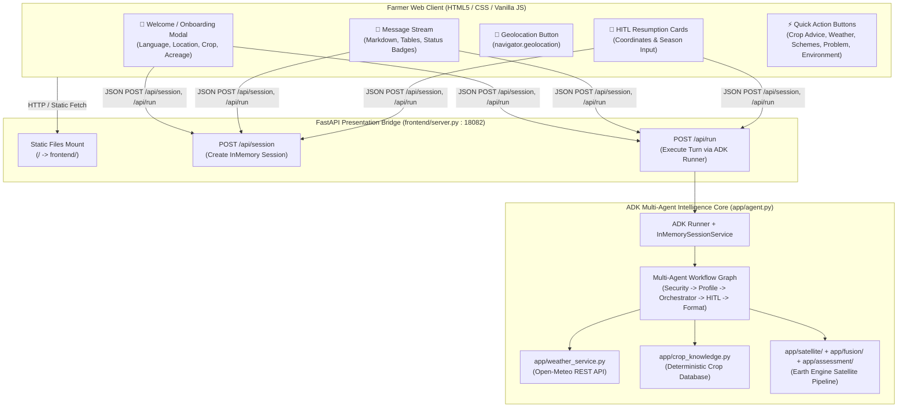

# Phase 9 — UI / UX & Map Experience

> **Canonical Phase 9 Specification, Frontend Architecture, Live Weather Subsystem, and Verification Record for BharatSahayak V2.**
> *Status: 🟢 COMPLETED & VERIFIED | Commit Checkpoint: `13b80ef` | Date: September 2026*

---

## 🎯 Objective

Phase 9 bridges the gap between deep backend multi-agent satellite intelligence (Phases 0–8) and practical, farmer-accessible presentation. The primary goals of this phase are:
1. Deliver a responsive, mobile-first web interface tailored for Indian farmers with zero unnecessary technical jargon.
2. Implement a dedicated FastAPI presentation bridge server running independently of the ADK developer playground.
3. Provide one-tap browser GPS geolocation and robust coordinate input validation to fulfill the spatial prerequisites of satellite environmental analysis (`get_environmental_assessment`).
4. Integrate a live, public meteorological weather service via Open-Meteo with comprehensive Indian centroid fallbacks and bilingual WMO weather descriptions.
5. Provide a deterministic crop knowledge and seasonality database supporting major Indian crops and regional agro-climatic overrides.
6. Enable seamless Human-in-the-Loop (HITL) interactive clarification cards directly inside the conversation stream.

---

## 🏗️ Presentation Layer Architecture

---

## 🧩 Component Implementation Details

### 1. Presentation Bridge Server ([`frontend/server.py`](file:///d:/Documents/Desktop/adk-workspace/bharatsahayak/frontend/server.py))
- **Server Framework:** FastAPI with CORS middleware and `StaticFiles` mounted to the `frontend/` directory.
- **Port:** Standardized on `18082` to run concurrently with ADK Playground (`18081`).
- **REST Endpoints:**
  - `POST /api/session`: Creates an isolated session in `InMemorySessionService` and returns `{ "session_id": "<uuid>" }`.
  - `POST /api/run`: Accepts `{ "session_id": str, "message": str, "farmer_profile": dict | None }`. Converts input into ADK `ContentPart` and calls `runner.run_async()`.
  - Formats multi-turn responses, extracts text from model response parts, and intercepts `RequestInput` events to signal pending HITL clarification cards to the frontend.

### 2. Farmer-Facing Conversational Web Interface ([`frontend/index.html`](file:///d:/Documents/Desktop/adk-workspace/bharatsahayak/frontend/index.html), [`frontend/style.css`](file:///d:/Documents/Desktop/adk-workspace/bharatsahayak/frontend/style.css), [`frontend/app.js`](file:///d:/Documents/Desktop/adk-workspace/bharatsahayak/frontend/app.js))
- **Bilingual Onboarding Modal:** Greets the farmer in English or Hindi, allowing rapid selection of language, state, crop, and farm size.
- **Top Navigation Bar:** Features the BharatSahayak brand identity, active system status indicator pill (`● Online`), Hindi/English toggle button, and a "New Chat" session reset button.
- **5 Preset Quick-Action Suggestion Buttons:**
  1. 🌱 *Crop Advice (फसल सलाह)*
  2. 🌦️ *Weather (मौसम पूर्वानुमान)*
  3. 🏛️ *Government Schemes (सरकारी योजनाएं)*
  4. 🦠 *Crop Problem (फसल समस्या)*
  5. 🛰️ *Farm Environment (खेत पर्यावरण स्थिति)*
- **Chat Stream & Message Rendering:** Full markdown formatting support (headers, lists, bold text, alerts), clean card wrappers for structured environmental assessments, and distinct styling for farmer queries vs. assistant responses.
- **Mobile-First Responsive Design:** Clean CSS Grid and Flexbox layouts tested across 320px to 1440px viewport widths with zero horizontal overflow.

### 3. Location & Geolocation Handling
- **Browser GPS Acquisition:** One-tap "Use my current location" button invoking HTML5 `navigator.geolocation.getCurrentPosition()`. Automatically populates decimal latitude and longitude into the active turn or onboarding modal.
- **Manual Coordinate Input:** Text inputs with regular expression validation ensuring latitude is within $[-90, 90]$ and longitude is within $[-180, 180]$.
- **Location Invariant Preservation:** Regional state/district text context is preserved in profile memory for government schemes but is **never silently converted to fake farm coordinates**. High-resolution satellite assessment strictly requires verified coordinates.

### 4. Human-in-the-Loop (HITL) Resumption Cards
- When the backend ADK workflow encounters missing critical data (e.g. coordinates for satellite analysis, or sowing season for crop recommendations), it pauses statefully yielding a `RequestInput` interrupt.
- The web UI dynamically renders an **interactive HITL card** directly within the chat message stream.
- The farmer provides the requested information (by clicking a season button or acquiring coordinates), which sends a resumed turn payload via `/api/run` and smoothly resumes the agent conversation without page reload.

### 5. Live Weather Subsystem ([`app/weather_service.py`](file:///d:/Documents/Desktop/adk-workspace/bharatsahayak/app/weather_service.py))
- **Data Provider:** Open-Meteo free public API (`https://api.open-meteo.com/v1/forecast`), providing current temperature, relative humidity, wind speed, precipitation, and 3-day daily forecasts (temperature max/min, rain sum, precipitation probability).
- **Centroid Coordinates Database:** Built-in centroid coordinates for all **36 Indian States and Union Territories**, as well as major agricultural districts (e.g. Ludhiana, Bathinda, Karnal, Nashik, Pune, Guntur, Mandya).
- **Bilingual WMO Weather Code Translation:** Comprehensive mapping of WMO standard weather interpretation codes (0–99) to clear, natural descriptions in both English and Hindi (e.g., Code 61 $\rightarrow$ *"Slight rain"* / *"हल्की बारिश"*).
- **Network Resilience:** Structured fallback handling ensuring network timeouts or API errors produce informative fallback messages without crashing the multi-agent session.

### 6. Deterministic Crop Knowledge & Seasonality Layer ([`app/crop_knowledge.py`](file:///d:/Documents/Desktop/adk-workspace/bharatsahayak/app/crop_knowledge.py))
- **Authoritative Crop Database:** Curated domain records for 15+ major Indian agricultural crops (Rice, Wheat, Cotton, Sugarcane, Maize, Potato, Tomato, Soybean, Mustard, Gram, Groundnut, Pulses, Onion, Chilli).
- **Seasonal Cycles:** Defines primary and secondary sowing/harvesting seasons (`Kharif`, `Rabi`, `Zaid`) with water requirement levels, soil suitability, and temperature ranges.
- **Regional State Overrides:** Captures agro-climatic deviations (e.g. West Bengal Aus/Aman/Boro rice cropping calendar; Assam multi-season paddy; Tamil Nadu Samba/Kuruvai seasons).
- **Calendar-Based Season Detection:** Pure-Python `detect_season_from_calendar(month)` function mapping calendar dates to the active Indian farming season.

---

## 🧪 Verification & Testing Record

Phase 9 implementation has been rigorously verified across unit tests, live service tests, and end-to-end integration tests:

### 1. Phase 9 Test Suites
- **Frontend Presentation & Bridge Tests (`tests/unit/test_phase9_frontend.py`):**
  - Validates FastAPI session creation, run execution, and static file delivery.
  - Verifies HITL `RequestInput` interception and resume response envelope serialization.
- **Weather Service Tests (`tests/unit/test_weather_service.py`):**
  - Tests Open-Meteo REST API client with mocked responses and live fallback verification.
  - Validates centroid dictionary resolution across all 36 Indian states and districts.
  - Verifies bilingual WMO code translation across all defined weather states.
- **Crop Knowledge Tests (`tests/unit/test_crop_knowledge.py`):**
  - Validates crop database lookups, regional state override resolution, and seasonal calendar detection.

### 2. Full Repository Verification
- **Testing Results:** 1,263 unit tests passed and 52 integration tests passed. The broader suite contains known non-blocking/stale/external failures documented in the final audit; these were not Phase 9 implementation blockers.
- **Security Checkpoint Verification:** Verified on prompt-injection defense and PII redaction regression suites.

---

## ⚠️ Known Limitations & Deferred Backlog

To maintain high code quality and prevent non-essential dependencies during MVP delivery, the following items remain deferred:
1. **Interactive Polygon Boundary Drawing:** Field boundary selection currently uses 100m circular point buffers from verified GPS coordinates. Full polygon canvas drawing (Leaflet / Mapbox) is deferred to future releases.
2. **Audio / Voice Toggles (STT / TTS):** Speech-to-text and text-to-speech in regional Indian languages remain deferred to future backlog (`FUTURE_BACKLOG.md`).
3. **Offline Progressive Web App (PWA):** Service worker caching and offline advisory storage remain post-MVP enhancements.

---

## 🚀 Transition to Phase 10 (Cloud Deployment & Telemetry)

With Phase 9 fully implemented and verified, the repository is ready for **Phase 10: Cloud Deployment & Telemetry**.

### Phase 10 Prerequisites:
- [ ] Create production `Dockerfile` containerizing `frontend/server.py` and ADK backend.
- [ ] Finalize Terraform templates in `deployment/terraform/single-project/` for GCP project `bharatsahayak-v2`.
- [ ] Configure Cloud Run service deployment with automated Secret Manager integration (`GOOGLE_API_KEY`).
- [ ] Configure Earth Engine service account authentication in Cloud Run.
- [ ] Verify GCP Cloud Storage telemetry bucket, GenAI completions view, and OpenTelemetry logging.
